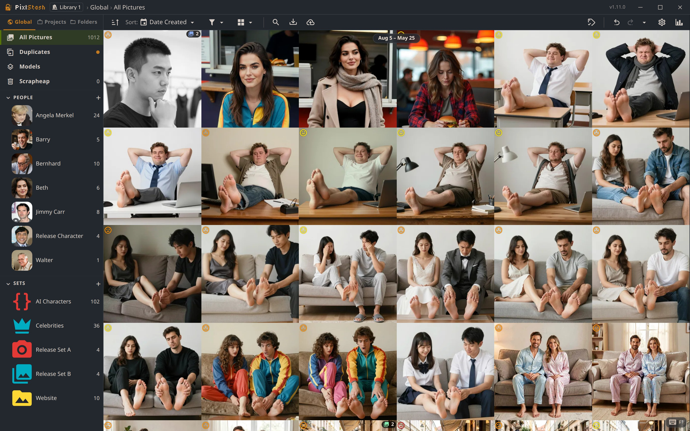

# PixlStash
<p align="center">
  
</p>

PixlStash is a local picture library server for organizing, filtering, and reviewing large image collections.

It provides:

- A desktop application or a headless server with a browser-based interface
- Semantic search across the whole library with CLIP text queries, tagged or not (OpenCLIP ViT-B-32)
- Face detection, face recognition and automatic grouping into named characters (InsightFace SCRFD-10G, buffalo_l or AuraFace), plus reverse face search
- Automatic tagging and image descriptions with selectable AI engines (our own PixlStash Tagger, WD14, Florence-2, JoyCaption), chosen per request
- Object segmentation, and reverse likeness search on CLIP embeddings
- A tag review queue and a per-tag health board, so auto-tags become tags you can trust
- Smart score sorting, character-likeness scoring, and calibrated anomaly detection for malformed anatomy
- Every model runs on your own hardware (CPU, NVIDIA CUDA, or experimental AMD ROCm). No cloud API
- Re-tag or regenerate descriptions for any selection directly from the context menu
- Instant grid loading — thumbnails appear immediately, metadata fills in asynchronously
- Fast metadata and tag filtering
- Character and set organization
- Local storage of your library data
- API for integrating with other tools
- Simple keyboard shortcuts for scoring, selection, tagging, deletion and navigation.
- Integration with ComfyUI for running workflows on selected images within PixlStash.
- Plugin system for defining new filter operations that can be performed on a set of images.
- Sharing of pictures, picture sets, characters and projects.
- Persistent view URLs — bookmark or refresh any view and land exactly where you left off.
- Undo and Redo with keyboard shortcuts and history
- Deduplication helper
- Tag review helper
- A model overview for keeping track of your generative AI models
- Swappable image library
- Scriptable backup 

PixlStash runs on your machine and serves the UI at a local (or Internet-facing) web address.

## How is this different from Immich?

Immich is a very good home photo server. If that's what you need, use it! PixlStash does a different job.

**PixlStash does both of the AI features Immich is known for.** CLIP semantic
search and InsightFace face recognition are in here too, along with duplicate
detection. Immich documents two machine-learning tasks, smart search and facial
recognition, and does them well for the job it is built for: finding a photo you
already took. Immich also has OCR and mobile apps with background sync, which
PixlStash does not.

What PixlStash adds is everything that happens *after* you have found the
pictures. It is a tool for working with images rather than just storing them,
though it works as a home server too:

- Automatic tagging and captioning, with the engine selectable per request
- A tag review queue and a tag health board, so auto-tags are verified rather than trusted
- Quality, anomaly and character-likeness scoring, so a large set sorts by what is worth looking at
- Segmentation, reverse face search and reverse likeness search
- Dataset export, and ai-toolkit run import with sample images and version history
- Two-way ComfyUI integration: control ComfyUI from PixlStash, or call its nodes from your own workflows. Generated images return tagged, with People, Picture Set, and Project associations attached
- A tagger plugin API, so a model we have never heard of shows up in the engine picker

Full breakdown, including a capability-by-capability comparison table:
[pixlstash.dev/ai.html](https://pixlstash.dev/ai.html).

## Install or try PixlStash

<p align="center">
  <a href="https://pixlstash.dev/install.html">
    
  </a>
  &nbsp;
  <a href="https://demo.pixlstash.dev?token=o75qQ-w0fy_FraPb2sdxcGOVTBoKFmmZwStycljomSs">
    
  </a>
</p>

PixlStash is available as a **native desktop app for Windows, macOS (Apple
Silicon), and Linux** (no Python or browser tab required), as a Docker image, or
as a pip package that runs anywhere Python does (including Intel Macs). The
desktop app ships a ready-to-run CPU runtime,
so it works offline out of the box, and auto-detects your hardware to offer
optional GPU acceleration (NVIDIA CUDA, or experimental AMD ROCm), which it
installs on demand straight from PyPI / PyTorch.

Detailed installation instructions on <a href="http://pixlstash.dev/install.html">pixlstash.dev</a>.


## First run and data location

On first run, PixlStash creates a user config directory and stores:

- Server config
- Database
- Imported media files

The **desktop app** uses this same platform user data directory, so a desktop
install shares its library with a pip or Docker install on the same machine. If
you add GPU acceleration, the desktop app stores the downloaded GPU wheels under
the app's own user-data directory.

> **Model downloads:** On first startup, PixlStash automatically downloads the AI models required for tagging, captioning, and quality scoring. This includes several hundred MB of model weights. Downloads are stored in the platform user data directory:
>
> | OS | Path |
> |----|------|
> | **Linux** | `~/.local/share/pixlstash/downloaded_models/` |
> | **macOS** | `~/Library/Application Support/pixlstash/downloaded_models/` |
> | **Windows** | `%LOCALAPPDATA%\pixlstash\downloaded_models\` |
>
> An internet connection is required the first time the server starts. Subsequent starts use the cached models.
>
> **Moving them somewhere else:** open **Model folders** on the model shelf and use **Move** on PixlStash's own folder. Every file in it is copied, verified and removed from the old location, and the new location is remembered — so nothing is downloaded again. Set `PIXLSTASH_BUILTIN_MODEL_DIR` instead if you want the folder somewhere else without moving what is already in it (a mounted model volume, typically).

If you need to use a custom config path:

```bash
python -m pixlstash.app --server-config "C:\path\to\server-config.json"
```

## Multiple libraries

PixlStash can register several independent image libraries and keep one open at
a time. Pictures, tags, scores, snapshots, guest sessions, and guest scores stay
with their library; your owner account and preferences stay with the
installation. API tokens and share links are pinned to the library where they
were created: they become inactive while a different library is open and work
again when you switch back.

**Settings → Libraries** does all of it: add a library, rename one, switch
between them, and stop using one. **Add a library…** takes a single folder and
works out what it is — a library you already made is added as it is, with its
tags, scores and people; a folder of pictures is brought in as it stands; an
empty folder starts a fresh library. Nothing in that folder is moved, renamed
or copied.

**Stop using this** removes no file. PixlStash forgets the library, everything
inside the folder stays where it is, and adding the folder again brings back its
tags and its share links. The library you have open cannot be forgotten — switch
away from it first.

Managing libraries is available on the machine running PixlStash, or over your
local network or Tailscale, because it points the server at folders on that
machine. A session from further away can **see** the list — the names, and which
one is open — and nothing more: switching is on that same footing as adding and
removing, because it reloads every connected client and takes the outgoing
library's share links offline. It also sees no folder paths. Set
`allow_remote_host_ops` in server settings to lift all of it at once.

### The library command line

The same things can be done from a terminal, which is what a script or a cron
job wants. **Settings → Libraries** shows the exact command for your
installation, with a copy button.

Run these on the machine hosting PixlStash, as the OS user that owns `hub.db`,
**with the same environment active that the server runs in** (activate the venv,
or use the same interpreter). That is the one assumption the short form makes;
if the commands are not found, see [Which form to type](#which-form-to-type)
below.

```bash
pixlstash-cli libraries list
pixlstash-cli libraries create /path/to/new-library --name "New library"
pixlstash-cli libraries attach /path/to/existing-library --name "Existing library"
pixlstash-cli libraries rename "Existing library" "Better name"
pixlstash-cli libraries relocate "Existing library" /new/path
pixlstash-cli libraries detach "Existing library"
pixlstash-cli libraries backup "Existing library" /path/to/backups/
pixlstash-cli libraries backup "Existing library" /path/to/backups/monday.tar.zst
pixlstash-cli libraries restore /path/to/backups/monday.tar.zst /path/to/new-library
```

| Command | What it does |
| --- | --- |
| `list` | Shows every registered library and marks the active one. |
| `create` | Creates the folder, starts an empty library in it, and registers it. |
| `attach` | Registers a library folder that already exists on disk. |
| `rename` | Changes the display name. Nothing on disk moves. |
| `relocate` | Points an existing registration at a new path, keeping its identity and share links. |
| `detach` | Forgets a library. **No files are removed and nothing inside the folder changes.** |
| `backup` | Writes the library and the hub to a single archive. |
| `restore` | Unpacks an archive into a **new** folder and makes it the library that opens. |

Notes worth knowing before you need them:

- `detach` refuses the **active** library. Switch to another one first.
- Reattaching the same folder revives its original registration, including its
  share links, because a library carries a fingerprint of its own identity.
- A backup is a **zstd-compressed tar**, named `.tar.zst` — not `.tar.gz`.
  `--no-compress` writes a plain `.tar` instead. Given a folder, `backup`
  invents a dated name with the right ending; given a filename, it adds the
  right ending if you left it off. `restore` recognises an archive by its
  contents, so a renamed file still works.
- A backup contains `hub.db`, and therefore your login and token secrets.
  PixlStash writes it owner-readable and refuses to overwrite an existing file.
- A backup covers the library folder. Pictures kept in **reference folders** live
  outside it and are *not* included, so back those up separately.
- Backing up finishes any outstanding one-time snapshot cleanup first, so the
  archive never carries credentials from before your upgrade.
- `restore` needs PixlStash stopped, and names a folder that is empty or does
  not exist yet — it never writes over a library. Because the archive holds the hub,
  restoring also brings back the password and API tokens that library was
  using, so your current ones are replaced.
- **`restore` does not delete your current setup.** It *moves*
  `server-config.json` and `hub.db` into a dated `pre-restore-*` folder beside
  themselves and prints the launch command for each, so
  `pixlstash-server --server-config <pre-restore-*>/server-config.json` reopens
  what you had. Your old library folder is never touched.

#### Which form to type

The commands above assume `pixlstash-cli` is on your `PATH`, which is true once
the environment PixlStash is installed into is active.

- **Source checkout**, or an environment you have not activated:
  `python -m pixlstash.cli libraries list`
- **Docker Compose**, for a running service (paths are inside the container):
  `docker compose exec pixlstash pixlstash-cli libraries list`
- **Desktop app** (AppImage, deb, .dmg, installer): the app is its own CLI, so
  `/path/to/PixlStash.AppImage cli libraries list` works whether or not the app
  is running. On Windows that route is the bundled interpreter instead, because
  the app's own launcher is a GUI binary no shell waits for. Turn on Settings ›
  Backend › Desktop › **Shell command** to get a `pixlstash` command
  (`~/.local/bin` on Linux and macOS, `%LOCALAPPDATA%\PixlStash\bin` — added to
  your user `PATH` — on Windows) and type `pixlstash libraries list` instead;
  open a new terminal afterwards. Either form targets the desktop app's own hub;
  there is no need to pass `--hub`. Settings › Libraries always shows the exact
  command for your install.
- **A different hub** than the default: put global options *before* `libraries`,
  e.g. `pixlstash-cli --hub /path/to/hub.db libraries list`. Without `--hub` the
  CLI uses the standard config location, which is what you want almost always.

### Required one-shot preparation when upgrading

If an older installation already has its owner and tokens inside `vault.db`,
normal startup deliberately will not guess from the config file or from
finding an existing vault; it needs that exact legacy vault authorized once.

- **Desktop app:** setup performs this step only after you explicitly approve
  importing the detected legacy owner and tokens.
- **`pixlstash-server` / `python -m pixlstash.app`, in an interactive
  terminal:** startup detects the unprepared legacy vault itself and asks,
  with a plain explanation and a `[y/N]` prompt — defaulting to **no**, since
  this is irreversible — before doing anything. Saying yes does the same thing
  the CLI command below does, in the same startup, so no separate step or
  restart is needed. After this runs, the vault is no longer readable as an
  owner/token store by versions of PixlStash older than the hub — the prompt
  says so before you answer.
- **Non-interactive launches** (a service, a container, redirected stdin) log
  that the legacy vault needs preparing instead of asking, and the CLI command
  below remains the
  way to authorize the migration ahead of time.

Pip installation:

```bash
pixlstash-cli --hub /path/to/config-dir/hub.db libraries prepare-legacy-identity /path/to/library
```

Source checkout:

```bash
python -m pixlstash.cli --hub /path/to/config-dir/hub.db libraries prepare-legacy-identity /path/to/library
```

Docker Compose, before bringing the upgraded service up (adjust the two
container paths if you configured custom mounts):

```bash
docker compose run --rm --entrypoint pixlstash-cli pixlstash \
  --hub /home/pixlstash/.config/pixlstash/hub.db \
  libraries prepare-legacy-identity \
  /home/pixlstash/.config/pixlstash/images
```

After the command succeeds, start PixlStash normally. Startup verifies the
approved path and identity digest, copies the owner/tokens into the hub, stamps
the library, and only then removes portable owner, token, and guest-session data
from the live vault and its historical snapshots. New snapshots and every
restore scratch database receive the same sanitation, so identity remains
hub-only. If verification fails, the hub does not mark the migration complete;
correct the reported problem and retry.

## Server configuration

On first run, PixlStash generates a `server-config.json` file in the user config directory:

- **Linux / macOS:** `~/.config/pixlstash/server-config.json`
- **Windows:** `%LOCALAPPDATA%\pixlstash\server-config.json`

You can also supply a custom path with `--server-config <path>`.

On first run in an interactive terminal, PixlStash now launches a short setup wizard for:

- `image_root` (storage path)
- `port`
- `require_ssl` (HTTP/HTTPS)

Before the server starts, bootstrap also offers to set (or replace) the
initial username/password.

You can rerun the wizard at any time with:

```bash
python -m pixlstash.app --bootstrap
```

When rerunning the wizard, pressing Enter keeps existing values as defaults.

Edit the file and restart the server to apply changes.

### Network and port

| Key            | Default       | Description                                                                                                                                               |
| -------------- | ------------- | --------------------------------------------------------------------------------------------------------------------------------------------------------- |
| `host`         | `"localhost"` | Address the server binds to. Change to `"0.0.0.0"` to expose the server on the local network or internet.                                                 |
| `port`         | `9537`        | TCP port the server listens on.                                                                                                                           |
| `cors_origins` | `[]`          | Extra origins allowed to make credentialed cross-origin requests. `localhost`, `127.0.0.1`, and the server's own LAN IP are always permitted on any port. |
| `require_local_for_write` | `true` | When `true`, full login (username/password and ALL-scope tokens) is only permitted from local network addresses (RFC 1918 / loopback). READ-only share tokens are always accepted from any IP. Set to `false` to allow full login from any IP. |
| `trusted_proxies` | `[]` | List of proxy IP addresses whose `X-Forwarded-For` header should be trusted for real-client-IP detection. See [Sharing and remote access](#sharing-and-remote-access) below. |

At startup the server detects its own LAN IP and automatically allows it on any port. This means the Vite dev server works over LAN (`http://<lan-ip>:5173` → `http://<lan-ip>:9537`) without any extra configuration, as long as network access is enabled via `host`.

Use `cors_origins` only if you need to allow origins on a different machine entirely.

### Sharing and remote access

PixlStash supports read-only share tokens that let you give guests access to
a specific picture, picture set, character, or project without exposing your full
account. To safely share over the internet while keeping your login protected:

1. **Expose the server** — set `"host": "0.0.0.0"` and open/forward the port.
2. **Enable HTTPS** — set `"require_ssl": true` (strongly recommended whenever
   the server is internet-facing; see [SSL / HTTPS](#ssl--https) below).
3. **Keep `require_local_for_write: true`** (the default) — this ensures that
   full login is only possible from your local network or VPN. Share tokens
   (READ-only) continue to work from any IP.
4. **Create a share token** — in the PixlStash settings UI, create a READ-only
   token scoped to the resource you want to share. Copy the generated URL and
   send it to your guests.

#### If you run a reverse proxy (nginx, Caddy, Cloudflare Tunnel…)

When a proxy sits in front of PixlStash, `require_local_for_write` sees the
proxy's IP instead of the real client IP. You must tell PixlStash which proxy
addresses to trust so it reads the real IP from the `X-Forwarded-For` header:

| Scenario | `trusted_proxies` value |
|---|---|
| nginx/Caddy on the same machine | `["127.0.0.1"]` |
| Cloudflare Tunnel (cloudflared on same machine) | `["127.0.0.1"]` |
| Proxy on a different LAN machine | `["192.168.1.x"]` (the proxy's LAN IP) |

Example:
```json
{
  "host": "0.0.0.0",
  "require_ssl": true,
  "require_local_for_write": true,
  "trusted_proxies": ["127.0.0.1"]
}
```

> **Warning:** Only add addresses you control to `trusted_proxies`. Trusting an
> untrusted address allows that host to spoof any client IP, bypassing the local
> network restriction entirely.

### SSL / HTTPS

| Key               | Default                     | Description                                                                   |
| ----------------- | --------------------------- | ----------------------------------------------------------------------------- |
| `require_ssl`     | `false`                     | Enable HTTPS. When `true`, the server will use the key and certificate below. |
| `ssl_keyfile`     | `<config_dir>/ssl/key.pem`  | Path to the SSL private key file.                                             |
| `ssl_certfile`    | `<config_dir>/ssl/cert.pem` | Path to the SSL certificate file.                                             |
| `cookie_samesite` | `"Lax"`                     | `SameSite` attribute for session cookies (`"Lax"`, `"Strict"`, or `"None"`).  |
| `cookie_secure`   | `false`                     | Set the `Secure` flag on session cookies. Enable when serving over HTTPS.     |

When `require_ssl` is enabled and no certificate files exist at the configured
paths, PixlStash generates a **self-signed certificate** automatically. Browsers
will show a security warning for self-signed certs. To get a trusted certificate
without warnings, choose one of the options below.

#### Option A — Replace the auto-generated certificate with a real one

If you already have a certificate (e.g. from certbot or your DNS provider), drop
the files into the config directory and restart:

| OS | Default cert directory |
|----|------------------------|
| Linux / macOS | `~/.config/pixlstash/ssl/` |
| Windows | `%LOCALAPPDATA%\pixlstash\ssl\` |

Place your private key as `key.pem` and the full certificate chain as `cert.pem`,
or point `ssl_keyfile` / `ssl_certfile` at any paths you prefer.

To obtain a cert with **certbot** (requires port 80 reachable and a real domain):

```bash
certbot certonly --standalone -d pixlstash.example.com --email you@example.com
```

Then in `server-config.json`:

```json
{
  "require_ssl": true,
  "cookie_secure": true,
  "ssl_keyfile": "/etc/letsencrypt/live/pixlstash.example.com/privkey.pem",
  "ssl_certfile": "/etc/letsencrypt/live/pixlstash.example.com/fullchain.pem"
}
```

Certbot installs a systemd timer / cron job that renews automatically. The
`--standalone` renewal briefly needs port 80; use a
[pre/post hook](https://eff-certbot.readthedocs.io/en/latest/using.html#pre-and-post-validation-hooks)
to stop and restart PixlStash around the renewal if it is bound to port 80.

#### Option B — Caddy as a reverse proxy (automatic Let's Encrypt)

[Caddy](https://caddyserver.com/) provisions and renews a trusted TLS certificate
automatically whenever it proxies a request for a real domain. No manual cert
management required.

1. Install Caddy: `sudo apt install caddy` (or see [caddyserver.com](https://caddyserver.com/docs/install))
2. Create `/etc/caddy/Caddyfile`:
   ```
   pixlstash.example.com {
       reverse_proxy localhost:9537
   }
   ```
3. `sudo systemctl reload caddy`

PixlStash itself can stay on plain HTTP (`require_ssl: false`); Caddy terminates
TLS externally. Set `"trusted_proxies": ["127.0.0.1"]` in `server-config.json`
so that `require_local_for_write` correctly identifies the real client IP (see
[Sharing and remote access](#sharing-and-remote-access)).

#### Option C — Cloudflare Tunnel (no open port, no domain purchase required)

[Cloudflare Tunnel](https://developers.cloudflare.com/cloudflare-one/connections/connect-networks/)
routes traffic to PixlStash through Cloudflare's edge without opening any inbound
firewall ports. Cloudflare provides a free `*.trycloudflare.com` subdomain with a
valid TLS certificate, or you can use your own domain.

```bash
# Install cloudflared, then:
cloudflared tunnel --url http://localhost:9537
```

Cloudflare terminates TLS; PixlStash runs plain HTTP internally. As with Caddy,
set `"trusted_proxies": ["127.0.0.1"]` so local-write restrictions work correctly.

### Storage

| Key             | Default               | Description                                                                                                                  |
| --------------- | --------------------- | ---------------------------------------------------------------------------------------------------------------------------- |
| `image_root`    | `<config_dir>/images` | Directory where imported media files are stored.                                                                             |

Automatic import folders are stored in the database and managed via the
Import Folders UI/API, not in `server-config.json`.

### Processing

| Key                              | Default        | Description                                                                                                  |
| -------------------------------- | -------------- | ---------------------------------------------------------------------------------------------------------- |
| `default_device`                 | `"cpu"`        | Device used for AI processing (`"cpu"` or `"cuda"`).                                                        |
| `insightface_model_pack`         | `"buffalo_l"`  | InsightFace model pack used by the face detection / recognition pipeline. One of `"buffalo_l"` or `"auraface"`. |
| `generate_thumbnails_on_startup` | `true`         | Generate missing thumbnails when the server starts.                                                         |

#### Face model pack and licensing

`insightface_model_pack` selects which InsightFace model pack powers face
detection and face recognition. The licensing decision is yours;
PixlStash simply makes the choice available.

- **`buffalo_l`** (default): the standard InsightFace pack. Its recognition
  weights are trained on the WebFace600K dataset, which is licensed for
  **non-commercial research use only**. This is the right choice for personal
  and research use, and it downloads automatically on first use.
- **`auraface`**: the [`fal/AuraFace-v1`](https://huggingface.co/fal/AuraFace-v1)
  pack, whose weights are **Apache-2.0 licensed** and therefore suitable if you
  need to use face features in a **commercial** setting. It uses the same
  SCRFD-10G face detector as `buffalo_l`, so switching only changes the
  recognition embedding. When selected, PixlStash downloads the pack from a
  pinned HuggingFace revision into `~/.insightface/models/auraface/` on first
  use. If the automatic download fails (for example, no network access), you can
  place the pack's `.onnx` files in that directory manually and restart.

Changing this setting on an existing library does **not** delete your faces or
your manual character assignments. PixlStash detects faces whose embeddings came
from a different pack and refreshes those embeddings in place, in the background,
keeping each face's identity intact. New imports are always processed first, so a
refresh sweep never starves brand-new pictures.

To remove stale database records for missing source files at startup, run:

```bash
python -m pixlstash.app --cleanup-missing-pictures
```

### Logging

| Key         | Default                   | Description                                                  |
| ----------- | ------------------------- | ------------------------------------------------------------ |
| `log_level` | `"info"`                  | Log verbosity (`"debug"`, `"info"`, `"warning"`, `"error"`). |
| `log_file`  | `<config_dir>/server.log` | Path to the log file.                                        |

### Example config

```json
{
  "host": "localhost",
  "port": 9537,
  "log_level": "info",
  "require_ssl": false,
  "image_root": "/home/user/.config/pixlstash/images",
  "default_device": "cpu",
  "insightface_model_pack": "buffalo_l",
  "generate_thumbnails_on_startup": true
}
```

## Upgrade PixlStash

<p align="center">
  <a href="https://pixlstash.dev/upgrade.html">
    
  </a>
</p>

Detailed installation instructions on <a href="http://pixlstash.dev/upgrade.html">pixlstash.dev</a>.

## Installing plugins

PixlStash supports built-in plugins and user-created plugins.

### With the CLI (recommended)

```bash
pixlstash-cli plugins available                     # what is published
pixlstash-cli plugins available caption             # ...matching a word
pixlstash-cli plugins install hello_world_stamp     # from the plugins repository
pixlstash-cli plugins install ./my_captioner.zip    # a zip of a plugin folder
pixlstash-cli plugins install ./my_captioner/       # an extracted folder
pixlstash-cli plugins install ./my_filter.py        # a single module
pixlstash-cli plugins test ./my_captioner.py       # does it load and render?
pixlstash-cli plugins list
pixlstash-cli plugins remove my_captioner
pixlstash-cli plugins create                          # start writing one
pixlstash-cli plugins submit                          # ...and open its PR
```

`plugins available` lists what
[PixlStash-plugins](https://github.com/Pikselkroken/PixlStash-plugins) publishes,
with each plugin's name, title, one-line summary and (where declared) author and
licence; `*` marks one you already have. Add a word to search, and it matches
any of those fields, so anything you can see in the listing you can search for.
It downloads the same archive `install` does and reads it without importing
anything, so it needs no token and runs no published code.

The destination differs by kind (captioning plugin or image filter) and by
shape, so `install` works it out from the source instead of asking you to type
it: it reads the source without importing it, decides which base class it
derives from, and names the installed file after the plugin's own `name`. It
refuses a source that is not a plugin, one whose name collides with a built-in,
and a zip whose entries would be unpacked outside the folder it is unpacked
into.

`--dry-run` prints the plan and stops, `--yes` skips the confirmation, `--force`
replaces an existing plugin of the same name, and `--strict` turns the warnings
into refusals. `--ref` picks a branch, tag or commit in the plugins repository
and is ignored for local sources; it cannot point the download at a different
repository. A plugin's `requirements.txt` is never installed unless you pass
`--with-deps`. **Plugin code runs unsandboxed, in the server process, with your
permissions** — install what you would run yourself.

Captioning plugins load at server start, so restart PixlStash after installing
one; image filters are re-scanned every time the Filters menu is listed.

`plugins test` is for the person *writing* a captioning plugin, and it is the
one verb that imports the plugin instead of reading it: it loads the file the
way the server does, registers what it defines, and checks that the parameter
schema is one the settings screen can render — so a typo costs a command rather
than a restart. `--image PATH` runs it over one picture as well, and stops
instead of running when the plugin reports its model is not present — though a
plugin that downloads inside `init()` still will, since by then it is the
plugin's code deciding.

**It is a development aid, not a security scanner.** It does not tell you
whether a plugin is safe to install — it *runs* the plugin, unsandboxed, with
your permissions, which is exactly what the server would do. Only test a plugin
you would have installed anyway.

### User plugin directory

If you prefer to copy files by hand, they go in the platform-specific user data
directory. PixlStash logs the exact path on startup, and
`pixlstash-cli plugins list` prints it.

| OS | Image filters | Captioning plugins |
|----|---------------|--------------------|
| **Linux** | `~/.local/share/pixlstash/image-plugins/user/` | `~/.local/share/pixlstash/tagger-plugins/user/` |
| **macOS** | `~/Library/Application Support/pixlstash/image-plugins/user/` | `~/Library/Application Support/pixlstash/tagger-plugins/user/` |
| **Windows** | `%LOCALAPPDATA%\pixlstash\pixlstash\image-plugins\user\` | `%LOCALAPPDATA%\pixlstash\pixlstash\tagger-plugins\user\` |

The doubled `pixlstash\pixlstash` on Windows is not a typo: `platformdirs` puts
the app under a vendor folder, and PixlStash passes no separate vendor name.
This table used to show it singly, which is why copying a plugin there by hand
appeared to do nothing.

An image filter is always a single `.py` file. A captioning plugin may be a
single `.py` file or a folder containing `__init__.py`.

### Writing a plugin

```bash
pixlstash-cli plugins create
```

Run with no arguments it is a wizard. It works out first whether it can fork
[PixlStash-plugins](https://github.com/Pikselkroken/PixlStash-plugins) for you,
and names the repository it would create:

```
This will create https://github.com/you/PixlStash-plugins, a public fork of
Pikselkroken/PixlStash-plugins on your account, and clone it.
```

If you already have that fork it says so, and that it will be reused rather
than created. If it cannot fork at all it says why: `gh` missing, or `gh` not
signed in.

Then it asks what kind of plugin you are writing, and that question carries the
way out:

```
What kind of plugin is it?
  1  image       turns a picture into another picture (the Filters menu)
  2  captioning  turns an image into tags or a description
  3  abort       stop here, creating nothing
Choose [1]:
```

Answer with the number or the name. `3` stops with nothing forked, cloned or
created, and the question is asked before any of those happen for exactly that
reason. After it, you are asked what the plugin should do and what to call it.

Everyone contributes from a fork, maintainers included. A plugin reaches the
repository as a pull request or not at all, and a shortcut for the few people
with write access would be a second path that only those people ever exercise.

From those answers it clones, branches, copies one of the repository's example
plugins into `plugins/<kind>/<name>/`, renames its folder, module and class,
puts your git identity and your licence in the header, writes what you said it
should do into the plugin's README and docstring, and prints the commands that
open the pull request. Nothing is committed or pushed: the plugin at that point
is still the example.

Last, it offers a command that hands the job to a coding agent:

```bash
cd /home/you/PixlStash-plugins && claude 'Read plugins/image/edge_glow/BRIEF.md and do what it says.'
```

One line, because the command is the part that gets pasted. The brief itself is
written to disk as `BRIEF.md` inside the new plugin's folder, where it can be
read, edited and re-run without retyping anything. It says what you asked the
plugin to do, that the folder holds a renamed copy of an example whose
behaviour must be replaced rather than described, what "done" looks like, and
that it should delete itself when finished. `BRIEF.md` is gitignored, so
forgetting cannot put it in the pull request.

The command carries its own `cd`, because the brief is named relative to the
checkout and the agent reads that checkout's instructions: pasted anywhere else
it would find neither.

For everything general, the brief points at the plugins repository's own
[`AGENTS.md`](https://github.com/Pikselkroken/PixlStash-plugins/blob/main/AGENTS.md)
(and a byte-identical `CLAUDE.md`) that both agents read on their own, covering
the contract to follow, the header rules, what a plugin README needs and the
commands to finish with. Restating any of that in the prompt would be a second
copy of instructions that repository maintains and its tests keep honest. All
the command adds is which README holds the brief.

It is printed rather than run: starting an agent on your checkout is your call,
and you should read what it writes before committing it.

### Submitting it

```bash
cd PixlStash-plugins
pixlstash-cli plugins submit
```

`submit` is the other half of `create`, and there is nothing to type because
the branch already names the plugin. It runs the plugins repository's own
checks with that checkout's `.venv` if it has one (its ruff is pinned, and a
different version formats differently), stages the one plugin folder, commits
it, pushes the branch and opens the pull request.

A failing check stops it, which is the point: the same failure found in CI
costs a red pull request and a force-push. `--dry-run` runs the checks and
stops; `--skip-checks` runs none of them.

It asks one thing first: what you tested the plugin against, which model, which
PixlStash version, on what hardware. That goes in the pull request body,
verbatim and with nothing else read off your machine. CI checks the shape of a
model-backed plugin and never runs the model, so that sentence is what makes it
reviewable at all. Pushing and opening the PR are confirmed before they happen
(`--yes` skips the question).

Everything the wizard asks can be given as an option instead, and giving a name
and `--kind` skips the questions entirely:

```bash
pixlstash-cli plugins create edge_glow --kind image \
  --purpose "Adds a soft glow around every edge." --agent claude
```

It copies the example the plugins repository's own CI keeps green, rather than a
template kept here, so a scaffold cannot be out of date with the contract tests
it has to pass. `--from` starts from a different published plugin,
`--display-name`, `--description`, `--author` and `--license` fill in the
header, `--dir` says where the checkout goes, and `--no-fork` skips the fork.

To write one by hand instead, start from
`pixlstash/image_plugins/built-in/plugin_template.py` in this repository:

1. Create a new `.py` file in your user plugin directory.
2. Subclass `ImagePlugin`, set a unique `name` and `plugin_id`, and implement `run()`.
3. Restart PixlStash Server — plugins are loaded at startup.

`plugin_template.py` is ignored by plugin discovery and will not be loaded as a plugin.

### Plugin licensing

PixlStash backend core is GPL-3.0, but the plugin authoring API files
`pixlstash/image_plugins/base.py` and
`pixlstash/image_plugins/built-in/plugin_template.py` are MIT-licensed.

This means user plugins that only rely on that plugin API/template may use any
license chosen by the plugin author.

If a plugin copies substantial GPL backend code or depends directly on other
GPL-only backend internals, different obligations may apply.


## Troubleshooting

- If the page does not load, confirm the server process is running.
- If port `9537` is in use, set a different port in your server config file.
- If frontend assets are missing, rebuild frontend with `npm run build` and restart the server.
- **Mobile browsers:** the UI is designed for desktop. Mobile may work for basic browsing but is not a supported layout in 1.0.0.

## Docker Images

PixlStash maintains separate Dockerfiles:

- `Dockerfile`: CPU image
- `Dockerfile.gpu`: GPU image (NVIDIA CUDA)

Build locally:

```bash
# CPU
docker build -f Dockerfile -t pixlstash:cpu .

# GPU
docker build -f Dockerfile.gpu -t pixlstash:gpu .
```

Run locally:

```bash
# CPU
docker run --rm -p 9537:9537 -v pixlstash_data:/home/pixlstash pixlstash:cpu

# GPU
docker run --rm --gpus all -p 9537:9537 -v pixlstash_data:/home/pixlstash pixlstash:gpu
```

### First-run setup in Docker

Claiming the owner account (choosing the first username/password) is normally
restricted to loopback connections, and a Docker container never sees your
traffic as loopback — so the in-browser first-run setup is blocked with a 403.
Provision the owner account via environment variables on the **first** run
instead:

```bash
docker run --rm -p 9537:9537 \
  -e PIXLSTASH_INITIAL_USERNAME=owner \
  -e PIXLSTASH_INITIAL_PASSWORD=change-me-now \
  -v pixlstash_data:/home/pixlstash pixlstash:cpu
```

The account is claimed at startup and you can log in with those credentials
right away. Afterwards, restart the container **without** the two variables:
they are only used to claim a still-unclaimed account (a restart with stale
values never changes an existing password — it just logs that they were
ignored), but credentials should not linger in the container environment.
`docker-compose.yml` ships the same two variables commented out.

Alternative: log in over loopback from inside the container, e.g.
`docker exec -it <container> curl -X POST http://127.0.0.1:9537/api/v1/login -H 'Content-Type: application/json' -d '{"username":"owner","password":"change-me-now"}'`.

GitHub Actions uses the same split in `.github/workflows/docker-publish.yml`:

- CPU publish job builds from `Dockerfile`
- GPU publish job builds from `Dockerfile.gpu`

### GPU startup fails (`CUDAExecutionProvider` unavailable)

If startup reports that ONNX `CUDAExecutionProvider` is unavailable, you likely have CPU-only ONNX Runtime installed.

Fix your environment:

```bash
pip uninstall -y onnxruntime
pip install onnxruntime-gpu
```
It some cases you may have to uninstall onnxruntime-gpu and reinstall it.

Verify providers:

```bash
python -c "import onnxruntime as ort; print(ort.get_available_providers())"
```

Expected output should include `CUDAExecutionProvider`.

If you prefer CPU mode, set `"default_device": "cpu"` in `server-config.json`.

### Import Folders and Reference Folders in Docker

Because Docker containers have an isolated filesystem, folders on your host machine must be explicitly bind-mounted into the container before PixlStash can read them.

**Key restrictions:**

- **No folder browser.** The path browser is unavailable in Docker. You must type the host path manually in the folder editor.
- **Volume mount required before the folder becomes active.** When you add a new Import or Reference folder, PixlStash saves it with a `pending_mount` status. The folder will not scan or import until you restart the container with the corresponding `-v` mount in your `docker run` command.
- **Container restart needed for each new folder.** Adding a folder in the UI does not automatically mount it. You must stop and recreate the container with the new `-v` flag, then open PixlStash again.

**Workflow:**

1. Open the sidebar **Folders** tab and add a new Import or Reference folder.
2. Enter the **host path** (the path on your machine) and note the suggested **container path** (e.g. `/data/import/pictures-001` or `/data/ref/pictures-001`).
3. The editor shows a ready-to-copy `docker run` restart command that includes all current mounts. Copy and run it to recreate the container with the new mount.
4. After the container restarts, the folder status changes from `pending_mount` to active and scanning begins.

**Example** — adding a reference folder to an existing GPU container:

```bash
docker rm -f pixlstash-gpu 2>/dev/null || true
docker run -d \
  --runtime nvidia \
  -e HOME=/home/pixlstash \
  -e PIXLSTASH_HOST=0.0.0.0 \
  -p 9537:9537 \
  -v ~/Pictures/pixlstash:/home/pixlstash \
  -v '/home/you/Photos:/data/ref/pictures-001' \
  --name pixlstash-gpu \
  ghcr.io/pikselkroken/pixlstash:latest-gpu
```

Replace `/home/you/Photos` with your actual host path and adjust the container path index if you have multiple folders.
