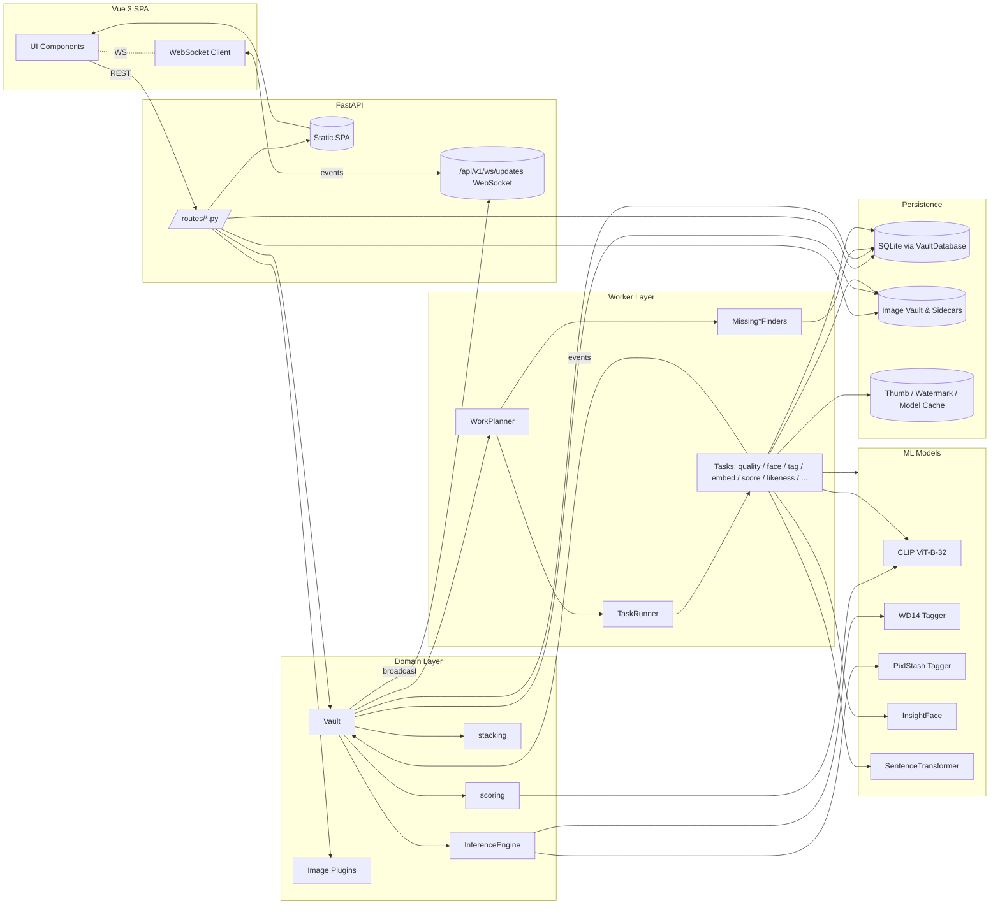
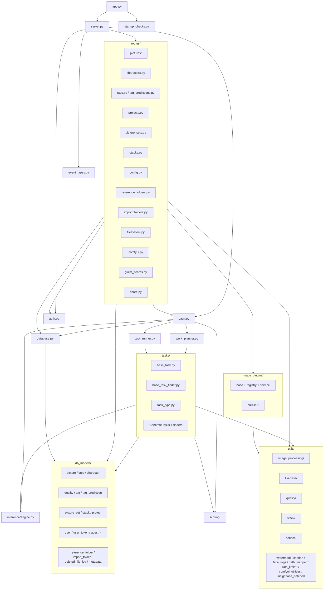
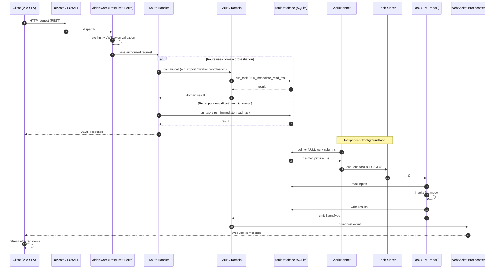

# PixlStash Backend Architecture

> Synthetic reference of the PixlStash backend. This document is the source of truth for both Copilot and human contributors when reasoning about server-side code.
>
> Companion documents:

* Frontend: [docs/frontend_architecture.md](frontend_architecture.md)
* Integration: [docs/integration_architecture.md](integration_architecture.md)

---

## Table of Contents

1. [Project Tree](#1-project-tree)
2. [Architecture Overview](#2-architecture-overview)
3. [Frameworks, Runtime & Dependencies](#3-frameworks-runtime--dependencies)
4. [Top-Level Modules](#4-top-level-modules)
5. [Routes / HTTP API](#5-routes--http-api)
6. [Database Models](#6-database-models)
7. [Task System](#7-task-system)
8. [Image Plugins](#8-image-plugins) — incl. [8.1 Installing and checking plugins from the CLI](#81-installing-and-checking-plugins-from-the-cli-issue-958)
9. [Tagger Plugins](#9-tagger-plugins)
10. [Services Layer](#10-services-layer)
11. [Utility Modules](#11-utility-modules)
12. [Alembic Migrations](#12-alembic-migrations)
13. [Storage Architecture](#13-storage-architecture)
14. [Server Lifecycle](#14-server-lifecycle)
15. [Frontend Integration](#15-frontend-integration)
16. [Authentication & Authorization](#16-authentication--authorization)
17. [Data Flow Pipeline](#17-data-flow-pipeline)
18. [Snapshots & Restore](#18-snapshots--restore)
19. [Mermaid Diagrams](#19-mermaid-diagrams)
20. [Architectural Patterns](#20-architectural-patterns)
21. [Operation Log](#21-operation-log--undoredo-and-the-audit-trail-dam-12)
22. [Tiered Duplicate Detection](#22-tiered-duplicate-detection-v19-dedup--stacks)
23. [Opt-in telemetry](#23-opt-in-telemetry-the-install-id-and-the-consent-flags-v19-lane-f)
24. [The folder-structure read](#24-the-folder-structure-read-v111-phase-2)
25. [The folder-structure commit](#25-the-folder-structure-commit-v111-phase-3)
26. [The layout and the move engine](#26-the-layout-and-the-move-engine-v111-phase-4b)
27. [Reconciling moves made outside PixlStash](#27-reconciling-moves-made-outside-pixlstash-v111-phase-5)

---

## 1. Project Tree

```
pixlstash/
├── __init__.py
├── app.py                            # CLI entry point
├── server.py                         # FastAPI app + lifespan
├── database.py                       # VaultDatabase (threaded queue over SQLite)
├── auth.py                           # AuthService, JWT, scoped tokens
├── task_runner.py                    # Threaded CPU/GPU task executor
├── work_planner.py                   # Polls finders, schedules work
├── vault.py                          # Top-level orchestrator
├── stacking.py                       # Picture stacking
├── worker_config.py                  # Concurrency / batch tuning
├── startup_checks.py                 # Disk / VRAM / SSL preflight
├── event_types.py                    # WebSocket EventType enum
├── pixl_logging.py                   # Uvicorn log config
├── image_loading_dataset_prepper.py  # Training dataset prep
├── alembic.ini
│
├── db_models/                        # SQLModel definitions
│   ├── picture.py                    # Picture, SortMechanism, LikenessParameter
│   ├── face.py                       # Face (bbox + 512-d embedding)
│   ├── character.py                  # Character
│   ├── quality.py                    # Quality (sharpness, contrast, …)
│   ├── tag.py                        # User-confirmed tags
│   ├── tag_prediction.py             # Model-predicted tags + confidence
│   ├── tag_health.py                 # Per-tag health board cache
│   ├── tag_suggestion.py             # Suspected label fixes (review queue)
│   ├── tagger_run.py                 # Tagger eval runs pushed from PixlTagger
│   ├── review.py                     # Tag review sessions + item decisions
│   ├── detection.py                  # Florence-2 object detections
│   ├── snapshot.py                   # Vault snapshots (GFS retention)
│   ├── picture_likeness.py           # Pairwise image similarity
│   ├── picture_set.py                # Sets + membership
│   ├── picture_stack.py              # Stacks (duplicates / variants)
│   ├── picture_project.py            # Picture↔Project M-M
│   ├── project.py                    # Projects
│   ├── user.py                       # User + settings
│   ├── user_token.py                 # Scoped API tokens
│   ├── guest_session.py              # Public guest sessions
│   ├── guest_score.py                # Guest ratings
│   ├── reference_folder.py           # Anchor / reference folders
│   ├── import_folder.py              # Watched import folders
│   ├── deleted_file_log.py           # Deletion audit
│   └── metadata.py                   # Vault-level metadata
│
├── routes/                           # FastAPI routers
│   ├── pictures/                     # CRUD, search, thumbnails, export/import
│   ├── characters.py                 # Character management + face assignment
│   ├── tags.py                       # Tags + bulk operations
│   ├── tag_predictions.py            # Confirm / reject predictions
│   ├── projects.py                   # Projects
│   ├── picture_sets.py               # Picture sets + membership
│   ├── stacks.py                     # Stacks
│   ├── dedup.py                      # Duplicate queue, counts, scan, verdicts + sweep dry run
│   ├── config.py                     # User/server config + progress
│   ├── reference_folders.py          # Reference folders
│   ├── import_folders.py             # Watch folders
│   ├── filesystem.py                 # Directory browsing
│   ├── comfyui.py                    # ComfyUI workflow integration
│   ├── guest_scores.py               # Guest scoring
│   └── share.py                      # Public sharing endpoints
│
├── tasks/                            # Background tasks + finders
│   ├── base_task.py                  # BaseTask, TaskStatus, QueueType
│   ├── base_task_finder.py           # BaseTaskFinder + picture claim
│   ├── task_type.py                  # TaskType enum
│   ├── quality_task.py
│   ├── description_task.py
│   ├── text_embedding_task.py
│   ├── image_embedding_task.py
│   ├── face_extraction_task.py
│   ├── likeness_task.py
│   ├── likeness_parameters_task.py
│   ├── tag_task.py
│   ├── smart_score_task.py
│   ├── text_score_task.py
│   ├── comfyui_extraction_task.py
│   ├── watch_folder_import_task.py
│   ├── source_face_likeness_task.py
│   ├── missing_file_purge_task.py
│   ├── reference_folder_scan_task.py
│   └── missing_*_finder.py           # One finder per task type
│
├── image_plugins/                    # Image transformation plugins
│   ├── base.py                       # ImagePlugin ABC
│   ├── registry.py                   # Plugin discovery
│   ├── service.py                    # Batch application
│   └── built-in/
│       ├── brightness_contrast.py
│       ├── blur_sharpen.py
│       ├── colour_filter.py
│       ├── pixelate.py
│       ├── rotate.py
│       ├── scaling.py
│       └── plugin_template.py
│
├── tagger_plugins/                   # TaggerPlugin subclasses + registry (WD14, PixlStash tagger, Florence-2, JoyCaption)
│
├── inference/                        # ML engine + model lifecycle
│   ├── engine.py                     # InferenceEngine (captioning, detection, embeddings)
│   ├── model_lifecycle.py            # Model load/unload management
│   ├── vram_budget.py                # VRAM budgeting
│   └── workflows/                    # tagging, description, text/clip/face embedding
│
├── scoring/                          # Picture scoring (formerly picture_scoring.py)
│   ├── smart_score.py                # Anchor-based smart-score heuristic + anomaly penalty
│   └── character_likeness.py         # Face↔reference likeness scoring
│
├── services/                         # Business-logic extracted from route handlers
│   ├── config_service.py             # Hardware monitoring + import folder utilities
│   ├── dedup_sweep_service.py        # Vault-wide near-duplicate sweep planner (read-only)
│   ├── dedup_tier_service.py         # Tiered detection, tier policy, cover + evidence (§22)
│   ├── dedup_verdict_service.py      # Stack / keep-separate verdicts + metadata union (§22)
│   ├── library_insights_service.py   # "About your library" findings, read-only (v1.11)
│   ├── plugin_service.py             # Image plugin orchestration + progress tracking
│   ├── share_service.py              # Share-token validation + watermark resolution
│   └── tag_prediction_service.py     # Confirm / reject / reset tag predictions
│
├── utils/
│   ├── watermark.py
│   ├── caption_file_utils.py
│   ├── face_tags.py
│   ├── path_mapper.py
│   ├── path_utils.py                    # resolve_path_within (moved out of service/)
│   ├── serialization_utils.py           # safe_model_dict (moved out of service/)
│   ├── system_utils.py                  # default_max_vram_gb (moved out of service/)
│   ├── host_path_utils.py
│   ├── reference_folder_watcher.py
│   ├── reference_folder_validator.py
│   ├── rate_limiter.py
│   ├── comfyui_utilities.py
│   ├── insightface_batched.py
│   ├── image_processing/             # image_utils, face_utils, video_utils
│   ├── likeness/                     # likeness_utils, likeness_parameter_utils
│   ├── quality/                      # quality_utils, smart_score_utils
│   ├── stack/                        # stack_utils
│   └── service/                      # path/export/serialization/caption/config utils
│
├── migrations/
│   ├── env.py
│   ├── script.py.mako
│   └── versions/                     # Migration files for Alembic
│
├── data/
│   ├── anchors/                      # builtin_good.npy, builtin_bad.npy
│   └── comfyui-workflows/built-in/
│
└── frontend/                         # Bundled Vue 3 dist (served at /)
```

---

## 2. Architecture Overview

PixlStash is a **single-process image vault** built on FastAPI. Despite running on an ASGI server, most route handlers are synchronous and offload to background threads; "async" here means cooperative I/O for FastAPI/WebSockets, not an async stack end-to-end. It combines:

- A **REST + WebSocket API** for the Vue 3 frontend
- A **threaded task runner** with separate CPU and GPU queues
- A **SQLite database** wrapped in a threaded work queue (`VaultDatabase`) — a single dedicated writer thread serialises mutations while reads can bypass the queue via `run_immediate_read_task` meant for interactive tasks that needs a quick response
- A **ML pipeline** (CLIP, WD14, InsightFace, PixlStash tagger, SentenceTransformer)
- A **plugin system** for image transformations
- A **file vault** rooted at a configured `image_root` directory

The runtime is organised around five layers:

| Layer | Component | Responsibility |
|-------|-----------|----------------|
| **API** | `server.py`, `routes/*` | HTTP / WebSocket handlers, request validation |
| **Services** | `services/*` | Focused business-logic modules extracted from route handlers when they grew too large; not a formal service tier: `vault.py`, `scoring/`, and `stacking.py` are the real domain layer |
| **Domain** | `vault.py`, `inference/engine.py`, `scoring/`, `stacking.py` | Core orchestration: vault lifecycle, ML engine, scoring, stacking |
| **Workers** | `task_runner.py`, `work_planner.py`, `tasks/*` | Async background processing of new pictures |
| **Persistence** | `database.py`, `db_models/*`, `migrations/*` | Schema, queries, transactions |

Background processing is **data-driven**: each task type has a *finder* that queries the DB for rows with `NULL` work columns. The `WorkPlanner` polls finders, the `TaskRunner` executes tasks, and completion events trigger WebSocket broadcasts to update the UI.

---

## 3. Frameworks, Runtime & Dependencies

### Web & Server

| Component | Library | Notes |
|-----------|---------|-------|
| Web framework | **FastAPI** ≥ 0.135 | Async REST + WebSocket, auto OpenAPI |
| ASGI server | **Uvicorn** ≥ 0.41 | Lifespan hooks for startup/shutdown |
| Multipart | **python-multipart** | Image upload |
| Auth | **python-jose**, **passlib[bcrypt]**, **cryptography** | JWT + bcrypt |
| Rate limit | Custom middleware in `utils/rate_limiter.py` | IP-based throttling |

### Persistence

| Component | Library |
|-----------|---------|
| Database | **SQLite** (file-based) |
| ORM | **SQLModel** ≥ 0.0.37 (Pydantic + SQLAlchemy) |
| Migrations | **Alembic** ≥ 1.18 |

### ML Stack

| Capability | Library |
|------------|---------|
| Deep learning | **PyTorch** ≥ 2.10, **torchvision** ≥ 0.25 |
| Image-text embeddings | **open_clip_torch** ≥ 3.3 (CLIP ViT-B-32) |
| Model loading | **transformers** ≥ 5.3, **accelerate** ≥ 1.13 |
| Inference runtime | **onnxruntime** ≥ 1.24 |
| Face detection | **insightface** ≥ 0.7.3 |
| Text embeddings | **sentence_transformers** ≥ 5.2 |

#### ML import discipline — these libraries are imported *inside functions*

**Never `import torch` (or `torchvision` / `transformers` / `sentence_transformers` / `open_clip` / `insightface` / `onnxruntime`) at module scope in any module reachable from `pixlstash.server`.** Import it in the function that uses it.

The reason is measured, not stylistic. The ML stack costs **~2.8 s** to import; the web stack (FastAPI, SQLModel, PIL, NumPy, cv2) costs **0.29 s**. Because `tests/conftest.py` imports `Server`, *every* test process paid the full ML cost before running a single assertion:

| | before | after |
|---|---|---|
| `from pixlstash.server import Server` | 3.84 s | **0.96 s** |
| `pytest --collect-only` (one file) | 4.29 s | **1.80 s** |
| `pytest -k <one test>` | 4.17 s | **1.38 s** |

This is explicitly the exception the import policy in `CLAUDE.md` allows ("to reduce startup time for rarely used modules"). Three things make it work:

- **The cost is shared, so partial fixes buy nothing.** These libraries pull a common base — deferring only `sentence_transformers` saved 0.15 s, because `open_clip` still dragged in torch, torchvision *and* transformers. The win only appears when **no** ML library loads.
- **Watch the indirect pullers.** The last offenders found were not obvious: `clip_service.py` imported `open_clip` merely so another module could read the `CLIP_MODEL_NAME` *string constant*, and `startup_checks.py` hid `import torch` inside a module-scope `try:` block (invisible to a column-0 grep). Scan with an AST walk over module-level statements, descending into `try`/`if`, not with `grep '^import'`.
- **Annotations.** Signatures referencing ML types need `from __future__ import annotations` plus an `if TYPE_CHECKING:` import. `pixlstash/utils/model_utils.py`, `tagger_plugins/florence2.py` and `tagger_plugins/pixlstash_tagger.py` are the worked examples.

`utils/vram_utils.empty_cuda_cache()` is the shared cache-flush helper and deliberately reads `sys.modules.get("torch")` instead of importing: if torch was never imported, the process cannot hold CUDA allocations, so there is nothing to free and importing torch to learn that would cost seconds on every teardown.

Modules **off** the server import path (`tagger_plugins/wd14.py`, `tagger_plugins/joycaption.py`, `image_loading_dataset_prepper.py`) may still import ML at module scope; they are only ever reached through function-local imports. `image_loading_dataset_prepper.py` in particular *must* keep its module-scope `torch`, since it subclasses `torch.utils.data.Dataset`.

### Image & Video

| Capability | Library |
|------------|---------|
| Image I/O | **Pillow** ≥ 12.1, **pillow-heif** |
| Computer vision | **opencv-python** ≥ 4.13 |
| EXIF | **piexif** |

### Math & System

| Capability | Library |
|------------|---------|
| Numerical | **NumPy** ≥ 2.4, **SciPy** ≥ 1.17 |
| Fuzzy matching | **rapidfuzz** ≥ 3.14 |
| File watching | **watchdog** ≥ 4.0 |
| HTTP client | **httpx** ≥ 0.28, **requests** |
| GPU monitor | **nvidia-ml-py** |
| Config dirs | **platformdirs** |
| Logging | **colorlog** |

**Python**: 3.11+

---

## 4. Top-Level Modules

| File | Responsibility |
|------|----------------|
| [pixlstash/app.py](../pixlstash/app.py) | CLI entry point (`pixlstash-server`). Parses arguments, runs startup checks, instantiates `Server`. |
| [pixlstash/server.py](../pixlstash/server.py) | Builds the FastAPI app, mounts routers, attaches WebSocket, registers lifespan (thumbnail pre-gen, cleanup, graceful shutdown). |
| [pixlstash/vault.py](../pixlstash/vault.py) | Top-level orchestrator. Owns `VaultDatabase`, `TaskRunner`, and `WorkPlanner`; lazily creates `InferenceEngine` on demand. Bridges domain events to the WebSocket broadcaster. |
| [pixlstash/database.py](../pixlstash/database.py) | `VaultDatabase`: queues DB work on a single writer thread; serialises writes via mutex, allows parallel reads. Exposes `run_task` / `run_immediate_read_task`. |
| [pixlstash/auth.py](../pixlstash/auth.py) | `AuthService`: password + JWT + scoped tokens. Enforces resource-level permissions (picture / set / character / project). |
| [pixlstash/task_runner.py](../pixlstash/task_runner.py) | Threaded executor with separate CPU and GPU pools. Monitors VRAM, gates GPU-heavy tasks, drains queues at shutdown. |
| [pixlstash/work_planner.py](../pixlstash/work_planner.py) | Registers all `BaseTaskFinder`s, polls them in round-robin, enforces inflight limits and adaptive backoff. |
| [pixlstash/scoring/](../pixlstash/scoring/) | Smart-score computation (anchor-based heuristic combining image embedding, CLIP anchors, a CLIP-IQA objective quality probe, and a calibrated anomaly penalty: per-tag severity × confidence × precision, where confidence is graded *relative to that tag's acceptance threshold* (normalised onto `[threshold, 1]` before the `CONF_POWER` exponent, so a barely-accepted detection costs `EVIDENCE_FLOOR` of full severity for every tag regardless of where its gate sits, and full confidence is unchanged), noisy-OR over merge-alias duplicates only, then rank-decayed accumulation across distinct defects so defect *count* escalates the penalty; the raw score is soft-compressed rather than hard-clipped at the bottom so heavily penalised pictures stay ordered instead of tying at 1.0. Per-tag severity comes from the **user's** `User.smart_score_penalised_tags` (resolved from the **hub** by `resolve_penalised_tag_weights`, which takes the auth service rather than the scoring session — identity never lives in a vault, so resolving it from the scoring session found no user row on every call and silently scored with the seed; `DEFAULT_SMART_SCORE_PENALIZED_TAGS` is only the seed/fallback, and a tag absent from the user's table is not penalised at all), and a **model** prediction is charged only when the defect is genuinely visible in the picture's tag list: it must clear the tagger's per-label acceptance threshold **and** have a matching `Tag` row. The threshold alone used to stand in for both, but `TagPredictionBackfillTask` writes predictions against a picture's *existing* tag set and deliberately never writes a `Tag` row, and a stale-model prediction re-graded against a newer meta.json's lower threshold can clear a gate it never cleared when it was written; either way the picture was penalised for a defect that appears nowhere in the UI. Human POS/NEG decisions are honoured regardless of confidence *and* of tag membership: a human POS counts with no `Tag` row, a human NEG suppresses while the tag is still applied. The applied-tag check is applied unconditionally rather than inside the threshold branch, which is what puts tag membership into `anomaly_state_signature` (it reads with `apply_thresholds=None`) and so makes adding or removing an anomaly tag invalidate the cached score. See [`utils/quality/anomaly_penalty.py`](../pixlstash/utils/quality/anomaly_penalty.py), [`utils/service/anomaly_thresholds.py`](../pixlstash/utils/service/anomaly_thresholds.py) and [`docs/reviews/2026-06-smart-score-calibrated-anomaly-plan.md`](reviews/2026-06-smart-score-calibrated-anomaly-plan.md)) and character likeness scoring (face↔reference similarity via InsightFace embeddings). These two distinct features are split into `scoring/smart_score.py` and `scoring/character_likeness.py`; import the public names from `pixlstash.scoring`. |
| [pixlstash/worker_config.py](../pixlstash/worker_config.py) | Global constants — `NUM_WORKERS`, per-task `*_MAX_INFLIGHT`, batch sizes. |
| [pixlstash/startup_checks.py](../pixlstash/startup_checks.py) | Preflight: disk space, VRAM, CUDA, SSL. May force CPU mode. |
| [pixlstash/event_types.py](../pixlstash/event_types.py) | `EventType` enum used by WebSocket event bus. |
| [pixlstash/pixl_logging.py](../pixlstash/pixl_logging.py) | Uvicorn log config + coloured formatter. |
| [pixlstash/stacking.py](../pixlstash/stacking.py) | Picture stacking (duplicates / variants). |
| [pixlstash/image_loading_dataset_prepper.py](../pixlstash/image_loading_dataset_prepper.py) | Dataset preparation utilities for offline training scripts. |
| [pixlstash/cli.py](../pixlstash/cli.py) | CLI entry point (`pixlstash-cli`). Two verb groups: `libraries` (list/create/attach/detach/relocate/backup/prepare-legacy-identity/rename) and `plugins` (install/test/list/remove). Only the `libraries` group opens the hub — see §8.1. |
| [pixlstash/plugin_install.py](../pixlstash/plugin_install.py) | Backs `pixlstash-cli plugins available/install/list/remove`. Classifies a plugin source with `ast` (never by importing it), resolves the destination, and copies it; also lists what the plugins repository publishes. See §8.1. |
| [pixlstash/plugin_check.py](../pixlstash/plugin_check.py) | Backs `pixlstash-cli plugins test`. The one plugin verb that *does* import, through the server's own loader, and the only place the parameter schema is checked against what the UI renders. See §8.1. |

---

## 5. Routes / HTTP API

All routers are mounted under `/api/v1/` unless stated otherwise. Routers live in [pixlstash/routes/](../pixlstash/routes/).

### `pictures/` package

Key endpoints (see the auto-generated index below for the full set):

| Method | Path | Purpose |
|--------|------|---------|
| GET | `/pictures` | Filtered/paginated picture listing |
| GET | `/pictures/search` | Keyword + semantic search |
| GET | `/pictures/stats` | Aggregate stats (see the `score_agreement` note below) |
| POST | `/pictures/import` | Upload images → create Pictures (one-shot) |
| GET | `/pictures/import/status?task_id=…` | Import progress |
| POST | `/pictures/import/staging` | Open an async streaming-import session (#459) |
| POST | `/pictures/import/staging/{staging_id}/files` | Stream files into a staging session (unsafe window) |
| POST | `/pictures/import/staging/{staging_id}/commit` | Safe handoff → background `PictureImportTask` |
| DELETE | `/pictures/import/staging/{staging_id}` | Cancel an uncommitted staging session |
| GET | `/pictures/import/staging/{staging_id}/status` | Staging + background-import progress |
| GET | `/pictures/export` | Start async ZIP export |
| GET | `/pictures/export/status?task_id=…` | Export progress |
| GET | `/pictures/export/download/{task_id}` | Download finished ZIP |
| GET | `/pictures/thumbnails/{id}.webp` | Cached thumbnail |
| POST | `/pictures/thumbnails` | Batch thumbnails |
| GET | `/pictures/{id}.{ext}` | Serve original (optionally watermarked) |
| POST | `/pictures/{id}/plugin/{name}` | Run image plugin |
| PATCH | `/pictures/project` | Bulk assign to project |
| POST | `/pictures/scores` | Bulk apply user ratings |
| POST | `/pictures/{id}/face` | Create face record |
| DELETE | `/pictures/{id}/face/{index}` | Delete face |
| POST | `/pictures/detect` | Queue object detection (Segment) for a batch; optional `prompt` for open-vocab grounding |
| GET | `/pictures/{id}/detections` | Stored detection boxes for a picture (registered before the `/{id}/{field}` catch-all) |
| POST | `/pictures/likeness-search` | Reverse-image likeness search |
| POST | `/pictures/face-search` | Face-likeness search (see below) |
| POST | `/pictures/scrapheap/delete-preview` | What a delete-forever would destroy + the `confirm_token` the delete requires |
| DELETE | `/pictures/scrapheap` | **The one irreversible endpoint.** Requires `confirm_token` |

**Delete-forever needs a server-side confirmation (`confirm_token`).** The type-to-confirm dialog is a *client* control and proves nothing to the server: `DELETE /pictures/scrapheap` with an empty body used to destroy the entire scrapheap and its files with no server-side intent check at all. There is no CSRF token anywhere, and CORS admits **any** `localhost`/LAN-IP *port* with credentials (§6 of `integration_architecture.md`), so a page served on another local port could drive the owner's own session straight into it.

`POST /pictures/scrapheap/delete-preview` now mints a `confirm_token` alongside the counts, and `DELETE /pictures/scrapheap` refuses without a matching one — **400** when it is missing, **409** when it is unknown, already spent, older than `CONFIRM_TOKEN_TTL_SECONDS` (5 min), or was minted for a different selection. Nothing is destroyed on a refusal. The token is a `secrets.token_urlsafe(32)` value held in `ScrapheapDeleteConfirmations` (`services/scrapheap_service.py`, one instance per server, thread-safe, in-memory by design — losing them on restart is correct), bound to the *selection fingerprint* (`"ALL"` or the sorted ids) and **not** to `include_protected`, because one preview drives both dialog buttons and already reports exactly what each destroys.

Echoing the preview's `total_count` was considered and rejected as the primary control: a small integer is stable and enumerable, and ordinary concurrent scrapheaping would make it fail spuriously. A required custom header was rejected too — a DELETE with a JSON body already preflights, and `allow_headers=["*"]` lets the preflight pass for every origin the regex admits.

**This is an intent control, not an authorization control.** Authorization for both routes stays with the AuthzGate (`OWNER_ONLY` in `authz/registry.py`, §16.1); no per-handler scope check was added and none should be. The unattended retention sweep calls `purge_scrapheap_pictures` directly and needs no confirmation — the gate is on the HTTP endpoint, which is where the CSRF exposure is.

**`POST /pictures/face-search` — one query, four sources.** The query embeddings come from uploaded files, `source_picture_id`, `source_face_id`, or `source_character_id` (exactly one; more than one is a 400). `source_character_id` resolves through `select_reference_faces_for_character` — **the same selection the character-likeness sort and the picture-id branch of `POST /characters/{id}/faces` use**. Deriving it by any other rule would let the search rank pictures against one set of references while the assignment it feeds picks the winning face against another. It defaults `combine` to `max` (a character's ~10 references are the same person years and angles apart, so their mean is nobody and a good match to one reference must not be averaged away); every other source still defaults to `mean`.

`exclude_character_id` drops pictures that already contain a face assigned to that character. Paired with `source_character_id` it is what makes the result set the *un-assigned* candidates, so a caller can put its length on a button without over-promising — the assignment endpoint would skip those rows anyway and report them as `already_assigned_ids`. It is subtracted from the fetched candidates rather than intersected into `filter_candidate_ids`, because `None` there means "unrestricted" and has no set to subtract from.

**`include_reference_scores` adds `reference_likeness`** to every match: the winning face's similarity to each query embedding, in query order, from which `likeness` is the `combine`. It exists because the combine is lossy in the one direction the UI needs: with `combine=max` a candidate that resembles one reference perfectly outranks one that resembles all of them well, and `likeness` cannot tell those apart. Keeping the un-combined row is what lets a caller ask *how many* references a match satisfies, and it costs no extra work: `_score_best_faces` already has the whole `(F, Q)` similarity matrix and simply carries the winning row out with the score. Off by default (it is Q floats per row over up to 500 rows), rounded to 4 decimals, and consumed by the frontend's reference-agreement slider, which cuts client-side precisely so the knob costs no round trip.

Each match reports the **`face_id` that produced its score**, so a caller assigning the results does not repeat the comparison. Scoring combines across queries **per face** and only then takes the max over a picture's faces: the reverse order lets different faces satisfy different queries, which makes `combine=min` mean something other than its documented "must match all query images", and leaves no single face to name as the winner. For a single query embedding the two orders are identical. The comparison is one matmul over every candidate face rather than a per-picture Python loop, and **faces whose embedding width differs from the query's are skipped with a warning** — a vault that has been through a `FaceModelRefreshTask` holds two widths, and a cosine between them is not a similarity.

Authorization is unchanged: the route is already declared `SCOPED_LIST` in `authz/registry.py` and scope-filters its ids through `fetch_scope_allowed_picture_ids`, which still holds for the character source (`tests/test_likeness_and_face_search.py::test_face_search_by_character_still_scope_filters_for_a_share_token` asserts both directions). Note the route is in `READ_SAFE_POST_PATHS`, so share tokens do reach it.

**`score_agreement` (stats section, `include=picture`).** Cross-tabulates the user's star rating against the smart score for the stats sidebar's agreement heatmap. Shape: `{cells: [{score, bucket, count}] (dense, all 20), rated, pairs, total, pearson, spearman, tau_b}`.

- **Unrated means both `NULL` and `0`**, matching `score_distribution` (whose "Unscored" bucket counts both), the `unscored=1` grid filter, and the smart-score anchor query's `score > 0`. Clicking the current star again writes a literal `0` that nothing normalises back to `NULL`, so every consumer has to treat the two alike or the counts stop summing to the library. `rated` counts every rated picture; `pairs` counts the plottable subset that also has a smart score, so a rating awaiting its first smart-score computation is still reported as rated rather than silently dropped from the coverage line.
- **One query serves both the cells and the coefficient.** It groups by `(score, smart_score * 100 cast to int)`, so `tau_b` keeps essentially all of the continuous variable's resolution while the four display buckets are summed from the same rows. The number and the grid can therefore never disagree.
- **Three coefficients, all from the same rows.** `pearson` (straight-line, assumes evenly spaced stars), `spearman` (rank, mid-ranked so the five-level rating axis shares ties rather than inventing an order) and `tau_b` (the strictest tie correction, since nearly every pair ties on the rating axis). The sidebar shows Pearson and Spearman; tau-b stays in the payload. All three are `null` below `AGREEMENT_MIN_PAIRS` (20) and whenever one variable is constant, because a vanishing denominator means "no variance", not "no relationship", and must never be reported as 0.
- **`_agreement_scope` deliberately drops `min_score` / `max_score` / `unscored` / `smart_score_bucket`** while honouring every other filter and scope. `unscored` is dropped for a stronger reason than self-collapse: the matrix's rows are the ratings 1-5 by construction, so honouring "never rated" would render it permanently empty rather than merely narrow. A cell click sets exactly the score and bucket filters, so a self-filtering matrix would collapse to the clicked cell and strand the user with no way to reach a neighbour. The rebuild is skipped entirely when none of them is active. This self-exclusion is what `tests/test_score_agreement_stats.py` guards hardest.

### `characters.py`
List, create, update, delete characters; fetch reference picture set; list pictures per character. Face assign / unassign lives in the adjacent [`characters_faces.py`](../pixlstash/routes/characters_faces.py) module (same `create_router(server)` factory, mounted next to the characters router), keeping this module focused on character CRUD and search.

**Project-membership reconciliation:** when a character's (or picture set's) `project_id` changes, the handler reconciles its pictures' `PictureProjectMember` rows: each picture is added to the new project and removed from the old one. Removal is *reference-aware* — a picture stays in the old project if another character or picture set still assigned to that project anchors it there (see `picture_referenced_by_project` in [`routes/_helpers.py`](../pixlstash/routes/_helpers.py)). When the entity leaves all projects, each picture's scalar `Picture.project_id` pointer falls back to any remaining membership. This logic is a single shared implementation, `reconcile_entity_project_change` in [`services/project_membership_service.py`](../pixlstash/services/project_membership_service.py); both `patch_character` and `picture_sets.py::update_picture_set` call it. Each caller keeps only what genuinely differs by entity kind: how member pictures are derived (characters resolve faces and expand to stacks; sets read their explicit members), when to reconcile (characters on project change only; sets also on an idempotent same-project re-assign that repairs drift), and how the "did anything change" signal is interpreted.

### `tags.py` / `tag_predictions.py`
Add/remove user tags; bulk clear; confirm or reject model-predicted tags (`TagPrediction` → `Tag`).

### `projects.py`, `picture_sets.py`, `stacks.py`
Standard CRUD; set/stack membership management; stack reordering.

### `dedup.py`
The vault-wide near-duplicate sweep, **dry run only** (v1.9 Lane E). `GET /dedup/sweep/policy` returns the server's default confidence policy plus the bounds and closed vocabularies a client should build its controls from; `POST /dedup/sweep/dry-run` resolves every near-duplicate group in the vault under a supplied policy and returns the plan behind "N groups auto-collapse, M need review". Both are `owner_only` (a vault-wide aggregate cannot be narrowed to a share token's scope without leaking out-of-scope counts — the same reasoning as `tag_health`), and neither writes anything. All logic lives in [services/dedup_sweep_service.py](../pixlstash/services/dedup_sweep_service.py); the handlers only translate the request body into a `SweepPolicy` and serialise the `SweepReport`. Execution (applying a plan) and the auto-at-import policy are later work; the dry-run planner already accepts an optional `operation_batch_id` so a future apply step can correlate a plan with the operation-log batch that undoes it.

The same module also serves the **v1.9 tiered Duplicates queue** — `GET /dedup/policy`, `GET /dedup/groups`, `POST /dedup/counts`, `POST /dedup/scan`, `POST /dedup/verdicts/{stack,keep-separate,reopen}` and `POST /dedup/auto-stack`. Every one of them is `owner_only` for the same reasoning plus, for the verdict routes, the fact that they mutate stacks across arbitrary pictures. Detection lives in [services/dedup_tier_service.py](../pixlstash/services/dedup_tier_service.py) and verdicts in [services/dedup_verdict_service.py](../pixlstash/services/dedup_verdict_service.py); the handlers only build a `TierPolicy` / `DedupScope` (a bad one is a 400, never a silent retune) and call a service wrapper. See §22 for the tiers, the hash decision, the bucket design, the cover formula and the verdict memory, and `docs/integration_architecture.md` §19 for the request/response contract.

### `config.py`
| Method | Path | Purpose |
|--------|------|---------|
| GET | `/config` | User settings |
| PATCH | `/config` | Update settings |
| POST | `/config/login` | Login (also `/login` at root) |
| GET | `/config/logout` | Logout |
| GET | `/config/progress` | Worker progress snapshot |
| GET | `/config/sort-mechanisms` | Available sort modes |
| GET | `/server-config/scrapheap-retention` | Scrapheap auto-purge window (`scrapheap_retention_days`, `scrapheap_retention_reduced_at`, `scrapheap_retention_choices`, `scrapheap_retention_grace_days`). `null` days = Never, and that is the **shipped default** |
| PATCH | `/server-config/scrapheap-retention` | Set the window (30/60/90/120 or `null` = Never). The ONLY writer of `scrapheap_retention_days`, which is why an absent key reliably means "never chosen". Persists to `server-config.json`; stamps `scrapheap_retention_reduced_at` only on a *reduction* (turning auto-purge on counts as one). Purges nothing synchronously. |
| GET | `/server-config/scrapheap-retention/impact` | Preview a retention reduction: `would_purge_count` (excludes protected + locked; evaluated at the grace floor so it never understates) + `first_purge_at`. Pure read — applies nothing, stamps nothing, purges nothing. `0` when `days` is not lower than the current window |

### `reference_folders.py`, `import_folders.py`, `filesystem.py`
CRUD for reference / import folders; filesystem browsing for picker dialogs.

### `comfyui.py`
List workflows; execute a workflow against a picture; replay the workflow a picture carries.

**Two chunks, one of them executable.** A ComfyUI-generated PNG embeds *both* a `workflow` chunk (the UI node graph, for reopening in the editor) and a `prompt` chunk (the resolved API-format graph the server actually executed). Only the `prompt` chunk is submittable to `POST /prompt`.

- `find_comfy_workflow` (`utils/comfyui_utilities.py`) reads the **UI** chunk and drives display only (`GET /comfyui/pictures/{id}/workflow`, the overlay's workflow inspector, the `ComfyUIExtractionTask` backfill). As a lowest-priority display fallback it also accepts the `prompt` chunk (issue #628): PixlStash-generated PNGs deliberately embed **nothing** in the `workflow` chunk — `_submit_comfyui_prompt` must not put the API graph there, because the ComfyUI frontend feeds that chunk to `loadGraphData` unguarded on drag-in — so ComfyUI's own `prompt` chunk is the only displayable graph such files carry. A genuine UI `workflow` chunk always wins over the fallback, and `is_comfy_workflow` filters out plain-text `prompt` values from other tools.
- `find_comfy_api_prompt` reads the **`prompt`** chunk and is the only source for anything that runs. It has **no fallback to the UI graph and performs no UI→API conversion**: converting means re-resolving widget values, links, muted/bypassed nodes and subgraph expansion exactly as the ComfyUI frontend does, and a near-miss yields a graph that runs and silently generates something else. Absent an executable `prompt` chunk the honest answer is "no executable workflow embedded".

**Remix routes (v1.9).** `GET /comfyui/pictures/{picture_id}/recipe` reports whether a picture carries a replayable recipe and pre-flights it against the user's ComfyUI (see `services/comfyui_recipe_service.py`, §10). `POST /comfyui/run_recipe` replays it with fresh or pinned seeds into the source's stack; it **re-extracts the graph from the file server-side on every call and never accepts a client-supplied graph**, so the authz gate's `PICTURE_SCOPED` declaration on the source picture is the complete access control for it. Both refuse honestly rather than silently no-op: a graph with no seed input would re-generate a byte-identical image that the importer dedupes on `pixel_sha` and emits no event for, so the user would see literally nothing happen.

**The replayed graph is untrusted input (review finding R3, CWE-829).** It is authored by whoever made the image file, not by the owner, and PixlStash's premise is importing images from elsewhere: an attractive PNG from a model site can carry any API-format graph, and replaying it executes it on the owner's ComfyUI, bounded only by which node packs are installed. `sanitize_prompt_graph` is a **shape** filter (it drops non-node entries), not a capability filter, and there is deliberately no node-class allowlist — one would break every legitimate custom pack. The owner is therefore the trust anchor, and three controls make that a decision rather than an accident:

1. **Disclosure.** The recipe response carries `node_classes` — the distinct `class_type` list, from `collect_node_classes` — so the confirm dialog can name what will run. It is read from the file, so it is populated **even when the pre-flight could not run**, which is exactly the case where the owner has nothing else to judge by. A node *count* is not an answer to "what will this run".
2. **Fail closed on an uninspected graph.** `preflight_prompt` degrading to `unchecked_preflight` keeps `ok: True` because the only fact known is that the check did not run — so `run_recipe` refuses `preflight.checked is False` with a 400 unless the request carries `allow_unchecked: true`, the owner's explicit acknowledgement, which is logged with the node classes. **The refusal is enforced here, not only in the dialog**; a UI-only gate is not a gate. This is the one control that is a hard gate, and it is deliberately reserved for the rare case: gating the common ones is what turns an acknowledgement into a reflex.
3. **Provenance.** `_picture_source_origin` reports `source_is_imported` / `source_label`, surfaced as the **Source** row inside the dialog's disclosure. It stopped being a banner on 2026-08-06: a watched folder on the owner's own ComfyUI output makes every self-generated image "imported", so warning on it fired on the common case. There is no provenance column; the signal is the three fields only ever written on an *inbound* path (`reference_folder_id`, `import_source_folder`, `original_file_name`), all of which PixlStash's own ComfyUI import leaves NULL. The label names the route in ("Watched folder"), never the filesystem path. It is advisory only and fails toward "not imported" — it informs, it does not gate.

**Recipe replay refuses any graph that carries a ComfyUI-PixlStash node** (`graph_has_pixlstash_nodes`, prefix rule so new pack nodes are covered). Such a graph is a cycle — PixlStash runs ComfyUI, which calls back into PixlStash — and every id in it is frozen: the loaders serialise a choice as `"<name> #<id>"`, so replaying the file re-applies whatever project, set, character or picture id was current when it was written. Three ways that breaks the "variant of *this* picture" contract: the ids can name a deleted project or one that now lives in a **different library** (which surfaced as a raw SQLite `FOREIGN KEY` failure from the saver's own import, *after* the images were imported); `PixlStashPictureLoader` sources its input by baked `picture_ids`, or **auto-selects by its own sort and filters when that field is empty**, so the variant need not be of the selected picture at all; and the saver imports the outputs itself, competing with the import PixlStash is already running for the variant. `GET .../recipe` reports `available: false, reason: "pixlstash_nodes"` so the dialog can offer the workflow for pasting into ComfyUI instead of failing on submit. **Template runs are unaffected** — the owner picks those ids now, and nothing claims the result is a variant.

**Graphs saved by the ComfyUI-PixlStash node pack (`PixlStashPictureSaver`) take the other import path** (template runs only, per the refusal above). The node uploads to `POST /pictures/import` itself rather than writing a file for PixlStash to collect, so the collection pipeline has to invert for it, in three places that all key off `SAVE_NODE_CLASSES` / `PIXLSTASH_SAVER_CLASSES` in `services/comfyui_service.py`:

1. **It counts as a save node.** `preflight_prompt`'s `has_save_image` and `_extract_output_node_ids` both include it; without that, `run_recipe` rejected every workflow built on the pack with "produces nothing PixlStash can import".
2. **Its history images are not imported.** The node reports `type: "temp"` previews of pictures it has *already* imported. Downloading them re-imports a duplicate, which dedupes to an empty `new_ids` and so silently loses the stack placement, the source lineage and the import event. `_extract_comfyui_output_images` skips any node carrying `picture_ids`; a sibling `SaveImage` in the same graph is still collected normally.
3. **Its reported ids are adopted instead.** `_extract_pixlstash_picture_ids` returns the ids the node created (`None` when no such node ran, `[]` when it ran and every image was a duplicate — the distinction is what keeps an all-duplicates run from being reported as "ComfyUI finished without outputs"). `_process_comfyui_outputs` merges them into `new_ids`, so stacking, `source_picture_id`, set/project inheritance and the single `PICTURE_IMPORTED` event are unchanged.

Stack placement for these graphs therefore does **not** come from `build_stack_filename_prefix`: the filename tag is only parsed by the watch-folder importer, not by the API import endpoint the node calls. The "no SaveImage node to tag" warning is suppressed when the graph has a PixlStash saver (`graph_has_pixlstash_saver`), because there the ids arrive directly.

**Seed ranges differ by route.** `run_t2i` / `run_i2i` validate a fixed seed to 32 bits; `run_recipe` allows the full 64-bit range ComfyUI's core samplers declare, because the shipped `Flux2-Klein-Image-Edit` template's own `noise_seed` is `432262096973502` and a 32-bit check would reject reproducing our own built-in's default.

### `insights.py`
`GET /insights` — the v1.11 "About your library" screen. One route, no writes
anywhere on the surface. Every finding is computed live from data that already
ships (the tier-1 exact-duplicate key, the captioner's own sentinel predicate,
face rows and their character assignment, the `Tag` table, and the app's own
definition of an unassigned picture), so there is no cache to rebuild and no
background job behind it — "Look again" is this same GET. `owner_only` for the
`tag_health` reasoning: the numbers **are** the vault-wide aggregate, so a
narrowed answer would either leak that out-of-scope pictures exist or state a
wrong total. Findings and the reasoning behind each check live in
[services/library_insights_service.py](../pixlstash/services/library_insights_service.py);
the contract is in `docs/integration_architecture.md` §20.

### `guest_scores.py`, `share.py`
Public guest scoring and shared-link endpoints.

### App-level routes (`server.py`)
| Method | Path | Purpose |
|--------|------|---------|
| GET | `/` | Vue SPA index |
| GET | `/version` | Server version |
| GET | `/favicon.ico` | SPA favicon |
| POST | `/api/v1/login` | Login |
| GET | `/api/v1/login` | Registration status check |
| POST | `/api/v1/logout` | Logout |
| GET | `/api/v1/check-session` | Session / scope discovery |
| GET | `/api/v1/network/info` | LAN address info |
| GET | `/api/v1/protected` | Auth probe |
| WS  | `/api/v1/ws/updates` | Real-time event stream (broadcast) |
| WS  | `/api/v1/ws/comfyui` | ComfyUI progress passthrough (in `routes/comfyui.py`) |
| GET | `/share/{token_slug}` | Public token-embedded picture serving |
| GET | `/{full_path:path}` | SPA fallback (serves `index.html`) |

### Complete route index

> Auto-generated from `server.api.openapi()`. Regenerate with `python scripts/render_backend_architecture.py`.

<!-- AUTOGEN:start name="routes" -->
| Method | Path                                                                          | Tags            | Summary                                                     |
| ------ | ----------------------------------------------------------------------------- | --------------- | ----------------------------------------------------------- |
| GET    | /api/v1/adapters                                                              | model_shelf     | List adapters on the shelf                                  |
| GET    | /api/v1/adapters/{sha256}                                                     | model_shelf     | One adapter by hash                                         |
| PUT    | /api/v1/adapters/{sha256}/attachments                                         | model_shelf     | Set which characters and sets use an adapter                |
| GET    | /api/v1/adapters/{sha256}/file                                                | model_shelf     | Download one adapter's bytes                                |
| GET    | /api/v1/characters                                                            | characters      | List characters                                             |
| POST   | /api/v1/characters                                                            | characters      | Create character                                            |
| POST   | /api/v1/characters/likeness-search                                            | characters      | Search characters by face likeness                          |
| POST   | /api/v1/characters/membership                                                 | characters      | Batch character membership lookup                           |
| POST   | /api/v1/characters/{character_id}/faces                                       | characters      | Assign faces to character                                   |
| DELETE | /api/v1/characters/{character_id}/faces                                       | characters      | Unassign faces from character                               |
| PATCH  | /api/v1/characters/{id}                                                       | characters      | Update character                                            |
| DELETE | /api/v1/characters/{id}                                                       | characters      | Delete character                                            |
| GET    | /api/v1/characters/{id}                                                       | characters      | Get character by id                                         |
| GET    | /api/v1/characters/{id}/faces                                                 | characters      | List character faces                                        |
| GET    | /api/v1/characters/{id}/reference_pictures                                    | characters      | List reference pictures                                     |
| GET    | /api/v1/characters/{id}/summary                                               | characters      | Get character category summary                              |
| GET    | /api/v1/characters/{id}/{field}                                               | characters      | Get character field                                         |
| GET    | /api/v1/check-session                                                         | auth            | Check Session                                               |
| GET    | /api/v1/checkpoints                                                           | model_shelf     | List checkpoints on the shelf                               |
| POST   | /api/v1/dedup/auto-stack                                                      | dedup           | Bulk auto-stack the exact tier                              |
| POST   | /api/v1/dedup/counts                                                          | dedup           | Live duplicate counts, global and scoped                    |
| GET    | /api/v1/dedup/groups                                                          | dedup           | One page of the duplicate queue                             |
| GET    | /api/v1/dedup/mixed-stacks                                                    | dedup           | Live stacks whose members do not all match                  |
| POST   | /api/v1/dedup/mixed-stacks/{stack_id}/keep                                    | dedup           | Keep a mixed stack as it is                                 |
| DELETE | /api/v1/dedup/mixed-stacks/{stack_id}/keep                                    | dedup           | Undo a Keep                                                 |
| POST   | /api/v1/dedup/mixed-stacks/{stack_id}/split                                   | dedup           | Split the marked member(s) off a mixed stack                |
| POST   | /api/v1/dedup/mixed-stacks/{stack_id}/unstack                                 | dedup           | Dissolve a mixed stack                                      |
| GET    | /api/v1/dedup/policy                                                          | dedup           | Duplicate detection tier defaults                           |
| POST   | /api/v1/dedup/scan                                                            | dedup           | Queue a duplicate scan                                      |
| GET    | /api/v1/dedup/stacks/{stack_id}/members                                       | dedup           | One page of an existing stack's members                     |
| POST   | /api/v1/dedup/sweep/dry-run                                                   | dedup           | Plan a vault-wide near-duplicate sweep                      |
| GET    | /api/v1/dedup/sweep/policy                                                    | dedup           | Near-duplicate sweep policy defaults                        |
| POST   | /api/v1/dedup/verdicts/batch                                                  | dedup           | Apply one atomic multi-group duplicate gesture              |
| POST   | /api/v1/dedup/verdicts/keep-separate                                          | dedup           | Record that a group is not duplicates                       |
| POST   | /api/v1/dedup/verdicts/reopen                                                 | dedup           | Return a decided group to the queue                         |
| POST   | /api/v1/dedup/verdicts/stack                                                  | dedup           | Stack a duplicate group                                     |
| GET    | /api/v1/insights                                                              | insights        | Findings about the library, read-only                       |
| GET    | /api/v1/libraries                                                             | libraries       | List registered libraries                                   |
| POST   | /api/v1/libraries                                                             | libraries       | Add a library                                               |
| POST   | /api/v1/libraries/active                                                      | libraries       | Switch the active library                                   |
| GET    | /api/v1/libraries/inspect                                                     | libraries       | Ask what a folder is                                        |
| PATCH  | /api/v1/libraries/{library_uuid}                                              | libraries       | Rename a library                                            |
| DELETE | /api/v1/libraries/{library_uuid}                                              | libraries       | Stop using a library                                        |
| GET    | /api/v1/login                                                                 | auth            | Check Registration                                          |
| POST   | /api/v1/login                                                                 | auth            | Login                                                       |
| POST   | /api/v1/logout                                                                | auth            | Logout                                                      |
| POST   | /api/v1/model-files                                                           | model_shelf     | Add one model file to the shelf                             |
| POST   | /api/v1/model-files/delete                                                    | model_shelf     | Delete models from disk                                     |
| GET    | /api/v1/model-folders                                                         | model_shelf     | List registered model folders                               |
| POST   | /api/v1/model-folders                                                         | model_shelf     | Register a model folder                                     |
| GET    | /api/v1/model-folders/devices                                                 | model_shelf     | Capacity of the drives the model folders sit on             |
| PATCH  | /api/v1/model-folders/{folder_id}                                             | model_shelf     | Update a registered model folder                            |
| DELETE | /api/v1/model-folders/{folder_id}                                             | model_shelf     | Forget a registered model folder                            |
| POST   | /api/v1/model-folders/{folder_id}/relocate                                    | model_shelf     | Move a folder PixlStash owns to another location            |
| POST   | /api/v1/model-folders/{folder_id}/rescan                                      | model_shelf     | Rescan a registered model folder                            |
| GET    | /api/v1/model-folders/{folder_id}/runs                                        | model_shelf     | List the training runs in an ai-toolkit output folder       |
| GET    | /api/v1/model-folders/{folder_id}/runs/{run_name}/samples/{filename}          | model_shelf     | One preview image from a training run                       |
| GET    | /api/v1/model-icons/{sha256}                                                  | model_shelf     | Serve one stored icon                                       |
| POST   | /api/v1/model-imports                                                         | model_shelf     | Import a training run onto the shelf                        |
| GET    | /api/v1/model-moves                                                           | model_shelf     | How the current or last model move is going                 |
| POST   | /api/v1/model-moves                                                           | model_shelf     | Move model files into another registered folder             |
| DELETE | /api/v1/model-moves                                                           | model_shelf     | Cancel the running model move                               |
| POST   | /api/v1/model-stacks                                                          | model_shelf     | Collapse models into one stack                              |
| GET    | /api/v1/model-stacks/proposals                                                | model_shelf     | Groups of loose adapters that look like one subject         |
| DELETE | /api/v1/model-stacks/{stack_id}                                               | model_shelf     | Break a stack apart                                         |
| PATCH  | /api/v1/model-stacks/{stack_id}/cover                                         | model_shelf     | Choose which member covers a stack                          |
| DELETE | /api/v1/model-stacks/{stack_id}/members/{model_id}                            | model_shelf     | Take one model out of a stack                               |
| PATCH  | /api/v1/models                                                                | model_shelf     | Correct what the shelf records about one or more models     |
| GET    | /api/v1/models/base-models                                                    | model_shelf     | Completion targets for the base-model field                 |
| POST   | /api/v1/models/forget                                                         | model_shelf     | Forget models whose files are gone                          |
| POST   | /api/v1/models/icons/clear                                                    | model_shelf     | Clear the icon on one or more models                        |
| POST   | /api/v1/models/{model_id}/icon                                                | model_shelf     | Set a model's icon                                          |
| POST   | /api/v1/models/{model_id}/open-location                                       | model_shelf     | Open a model's folder in the host file manager              |
| GET    | /api/v1/models/{model_id}/samples                                             | model_shelf     | The training previews stored beside one imported checkpoint |
| GET    | /api/v1/models/{model_id}/samples/{filename}                                  | model_shelf     | One training preview stored beside an imported checkpoint   |
| POST   | /api/v1/moves/apply                                                           | moves           | Apply the given pending moves                               |
| POST   | /api/v1/moves/dismiss                                                         | moves           | Drop the given pending moves without changing anything      |
| GET    | /api/v1/moves/pending                                                         | moves           | Moves made outside PixlStash, awaiting reconciliation       |
| GET    | /api/v1/operations                                                            | operations      | List recorded operations (newest first)                     |
| POST   | /api/v1/operations/batches/{batch_id}/undo                                    | operations      | Undo one whole bulk action by its batch id                  |
| POST   | /api/v1/operations/redo                                                       | operations      | Re-apply the most recently undone operation                 |
| POST   | /api/v1/operations/undo                                                       | operations      | Undo the newest reversible operation                        |
| GET    | /api/v1/operations/undo-state                                                 | operations      | What undo and redo would do next                            |
| GET    | /api/v1/operations/{operation_id}                                             | operations      | Get one operation including its before/after state          |
| POST   | /api/v1/operations/{operation_id}/undo                                        | operations      | Undo one specific operation (and its batch)                 |
| GET    | /api/v1/picture_sets                                                          | picture_sets    | List picture sets                                           |
| POST   | /api/v1/picture_sets                                                          | picture_sets    | Create picture set                                          |
| GET    | /api/v1/picture_sets/locked-members                                           | picture_sets    | List locked sets and their frozen pictures                  |
| POST   | /api/v1/picture_sets/membership                                               | picture_sets    | Batch set membership lookup                                 |
| GET    | /api/v1/picture_sets/{id}                                                     | picture_sets    | Get picture set                                             |
| PATCH  | /api/v1/picture_sets/{id}                                                     | picture_sets    | Update picture set                                          |
| DELETE | /api/v1/picture_sets/{id}                                                     | picture_sets    | Delete picture set                                          |
| GET    | /api/v1/picture_sets/{id}/members                                             | picture_sets    | List picture set members                                    |
| POST   | /api/v1/picture_sets/{id}/members                                             | picture_sets    | Bulk add pictures to set                                    |
| PUT    | /api/v1/picture_sets/{id}/members                                             | picture_sets    | Bulk replace picture set members                            |
| POST   | /api/v1/picture_sets/{id}/members/{picture_id}                                | picture_sets    | Add picture to set                                          |
| DELETE | /api/v1/picture_sets/{id}/members/{picture_id}                                | picture_sets    | Remove picture from set                                     |
| GET    | /api/v1/picture_sets/{id}/thumbnail                                           | picture_sets    | Get picture set thumbnail                                   |
| DELETE | /api/v1/pictures                                                              | pictures        | Bulk move pictures to scrapheap                             |
| GET    | /api/v1/pictures                                                              | pictures        | List pictures                                               |
| POST   | /api/v1/pictures/apply-scores                                                 | pictures        | Batch apply manual scores                                   |
| POST   | /api/v1/pictures/character_likeness/batch                                     | pictures        | Batch picture character likeness                            |
| GET    | /api/v1/pictures/count                                                        | pictures        | Total picture count for a listing filter                    |
| POST   | /api/v1/pictures/detect                                                       | pictures        | Detect objects in pictures                                  |
| GET    | /api/v1/pictures/export                                                       | pictures        | Start picture export job                                    |
| GET    | /api/v1/pictures/export/download/{task_id}                                    | pictures        | Download completed export                                   |
| POST   | /api/v1/pictures/export/folder                                                | pictures        | Start picture export-to-folder job                          |
| GET    | /api/v1/pictures/export/status                                                | pictures        | Get export job status                                       |
| POST   | /api/v1/pictures/face-search                                                  | pictures        | Search by face likeness                                     |
| POST   | /api/v1/pictures/import                                                       | pictures        | Import media files                                          |
| POST   | /api/v1/pictures/import/staging                                               | pictures        | Open an async import staging session                        |
| DELETE | /api/v1/pictures/import/staging/{staging_id}                                  | pictures        | Cancel a staging session                                    |
| POST   | /api/v1/pictures/import/staging/{staging_id}/commit                           | pictures        | Hand off a staging session to the background import         |
| POST   | /api/v1/pictures/import/staging/{staging_id}/files                            | pictures        | Stream files into a staging session                         |
| GET    | /api/v1/pictures/import/staging/{staging_id}/status                           | pictures        | Get async import staging status                             |
| GET    | /api/v1/pictures/import/status                                                | pictures        | Get import job status                                       |
| POST   | /api/v1/pictures/impossible-tags/clear                                        | tags            | Bulk-clear impossible tags                                  |
| POST   | /api/v1/pictures/impossible-tags/restore                                      | tags            | Undo a bulk impossible-tags clear                           |
| POST   | /api/v1/pictures/layout/move-to-match                                         | pictures        | Move pictures to where the layout would put them            |
| POST   | /api/v1/pictures/likeness-search                                              | pictures        | Search by image likeness                                    |
| PATCH  | /api/v1/pictures/project                                                      | pictures        | Set project for pictures                                    |
| POST   | /api/v1/pictures/rotate                                                       | pictures        | Rotate pictures in place                                    |
| POST   | /api/v1/pictures/score_character_likeness                                     | pictures        | Score uploaded images by character likeness                 |
| DELETE | /api/v1/pictures/scrapheap                                                    | pictures        | Permanently delete scrapheap pictures                       |
| POST   | /api/v1/pictures/scrapheap/delete-preview                                     | pictures        | Preview a scrapheap delete-forever                          |
| POST   | /api/v1/pictures/scrapheap/restore                                            | pictures        | Restore deleted pictures                                    |
| GET    | /api/v1/pictures/search                                                       | pictures        | Search pictures by text                                     |
| GET    | /api/v1/pictures/stream                                                       | pictures        | Stream pictures in batches                                  |
| POST   | /api/v1/pictures/tags/bulk_fetch                                              | tags            | Fetch tags for multiple pictures                            |
| POST   | /api/v1/pictures/thumbnails                                                   | pictures        | Get batch thumbnail metadata                                |
| GET    | /api/v1/pictures/thumbnails/{id}.webp                                         | pictures        | Get picture thumbnail image                                 |
| PATCH  | /api/v1/pictures/{id}                                                         | pictures        | Patch picture fields                                        |
| DELETE | /api/v1/pictures/{id}                                                         | pictures        | Move picture to scrapheap                                   |
| GET    | /api/v1/pictures/{id}.{ext}                                                   | pictures        | Get original picture file                                   |
| GET    | /api/v1/pictures/{id}/anomaly_region                                          | pictures        | Locate an anomaly region                                    |
| GET    | /api/v1/pictures/{id}/detections                                              | pictures        | Get picture detections                                      |
| GET    | /api/v1/pictures/{id}/faces                                                   | pictures        | List picture faces                                          |
| GET    | /api/v1/pictures/{id}/layout                                                  | pictures        | Where this picture is, and where the layout would put it    |
| GET    | /api/v1/pictures/{id}/metadata                                                | pictures        | Get picture metadata                                        |
| POST   | /api/v1/pictures/{id}/tags                                                    | tags            | Add tag to picture                                          |
| GET    | /api/v1/pictures/{id}/tags                                                    | tags            | List picture tags                                           |
| DELETE | /api/v1/pictures/{id}/tags                                                    | tags            | Clear all tags on picture                                   |
| POST   | /api/v1/pictures/{id}/tags/remove_all                                         | tags            | Remove tag everywhere on picture                            |
| DELETE | /api/v1/pictures/{id}/tags/{tag_id}                                           | tags            | Remove picture tag                                          |
| GET    | /api/v1/pictures/{picture_id}/stack                                           | stacks          | Get picture's stack                                         |
| GET    | /api/v1/projects                                                              | projects        | List all projects                                           |
| POST   | /api/v1/projects                                                              | projects        | Create a project                                            |
| POST   | /api/v1/projects/membership                                                   | projects        | Batch project membership lookup                             |
| GET    | /api/v1/projects/{id_or_name}                                                 | projects        | Get a project by ID or name                                 |
| GET    | /api/v1/projects/{id_or_name}/picture_sets                                    | projects        | List picture sets for a project                             |
| PUT    | /api/v1/projects/{project_id}                                                 | projects        | Update a project                                            |
| DELETE | /api/v1/projects/{project_id}                                                 | projects        | Delete a project                                            |
| GET    | /api/v1/projects/{project_id}/attachments                                     | projects        | List attachments for a project                              |
| POST   | /api/v1/projects/{project_id}/attachments                                     | projects        | Upload an attachment to a project                           |
| POST   | /api/v1/projects/{project_id}/attachments/url                                 | projects        | Add a URL bookmark to a project                             |
| GET    | /api/v1/projects/{project_id}/attachments/{attachment_id}                     | projects        | Download a project attachment                               |
| DELETE | /api/v1/projects/{project_id}/attachments/{attachment_id}                     | projects        | Delete a project attachment                                 |
| GET    | /api/v1/projects/{project_id}/export                                          | projects        | Export project as ZIP                                       |
| GET    | /api/v1/projects/{project_id}/summary                                         | projects        | Get project picture count                                   |
| GET    | /api/v1/projects/{project_name}/characters/{character_name}                   | characters      | Get character by project name and character name            |
| GET    | /api/v1/projects/{project_name}/picture_sets/{picture_set_name}               | picture_sets    | Get picture set by project name and set name                |
| POST   | /api/v1/reviews                                                               | reviews         | Create a review session for one tag                         |
| GET    | /api/v1/reviews                                                               | reviews         | List review sessions                                        |
| DELETE | /api/v1/reviews                                                               | reviews         | Bulk-delete review sessions by status (clear all archived)  |
| GET    | /api/v1/reviews/preview                                                       | reviews         | Preview a review's coverage before creating it              |
| GET    | /api/v1/reviews/{review_id}                                                   | reviews         | Get one review's detail                                     |
| DELETE | /api/v1/reviews/{review_id}                                                   | reviews         | Delete one review session                                   |
| POST   | /api/v1/reviews/{review_id}/abort                                             | reviews         | Abort a review (discard the session)                        |
| POST   | /api/v1/reviews/{review_id}/archive                                           | reviews         | Archive a review (completed)                                |
| POST   | /api/v1/reviews/{review_id}/refresh                                           | reviews         | Re-scan a review append-only                                |
| GET    | /api/v1/reviews/{review_id}/suggestions                                       | reviews         | List a review's ranked queue                                |
| GET    | /api/v1/snapshots                                                             | snapshots       | List Snapshots                                              |
| POST   | /api/v1/snapshots                                                             | snapshots       | Create Snapshot                                             |
| GET    | /api/v1/snapshots/status                                                      | snapshots       | Snapshots Status                                            |
| PATCH  | /api/v1/snapshots/{snapshot_id}                                               | snapshots       | Rename Snapshot                                             |
| DELETE | /api/v1/snapshots/{snapshot_id}                                               | snapshots       | Delete Snapshot                                             |
| POST   | /api/v1/snapshots/{snapshot_id}/hash-compare                                  | snapshots       | Hash Compare                                                |
| POST   | /api/v1/snapshots/{snapshot_id}/restore                                       | snapshots       | Restore Snapshot                                            |
| POST   | /api/v1/snapshots/{snapshot_id}/restore/batch                                 | snapshots       | Restore Batch                                               |
| GET    | /api/v1/snapshots/{snapshot_id}/restore/preview                               | snapshots       | Preview Full Restore                                        |
| POST   | /api/v1/snapshots/{snapshot_id}/restore/preview/batch                         | snapshots       | Preview Batch Restore                                       |
| POST   | /api/v1/snapshots/{snapshot_id}/restore/{resource_type}/{resource_id}         | snapshots       | Restore Resource                                            |
| GET    | /api/v1/snapshots/{snapshot_id}/restore/{resource_type}/{resource_id}/preview | snapshots       | Preview Resource Restore                                    |
| GET    | /api/v1/sort_mechanisms                                                       | pictures        | List picture sort mechanisms                                |
| POST   | /api/v1/stacks                                                                | stacks          | Create stack                                                |
| POST   | /api/v1/stacks/keep-cover-only                                                | stacks          | Collapse stacks to their covers                             |
| POST   | /api/v1/stacks/keep-cover-only/preview                                        | stacks          | Preview collapsing stacks to their covers                   |
| GET    | /api/v1/stacks/{stack_id}                                                     | stacks          | Get stack details                                           |
| POST   | /api/v1/stacks/{stack_id}/members                                             | stacks          | Add stack members                                           |
| DELETE | /api/v1/stacks/{stack_id}/members                                             | stacks          | Remove stack members                                        |
| PATCH  | /api/v1/stacks/{stack_id}/members/{picture_id}                                | stacks          | Set member position                                         |
| PATCH  | /api/v1/stacks/{stack_id}/order                                               | stacks          | Reorder stack                                               |
| GET    | /api/v1/stacks/{stack_id}/pictures                                            | stacks          | List pictures in stack                                      |
| GET    | /api/v1/tag_health                                                            | tag_health      | Tag health board rows                                       |
| POST   | /api/v1/tag_health/rebuild                                                    | tag_health      | Rebuild the tag health cache                                |
| GET    | /api/v1/tag_suggestions                                                       | tag_suggestions | List ranked tag-fix suggestions                             |
| POST   | /api/v1/tag_suggestions/bulk-accept                                           | tag_suggestions | Resolve all confident suggestions for a tag                 |
| POST   | /api/v1/tag_suggestions/bulk-reopen                                           | tag_suggestions | Batch-undo a bulk accept                                    |
| POST   | /api/v1/tag_suggestions/scan                                                  | tag_suggestions | Scan a tag for near-neighbour label disagreements           |
| POST   | /api/v1/tag_suggestions/{suggestion_id}/accept                                | tag_suggestions | Accept a tag-fix suggestion                                 |
| POST   | /api/v1/tag_suggestions/{suggestion_id}/dismiss                               | tag_suggestions | Dismiss a tag-fix suggestion                                |
| POST   | /api/v1/tag_suggestions/{suggestion_id}/fix-twin                              | tag_suggestions | Resolve a suggestion in the twin's favour                   |
| POST   | /api/v1/tag_suggestions/{suggestion_id}/reopen                                | tag_suggestions | Reopen (undo) a reviewed suggestion                         |
| POST   | /api/v1/tag_suggestions/{suggestion_id}/skip                                  | tag_suggestions | Skip a tag-fix suggestion (no decision)                     |
| POST   | /api/v1/tag_suggestions/{suggestion_id}/swap                                  | tag_suggestions | Swap a pair's labels (both were wrong, opposite ways)       |
| POST   | /api/v1/tagger-runs                                                           | tagger_runs     | Ingest a tagger evaluation run from PixlTagger              |
| GET    | /api/v1/tagger-runs                                                           | tagger_runs     | List ingested tagger runs (newest first)                    |
| GET    | /api/v1/tags                                                                  | tags            | List all tags                                               |
| GET    | /api/v1/telemetry/install-id                                                  | telemetry       | Get the anonymous install ID                                |
| POST   | /api/v1/telemetry/install-id/recreate                                         | telemetry       | Recreate the anonymous install ID                           |
| GET    | /version                                                                      | server          | Read Version                                                |
| WS     | /api/v1/ws/updates                                                            | config          | Real-time event stream                                      |
| WS     | /api/v1/ws/comfyui                                                            | comfyui         | ComfyUI workflow progress                                   |
<!-- AUTOGEN:end name="routes" -->

---

## 6. Database Models

All models live in [pixlstash/db_models/](../pixlstash/db_models/).

### Core entities

```text
Picture
  id, file_path, pixel_sha, format, width, height,
  created_at, imported_at, score, smart_score, text_score,
  import_excluded, deleted, deleted_at, source_picture_id, stack_id,
  character_likeness, image_embedding (BLOB), text_embedding (BLOB),
  comfyui_models (JSON), comfyui_loras (JSON),
  watermark_seed, embed_watermark
  → faces, quality, tags, tag_predictions
  → likeness_a / likeness_b (PictureLikeness)
  → sets (M-M), projects (M-M), stack
```

```text
Face: id, picture_id, frame_index, face_index, character_id,
      bbox (JSON), features (512-d InsightFace BLOB)

Detection: id, picture_id, frame_index, detection_index,
           label (open-vocab, indexed), bbox (JSON pixel xyxy),
           score (nullable — Florence emits none), source
           (e.g. "florence2:od"), attributes (JSON escape-hatch)
           (UNIQUE picture_id+frame_index+detection_index)
           → object-detection boxes, user-triggered (Segment); the
             Picture.detections relationship cascades on delete

Character: id, name, description, extra_metadata,
           reference_picture_set_id, thumbnail_picture_id, project_id
           → thumbnail_picture_id pins which picture
             GET /characters/{id}/thumbnail crops (NULL = automatic).
             Deliberately NOT a foreign key: pictures are hard-deleted
             (scrapheap purge, maintenance) and an FK would abort those
             deletes. The purge clears the pin instead, and the route
             ignores a pin whose picture no longer carries a face of
             this character.

Quality: id, picture_id, sharpness, edge_density, contrast,
         brightness, noise_level, colorfulness,
         luminance_entropy, dominant_hue

Tag: id, picture_id, tag
TagPrediction: id, picture_id, tag, confidence, model_version,
               status, predicted_at  (UNIQUE picture_id+tag)

PictureLikeness: picture_id_a, picture_id_b (a < b), likeness, metric
```

### Grouping & scoping

```text
PictureSet / PictureSetMember
PictureStack       (Picture.stack_id links members)
Project / PictureProjectMember
CharacterProjectMember     (character ↔ project, many-to-many)
PictureSetProjectMember    (picture set ↔ project, many-to-many)
```

**Multi-project characters and picture sets (issue #125, v1.9).** A character or
picture set may belong to **several** projects. The join tables above are the read
model; the scalar `Character.project_id` / `PictureSet.project_id` foreign keys
stay, holding the entity's **primary** project (lowest member project id, or
`NULL`). The contract is **write both, read the join**:

- **Write:** only `services/project_membership_service.py::set_character_projects`
  / `set_picture_set_projects` may change membership. They write the join rows and
  re-derive the scalar pointer together. Assigning the FK directly is a bug — the
  entity becomes invisible to every project-scoped read and authorization check.
  Member pictures follow via `reconcile_entity_projects_change` (the multi-project
  generalisation of `reconcile_entity_project_change`, which is now a shim).
- **Write-propagation:** every path that adds a picture to an entity (set member
  add / bulk add / bulk replace, face assignment, the import task's set and
  character drop targets) must anchor it in **all** the entity's projects, via
  `picture_set_project_ids` / `character_project_ids` +
  `reconcile_entity_projects_change`. Reading the scalar FK there joins the
  picture to the primary project only, so a secondary project's token is 403'd on
  a picture its set legitimately shares (finding R2,
  `docs/reviews/v1.9-authz-signoff.md`).
- **Read:** use the correlated predicates in
  [`db_models/entity_project.py`](../pixlstash/db_models/entity_project.py) —
  `character_in_project` / `character_in_no_project` /
  `picture_set_in_project` / `picture_set_in_no_project` — never
  `Character.project_id == pid`, which only matches the primary project.
- **API:** `project_ids` (a list) is the new field on character / picture-set
  reads and on `POST`/`PATCH` payloads; the legacy scalar `project_id` is still
  accepted on write and still returned on read. `project_ids` wins when both are
  sent. No routes were added.
- **Serialisation is scope-narrowed.** `project_ids` is membership metadata about
  *other* projects, not part of the granted object, so every site that serialises
  it intersects it with `visible_project_ids(server, request)`
  (`utils/service/filter_helpers.py`) — same ladder as
  `fetch_scope_allowed_set_ids`: a project token sees only its own id, a
  character / set / picture token sees `[]`, the owner sees everything (finding
  R1, `docs/reviews/v1.9-authz-signoff.md`).
- The FK is retired by a post-1.12 cleanup, not here; migration
  `0087_add_entity_project_membership` is purely additive and backfills the join
  from the existing FKs.

### Users & sharing

```text
User: id, username, password_hash, plus full settings block
      (sort, columns, theme, similarity_character, hidden_tags,
       smart_score_penalised_tags, tagger_settings (JSON),
       keep_models_in_memory, max_vram_gb, watermark_image (BLOB), …)

UserToken: id, public_id (opaque, unique, never reused — §12.2),
           user_id, token_hash, scope (ALL|READ),
           resource_type, resource_id, expires_at,
           include_attachments, include_description

GuestSession / GuestScore
```

### Tag review & health

```text
TagHealth: id, tag (unique), est_wrong, est_missing,
           est_wrong_adj, est_missing_adj, mismatch, verified_pct,
           boundary_pct, overturn_rate, model_disputes, has_model,
           last_reviewed_at, computed_at
           → per-tag health board cache (rebuilt in the background)

TagSuggestion: id, picture_id, tag, direction ("add"|"remove"),
               source, score, reason, twin_picture_id, twin_sim,
               review_id, neighbors (JSON), status, created_at,
               reviewed_at, prior_review_id/status/reviewed_at
               (suspected label fixes in the review queue)

Review: id, tag, project_id, set_id, character_id, status
        (OPEN|ARCHIVED|ABORTED), scanned, found, prev_reviewed,
        created_at, refreshed_at, receipt_snapshot
        (one review session = one tag + a frozen scope + one scan)

TaggerRun: id, run (unique), model_version, verdict, recommend,
           accepted, anomaly_macro_f1, report (JSON), created_at
           (tagger eval runs pushed from PixlTagger)
```

### Operation log (append-only)

```text
Operation: id, batch_id, created_at, actor, op_type, target_type,
           target_ids (JSON list[int]), target_count,
           before_state (JSON {picture_id: {facet: value}}),
           after_state (same shape), source, origin_client_id,
           undoable, status (applied|undone|superseded), undone_at,
           summary
           (one recorded change; undo restores before_state, redo
            restores after_state — see §21)
```

### Filesystem-linked

```text
ReferenceFolder, ImportFolder, DeletedFileLog, Metadata

Snapshot: id, kind, created_at, relative_path,
          manifest_relative_path, byte_size, picture_count,
          schema_version, label   (vault snapshots, GFS retention)
```

**Vector storage**: image and text embeddings are stored as `BLOB` columns on `Picture` (no external vector DB). Face features are stored on `Face`.

---

## 7. Task System

### Building blocks

- **`BaseTask`** (`tasks/base_task.py`) — abstract task. Declares `task_type`, `queue_type` (CPU/GPU), `priority`, `run()`.
- **`BaseTaskFinder`** (`tasks/base_task_finder.py`) — queries DB for missing work, claims picture IDs, builds task instances, releases claims in `on_task_complete()`.
- **`TaskType`** (`tasks/task_type.py`) — enum of all task types.
- **`TaskRunner`** — executes tasks from CPU and GPU queues. CPU queue is multi-threaded (`NUM_WORKERS` per `worker_config.py`); GPU queue is serialised to avoid CUDA contention.
- **`WorkPlanner`** — polls each finder, respects `*_MAX_INFLIGHT` limits, applies adaptive backoff when no work is found.

**Release is unconditional.** A task's claimed picture ids and its in-flight slot are given back only by the `TaskRunner` completion callbacks, so *every* path that ends a task fires them, not just the worker's `finally`: `TaskRunner._cancel_queued_task` is the single cancel path (used by `cancel_pending_tasks()`, `stop()`'s drain and the worker's post-stop dequeue) and passes a `TaskCancelledError`, and `WorkPlanner._release_unsubmitted` hands back a task the planner found but decided not to submit. Anything that skips this wedges the finder at max in-flight for the life of the process and makes the claimed pictures permanently un-selectable — `start()` does not heal it.

**A GPU out-of-memory failure is retried, not lost.** VRAM pressure is almost always another process (a ComfyUI run, a second model) that gives the card back shortly, so `BaseTask.run()` gives a task `VRAM_OOM_ATTEMPTS` (3) attempts. Two guards keep that narrow, because re-running `_run_task()` from the top is only safe for an inference pass that failed before it wrote anything:

- **GPU-queue tasks only.** The CPU queue's import and purge tasks move and delete files; a blind second pass over one is a second effect, not a retry.
- **A device out-of-memory only.** `is_vram_oom()` takes `torch.OutOfMemoryError` by type, or a message that says "out of memory" **and** names a device (`cuda`/`gpu`/`hip`/`vram`), walking `__cause__`/`__context__` because a plugin wraps the driver's error in its own class. The device word is what keeps `sqlite3.OperationalError: out of memory` (SQLITE_NOMEM) out.

Between attempts `TaskRunner._pause_and_report_vram_oom` flushes the allocator cache — this returns *our own* cached-but-unused segments to the driver, which is what a fragmented allocation needs; it cannot reclaim what another process holds, and the pause is what covers that — emits `EventType.VRAM_OOM` so the SPA can raise a warning toast counting the attempts used, and waits `VRAM_OOM_RETRY_PAUSE_S` (5 s, kept short because the single GPU worker is parked on it and an interactive `submit_and_wait` queues behind it). A shutdown during the pause abandons the remaining attempts. Every retry sequence ends with a closing frame — `recovered` when a later attempt succeeded, `gave_up` when the task died — and the two counters are read for different jobs: `task.vram_oom_attempts` (how many attempts OOMed) decides *whether* a card is open, so a task that OOMed twice and then died of something else still closes it; `task.attempts_used` (which attempt actually ran) is what the frame reports, so a recovery names the attempt that did the work rather than the last one that failed, and a sequence that ended short of `max_attempts` is visibly an early stop rather than an exhausted retry.

The retry lives in `run()` rather than in the worker loop so a task settles — `_done_event`, `completed_at` — exactly once, after the last attempt; a `submit_and_wait` caller must not be woken by an attempt that is about to be retried. `Vault.notify` deliberately does **not** wake the planner for `VRAM_OOM`: every other event means "there may be work to pick up", and this one means the GPU is full.

**The consequence for callers: an OOM must be allowed to propagate.** `DescriptionWorkflow` and `DescriptionTask` re-raise it instead of falling into their "clear the description" path, because clearing a caption over a transient condition destroys data the retry would have produced; the picture keeps its sentinel and a later sweep picks it up. This only reaches as far as the OOMs that actually surface: a plugin that catches per image internally (JoyCaption) or falls back to CPU inside the service (Florence-2) reports a `None` caption instead, which is indistinguishable from "this image cannot be described" and is still cleared.

**A cancel is not a failure, and the event belongs to the task.** `BaseTask` carries a `_cancel_event` that its default `on_cancel()` sets and its `on_queued()` clears, so a task needing cancellation does not have to build its own — `DescriptionTask` uses it by *not* overriding `on_cancel`. The ten task classes that do override it (`TagTask`, `QualityTask`, `FaceExtractionTask` and friends) keep their own events and never call `super().on_cancel()`, so for those the base event stays unset; it is an available hook, not a property of every task. `run()` reads it in exactly one place — before the first attempt, so a task cancelled while queued and then picked up by a worker does no work at all.

**A task that returned normally reports `COMPLETED`, cancel event or not.** The event is set by the shutdown thread and can land at any instant, including after `_run_task` committed its rows; marking such a task `CANCELLED` would race a task that had already finished, and `Vault._on_task_complete` fires only for `COMPLETED`, so the notification for work already in the database would be swallowed. Cancellation is expressed by what the work *does* — return early — not by rewriting the status of work that finished.

Long-running work threads the event downward as a `stop_event`: `DescriptionTask` passes its own to `DescriptionWorkflow.generate_batch()`, which checks it per picture and hands it to the plugin, so a shutdown stops between images instead of running a 32-image JoyCaption batch out. **The event is a parameter, never workflow state:** with CPU spillover the batch runs on a `DescriptionWorkflow` that `InferenceEngine.description_workflow` builds fresh on every access, so an event stored on the workflow would be set on an object nobody is running. (`TagTask` does not yet pass one to `TaggingWorkflow.tag_images`; the same treatment is owed there.)

The write path has to tell the two apart. Blanking a description is how a picture the model genuinely cannot caption stops being retried for ever — `MissingDescriptionFinder` selects only `NULL` or a `__description::` sentinel, so an empty string is a permanent, silent exclusion. A cancel says nothing about the pictures it skipped, so `DescriptionTask` persists nothing for them and the finder picks them up on the next sweep; a real failure still clears.

**A raising finder costs only its own turn.** The planner catches per finder, not per cycle, so one failing `find_task()` is logged and skipped while the rest of the sweep continues; only shutdown abandons a cycle.

**`on_all_tasks_complete()` fires from either edge.** "Exhausted and idle" can be entered by the last task completing *or* by the finder reporting no more work, whichever happens second. `WorkPlanner._claim_drain` is armed on submit and claimed under `_lock` by whichever edge sees the condition first, so the drain (an InsightFace release for `MissingFaceExtractionFinder` when models are not kept in memory; `MissingTagFinder` no longer tears WD14 down on drain — its session is bounded by `gpu_mem_limit` and freed by `Vault._maybe_aggressive_unload`'s idle sweep) is announced exactly once per burst and is not announced over a task that has just been taken.

### Registered tasks

| Task | Queue | Finder | Purpose |
|------|-------|--------|---------|
| `FACE_EXTRACTION` | GPU | `MissingFaceExtractionFinder` | InsightFace detection + 512-d embedding |
| `FACE_MODEL_REFRESH` | GPU | `MissingFaceModelRefreshFinder` | Re-embed `Face` rows in place when `insightface_model_pack` changes (selects faces whose `model_pack` differs from the configured pack, preserving `character_id`). `depends_on=[FACE_EXTRACTION]` so brand-new pictures are never starved by a pack-refresh sweep. Registered in `vault.py`. |
| `QUALITY` | CPU | `MissingQualityFinder` | OpenCV quality metrics |
| `TAGGER` | GPU | `MissingTagFinder` | All enabled tag plugins (union) |
| `TAG_PREDICTION_BACKFILL` | GPU | `MissingTagPredictionFinder` | Recover `tag_prediction` rows for pictures with tags but no predictions (runs the PixlStash tagger for raw scores only; never re-tags). Gated on the PixlStash tagger being active; depends on `FACE_EXTRACTION` + `TAGGER` so live work runs first. |
| `DESCRIPTION` | GPU | `MissingDescriptionFinder` | Image caption generation |
| `TEXT_EMBEDDING` | GPU | `MissingTextEmbeddingFinder` | SentenceTransformer on captions |
| `IMAGE_EMBEDDING` | GPU | `MissingImageEmbeddingFinder` | CLIP image embedding |
| `LIKENESS` | GPU | `MissingLikenessFinder` | Pairwise CLIP similarity |
| `LIKENESS_PARAMETERS` | CPU | `MissingLikenessParametersFinder` | Per-character similarity params |
| `SMART_SCORE` | GPU | `MissingSmartScoreFinder` | Anchor-based heuristic score. Takes a full `Vault` (not just `database`) so it can resolve the tagger's per-label acceptance thresholds for the anomaly penalty, and is therefore registered in `vault.py` rather than `WorkPlanner.work_finders()` — same reason as `GFS_SNAPSHOT` and `TAG_HEALTH_AUTO_REBUILD`. |
| `TEXT_SCORE` | CPU | `MissingTextScoreFinder` | MSER-based text-in-image score |
| `WATCH_FOLDERS` | CPU | `MissingWatchFolderImportFinder` | Ingest from watch folders |
| `COMFYUI_EXTRACTION` | CPU | `MissingComfyUIExtractionFinder` | Parse ComfyUI metadata, and file the picture's workflow in the hub (see *The workflow scan rides the ComfyUI extraction* below) |
| `SOURCE_FACE_LIKENESS` | GPU | `MissingSourceFaceLikenessCharacterFinder` | Face↔reference similarity |
| `MISSING_FILE_PURGE` | CPU | `MissingFilePurgeFinder` | Remove records for vanished files |
| `REFERENCE_FOLDER_SCAN` | CPU | `ReferenceFolderScanFinder` | Periodic reference-folder rescan |
| `DETECTION` | GPU | _(none — user-triggered)_ | Florence-2 object detection / phrase grounding → `Detection` rows. Enqueued by `POST /pictures/detect` (the Segment action); HIGH priority, no WorkFinder. Reuses the captioning Florence-2 model via `InferenceEngine.detect_objects`. |
| `PICTURE_IMPORT` | CPU | _(none — user-triggered)_ | Async streaming-staging import (#459). Finishes a committed staging session server-side (the *safe* window): hashes, de-dupes by `pixel_sha` (incl. intra-batch), ingests each staged file, inserts `Picture` rows with a pending-tag sentinel, then removes the staging dir. Enqueued by `POST /pictures/import/staging/{id}/commit`; HIGH priority, no WorkFinder. Live progress via the worker-progress snapshot (`_total_count`/`_processed_count`), completion emits `CHANGED_PICTURES` + `PICTURE_IMPORTED`. |
| `MODEL_FOLDER_SCAN` | CPU | _(none — user-triggered)_ | Model shelf. Walks one registered `model_folder` and reconciles its `model` / `model_file` rows with disk (`ModelFolderScanner.scan_folder`). Enqueued by `POST /model-folders/{id}/rescan`; HIGH priority, no WorkFinder. **Works on the hub, not the vault** — like `CHECKPOINT_HASH`, because a model folder is a fact about the machine. It replaced a bare `threading.Thread`, which nothing observed: the scan hashes every adapter it sees, so a 57 GB folder ran for minutes with no progress, a crash was indistinguishable from a slow read (the scanner logs and returns without stamping `last_checked`), and the thread was exactly the leaked-daemon shape #856's teardown gate exists to catch. Live progress via the worker-progress snapshot (`_total_count`/`_processed_count`, fed by the scanner's `progress` callback once per file); the outcome is the task's own `status`, surfaced per folder as `scan_status` / `scan_error` on `GET /model-folders`. **One scan per folder at a time**, gated by `_scans` in `routes/model_folders.py`, claimed *before* submission so the gate covers the queued window too. Deliberately **not** under `SHELF_IO_LOCK`: that lock serialises the mutating shelf operations (moves, imports) against each other, and a minutes-long read has no business blocking a move the owner asked for. Concurrent scans of *different* folders are safe by construction — the missing sweep is `seen_at <` the run's own stamp, per-folder (#794). **The scan's write cadence is bounded by time as well as by count** (`_WRITE_INTERVAL_S = 2.0` beside `_WRITE_BATCH = 200`), which is what lets `CHECKPOINT_HASH` overlap it: a 91-file folder is one commit at the very end under the count alone, and a measured 6.11 GB scan showed `MissingCheckpointHashFinder` zero rows at any point while it ran, so the two workers went strictly nose to tail. Time rather than a smaller count because the cost driver is per-file hashing, not row count — ten 4 GB adapters are ten files and several minutes. Commits are cheap enough to spend: 0.06 ms marginal per extra commit over 1,800 files on the hub (WAL, `synchronous=NORMAL`). Measured on a 9.4 GB folder: first work visible to the finder at 2.05 s of a 4.33 s scan, against never before, with scan wall time unchanged. |
| `GFS_SNAPSHOT` | CPU | `EnsureGfsSnapshotFinder` | Drives the Grandfather-Father-Son automatic snapshot schedule: at most one snapshot per check (every 5 minutes), of the highest tier that is due (`MONTHLY` / `WEEKLY` / `DAILY`). Retention prunes each tier independently (7 daily / 4 weekly / 12 monthly). Registered in `vault.py`. |
| `SCRAPHEAP_RETENTION_PURGE` | CPU | `ScrapheapRetentionPurgeFinder` | Scrapheap auto-purge. Every 15 minutes, selects UNPROTECTED, UNLOCKED soft-deleted pictures whose deadline has passed and permanently destroys them through the ONE destruction path, `scrapheap_service.purge_scrapheap_pictures(..., include_protected=False)`. **Deadline = `max(deleted_at + scrapheap_retention_days, scrapheap_retention_reduced_at + 1 day)`** — the second term is a FLOOR measured from the last window *lowering*, not a per-picture extension, so after a reduction nothing is purgeable for a day regardless of age. (Measuring the grace from `deleted_at` would only help the `[days, days+1)` band, leaving `Never -> 30` free to wipe a long-lived scrapheap on the next sweep.) The deadline and the locked-set freeze are enforced **twice** — in the finder's candidate query and again by a `RetentionGuard` inside `build_purge_plan`, which re-derives them from the row's current `deleted_at` (the task runs at LOW priority, so a restore/re-delete in between is a real TOCTOU). Locked-set members (directly, or via a live stack sibling) are skipped and reported, never raised — on **every** path: `build_purge_plan` enforces the freeze unconditionally, so the manual `DELETE /pictures/scrapheap` cannot destroy one either, at either `include_protected` value (returned as `skipped_locked`). `POST /pictures/scrapheap/delete-preview` reports `locked_count` / `protected_count` / `unprotected_count` as three DISJOINT buckets summing to `total_count`, keyed on which action destroys the row — locked classified FIRST (the opposite of `auto_purge_exempt_reason`, where protected wins) because the preview answers "what will this button destroy?" and must lead with the binding blocker, while the badge answers "why is this kept?" and leads with the permanent reason. The candidate query evaluates the deadline in SQL — `deleted = TRUE AND deleted_at <= now - retention_days`, keyset-paginated on `(deleted_at, id)` so `ix_picture_deleted_at` is actually used (ordering by `id` instead made SQLite walk every scrapheap row via `ix_picture_deleted`: 1.23 ms/page vs 0.08 ms/page on a 200k library with a 20k scrapheap) — and returns early without scanning at all while `now < reduced_at + grace`, since no row can be due inside the floor. The lock lookup is chunked; the lock lookup is chunked to `LOCK_QUERY_CHUNK` ids so a large scrapheap cannot hit the 999-variable limit of SQLite < 3.32 and silently disable the sweep. The scrapheap listing applies the SAME two exemptions through the same helpers, exposing `purge_at` / `auto_purge_exempt` / `auto_purge_exempt_reason` (`"protected"` | `"locked"` | `null`; protected wins when both apply), so the countdown the UI renders can never disagree with what the sweep will do. Full restore and per-resource restore both re-stamp `deleted_at = now()` on restored scrapheap rows, so restoring an old snapshot cannot hand the sweep an already-expired deadline. Protected reference-folder originals (`allow_delete_file=False`) are exempt from any timer and are excluded from the candidate query — only the consent-gated manual delete-forever (`include_protected=true`) can destroy them. `scrapheap_retention_days=null` ("Never") disables the finder entirely, and a config save NEVER purges synchronously. **`null` is the DEFAULT (`scrapheap_service.DEFAULT_RETENTION_DAYS`): auto-purge is opt-in.** An unattended path that removes files from disk must be one the user switched on, so an install that has never saved a window — a fresh install, or one upgraded from a release without the setting — is never on the clock; an unparseable stored value also resolves to Never rather than to a window. The server-config key is written *only* by `apply_retention_config` (i.e. by an explicit PATCH), so "key absent" reliably means "never chosen" and an existing explicit choice, including an explicit `30`, survives the upgrade untouched. Because the default is Never (an infinite window), **turning auto-purge on is a *reduction*** and therefore earns both the grace floor and the `/impact` confirm — the switch-on is the one change that can expose an entire long-lived scrapheap at once. Registered in `vault.py`. |
| `TAG_HEALTH_AUTO_REBUILD` | CPU | `TagHealthAutoRebuildFinder` | Checks `tag_health_service.is_stale` at most every 5 minutes (`AUTO_REBUILD_CHECK_INTERVAL_S`); when stale and no rebuild is running, dispatches through the same idempotent `start_rebuild` path `POST /tag_health/rebuild` uses. Closes the loop so `GET /tag_health`'s `stale` flag (new pictures / `TaggerRun`s / reviewed `TagSuggestion`s since the cache's `computed_at`) self-heals without a manual click. |
| `CHECKPOINT_HASH` | CPU | `MissingCheckpointHashFinder` | Model shelf (v1.10). The **only finder that works on the hub rather than on the vault**, because a model folder is a fact about the machine: `ModelFolderScanner` (`services/model_folder_scanner.py`) registers a checkpoint the instant it sees it as a `model` row with `file_kind = 'checkpoint'` and `sha256` NULL — it may be 24 GB and the shelf must not stall behind it — and this fills the digest in, which is what `model.hashed_at` was always for. **A changed file at a known path forks onto a new `model` row rather than editing the old one in place.** A `model` row is per *content* and legitimately holds many `model_file` rows, so clearing `sha256` by id stripped the digest off copies in other folders that nobody had touched, and it was rejected outright by `CHECK (file_kind <> 'adapter' OR sha256 IS NOT NULL)` when an adapter had been replaced by a checkpoint at that path, rolling the whole write batch back and aborting the scan before its missing and unreachable sweeps ran. The stored row is reused only when it is that path's sole location and its `file_kind` still matches, which is the case where the entry is the same and only the hash is stale. Adapters are not in this lane; they are hashed on sight by the scan, and `CHECK (file_kind <> 'adapter' OR sha256 IS NOT NULL)` is what makes that a schema fact. The queue is `sha256 IS NULL` joined to a `model_file` row in state `present`, matching the partial index `ix_model_hash_queue`. **A `sha256 UNIQUE` collision is a MERGE inside the task, never a raise**: two rows legitimately reach one digest, because an unhashed checkpoint is identified by the location it was found at, so one file in two registered folders is two rows (as is the duplicate the move invariant's crash window is *designed* to leave). The lower id survives, **every `model_file` row the dropped id held is repointed at it**, and it fills any column only the dropped row had. That location move is what stops a checkpoint present at two paths being re-hashed and re-merged once per scan cycle forever. A row whose file cannot be read is deferred for the life of the process, or one broken path would make the planner submit a doomed task every cycle; a re-scan re-queues it. Registered in `vault.py` only when the vault was opened through a hub registration (`RegisteredVaultPath`), so a Vault built without a hub — CLI tools, most tests — simply does not have this lane. |

**Re-processing**: setting a work column to `NULL` (e.g. via an Alembic migration) makes the corresponding finder pick the row up on the next pass — this is how data regenerations are triggered.

**Probe cost (#651)**: the planner sweeps every finder on a short interval and resets to `MIN_INTERVAL_S` whenever anything was submitted, so a finder's query runs continuously while any pipeline is active — including on a fully-processed library, where it matches nothing. Two rules follow, and a new finder must obey both:

- **Never select the whole ORM `Picture`.** Narrow to the columns the task actually reads (`load_only`, plus `load_only` on any `selectinload`). `image_embedding`, `text_embedding`, `likeness_parameters` and `Face.features` are `LargeBinary`; dragging them through a probe evicts the pages the API endpoints need, several times a second. Keep it an ORM select though — `BaseTaskFinder._filter_and_claim` claims via `getattr(picture, "id", None)`, so a scalar/tuple select silently claims nothing. The session is closed before the task runs, so anything not loaded raises `DetachedInstanceError`.
- **Give the predicate an index, and lead it with the nullable column.** Pick the column order that wins *with and without* table statistics. PixlStash itself never runs `ANALYZE`, but that is a property of our code, not of the database: a user can run it from any SQLite client, and nothing asserts `sqlite_stat1`'s absence, so a rule that depends on it is a rule that can be switched off from outside. Leading with the nullable work column does not depend on it. A partial index only wins when it can claim *more* equality terms than the index it competes with, and `<col> IS NULL` counts as one, so `(work_col, deleted, id) WHERE work_col IS NULL` beats single-term `ix_picture_deleted` under either regime. The counter-example is the load-bearing evidence: an `(id)`-only partial index over the same predicate claims no extra term, so without statistics SQLite ignores it and falls back to `ix_picture_deleted` at **80 ms**, against **0.003 ms** for the correct ordering on the same 200k-row table. Accurate statistics leave that plan unchanged; stale ones (an `ANALYZE` run mid-import) collapse the probe to `SCAN picture` whether the partial indexes exist or not, so they are not a case the column order can be chosen for. Measured on 200k rows: 17.9 ms → under 0.01 ms per probe.

Most finders still fetch the full ORM row; only `MissingThumbnailFinder` and `MissingSmartScoreFinder` (the two hottest) have been narrowed so far.

**User-triggered tasks** (e.g. `DETECTION`, `PICTURE_IMPORT`, `MODEL_FOLDER_SCAN`) have no finder: they are enqueued directly from a route in response to a user action and replace prior rows on re-run rather than being gated on a `NULL` column. A route that needs background work therefore submits a task (`Vault.submit_task`) — **never a bare thread**. The task runner owns the lifecycle, which is what gives the work a queue position, live progress in the worker-progress snapshot, a real terminal `status`, and a deterministic shutdown (#856).

---

## 8. Image Plugins

Located in [pixlstash/image_plugins/](../pixlstash/image_plugins/).

- **`base.ImagePlugin`** — abstract base. Each plugin declares `name`, `display_name`, `description`, the `author`/`license`/`models` header (see §9's `TaggerPlugin` entry — the two base classes carry the same three, defaulting to empty), `parameter_schema()` and implements `run(images, parameters, progress_callback, error_callback)`.
- **`registry.PluginRegistry`** — discovers plugins (built-in + user-supplied), exposes lookup by name. **It probes `plugin_schema()` once at load**, so a plugin that raises there — or declares a `models` header that is not a list of dicts — is rejected with a recorded reason instead of taking `GET /pictures/plugins` down for every plugin at request time. `TaggerPluginManager._register_user_plugin` does the same.
- **`service.apply_plugin_to_pictures`** — batch entry point invoked by `POST /pictures/{id}/plugin/{name}`; emits `PLUGIN_PROGRESS` events.

Built-in plugins: `brightness_contrast`, `blur_sharpen`, `colour_filter`, `pixelate`, `rotate`, `scaling`, plus `plugin_template.py` as a starter for custom plugins.

User-supplied image plugins are loaded from `user_data_dir("pixlstash")/image-plugins/user` (`registry.user_plugin_dir()`). **The tagger plugins use the same discovery mechanism** (§9, "User-supplied plugins") — keep the two in step rather than letting them drift, and note where they already differ: taggers also accept a package folder, built-ins win a name collision instead of losing it, and `TaggerPluginManager.plugin_dirs()` returns a `{source: path}` dict (the JSON `GET /taggers/plugin-diagnostics` emits) where `ImagePluginManager.plugin_dirs()` returns a list of tuples it iterates internally. Neither folder is served on an `ANY_TOKEN` route: the tagger path is behind the `LOCAL_OWNER_ONLY` route named above, and for image plugins both the folders and the load errors — whose `file` field was the *full* path of the failing plugin — are no longer served at all (§16.3, 2026-08-15). A consequence worth knowing before debugging one: **a broken image plugin is now reported only in the server log**, where the tagger equivalent has a local-owner-only route to render it.

[docs/writing-image-filter-plugins.md](writing-image-filter-plugins.md) is the contract, and its §10 tabulates every divergence from the tagger system. Three of those are quiet rather than loud, and all three are the image side being the looser of the two: a **user plugin replaces a built-in of the same name** (taggers reject it), **only the first `ImagePlugin` subclass in a module is registered** so a file defining two concrete plugins ships one (taggers register every class the module *defines*), and the **parameter schema is a different schema** — a dropdown is `type: "string"` plus `enum`, with no `select` branch in `PluginParametersUI.vue` at all. The other two halves of the class-selection divergence were closed in #968: `_find_plugin_class` now excludes classes the module merely imported (as `TaggerPluginManager._register_module_plugins` does; its extra `__module__` prefix clause covers the package shape, which this loader does not accept), so a plugin that imports a built-in for reference can no longer be shipped in place of the class its author wrote. An abstract class is demoted to a *fallback* rather than skipped: an intermediate base above the real class no longer wins, while a file whose only plugin class is abstract still produces `Can't instantiate abstract class X with abstract method run`, which names the class and the missing method — the reason not to copy the tagger's outright skip here. The shadowing itself is still user-wins, but it is now recorded: a `PluginLoadError` on the manager's own error list, and — since that list is served nowhere (above) — a log line, which is the only place a user will see it. Both name the **user** file as the one taking over, where the log used to name the built-in as "the duplicate" and so point away from the cause. `ImagePlugin.parameter_schema`'s docstring and the shipped template both described the `select`/`options` form that does not render; both were corrected when the guide was written.

### 8.1 Installing and checking plugins from the CLI (issue #958)

`pixlstash-cli plugins available|install|list|remove` ([pixlstash/plugin_install.py](../pixlstash/plugin_install.py))
puts a plugin in the right directory instead of asking the user to. The
destination differs by kind *and* by shape, and getting it wrong fails silently:
a folder in the image directory is skipped without a message, and a single
module in the tagger directory named after the wrong thing simply never loads.

| Detected | Destination | Installed as |
|---|---|---|
| Captioning, folder source with `__init__.py` | `tagger-plugins/user/<name>/` | the folder |
| Captioning, single module | `tagger-plugins/user/<name>.py` | the file |
| Image | `image-plugins/user/<name>.py` | the file, always |

Four properties are load-bearing:

- **Nothing is imported.** The kind, the plugin's `name` and the shape are read
  out of the source with `ast`, because importing to classify means running
  third-party code before the user has agreed to install it. The cost is that
  some checks can only warn (a missing abstract method, a captioner with neither
  capability flag, an image module defining more than one `ImagePlugin`
  subclass, a folder image plugin whose sibling modules are being left behind);
  `--strict` promotes them all to refusals, in `_analyse` for the per-file ones
  and again at the end of `plan_install` for the ones about the plan itself.
  The same choice is why `plugins list` cannot report an import-time failure
  such as a missing `torch`: for a captioning plugin that surfaces in
  `GET /taggers/plugin-diagnostics`, and for an image filter it surfaces
  nowhere at all (the load errors were taken off `GET /pictures/plugins` in the
  §8 sweep above), so the command points at the server log for that case.
- **The destination is named after the plugin's `name`, not the source file**, so
  `install ./Downloads/plugin(1).py` lands as `my_filter.py`. A computed or
  non-snake_case `name` is a refusal, since it is also the collision key.
- **Built-in names are refused**, and read out of the shipped sources
  (`image_plugins/built-in/*.py`, `_FIRST_PARTY_PLUGINS`) rather than listed a
  second time. The two kinds fail in opposite directions and both fail quietly:
  a user image plugin *replaces* a built-in (recorded since #968, but only in
  the server log), and a user captioning plugin loses to one and never loads.
- **`plugins remove` is the first CLI verb that deletes.** It is scoped by
  location, not provenance — anything in the two user directories, however it
  got there — so what it guarantees instead is containment, and it takes two
  checks to hold: a name carrying a path separator is refused (so it can only
  ever address a direct child), **and** a symlinked entry is refused rather than
  followed (so nothing can reach out of the directory that way). Following the
  link would stay inside the letter of "only delete plugin files" while deleting
  a file the user did not name. Zip extraction is checked entry by entry the
  same way — traversal and symlink both — before anything is written.
- **Installing never deletes before it has the replacement.** The copy is staged
  as `_<name>.installing` beside the destination and moved into place, so a copy
  that fails part-way leaves the previous plugin intact; the leading underscore
  keeps the staging entry out of both registries' scans. Installing a plugin
  over itself (`install <the installed path> --force`, which a tab-completion
  makes easy) is refused outright rather than deleting the only copy.

`main()` opens the hub only for the `libraries` group (`needs_hub` on the group
parser). Plugin installation touches no library, and a machine that has never
started the server has no hub to open; opening one would exit `3` where the work
would have succeeded.

The two user directories are named in `plugin_install._SUBDIRS` rather than
imported, because importing `image_plugins.registry` pulls in cv2 and Pillow on
every CLI run. (The *tagger* registry is cheap and **is** imported, for
`_FIRST_PARTY_PLUGINS` in `builtin_names` — so the rule is about cv2, not about
registries in general.) `tests/test_plugin_install.py::test_the_installer_writes_where_the_registries_read`
pins the duplicated paths to `tagger_plugins.registry.user_plugin_dir()` and
`image_plugins.registry.user_plugin_dir()` so they cannot drift.

**The `--ref` flag is validated, not just interpolated.** `requests` collapses
dot segments before sending, so an unchecked ref (`../../../someone/evil/zip/main`)
walks out of `PLUGINS_REPO` entirely and installs code this CLI then runs
unsandboxed in the server process. `_REF_RE` plus an explicit `..` component
check is what keeps "a named plugin from one repository" true.

**`plugins available` lists that repository, and shares its download.** Until it
existed, `install <name>` was the only thing that knew what `PLUGINS_REPO`
contained, and the catalogue leaked out only on the failure path — the
`Available: ...` line of the "no plugin called X" refusal. Guessing a name wrong
was the documented way to discover the right one. The listing reuses that same
archive rather than adding a second source: `_download_repository` and
`_published_dirs` were split out of `_fetch_from_repository`, so the layout
(`plugins/<kind>/<slug>`) and the `--ref` validation above have one definition
each, and a listing can never show a set that installing cannot reach. It needs
no API token and no second host, because codeload serves the zip unauthenticated.

Two properties carry over from §8.1 and one is new:

- **Still nothing is imported.** This reads plugin source that has just come off
  the network, so the ast-only rule is not a preference here but the whole of the
  safety story; `test_the_catalogue_never_imports_a_published_plugin` fails the
  build if `importlib` is reached at all.
- **One broken published plugin does not empty the listing.** `_catalogue_entry`
  records the problem on the entry rather than raising, because the reader is
  choosing between the others and a refusal naming none of them is useless. This
  is the same shape as `_describe` for installed plugins.
- **The summary comes from the README's first *sentence*, not its first line.**
  The published READMEs hard-wrap their opening paragraph, so a line-wise read
  prints a fragment ("...so it runs"). `_summary` joins the paragraph before
  splitting the sentence. `author` and `license` (issue #961) are read as class
  literals through the existing `_string_attribute`, and shown only where the
  plugin declares them — every plugin published so far predates the header.
- **`install <name>` takes the name the listing printed, which is the plugin's
  *declared* name, not the repository's directory slug.** The two differ in the
  published repository — `plugins/captioning/moondream2_captioner` declares
  `moondream2` — and matching only on the directory left `plugins available`
  advertising `moondream2` while `plugins install moondream2` refused it. The
  declared name is the identity everywhere else too: it is what the plugin
  installs under, what `plugins list` shows and what `plugins remove` takes. So
  `_fetch_from_repository` matches the declared name first and the directory
  name second (that one still works, and was the only one accepted before), and
  its `Available:` refusal lists declared names, falling back to the directory
  name only for a folder too broken to read one out of. **Both passes run over
  the whole set**, not per folder in `sorted()` order: otherwise a declared name
  would beat only the directory names that happen to sort after it, and which
  plugin `install` fetched would depend on the kind directory it sat in. **Two
  folders answering to one name are refused, naming both** — the shape
  `resolve_removal` already uses for an ambiguous name. Picking one silently
  would let a string inside downloaded code, which the listing does not show,
  decide what gets installed.

**`plugins test` is the exception to "nothing is imported", and the reason the
rest of the group can stay static** ([pixlstash/plugin_check.py](../pixlstash/plugin_check.py),
issue Pikselkroken/pixlstash-plugins#4). Discovery runs once, at start-up, so
without it the loop for finding a typo in a plugin is edit → restart → boot →
read the error row under Settings › Auto-tagging. Here the user has named a
plugin and asked for it to be run, so importing it is the request rather than a
side effect of classifying it.

**It is a development aid and must never be presented as a security check**, and
that is a wording constraint on the code as much as on the docs. Running the
plugin *is* the mechanism, so the command has no way to tell a user whether a
plugin is safe — it has already executed the module body by the time it prints
anything, unsandboxed, with the caller's permissions, which is why the caveat is
printed *before* the load rather than after it. Everything it reports is about
the plugin's contract, never its intent. A report a user reads as a safety
verdict is worse than no report, and would also be the second time a
"reassuring" plugin surface got the trust boundary wrong (the `plugins list`
listing already has to say out loud that it imports nothing and therefore cannot
see an import-time failure). Observing what a plugin *reaches for* — an audit
hook over `socket.connect` / `subprocess.Popen` / writes — is tracked separately
and is disclosure, not containment; real containment is OS-level and out of
scope here.

- **The load is `TaggerPluginManager.load_plugin_from_path`, the server's own
  loader** — extracted from the body of `_load_user_plugins`, which now calls
  it, rather than reimplemented. Module namespacing, the package's
  `submodule_search_locations`, the `sys.modules` registration *before*
  `exec_module` (so `from . import helper` resolves) and the containment of a
  failing import are therefore the same by construction, not by resemblance. A
  second implementation that got the package case wrong would fail plugins that
  work in the server, which is worse than no check at all.
- **Sharing the loader is not sharing discovery, and the gap is where the
  silent failures live.** `_load_user_plugins` filters the directory listing
  *above* the extracted method (`.`/`_`-prefixed entries are skipped without a
  message) and the registry refuses a duplicate name *after* it — and the
  checker's manager deliberately scans no directory, so neither fires. Both are
  therefore restated in `plugin_check`: `_ineligible` on the entry name, and
  `_installed_names`, which reads the installed captioners' names statically
  through `plugin_install.list_installed()` (no import, nobody else's plugin
  code run) and excludes the target itself so checking an already-installed
  plugin does not report it colliding with its own copy. Without these a plugin
  passes here and never loads there, which is the exact failure the command
  exists to remove.
- **What it adds is the schema shape**, which nothing else checks. The registry
  exercises `plugin_schema()` at registration so a raising plugin cannot take
  out the boot, but a schema that *renders* wrong raises nowhere, and the three
  ways of getting it wrong land in different places: an unknown `type` falls
  through `TaggerParametersUI.vue`'s `v-else` to a text box, a `select` with no
  `options`/`enum` key fails that branch's `Array.isArray` guard and becomes a
  text box too, while `options: []` **satisfies** the guard and renders a real
  dropdown with nothing in it. A missing `default` or `name` is worse —
  `default_params()` and `fill_defaults()` read both unguarded, on every library
  open — as is a name a first-party plugin already holds, which loses that
  collision silently. **Missing `label` and neither capability flag being set
  are warnings, not failures**: the UI renders `field.label || field.name` and a
  flagless plugin registers exactly as written, so refusing them would make this
  less useful than the restart it replaces, and `plugins install` already only
  warns about the second.
- **`plugin_check.SCHEMA_TYPES` is a hand-copy of a `v-else-if` chain in a Vue
  component**, which this repository does not otherwise allow (cf. `_SUBDIRS`
  pinned to the registries). `test_schema_types_match_the_component_that_renders_them`
  parses `TaggerParametersUI.vue` and pins the two together; it is what makes
  the list `bool` (an undocumented alias for `boolean`) and `enum` (an alias for
  a select's `options`) appear in, since the checker mirrors what renders rather
  than what the guide recommends writing.
- **`--image` runs the plugin the way the workflows do** — `setup(device)` if it
  exists, then `init(params)`, then `generate_descriptions` (or `tag_images`)
  with the schema's defaults — and checks the result is a dict keyed by the paths
  it was given, because the workflow looks its results up by path and silently
  drops anything else. **Which method to call is decided before any of that**:
  a plugin with neither capability flag has nothing for this to call and the
  workflows would never reach it either, so downloading and initialising its
  model would be work done for a call that is not going to happen. It stops
  when `needs_download()` is True rather than
  starting a multi-gigabyte fetch from a check command. **That is a courtesy and
  not a guarantee, and no wording may promise otherwise:** `needs_download()` is
  the plugin's own answer about its own files, and a plugin that downloads
  inside `init()` — which is where `from_pretrained_local_first` does it, and so
  where an author copying the shipped captioners will do it — is already past
  that gate.
- **Only captioning plugins.** Image filters have a different base class and a
  different parameter schema (`string` + `enum`, no `select`), so `plugins test`
  says so and stops rather than reporting "No TaggerPlugin subclass found",
  which is true and useless to the person who pointed it at the other kind.

`tests/test_plugin_install.py` drives this off the shipped
`tagger_plugins/plugin_template.py`: the pass case guards the starter we hand
contributors, and every failure case is one mistake spliced into a copy of it,
each anchored on a string that must appear exactly once so a mutation that
matched a docstring instead of the code cannot read as coverage. **The `--image`
test splices sentinels into its copy rather than running the template as
shipped**, because as shipped the template cannot fail it: it seeds
`self._device = "cpu"` in `__init__` and falls back to `max_tokens or 128`, so
the caption a working run produces is character-for-character the caption you
get with `setup()`, `init()` and the merged defaults *all* skipped. That
assertion was dead on arrival and was found by deleting each of the three from
`plugin_check` in turn; with the sentinels in place all three deletions fail the
test and the unmutated file passes.

**There is deliberately no manifest.** An optional `pixlstash-plugin.toml` was
considered and dropped: static detection already answers what the thing is and
which kind, no plugin written so far ships one, so the parse path would be dead
on arrival. The one thing it would genuinely add is a declared minimum
PixlStash version — a captioning plugin installed on 1.9.0 lands on disk and can
never load, and only a declaration could say so. Add it when there is something
that writes it.

### 8.2 Embedded metadata follows the source into the output

**Provenance is inherited, not regenerated.** A plugin run creates a *new*
picture, and the source's embedded metadata is the only copy of things that
cannot be recomputed — above all the ComfyUI graph in a PNG's `workflow` /
`prompt` / `parameters` text chunks, which `utils/comfyui_utilities.find_comfy_workflow`
reads back as `metadata["png"][…]`. Saving the output without them destroyed
them permanently, for every plugin, on every run.

`service._save_output_images(image, source_format, source_path)` therefore
re-reads the metadata **from the source file**, not from the in-memory image:
`_load_input_images` builds its PIL image with `Image.fromarray(...)`, so
`img.info` is already empty before any plugin sees it. The source path is
carried in the 4-tuples `_load_input_images` returns and threaded into the save.

| Output format | Carried | Mechanism |
|---|---|---|
| PNG | all tEXt/zTXt/iTXt chunks (`workflow`, `prompt`, `parameters`, …) | `_source_png_text` → `pnginfo=` |
| JPEG, WebP | EXIF IFD0 + Exif sub-IFD, minus the fields below | `_source_exif_bytes` → `exif=` |
| BMP, TIFF | nothing | — |
| video source, or bytes a plugin already encoded | nothing — returned untouched | early return |

**Dropped on purpose**, because a plugin may legitimately change geometry
(`scaling` upscales, `rotate` swaps the axes) and a carried-over measurement
would then be false:

- **Orientation (`0x0112`) — the highest-risk one.** `ImageUtils.load_image_or_video`
  applies `ImageOps.exif_transpose` on load, so the pixels a plugin returns are
  *already upright*. Re-stamping the source's orientation would turn the output
  a second time on display, and its displayed size would disagree with its
  stored size.
- `ImageWidth` (`0x0100`) / `ImageLength` (`0x0101`), and `PixelXDimension`
  (`0xA002`) / `PixelYDimension` (`0xA003`) in the Exif sub-IFD.
- The IFD1 thumbnail, which `Exif.tobytes()` does not write — it would show the
  un-transformed image.

Nothing is fabricated: a source with no metadata yields an output with none.
Failing to read the source's metadata is logged at warning level and the run
continues without it; it never fails the plugin.

---

## 9. Tagger Plugins

All taggers and captioners are implemented as `TaggerPlugin` subclasses ([pixlstash/tagger_plugins/base.py](../pixlstash/tagger_plugins/base.py)). Plugins are managed by `TaggerPluginManager` ([pixlstash/tagger_plugins/registry.py](../pixlstash/tagger_plugins/registry.py)), the process-wide singleton accessed via `get_tagger_plugin_manager()`. If a plugin module fails to import (e.g. a missing optional dependency), the registry logs a warning and skips it — the rest of the app boots normally.

| Plugin name | Class | File | Capability | Notes |
|-------------|-------|------|------------|-------|
| `wd14` | `WD14Plugin` | `tagger_plugins/wd14.py` | Tags | `SmilingWolf/wd-convnext-tagger-v3` ONNX |
| `pixlstash_tagger` | `PixlStashTaggerPlugin` | `tagger_plugins/pixlstash_tagger.py` | Tags | `PersonalJeebus/pixlvault-anomaly-tagger` (HF, pinned) |
| `florence2` | `Florence2Plugin` | `tagger_plugins/florence2.py` | Descriptions | Florence-2 captions **and** the Segment action's detector — see the variant note below |
| `joycaption` | `JoyCaptionPlugin` | `tagger_plugins/joycaption.py` | Tags + Descriptions | LLaVA-style LLM; `bitsandbytes` optional dep |

#### User-supplied plugins (issue #326)

Beyond the four built-ins above, `TaggerPluginManager` scans
`user_data_dir("pixlstash")/tagger-plugins/user` and registers whatever `TaggerPlugin`
subclasses it finds there. `pixlstash/tagger_plugins/plugin_template.py` is the starter and
[docs/writing-tagger-plugins.md](writing-tagger-plugins.md) is the contract. Four properties
are load-bearing:

- **Two accepted shapes**: a single `.py` file, or a folder containing `__init__.py` (loaded
  as a package, so it may `from . import helper`). Entries starting with `.` or `_` are
  skipped. Modules are namespaced `pixlstash_user_tagger_<entry>` with the extension kept
  (`foo.py` → `…_foo_py`, so a `foo/` package beside it is a different module), distinct
  from the image plugins' `pixlstash_dynamic_plugin_*`. A failed import restores whatever
  `sys.modules` entry it displaced, so a contrived clash cannot strip a working plugin's
  module out from under it.
- **Built-ins are loaded first and win a name collision**, which is the deliberate divergence
  from `ImagePluginManager` (where the user directory is scanned first). A user plugin named
  `florence2` would be inert anyway — `DescriptionWorkflow.generate_batch` routes that name
  down a native fast path that never touches the plugin object — so the collision is recorded
  as a `PluginLoadError` and surfaced in the UI rather than silently ignored.
- **Every concrete class the module *defines* is registered**, not just the first one found,
  so a package may bundle two engines. A subclass merely imported into the module is
  excluded by comparing `__module__`.
- **`pixlstash-cli plugins install` writes here**, working the destination out
  from the source rather than asking for it — §8.1. It is the same directory and
  the same two shapes; nothing about discovery changes.
- **Start-up scan only.** There is no reload endpoint: re-instantiating a plugin whose model
  is resident would orphan the model and make `is_loaded()` lie. Adding a plugin requires a
  restart, which the guide and the Auto-tagging settings section both say. **The author's
  way out is `pixlstash-cli plugins test`** (§8.1), which calls the one-plugin entry point
  `load_plugin_from_path` that the scan below now loops over — same loader, in a process
  that is not the server. The directory is
  not created at boot; **`GET /taggers/plugin-diagnostics`** returns its path so the UI can
  tell the user where to make it. That is a route of its own, on the §16.3 locality tier,
  and not a field on `GET /taggers`: the list route was `ANY_TOKEN` at the time, so a field there handed
  the owner's home directory to every share-link holder. The same sweep took `plugin_dirs`
  **and** `plugin_errors` off `GET /pictures/plugins` and `workflow_dirs` off
  `GET /comfyui/workflows`, both `ANY_TOKEN` and both carrying the same directory; nothing
  read any of them, so they are deleted rather than moved.

A broken plugin never aborts the load: each entry is wrapped, logged with its path, and
recorded as a `PluginLoadError` that **`GET /taggers/plugin-diagnostics`** returns in
`load_errors`. It is on the locality tier with the folder, and for the same reason rather
than by association: the message is `str(exc)` from an exception raised by third-party code
during import, so an `OSError` out of a plugin's module body carries whatever absolute path
it was reaching for. Sanitising that text would be guesswork. The **Auto-tagging** settings
section renders the list; `PluginsTable.vue` never could, since a failed plugin carries
neither capability flag.
Registration also calls `plugin_schema()` once, because `GET /taggers`,
`user_settings_utils` and `fill_defaults()` (on the library-open path, `server.py`) all
call it unguarded: a plugin whose `parameter_schema()` raises has to be rejected at load
or it takes the settings screen and the boot down with it. That check is boot-state only
— it cannot catch a plugin that starts raising once its model is loaded — and the
inference methods (`tag_images`, `generate_descriptions`, `download`, …) remain unguarded
by design, exactly as they are for first-party plugins. `SystemExit` is caught alongside
`Exception` so a stray `sys.exit()` in a plugin module cannot end the process;
`KeyboardInterrupt` deliberately still propagates. The registry lock is an `RLock` and `_loaded`
is set before loading for the same class of reason — a plugin whose module body calls
`get_tagger_plugin_manager()` would otherwise hang the server forever, which is not an
exception and so cannot be caught. It sees the partial registry.

Plugin code runs unsandboxed, exactly as image plugins already do — but earlier: the
tagger registry is built during vault construction, so a user plugin executes at boot
rather than on first request. Three consequences worth naming: a plugin that hangs or
segfaults at import stops the server starting (no containment is possible in-process);
the developer's own plugin folder is executed by any test that boots a `Server`; and the
folder's absolute host path needs somewhere to be served from, which is why
`GET /taggers/plugin-diagnostics` exists on the §16.3 locality tier rather than as fields on
`GET /taggers`, which was `ANY_TOKEN` then and is `OWNER_ONLY` now (the same disclosure `GET /pictures/plugins` and
`GET /comfyui/workflows` had made all along, now removed from both).

**The lifecycle methods the contract declares are now called (issue #967).** All three
gaps the guide used to list are closed, each of them "the host ignores a method it
declared":

- **`unload()` reaches every plugin**, through `unload_loaded_tagger_plugins()` in the
  registry. Until this, a plugin's model stayed resident for the life of the process and
  *Keep models in memory = off* could not free it — a multi-GB problem for a VLM
  captioner. **Where it is called from is the whole design.** The one caller is
  `Vault._maybe_aggressive_unload`, the setting's own sweep, which fires only once every
  worker is idle. Hanging it off `ModelLifecycleManager.aggressive_unload` instead reads
  as the tidier place and is wrong twice over: the registry is process-wide and bound to
  the *vault's* engine (`_bind_engine_services`), while `InferenceEngine.close()` is also
  what `DescriptionTask` and `TagTask` call to reap a throwaway CPU spillover engine —
  on the hot path, before every batch — so a per-engine walk would unload the GPU
  engine's Florence-2 immediately before captioning with it. Waiting for idle also keeps
  the walk away from a plugin's in-flight load, which is memory-unsafe rather than merely
  wrong (`tests/test_model_unload_race.py`); the built-in services hold one lock across
  load and unload, and a third-party plugin may not. Each plugin is guarded on its own,
  and `is_loaded()` gates the call — which is also what keeps the walk off a built-in
  wrapper with no service bound, whose `unload()` would raise. It never builds the
  registry: a registry nothing has imported is holding nothing.
- **`estimated_vram_mb()` is consulted on the description path.**
  `DescriptionWorkflow.estimate_vram_mb` asks the plugin that will actually run the
  batch, capped at that plugin's own `effective_batch_size` and asked with the parameters
  it will run with. Charging the Florence figure for a batch that never loads Florence
  let the scheduler start a second model alongside the plugin's and OOM. `DescriptionTask`
  passes its `engine_override` so an overridden batch is billed for the plugin it
  dispatches to, and `DetectionTask` — which borrows this estimate but always runs
  Florence-2 — names `florence2` explicitly. Two limits worth naming rather than
  implying. **First, 0 is ambiguous and the host resolves it against the plugin.**
  `TaggerPlugin.estimated_vram_mb` documents 0 as "CPU-only" and 0 is also what the
  base class returns for a plugin that never overrode it, so a 0 on CUDA is read as *no
  answer* and charged the Florence figure. For a CPU-only plugin that is a harmless
  over-charge; for a GPU model that returned 0 merely because it was not resident yet it
  is the under-charge the budget exists to prevent, which is exactly what
  `JoyCaptionPlugin` used to do — it now bills its full 8 GB footprint until its weights
  are actually on the CPU. The three docstrings that authors read (`base.py`,
  `plugin_template.py`, `docs/writing-tagger-plugins.md`) state the ambiguity rather than
  leaving it to be discovered. Distinguishing "unknown" from "genuinely zero" would need
  a new sentinel in the published MIT contract, which is a decision for a separate
  change. **Second**, `TaggingWorkflow.estimated_vram_mb` still bills its own constants
  without asking a tag plugin, which is the same gap on the other surface.
- **`generate_descriptions` gets a `stop_event`** on both paths, so a plugin that honours
  it stops between images instead of running the batch out.

#### Florence-2 checkpoint selection (issue #512)

`Florence2Service` is shared between captioning and object detection (the Segment action), so **one setting drives both** — `model_variant` in the plugin's `parameter_schema`, a `select` over `FLORENCE_MODEL_VARIANTS` (`base`, default, and `large-ft`). Loading two variants side by side would double the VRAM for no benefit, so this is deliberate rather than a limitation.

Three things have to move together, and the tests in `tests/test_florence_model_variant.py` pin each:

- **The revision follows the variant.** Every entry pins a HuggingFace commit; an unpinned ref is a silent supply-chain change.
- **The VRAM figure follows the variant** (`Florence2Service.base_vram_mb`, ~900 MB base vs ~2.6 GB large-ft). A constant pinned to base would under-count the gate and spill.
- **The variant is applied at one chokepoint**, `InferenceEngine.ensure_captioning_ready()`, not only in `Florence2Plugin.init()` — `DescriptionWorkflow` and `detect_objects` reach the service directly and never run the plugin's `init`. Switching variants unloads the resident checkpoint so the next load picks up the new one.

No migration is needed: the value is read from `tagger_settings` with a `base` fallback, so existing installs are unchanged.

### `TaggerPlugin` ABC

Every plugin declares:
- **Class attributes**: `name`, `display_name`, `description`, `author`, `license`, `models`, `supports_tags`, `supports_descriptions`, `requires_download`, `default_enabled`.
- **The header — `author`, `license`, `models`** — is declared as plain literals so a tool can read it off the source with `ast` instead of importing the plugin and running its module body. `models` lists every model or remote service the plugin loads (`{"name": ..., "license": ...}` per entry), because the plugin's own license says nothing about the weights it downloads. All three default to empty on both base classes, so a plugin that omits them loads unchanged and a caller shows nothing for it; `plugin_schema()` forwards them either way. `ImagePlugin` carries the same three. `tests/test_plugin_install.py::test_every_shipped_plugin_declares_a_readable_header` holds every shipped plugin *and both templates* to a literal header.
- **`parameter_schema()`** — list of JSON-serialisable parameter definitions (same shape as `ImagePlugin.parameter_schema()`).
- **Lifecycle**: `needs_download()`, `download()`, `init(parameters)`, `unload()`, `is_loaded()`.
- **Inference**: `tag_images(...)` (when `supports_tags`) returns `{path: list[TagResult]}`; `generate_descriptions(...)` (when `supports_descriptions`) returns `{path: caption_str}`. `TagResult` carries `tag` and `confidence` (may be `None` for LLM-based plugins).
- **VRAM hints**: `estimated_vram_mb()`, `effective_batch_size()`.
- **`model_version()`** — a string identifying the weights *and how they are run*, defaulting to `""`. See the fence below for why it matters; it must change whenever the numbers do, quantisation and inference runtime included.

### Prediction provenance and the anomaly fence

A tagger plugin whose `TagResult`s carry confidences now gets `TagPrediction` rows like the built-in tagger does — `TaggingWorkflow.tag_images(out_raw_scores=...)` collects them for whichever plugin is active, and `_tag_images_single_plugin` no longer reduces the results to bare tag strings.

Two rules keep that from moving anything it should not, both in `pixlstash/db_models/tag_prediction.py`:

- **Rows are stamped `<plugin>@<version>`** (`qualify_plugin_model_version`), with `unknown` when the plugin declares none. `model_version` is the *sole* staleness key — `TagTask._write_predictions_from_tags` deletes rows whose version differs and rewrites them — so a plugin that cannot version itself keeps its confidences forever. The built-in tagger keeps its bare `v<n>`, so its existing rows are not orphaned and no migration is needed.
- **Only unqualified rows feed the anomaly penalty** (`feeds_anomaly_score`, enforced in `smart_score.fetch_anomaly_confidences` and `recompute_anomaly_tag_uncertainty`). Raw confidences are not comparable across models and the apply thresholds are calibrated against the built-in tagger, so a plugin's 0.4 reaching the penalty would move every affected picture's smart score with no user action. A **human** verdict is exempt in both directions: `label_source == HUMAN` is tested before the fence, so a person's POS/NEG counts whichever row carries it.

The same built-in/plugin split guards the stale-row delete and the overwrite path (`is_plugin_model_version`): a picture holds one prediction row per tag, so without it a plugin run would clear the built-in tagger's confidences and take the picture's `anomaly_tag_uncertainty` with them. The consequence is that whichever population owns a tag keeps it — a plugin cannot record a prediction for a tag the built-in tagger already has a row for. Widening the unique key to `(picture_id, tag, model_version)` is the upgrade path if per-source predictions are ever needed. Covered by `tests/test_smart_score_invalidation.py::test_plugin_sourced_model_prediction_is_not_scored`, `::test_human_decision_on_a_plugin_row_still_counts` and `::test_plugin_write_leaves_the_built_in_taggers_predictions_alone`.

### `tagger_settings` JSON column

User plugin preferences are stored in a single `User.tagger_settings` JSON column:

```json
{
  "active_description_plugin": "florence2",
  "plugins": {
    "wd14":             {"enabled": false, "params": {"threshold": 0.85}},
    "pixlstash_tagger": {"enabled": true,  "params": {"threshold_offset": 0.0}},
    "florence2":        {                   "params": {"max_new_tokens": 120, "fast_mode": false}}
  }
}
```

- **Tag plugins** carry an `enabled` flag; outputs union across all enabled plugins (max confidence wins).
- **Description plugins** are selected via the single `active_description_plugin` value (radio-select). Florence-2 is the fallback if the configured plugin is unavailable.
- Missing entries are filled with per-plugin defaults on every serialise; unknown plugin names are preserved on read for downgrade safety.
- Written exclusively through `PATCH /users/me/config` (`tagger_settings` key); `user_settings_utils._apply_tagger_settings_patch` validates all plugin names and parameter names against the live registry.

All models support CUDA and CPU. Models are lazily loaded on first `init()` call and can be unloaded after idle to free VRAM unless `keep_models_in_memory` is set.

The `InferenceEngine` also exposes workflow accessor properties that wrap the tagger services:

| Property | Workflow class | Purpose |
|----------|---------------|---------|
| `tagging_workflow` | `inference/workflows/tagging.py` | All enabled tag plugins (union) |
| `description_workflow` | `inference/workflows/description.py` | Active description plugin (Florence-2 fallback) |
| `text_embedding_workflow` | `inference/workflows/text_embedding.py` | SentenceTransformer + CLIP text |
| `face_embedding_workflow` | `inference/workflows/face_embedding.py` | InsightFace 512-d embeddings |
| `clip_embedding_workflow` | `inference/workflows/clip_embedding.py` | CLIP image embeddings |

---

## 10. Services Layer

Modules in [pixlstash/services/](../pixlstash/services/) contain business logic that has been extracted from route handlers to keep those handlers thin. Unlike `utils/`, which provides stateless helpers, service modules may perform DB access and emit domain events.

| Module | Role |
|--------|------|
| [utils/service/filter_helpers.py](../pixlstash/utils/service/filter_helpers.py) | Shared SQL filter helpers (`normalize_set_mode`, `collect_set_filter_ids`, `project_membership_exists_clause`). Lives under `utils/service/` (not `services/`); it is a stateless utility module, not a service in the domain sense |
| [utils/service/picture_stats.py](../pixlstash/utils/service/picture_stats.py) | Aggregation queries for `GET /pictures/stats`; accepts a `PictureStatsParams` dataclass and returns the stats dict; used by `routes/pictures/_misc.py`. Lives under `utils/service/`, not `services/`. Includes `score_agreement` (see below) |
| [services/config_service.py](../pixlstash/services/config_service.py) | Hardware monitoring (CPU, RAM, GPU via `psutil` / `pynvml`) and import-folder path resolution; extracted from `routes/config.py` |
| [services/picture_service.py](../pixlstash/services/picture_service.py) | DB-layer helpers for single-picture reads from route handlers; accept a `Database` (`vault.db`) and delegate session management to it |
| [services/search_query_service.py](../pixlstash/services/search_query_service.py) | DB-layer helpers for face-search and likeness-search queries; same `Database`-delegating pattern as `picture_service.py` |
| [services/plugin_service.py](../pixlstash/services/plugin_service.py) | Plugin listing and async orchestration for `POST /pictures/plugins/{name}`; emits `PLUGIN_PROGRESS` WebSocket events; used by `routes/pictures/_misc.py` |
| [services/share_service.py](../pixlstash/services/share_service.py) | Validates picture share tokens (`UserToken`), resolves shared pictures, and returns the correct watermark bytes (custom or default) |
| [services/stack_membership.py](../pixlstash/services/stack_membership.py) | Stack-atomic project & set membership helpers — keeps every member of a stack sharing the same project (`PictureProjectMember` / `Picture.project_id`) and set (`PictureSetMember`) membership |
| [services/set_lock_service.py](../pixlstash/services/set_lock_service.py) | Single source of truth for picture-set lock enforcement: a `PictureSet` with `locked=True` is a hard whole-set freeze (set-level and member-level protections). Stacks are guarded in **both** directions: `enforce_stack_membership_not_locked` refuses a picture *joining* a stack a locked set touches, `enforce_stack_detach_not_locked` refuses one *leaving* it, and `locked_sets_freezing_stacks` is the read-side prediction computed over the same member rows |
| [services/scrapheap_service.py](../pixlstash/services/scrapheap_service.py) | **The single permanent-destruction path for scrapheap pictures** plus the retention policy maths. Both the manual `DELETE /pictures/scrapheap` handler and the scheduled `ScrapheapRetentionPurgeTask` call `purge_scrapheap_pictures`; there is deliberately no second destruction path. Also owns `compute_purge_at` / the reduction-grace rule, the `scrapheap_retention_*` server-config read/write, the delete-forever `confirm_token` store (`ScrapheapDeleteConfirmations`, §5), and the permanent-deletion ledger's only `True -> False` correction — bounded to the `path_sha`s the same purge wrote, so it can never retract an earlier purge's genuine deletion at a reused path.<br><br>**Selection, planning and deletion run in ONE DB-queue submission (`plan_and_purge_in_session`), and `purge_rows_in_session` re-checks `deleted` where it deletes.** The purge used to be four separate submissions — fetch the scrapheap rows, fetch the protected folder ids, look up the locks, then `DELETE ... WHERE id IN (...)` with no `deleted` predicate. Writes are serialised on a single DB worker thread, so a `POST /pictures/scrapheap/restore` submitted between those steps ran *between* them: the ids went live again and the final delete-by-id destroyed the rescued rows, removed their files from disk, and wrote `file_removed=True` ledger entries so even a snapshot restore dropped them. (The lock lookup was worse — it ran on the caller's thread via `run_immediate_read_task`, so a set locked afterwards was not seen at all.) The single task closes the window; the `deleted` re-check is the half that holds regardless of how the work is scheduled, and it also covers the automatic sweep. Ids that left the scrapheap get no ledger row, are not deleted, have their file removal dropped, and are logged + reported as `skipped_restored` — never silently discarded |
| [services/import_dedup_service.py](../pixlstash/services/import_dedup_service.py) | **Content-hash matching for every import path, Scrapheap included.** Import dedup used to ask only "is there a LIVE picture with this `pixel_sha`?", `Picture.find` defaults `include_deleted=False` and the one-shot import called it that way, so **a scrapheaped picture was invisible to import dedup** and its file was re-imported as a brand-new second row while the original was still there. Harmless while the Scrapheap held a handful of pictures; predictable the moment a bulk "Keep cover only" cleanup puts hundreds there, all of them copies of files the user still has on disk.<br><br>`partition_by_pixel_sha_in_session` returns two **disjoint** maps, live matches and scrapheaped matches (a live row outranks a soft-deleted one for the same hash, because the content genuinely IS in the library). Both are skipped by the import; only the second is reported as its own outcome and offered for restore. **The widening is scoped to this query:** `Picture.find`'s `include_deleted` default is unchanged, so no listing, search, count, export or dedup query gains deleted rows. A permanently purged file is correctly NOT a match, delete-forever removes the row, so there is nothing to match and nothing to resurrect; the `deleted_file_log` ledger is deliberately not consulted here, since it exists to stop a *snapshot restore* resurrecting destroyed rows (§18.7), not to refuse the owner's own re-import of a file they still have |
| [services/comfyui_recipe_service.py](../pixlstash/services/comfyui_recipe_service.py) | Remix recipe replay (§5 `comfyui.py`): fetches ComfyUI's `GET /object_info`, pre-flights an embedded API prompt graph against it (missing node classes / model filenames / input images, and whether anything writes an image), detects patchable seed inputs by ComfyUI's own `control_after_generate` flag rather than a class allowlist, and renders `POST /prompt`'s structured `node_errors` as one sentence. **The governing rule is that a check that could not run reports as *unchecked*, never as passing and never as missing** — a spurious "missing model" blocks a run that would have worked |
| [services/workflow_hash.py](../pixlstash/services/workflow_hash.py) | **Content-addressed identity for a ComfyUI graph, in three tiers** (workflow library plan §3, hash spec §Node identity / §Subgraphs). `topology_hash` is node classes and named-input edges and nothing else; `structural_hash` adds the topology assets a node names (model and image filenames, and a ComfyUI-PixlStash loader's `*_sha256`) with every parameter and seed nulled; `instance_hash` is that recipe with one set of parameters, the prompt included and the seed excluded, and is stored on the picture rather than in the hub. `document_from_reduction` renders that same reduction back out as the graph that gets stored, so the document and the hash can never disagree about what was kept. **One walk serves all three**, because the backfill is a pass over every picture in every library. A link is `[node_id, slot]` with the id a **string**: a widget can legitimately hold a two-element list of numbers, and reading a resolution pair as a connection puts a bucket-P value into the topology, which the spec calls the unrecoverable direction. Measured, all 501,128 links across the owner's API graphs carry a string node id.<br><br>**No positional node ids are assigned, and that is the correction this module exists for.** The superseded rule relabelled by topological sort and tie-broke on `(class_type, input signature)` — a tie two twin `CLIPTextEncode` nodes do not break, so the "canonical" id fell through to JSON serialisation order and 12 of 40 real workflows re-keyed when nothing but the key order moved. Instead each node gets an order-invariant label by Weisfeiler-Leman refinement over its **sorted** neighbours, and the graph is emitted as a sorted multiset of node descriptors: genuine twins produce identical descriptors, so the automorphism stops mattering. Node ids are never read, which is also why an API-format subgraph needs no handling at all — a colon path (`75:61`) is an id. The accepted residual is that WL can over-group, which the spec calls the recoverable direction: a later `hash_version` splits recipes cleanly, whereas merging shattered ones requires guessing intent.<br><br>**The UI format is where subgraphs do matter**, and `reduce_ui_graph` inlines `definitions.subgraphs` before keying — recursively, because real files nest two deep. A subgraph instance is typed by a per-definition UUID, so keying it as one opaque node both under-counts the graph (17 nodes read as 8) and gives two people who built the same workflow different keys. An instance lists only the inputs it wires while the definition declares all of them, so the boundary is mapped by **name**, never by position (measured: 3 against 7, in a different order). A UUID-typed node with no definition raises rather than keying as a leaf, and a **bypassed** instance takes its whole contents with it — expanding one anyway leaves its inner nodes standing while every edge through it disappears, which is a key for a graph ComfyUI has never run. The two synthetic boundary nodes are installed *after* the definition's own node list, so a definition that serialises its IO nodes cannot overwrite them. Resolution refuses rather than degrades: a cycle or an over-long passthrough chain raises, because dropping the edge and returning a confident key is the silent-failure shape the house rules forbid |
| [services/workflow_library_service.py](../pixlstash/services/workflow_library_service.py) | **Vault-side reads over the workflow keys `picture` carries.** One function today, and the module exists so it has one home: `topology_picture_counts` excludes soft-deleted pictures, because a workflow whose every picture sits in the Scrapheap has to read as "none kept" rather than as live. Nothing here joins to the hub — the hashes are content addresses, so a hash the attached hub has never seen is a workflow this machine does not have, reported as unknown rather than as an error |
| [services/dedup_sweep_service.py](../pixlstash/services/dedup_sweep_service.py) | **Vault-wide near-duplicate sweep planner (read-only).** Promotes the client-side, selection-scoped "Stack groups" grid maneuver into a library-wide service. Streams the `PictureLikeness` edge table in keyset-paginated pages and folds each edge into a **union-find forest** (peak memory: two ints per picture, versus the `GET /pictures/likeness-groups` endpoint's full adjacency dict), accumulating each component's min/max likeness on its root so the weakest link of a transitive chain is known in one pass. A `SweepPolicy` parameter object (candidate threshold, the higher auto-resolve threshold, smart-score margin, group-size ceiling, cross-stack disposition, listing cap) splits every group into `auto_collapse` and `needs_review`, and every review group carries machine-readable reason codes.<br><br>**Non-destructive by construction:** every outcome is additive (`create_stack` / `add_to_stack` / `merge_stacks`), the module opens no write task, and a dry run mutates no row. Groups spanning several existing stacks — which the shipped client silently skips — are a first-class `merge_stacks` proposal naming the target stack and the stacks folded into it. Keeper selection reuses the shipped stack order (score → smart score → recency → id); the one deliberate divergence from `routes/stacks.py::_stack_order_key` is that it reads the **stored** `Picture.smart_score` (a vault-wide sweep cannot afford a live batch recompute), and a picture with no stored smart score is reported as an ambiguous keeper rather than ranked at zero |
| [services/stack_detector.py](../pixlstash/services/stack_detector.py) | **Adapter-stack detection for the model shelf (shelf plan F5), read-only in its proposing half.** `propose_stacks` groups *loose* adapters whose names differ only by a training step or by a version token and writes nothing; `apply_stack` is the separate call the UI makes after the owner has seen that dry run — the third instance of the house rule that **detection proposes, it never applies**, after folder monitoring and the ai-toolkit run scan.<br><br>**A stack is a subject, not a training run.** Grouping is on the name with both the step and the version stripped (`split_model_version` in `utils/model_utils.py`), so `Foxglove` and `Foxglove_v2` — separate runs, one character LoRA — land behind one row. Groups come back as `step_group` (one version throughout) or `version_group` (two or more), and a `step_group`'s name keeps its version so a run of `portrait_mix_v2` checkpoints is still called that. **Prefix grouping** (`JimmyVehicle` beside `JimmyVehicle2`) is still absent, and the version rule is careful about it: only an explicit `v<digits>`, optionally with one decimal, counts, because a bare trailing digit could be part of the name and merging on it would invent a subject. That case needs per-group adjudication with counter-evidence — a design question, not missing code.<br><br>Four rules carry the weight and each is mutation-checked. **Grouped per folder**, never shelf-wide: two runs on different disks can share a name, and collapsing across them would invent a run and put one stack's members on two drives. **A group needs a stepped member or two versions**, or a shared name in one folder is a duplicate rather than a subject with a history — and distinctness is compared on the parsed `(major, minor)`, so `Foxglove` beside `Foxglove_v1` is one version and stays a duplicate. **The cover is recomputed server-side** from the filenames (newest version first, then within it the bare final, else the highest step), so a client cannot choose the face of a stack by reordering its request. That is a strict **superset** of `run_importer._cover_first`, which is left alone: it orders one ai-toolkit run, which is single-version by construction, so the two agree on every input it can see — but it is a second function now, not the same rule, and the docs say so rather than asserting a parity a reader would find broken. And **the `stack_id IS NULL` gate is re-read inside the write transaction**, so a row stacked between the dry run and the confirmation is dropped rather than torn out of the stack it already has — the shape the CSO review of `forget_models` established.<br><br>**`fuse` stacks the stacks, and `unstack` takes it back.** `apply_stack(..., fuse=True)` admits already-stacked models and absorbs their stacks **whole** — every member, including ones the caller did not name, because a stack is atomic and a remnant of one is not a stack — then deletes the emptied `adapter_stack` rows and inherits the first surviving name rather than blanking it. The race guard survives the flag: the widened predicate admits a row only from a stack *this call is absorbing*, never from a third that appeared in the gap, and it is still repeated on the UPDATE. **`MAX_MEMBERS_PER_STACK` lives on the service and is counted after the widening**, because the route can only count what it was sent — reported in review of #999 and reproduced at 300 members against a ceiling of 200 from a request naming two ids. `unstack` is the inverse and the shelf's first undo for this: it clears `stack_id`/`stack_position` and drops the row inside one transaction, touching **no file on disk**, and 404s on an unknown id before releasing anything. Its one consequence is stated rather than hidden — released members are loose again, so `propose_stacks` can re-offer them; unstacking undoes a grouping, it does not record a refusal.<br><br>**`set_cover` and `remove_member` curate a stack that already exists**, and both are the owner overruling the filenames. `set_cover` moves one member to `stack_position` 0 and renumbers the rest, which is the only way a cover is ever chosen by hand — `apply_stack` deliberately recomputes the order and ignores the one it was given. **The choice needs no column of its own**: nothing *renumbers* a stack once it is built (detection reads *loose* adapters only, and `run_importer`'s upsert `COALESCE`s an existing `stack_position`), so it survives a re-scan and a re-import — both asserted, the re-import in `tests/test_model_run_import.py`. What can still happen is a member's row *disappearing*: Forget and Delete both end at `model_shelf_service._purge`, and the checkpoint-hash task's duplicate merge deletes the losing row, none of which knows about stacks. That is what **`repair_stacks`** is for, and it is the single statement of the rule — renumber the survivors contiguously, dissolve a stack left with fewer than two members — called by `_purge` and by `remove_member` rather than written twice. It deliberately leaves an *empty* `adapter_stack` row alone: `run_importer` inserts the stack before its members, so deleting empty ones would race a live import into removing the row it is about to point at. `remove_member` releases one file from a run and renumbers the survivors, so removing the cover promotes the member behind it, and **dissolves the stack when it would be left with one member** — a one-member stack is a grouping the shelf draws as a plain row and nobody can see or undo. Both refuse a model that is not in the named stack (404) from inside the transaction, and neither touches a byte on disk |
| [services/snapshot_service.py](../pixlstash/services/snapshot_service.py) | Snapshot creation (SQLite `VACUUM INTO` + JSON manifest + `Snapshot` row), listing, and GFS-style retention pruning (see §18) |
| [services/restore/](../pixlstash/services/restore/) | Full-database and per-resource (picture / picture_set / project / character) restore from a snapshot; runs `alembic upgrade head` on the snapshot first (see §18) |
| [services/tag_prediction_service.py](../pixlstash/services/tag_prediction_service.py) | Confirm, reject, delete, and reset tag predictions; encapsulates the `TagPrediction` → `Tag` promotion logic used by `routes/tag_predictions.py` |
| [services/tagger_run_service.py](../pixlstash/services/tagger_run_service.py) | System-of-record DB side for tagger evaluation runs pushed from PixlTagger: upsert a posted report on the run name and list stored runs for the stats panel |
| [services/library_insights_service.py](../pixlstash/services/library_insights_service.py) | **"About your library" findings (v1.11 Phase 6), read-only.** Five checks over one gathered pass of the library: the largest folder whose pictures carry no set, project or person; two folders holding mostly the same pictures (grouped on tier 1's own `(pixel_sha, size_bytes)` identity, so the finding is true on a library nobody has swept); uncaptioned; a face nobody has named; untagged.<br><br>**Every check answers in both directions.** A check that finds nothing returns `state="clear"` with the number that made it clear rather than disappearing — a screen where every row is a complaint reads as a nag, and a check that vanishes when it passes cannot be trusted when it fires. **A folder means the owner's folder:** `Picture.file_path` is absolute only for pictures indexed in place, so the folder-shaped checks read `os.path.dirname` and skip the flat `<uuid>.png` a vault-managed picture carries; a library with no folder tree gets one row saying so instead of arithmetic over zero folders. **A finding counts what its own button can show**, and where the two disagreed the CHECK was changed rather than the destination: a number the owner cannot reach reads as the feature being broken. Three consequences, each of which was a real defect first. The unnamed-faces check intersects with *unassigned* (that is what `/character/UNASSIGNED?face=with_face` is) and excludes `face.face_index = -1`, the sentinel row `FaceExtractionTask` writes for a picture holding **no** face — read as an unnamed face it fired on most of a scanned library and opened an empty grid. Counts are in grid **rows**, not pictures, because every grid request carries `fields=grid` (`stack_leaders_only`) and a stack of eight is one row. And the overlap check scopes the duplicate queue to the pair's **common ancestor**, never to one of the two folders (tier 1 applies the scope predicate inside `HAVING count(*) > 1`, so a scope holding one copy of each shared file finds nothing), falling back to the unscoped queue when that ancestor would not narrow anything — two unrelated trees under one home directory are siblings, structurally identical to two folders inside a library, so only `SCOPE_MAX_WIDENING` separates them. Nothing here writes, queues work, or reads a pixel |
| [services/tag_health_service.py](../pixlstash/services/tag_health_service.py) | Tag health board cache — computes one `TagHealth` row per tag from indexed SQL over `tag_prediction` / `tag` / `tag_suggestion` / `picture` plus stored `PictureLikeness` pairs; rebuilt in the background |
| [services/tag_suggestion_service.py](../pixlstash/services/tag_suggestion_service.py) | Human half of the tag-suggestion review queue: list ranked suspects and apply (write through to `Tag`) or dismiss them |
| [services/tag_scan_service.py](../pixlstash/services/tag_scan_service.py) | On-demand near-neighbour tag scan — finds one tag's suspects and appends them; reuses the shared `knn_disagreement_with_neighbors` kernel so CLI and UI can't drift |
| [services/review_service.py](../pixlstash/services/review_service.py) | Service layer for review sessions (one tag + a frozen scope + one scan's results): create, scan-once, append-only refresh, archive/abort, and per-item decisions |
| [services/operation_log_service.py](../pixlstash/services/operation_log_service.py) | The operation log (§21): snapshots the reversible metadata facets of the affected pictures before and after a mutation, records the diff as one append-only `Operation` row (with a batch id when it is part of a bulk action), and applies a recorded state back for undo/redo. `run_recorded_metadata_task` is the wrapper mutation sites call instead of `vault.db.run_task`, so capture, mutation and recording share one queued task |
| [services/impossible_tag_clear_service.py](../pixlstash/services/impossible_tag_clear_service.py) | Bulk-clear the filter-implied wrong tags for the human-reviewed "Impossible tags" grid selection (recording a human NEG per removed tag), plus the symmetric undo; used by the impossible-tags routes |

### 10.1 DB access rule for services (enforced in CI)

A service function must take an explicit **`session: Session`** and do its DB work on that pre-opened session — the `*_in_session(session, ...)` pattern. **Services must not call `vault.db.run_task` / `vault.db.run_immediate_read_task` directly**; only `Vault` (and the thin per-service wrapper that bridges a route to the DB worker) owns the work-queue. This is rule 3 of the refactoring guardrails (see [docs/ideas/codebase-refactoring.md](ideas/codebase-refactoring.md) §3) and keeps `services/` from degrading into a second DB layer.

The canonical shape (copy a sibling such as [`snapshot_service.py`](../pixlstash/services/snapshot_service.py) or [`restore/`](../pixlstash/services/restore/)):

- Pure, testable **`*_in_session(session, ...)`** functions hold all the logic.
- A thin **vault wrapper** (`def do_x(vault, ...)`) does nothing but `vault.db.run_task(x_in_session, ...)` and shape the return.

This rule is enforced by **`tests/test_architecture_guardrails.py::test_services_no_direct_db_calls`**, which fails CI on any `vault.db.run_*` call in `pixlstash/services/`. The test carries a small **allowlist** of transitional files that still keep the `vault.db.run_task` call inside their wrapper. **If you add or move a service file that contains such a wrapper, you must add it to that allowlist in the same change, with a one-line justification** — otherwise the guardrail fails (this is exactly how the impossible-tags clear service first broke CI). The allowlist is meant to shrink as files migrate fully behind `Vault` methods; do not grow it without cause.

---

## 11. Utility Modules

| Module | Role |
|--------|------|
| [utils/watermark.py](../pixlstash/utils/watermark.py) | Seeded watermark rendering + cache |
| [utils/caption_file_utils.py](../pixlstash/utils/caption_file_utils.py) | Sidecar `.txt` caption I/O |
| [utils/face_tags.py](../pixlstash/utils/face_tags.py) | Face-derived tag helpers |
| [utils/library_layout.py](../pixlstash/utils/library_layout.py) | The library layout model — `render` / `is_true` (§13) |
| [utils/path_mapper.py](../pixlstash/utils/path_mapper.py) | Host↔container path translation |
| [utils/host_path_utils.py](../pixlstash/utils/host_path_utils.py) | Host-aware path resolution |
| [utils/reference_folder_watcher.py](../pixlstash/utils/reference_folder_watcher.py) | watchdog-based folder monitoring |
| [utils/reference_folder_validator.py](../pixlstash/utils/reference_folder_validator.py) | Reference folder validation |
| [utils/rate_limiter.py](../pixlstash/utils/rate_limiter.py) | IP-based rate-limit middleware |
| [utils/request_origin.py](../pixlstash/utils/request_origin.py) | `OriginClientMiddleware` — captures the per-tab `X-Client-Id` for the real-time event envelope (see §15) |
| [utils/comfyui_utilities.py](../pixlstash/utils/comfyui_utilities.py) | ComfyUI workflow parsing |
| [utils/insightface_batched.py](../pixlstash/utils/insightface_batched.py) | Batched InsightFace wrapper |
| utils/image_processing/ | `image_utils`, `face_utils`, `video_utils` |
| utils/likeness/ | `likeness_utils`, `likeness_parameter_utils` |
| utils/quality/ | `quality_utils`, `smart_score_utils` |
| utils/stack/ | `stack_utils` |
| utils/service/ | `path_utils`, `system_utils`, `export_utils`, `tag_prediction_utils`, `serialization_utils`, `caption_utils`, `user_settings_utils` |

---

## 12. Alembic Migrations

- Baseline: `0001_baseline` calls `SQLModel.metadata.create_all()` for the full current schema.
- All subsequent migrations use conditional `add_column` (see [.github/copilot-instructions.md](../.github/copilot-instructions.md)) so they are safe on fresh DBs.

The multi-library lane runs `0097`-`0101`, linearly after develop's
`0096_add_picture_is_video`. `0098` creates the one-row `library_settings` table
and owns `library_uuid` plus `similarity_character`; `0101` adds
`settings_fingerprint` separately. Do not move the latter back into `0098`:
feature-lane vaults may already have recorded `0098`, and Alembic only runs
forward. Both revisions inspect the live schema so fresh databases and partially
exercised development databases converge.
- `__all__` is declared at the top of each migration to silence static-analysis "unused" warnings.
- Data regenerations are triggered by `NULL`-resetting work columns — never by application logic in migrations.

Selected milestones:

| Rev | Change |
|-----|--------|
| 0001 | Baseline (SQLModel `create_all`) |
| 0002–0003 | `text_score`, original filename |
| 0004–0006 | ComfyUI fields, projects, attachment URL |
| 0009–0010 | Picture-project membership + uniqueness |
| 0013–0015 | `TagPrediction` + confidence |
| 0017–0019 | Anomaly uncertainty, pending character |
| 0020–0021 | `source_picture_id`, tagger enable flags |
| 0024–0026 | Deleted file log, reference folders, caption sync |
| 0028 | `smart_score` |
| 0030–0031 | Import folders supersede legacy watch folders |
| 0034 | Token scope columns |
| 0038–0040 | Watermark fields, move `text_score` to `Picture` |
| 0041–0044 | Guest scores, grid sort indexes |
| 0045 | Tagger settings JSON column |
| 0049 | Vault snapshots table |
| 0053 | Face model pack tracking |
| 0057 | Split caption sidecars |
| 0058–0059 | Tag suggestions + tagger runs (PixlTagger eval history) |
| 0061 | Florence-2 detections |
| 0065 | Review sessions |
| 0066–0067 | Tag health board (+ precision-adjusted estimates) |
| 0068–0070 | Tag-review scoring subsystem: picture splits, eval slices, freeze eligibility *(removed by 0071)* |
| 0071 | Remove the tag-review accuracy/scoring subsystem (drops `picture_split`, `tag_eval_slice*`, `eval_*` TagHealth columns) |
| 0072 | Review receipt snapshot + suggestion prior-decision fields |
| 0073 | Picture-set lock (`PictureSet.locked`) |
| 0074–0075 | Tag-health recompute (exclude human decisions) + ground truth |
| 0076 | `smart_score` NULL-reset after the anomaly-penalty overhaul |
| 0077–0079 | Deletion/retention plumbing: `deleted_file_log.file_removed` to disambiguate the ledger (0077), `reference_folder.pending_reimport` re-import signal (0078), `picture.deleted_at` scrapheap retention clock (0079) |
| 0080, 0082 | Thumbnails: single-bitmap schema — stored bitmap dimensions, the face-weighted square-crop rectangle and `user.thumbnail_mode` for the justified layout (0080), `user.thumbnail_size_level` unified grid size (0082). There is no 0081: its square-crop schema was folded into 0080 before v1.8.0 shipped, so the revision number is skipped |

| 0083 | Scoped `smart_score` NULL-reset for pictures penalised by an anomaly prediction with no matching `Tag` row |

| 0084 | Library-wide `smart_score` NULL-reset after rebalancing the positive weights |

| 0085 | `smart_score` NULL-reset after restoring the built-in anchors |

| 0086_reissue_api_tokens | Clears every `usertoken` row, then `guest_score` and `guest_session` (child first — both reference a token id, and SQLite reuses the lowest free integer primary key), and NULLs `user.public_url` / `user.comfyui_url` so replacement tokens and generated pictures are not sent to a stale address. Shipped in v1.8.1 alongside the sign-in fix in §16: neither the login rule nor the session-to-token link can reach a token row that already exists, so the rows are reissued instead. Data-only |

| 0086_add_operation_log | Append-only `operation` table — the operation log / undo-redo substrate (§21), carrying `batch_id` from day one |

| 0087 | `characterprojectmember` / `picturesetprojectmember` join tables — many-to-many characters and picture sets across projects (#125). Additive: the scalar `project_id` FKs stay and stay populated as the primary project, and the migration backfills one join row per existing assignment |

| 0088 | `dedupgroup` / `dedupgroupmember` / `dedupverdict` / `dedupscan` — the tiered Duplicates queue cache, verdict memory and scan progress (§22.6). Additive, and deliberately no `NULL` reset: tier 1 reuses the existing `pixel_sha` column and the runtime `MissingPixelShaFinder` backfills rows where it is `NULL` (§22.1) |

| 0089 | `dedupverdict.reopen_batch_id` — the undo-of-clear correlation key (§22.6). Additive and schema-only; NULL on every existing row is correct |

| 0090 | `usertoken.public_id` — a stable, never-reused identity for a token (#666, see §12.2). Additive: add the column, backfill every row with `lower(hex(randomblob(16)))`, then add the unique index. Existing tokens keep their integer ids, hashes, foreign key and all three pre-existing indexes |

| 0095 | `ix_picture_thumbnail_missing` / `ix_picture_smart_score_missing` — partial indexes for the two hottest idle work probes (#651). Schema-only, no `NULL` reset. Column order is load-bearing: see §7's note on probe cost |

| 0096 | `picture.is_video` — persists what used to be a `CASE` over five `file_path ILIKE '%.ext'` tests in the character-thumbnail ordering (#651). Additive, `NOT NULL DEFAULT 0`, with a set-based extension backfill. NOT NULL is a correctness constraint, not tidiness: SQLite sorts `NULL` first, so a nullable column would let an unclassified row outrank a still image in the very ordering the column exists to serve, and would slip past the backfill's `= 0` guard |

| 0097 | `usertoken.library_uuid` so the shared token model maps in both the hub and a vault (§16.4). Additive; the multi-library lane starts here, linearly after `0096` |

| 0098 | The one-row `library_settings` table: owns `library_uuid` and `similarity_character`, the settings that belong to a library rather than to the machine |

| 0099 | Repoints `guest_score` / `guest_session` at `token_public_id` and clears their rows, so guest state survives a token reissue by public id rather than integer id |

| 0100 | `pending_score_invalidation`: the durable record that scores are owed a recompute, so an invalidation raised against a dormant library is not lost across the hub/vault boundary |

| 0101 | `library_settings.settings_fingerprint`, the keyed fingerprint that lets a dormant library detect it has fallen behind owner settings and catch up on activation |

Current head: `0101_add_settings_fingerprint`.

### 12.1 Two revisions numbered 0086, and why the chain was spliced

`0086_reissue_api_tokens` (v1.8.1, from `main`) and `0086_add_operation_log` (1.9 only) were written against `0085` on separate branches, so merging v1.8.1 into the 1.9 line left the chain with **two heads**. It was resolved by re-pointing `0086_add_operation_log.down_revision` at `0086_reissue_api_tokens`, giving the single chain `0085 → 0086_reissue_api_tokens → 0086_add_operation_log → 0087 → 0088 → 0089`.

The splice went that way round because **`0086_reissue_api_tokens` has already run on released v1.8.1 databases**, which are stamped with exactly that identifier. Changing its id or its parent would strand them. `0086_add_operation_log` is unreleased 1.9-only work, so it is the safe side to move. This is the `main`-branch rule in [CLAUDE.md](../CLAUDE.md) applied to a merge: the revision that shipped is immovable.

**Consequence for existing 1.9 development databases.** Alembic only walks *forward* from a database's current revision. A vault that already took the pre-merge path (`0085 → 0086_add_operation_log → … → 0089`) is downstream of the splice, so `alembic upgrade head` is a no-op for it and **it never runs the token clear** — it keeps whatever tokens it had, including any minted through the escalation §16 closes. There is no second reissue migration for this by design (adding one would clear tokens again on every up-to-date install, including v1.8.1 users who have already made replacements). The fix is operational, for dev vaults only:

```
alembic stamp 0085_recompute_smart_score_restored_builtin_anchors
alembic upgrade head
```

Replaying `0086_add_operation_log` through `0090` is safe because all of them are guarded (they inspect existing tables / columns / indexes before creating anything, and 0090's backfill is `WHERE public_id IS NULL`), so the second pass is a no-op. `tests/test_migrations.py::test_a_pre_splice_dev_database_is_recovered_by_stamping_back_to_0085` is the check on that claim, `::test_0090_replay_does_not_reissue_existing_public_ids` is the check for 0090 specifically, and `::test_the_migration_chain_has_exactly_one_head` pins the splice itself.

### 12.2 `usertoken.public_id` — why the token table was *not* rebuilt (0090, #666)

`usertoken.id` is declared `id: int = Field(default=None, primary_key=True)`, which SQLite emits as a plain `INTEGER PRIMARY KEY` — a rowid alias with no `AUTOINCREMENT`. SQLite hands out the lowest free value, so **a deleted token's id is reissued to the next token created**: with tokens 1–5 present, deleting all five and creating one more yields id 1 again. Anything holding that id then names a *different* token than the one it was given, silently. That is fail-open, and it is what 0090 closes.

The fix is an additive column, `public_id`: 128 bits of randomness as lowercase hex (`new_token_public_id` in `db_models/user_token.py`), unique, generated per row and never reissued. A stale reference to it resolves to the same token or to nothing — never to a different one.

**`AUTOINCREMENT` was considered and rejected.** It makes ids monotonic only *within one database file*: its high-water mark lives in `sqlite_sequence`, which is inside the database and is therefore replaced wholesale by a full restore, so a restored older snapshot would go on to reissue ids that in-memory state still remembers — the case §18.5 is actually about. It also cannot be added in place, so it would have meant a create/copy/drop/rename rebuild of `usertoken`, re-declaring the `user_id` foreign key and re-creating `ix_usertoken_user_id`, `ix_usertoken_token_hash` and `ix_usertoken_token_prefix` (a dropped table takes its indexes with it silently; losing the prefix index would deoptimise the token lookup path rather than fail visibly). The additive column avoids all of it, and `tests/test_migrations.py::test_0090_backfills_public_id_without_disturbing_existing_tokens` asserts the foreign key and all three indexes are still there afterwards.

**Why three statements rather than one.** SQLite rejects `ALTER TABLE … ADD COLUMN … UNIQUE` outright ("Cannot add a UNIQUE column"), and it rejects a NOT NULL column whose default is a non-constant expression. So the migration adds the column plain, backfills it in one set-based `UPDATE … SET public_id = lower(hex(randomblob(16))) WHERE public_id IS NULL`, and creates the unique index last. No Python loop, no application logic in the migration. The column stays **nullable** because making it NOT NULL afterwards would again require a rebuild; uniqueness carries the guarantee, and every row the application writes gets a value from the model's default factory. `_do_login` refuses to mint a session for a token with a NULL `public_id` (only reachable on a database that never ran 0090) rather than link the session to a reusable integer.

**Scope.** `public_id` is used by the in-memory session-to-token maps in `AuthService` (§16.5) — the place where a reference outlives the row and the fail-open case lives. `guest_session.token_id` and `guest_score.token_id` deliberately stay on the integer foreign key: their cascade handles the ordinary case, `0086_reissue_api_tokens` and the restore path clear both tables outright, and widening the change to them is extra surface for no additional guarantee today. The REST API also keeps exposing the integer id (`GET`/`DELETE /users/me/token/{id}`); it is a short-lived handle within one request, not a stored reference.

---

## 13. Storage Architecture

### Image vault

```
{image_root}/
├── YYYY/MM/DD/
│   ├── {uuid}.{ext}           # Original
│   ├── {uuid}.json            # Sidecar metadata
│   └── .pixlstash/            # Per-picture caches
│       └── {uuid}.webp        # Thumbnail
├── comfyui-outputs/
└── reference-folders/         # If configured
```

- `pixel_sha` (indexed) is used for import deduplication and for §22's tier-1 exact-duplicate detection. It is a **SHA-256 over the file's bytes** (not over decoded pixels, despite the name), and it is **sampled** above 128 KiB: `ImageUtils._calculate_sha256_digest` digests 8 chunks of 8 KiB spread across the file rather than every byte. Anything comparing on it should pair it with `size_bytes` — see §22.1.
- Watermarks are rendered on demand and cached in memory.

### Database

- File-based **SQLite** at `{image_root}/vault.db`
- All writes are serialised through `VaultDatabase`'s task queue (single writer); reads run in parallel.

### Stored path containment (#776)

`Snapshot.relative_path` and `Picture.file_path` are database values, so a
faulty import, a bug, or a restored archive can put a path in them that points
outside the library. They are contained **before a destructive operation**,
never on the read path:

- **Snapshot file paths** (`relative_path` / manifest / hashes) go through
  `resolve_path_within(vault_root, …)` at every read/delete site (retention
  prune, snapshot delete, restore, identity scrub). `os.path.join` silently
  discards the base when a component is absolute and must not be used there.
- **The scrapheap purge delete** (`remove_picture_files`) is the one unattended
  `os.remove` that follows `Picture.file_path` wherever it points, so it checks
  the resolved path against `image_root` **plus the configured reference-folder
  roots** (`Vault.reference_folder_roots()`, host-side and path-mapped forms).
  Containing against `image_root` alone would strand every reference-folder
  library's files; never do that. A refused path is reported as unconfirmed, so
  the deletion ledger is corrected to `file_removed=False` and restore can
  still resurrect the row.
- **The in-place rotate** (`operation_log_service.apply_orientation`, §21.5)
  contains `Picture.file_path` with `resolve_path_within(image_root, …)` and
  then reads and writes **the resolved path**, so the value that was checked is
  the value that is used. Containment here is **strict** rather than
  `path_is_within` (#1024), and the reason is not the one the function name
  suggests. A symlink planted inside the library never carried the *write* out
  of it: `write_orientation` renames a `mkstemp` sibling over the path and
  `os.replace` replaces a symlink instead of following it. `read_orientation`
  does follow it, so the lexical check let the outside file's bytes — and, via
  `_carry_file_identity`, its mode and owner — be copied into the library under
  the link's name. A read escape reachable through a write sink, which is the
  hole this closes. A library root that is *itself* a symlink still passes,
  because both sides are resolved.
  **The cost is deliberate:** a symlinked **subfolder** inside the library —
  photos kept on a second disk — is refused too, because realpath cannot tell
  it from a planted link, and rotate declines those pictures. Pinned in
  `tests/test_path_containment.py` in all three directions. Do not "fix"
  `path_is_within` to match: the read paths and the shelf's four sites want the
  lenient form its docstring promises. If the subfolder case must be allowed
  again, relax it at this sink.
- **Sidecar write-backs** funnel through `caption_file_utils.writeback_path`,
  which only honours a recorded `tags_file`/`description_file` value that is
  exactly the image stem plus a safe suffix, so a fabricated column cannot
  redirect a write.

**Reads are deliberately not contained.** `resolve_picture_path` does not
police where a picture lives. Whoever can write the vault DB can read those
files directly, so refusing to serve them buys little, while a false refusal
(an orphaned reference-folder row, a moved mount, a path-mapper form) presents
to a desktop user as their pictures failing to load. Over-blocking a delete
strands a file and is recoverable; over-blocking a read breaks the library.

Both directions are asserted in `tests/test_path_containment.py`: escape is
refused at each sink, and in-root plus reference-folder files are still deleted
(over-blocking is its own regression). **That file covers the picture sinks
only.** The model shelf's write/unlink sites (`services/model_mover.py`,
`services/run_importer.py`) are the same class and are contained the same way,
but they use the hub rather than the vault and are asserted in
`tests/test_model_move.py` and `tests/test_model_run_import.py` — do not read
the sentence above as covering them.

- **The shelf's containment is reachable at every one of its four sites**, and
  none of it is a dead sanitizer. Two are obvious: a `model_file.relpath` is a
  database value, so the mover resolves each **source** against its own
  `model_folder.path` before unlinking it, and a run *name* comes from the HTTP
  body, so the importer resolves it against the registered output root before
  reading it. The two **destination** checks were previously commented as
  unreachable, on the grounds that `os.path.basename` had already flattened the
  name — that is wrong. `resolve_path_within` calls `realpath`, so a **symlink
  standing at the destination filename** resolves outside the folder and is
  refused, which `basename` does nothing about. A *dangling* symlink is the
  sharp case: `os.path.exists` is False for it, so the collision check that
  follows waves it through. Before #1012 the containment was the only thing
  between the request and an `os.replace` writing outside a registered folder;
  publication now refuses a taken name outright, so the containment's job is to
  make that refusal a 4xx naming the file rather than a failed item on a worker
  thread. Both are pinned by a negative that goes red when the guard is swapped
  for `os.path.join`.
- **Publication claims the destination name and never replaces it**
  (`model_mover.publish_no_clobber`, #1012). Every shelf write that puts a file
  at its final name — the same-drive move, the cross-drive copy,
  `POST /model-files` and the ai-toolkit import — goes through one function.
  `os.replace`, and `os.rename` on POSIX, overwrite in silence, which made the
  free-destination check only as good as the gap that followed it: on the copy
  path that gap is a whole checkpoint's copy and digest, and a trainer or
  ComfyUI writing that name inside it had its file replaced while the move
  reported `moved` and removed the source. **The claim is one syscall** — a hard
  link, or an `O_CREAT|O_EXCL` reservation where the filesystem or
  `fs.protected_hardlinks` will not give one — so there is no instant in which
  an existing file is gone and ours is not yet there, and a conflict leaves the
  destination, the source and the hub row exactly as they were. It is the
  publication the backup writer already used
  (`library_backup_service._publish_private_temp`).
- **Publication gives back what it claimed** if it then cannot drop the
  temporary name. That failure is ordinary on Windows, where a file another
  process holds open cannot be unlinked and ComfyUI holds loaded models open;
  without the rollback it would leave an unregistered copy at the destination
  *and* a name that refuses every later move of that model, which `os.rename`
  could never produce because it was one syscall. The rollback is **best
  effort**: it runs through `discard_partial` with an error already on its way
  to the caller, so a destination that will not unlink either keeps the claimed
  name and says so in a warning. The move is reported failed in both cases; only
  the retry differs. The two-attempt claim is the
  only place the two shapes differ in residue: a **crash** between the
  reservation and the replace (never the link) leaves an empty file at the final
  name, which is the price of moving at all on a filesystem without hard links.
- **The relocation target is the one caller-supplied host path in the shelf**
  (`POST /model-folders/{folder_id}/relocate`). Owner-chosen paths are trusted
  here, as reference folders are, so the guard is deliberately narrow —
  `validate_reference_folder_path`: absolute, and not a system directory — and
  it is pinned in both directions by `tests/test_model_shelf_api.py` (`/etc/…`
  and a relative path are 400; an ordinary absolute path still relocates). The
  InsightFace branch runs the *same* guard on the same input, through the shared
  `_validated_destination`, and contains every pack relpath with
  `resolve_path_within` against both roots before it removes a source tree.

### PixlStash Views: the library as folders of links (v1.11 Phase 7)

`pixlstash/services/views_service.py` publishes the library's sets, people and
projects as a folder tree whose every file is a **link** to the picture where the
owner already keeps it. Nothing is copied, no original is moved, and deleting the
whole tree loses nothing — a picture in three projects appears in three view
folders and its one real file never moves. **Views are additional to the owner's
tree, never a replacement for it.** Off by default: `LibrarySettings.views_root`
is NULL until the owner names a folder, and nothing is written until then.

Two routes, both `LOCAL_OWNER_ONLY` (§16.3): `GET /server-config/views` reports
the folder and kinds, `PATCH /server-config/views` records them and rebuilds.
Saving *is* rebuilding — a full re-derive of 50,000 links measures 0.46 s to
create and 0.34 s to remove, so an incremental path would be a correctness risk
bought for nothing, and "Rebuild now" is the same PATCH with the current values.
The settings are per **library** rather than per user (`library_settings`,
migration `0107`), because the tree holds *this* library's people and sets and
two libraries publishing into one folder would overwrite each other.

**The location decides everything, and it is validated before a byte is
written.** The spike behind this is `docs/spikes/views-links.md`; the measured
facts that shape the code:

- Link support belongs to the **view root's** filesystem, not the library's. A
  symlink is a stored path and crosses devices happily (measured ext4 → a
  separate NVMe), so a library on a NAS or an external drive is fine as long as
  the tree lands somewhere with links.
- **exFAT and VFAT have neither** symlinks nor hard links (`EPERM` on both,
  measured on freshly formatted volumes). A hard link is therefore *not* the
  fallback for the external-drive case.
- A hard link never crosses a device (`EXDEV`, measured against three real
  drives) and keeps a deleted original's bytes alive under the views folder. It
  is used only same-device, only when symlinks are unavailable — the
  Windows-without-Developer-Mode case.
- Windows symlink creation needs `SeCreateSymbolicLinkPrivilege`. `probe_link_support`
  **asks** the chosen directory by attempting one link rather than predicting it,
  and `tests/test_views_links.py::test_this_filesystem_offers_a_link_mode` is
  that probe running under the gate, so the Windows shards report the real answer
  on every run.

`check_views_root` refuses four locations by name rather than half-writing a
tree, and each refusal is a measured failure:

| Refused location | Why |
|---|---|
| Inside the library root | `library_backup_service._validate_regular_file` raises `Refusing symlinked library payload`, so backups would fail outright |
| Overlapping any **other registered** library | The same failure in a library that is not open. Since v1.11 the owner registers several from Settings, so the active `image_root` is no longer the whole answer; the roots come from the hub registry via the route, because this vault cannot see them |
| Inside a reference folder | `os.walk` lists symlinked *files* (only symlinked *directories* are skipped), so the scan would index every link as a second copy of the picture |
| Containing the library or a reference folder | The same two problems from the other side |
| A cloud-sync folder | The client follows a link and uploads the file's content, duplicating the library into the owner's quota. **A precaution, not a measurement** — no sync client was available to the spike, and the refusal exists so the answer never has to be known. Detected by the client's in-tree marker (`.dropbox.cache`, `.tmp.driveupload`, …) or the sync folder's name, and the ancestor walk stops **below** `$HOME`: `~/.dropbox` is the client's *config*, not a sync root, and treating it as one refused every path a Dropbox user could pick |

`reference_folder_scan_task` additionally prunes any directory carrying the
`.pixlstash-views` marker, because a folder can be registered as a reference
folder *after* a tree was published inside it. **It remembers the pruned roots
rather than merely skipping them**, and subtracts them from `removed_paths`:
"absent from `disk_paths`" is what that task **hard-deletes** a `Picture` row
for — tags, scores and memberships with it — so pruning alone would have turned a
marker file appearing over an indexed folder into a silent library deletion, a
far worse failure than the double-indexing the prune exists to prevent.

**The rebuild deletes links, never last copies.** `shutil.rmtree` is not
link-aware — it removes a regular file as happily as a symlink — so a rebuild
built on it would destroy anything the owner dropped into a view folder, which is
precisely the gesture every line of this feature's copy invites. `_prune`
therefore decides per entry, on an exact test rather than a heuristic: a symlink
goes (it is a path), a regular file with `st_nlink > 1` goes (another name for
those bytes exists, which is what a hard link into the library is), and
**anything else stays** and is reported to the owner as `kept_by_owner`. A
directory is `rmdir`-ed bottom-up, so it survives exactly when something inside
it did. Nothing descends a symlinked directory: a symlink standing where a kind
folder goes is removed *as a link*, which is what stops one planted in the views
root from steering the whole rebuild out of it.

**The `.pixlstash-views` marker is the second guard, and it is about adoption
rather than deletion.** The service writes it when it claims a folder and refuses
a folder that already has content and no marker, so a views root aimed at
somebody's pictures folder is never adopted in the first place. `remove()` runs
the same prune and **keeps the marker whenever anything survived** — dropping it
over a partial removal would hand every remaining link to the next
reference-folder scan as a new picture. It never removes the root the owner
chose.

Every destination path is built with `resolve_path_within` against its kind
folder, and the kind folder itself against the root; names are reduced to one
path component, truncated to 80 characters (a component over `NAME_MAX` is
`ENAMETOOLONG`, and a views path clears Windows' `MAX_PATH` sooner than that) and
disambiguated by row id, because two characters really can be called the same
thing.

**A rebuild clears every kind folder, not only the requested ones.** Publishing
`people` after publishing `people,sets` must not leave `Sets/` behind full of
links nothing will refresh, and that is also what makes an empty `kinds` mean an
empty tree. The probe runs *before* the prune, so a folder that turns out not to
hold links does not cost the owner the tree they already had.

Symlinks are stored **relative** when the view root and the file share a device,
so a library and its views survive being moved together, and absolute otherwise —
across drive letters a relative path is impossible. A link that cannot be made is
counted and its folder named in the publish report rather than failing the whole
run, which is what a library split across two disks looks like when only hard
links are available.

### The shelf's five verbs (shelf plan F3)

**Five verbs, two new routes.** Assign was already `PUT /adapters/{sha256}/attachments`. Rename, Set base model and Set kind write one curated hub column each and differ in nothing else, so they share `PATCH /models`; Forget is `POST /models/forget`. Adding three routes that ran the same UPDATE with a different column name would have been three sets of guards to keep in step.

**Addressed by `model.id`, never by hash.** A 24 GB checkpoint is listable the moment it is registered and stays `sha256 NULL` until `MissingCheckpointHashFinder` reads it, so a hash-addressed verb layer would leave the largest files on the shelf as the only ones that cannot be corrected. `model.id` is AUTOINCREMENT and never reissued.

**`PATCH /models` writes only the fields the body carries**, using `model_fields_set` rather than a null check, so an explicit `null` is a *clear* (a wrong base model back to unset, which returns the row to the filter's "not set" bucket) while an absent field is untouched. That distinction is what lets one route carry three verbs without Set base model blanking the names in the selection.

Three guards on it, none of them authz:

- **`display_name` is refused for more than one id.** A name is a fact about one file; in bulk it would give every selected row the same one, and there is no undo.
- **`file_kind` cannot be cleared, only corrected.** Every file is something and `unknown` is how the shelf says so; a null would leave a row neither list block matches.
- **A correction the hub's own CHECK would reject is refused by name.** `model` carries `CHECK (file_kind <> 'adapter' OR sha256 IS NOT NULL)` and the same for `kind`. Left to SQLite a violation surfaces as a 500 naming `CHECK constraint failed`, which tells the owner nothing about the file they picked. The guard decides on the **post-write** state (`changes.get(col, row[col])`), not on the body, because three different bodies reach the same violation and only one mentions `file_kind`: promoting an unhashed checkpoint; `{"kind": null}` on a row that is already an adapter, which names no `file_kind` at all; and `{"kind": null, "file_kind": "adapter"}`, which a guard reading the *stored* kind waves through. Both of the latter were 500s until the CSO review of #869 found them.

**Forget is gated on the row's state, never on the size of the selection** (ruled 2026-08-10). A model is forgettable only when no copy of it is `present` **or `unreachable`**. The second is the one that matters: `unreachable` is the we-could-not-look state an unplugged NAS produces, and acting on it would let one call wipe the curation for a whole drive. A selection of one is therefore just a legal selection and needs no special case, and the confirmation stays at every size, because what makes it confirm is that curation cannot be reconstructed — as true of one row as of four hundred.

**The gate and the DELETE are one critical section.** `HubDatabase.fetchall` takes and releases the hub lock per call, so reading the states through it left a window in which a background `ModelFolderScanner` could flip a row from `missing` back to `present` between the check and the delete, and the model would be forgotten anyway. Both `SELECT`s therefore run on the transaction's own connection inside `with hub.transaction()`. Small window, unrecoverable consequence, on the one shelf operation with no undo behind it — the wrong side of that trade, and found by the CSO review of #869. `tests/test_model_shelf_api.py::test_forget_reads_its_gate_inside_the_write_transaction` counts the reads that escape the transaction rather than trying to schedule the race.

**Ids that fail the gate come back under `refused` with a reason rather than failing the call.** A selection is made against a list that may be seconds old, and failing the whole request because one file came back is the wrong answer to good news. That response *is* the receipt the shelf shows.

**Vault attachments survive a forget, deliberately.** `adapter_attachment` lives in each library's vault keyed by the content hash, so the rows held by libraries that are not open are unreachable from here and deleting only the active library's half would be an arbitrary subset. Left in place they are invisible (every read joins hub to vault) and they re-link by content if the file ever returns — the same property that makes folder removal a tombstone. What Forget destroys is the hub-side curation: name, base model, kind, trigger words. That is the whole reason it is one of the two confirmations while folder removal is neither.

**No undo, and no operation-log half.** The v1.9 operation log is vault-only and the shelf's rows are hub-side; the decision to span it was overturned on 2026-08-09 and reaffirmed 2026-08-10. Confirmation only where the prior state cannot be reconstructed: a bulk base-model overwrite and Forget.

### The built-in model folder: declared, never scanned

**PixlStash downloads engines for itself, so it declares what they are.** The
shelf catalogues by *reading* — the scanner walks a folder, reads each
`.safetensors` header and decides. That is right for a folder of LoRAs the owner
assembled and wrong for our own engines: half of them are ONNX or `.pt`, which
the scanner does not even yield (`MODEL_SUFFIX` is `.safetensors`), and every one
of them is a file we chose to fetch. `services/builtin_models.py` declares them
and writes the rows; nothing is parsed and nothing is hashed, so a 339 MB tagger
costs an existence check at start-up.

**`file_kind = 'engine'`, with the role in `kind`.** `kind` already holds free
text (`lora`, `lokr`) and already renders as the row's label, so `tagger` /
`captioner` / `scorer` / `face` ride there and `file_kind` stays four values
wide instead of growing one entry per role. No schema change: the `model` CHECK
constraints bind only `adapter`. `kind` holds the **primary** label only; the
full set lives in `model_capability` (below).

**The scanner must skip these folders**, which is what `model_folder.owner`
marks. It yields only `.safetensors` and sweeps whatever it did not see to
`missing`, so pointed here it would mark the ONNX tagger and both `.pth` scorers
missing on every pass. `POST /model-folders/{id}/rescan` answers `skipped` for
them, as it already does for a `source` folder.

**The filenames are restated rather than imported.** Every downloader names its
files as module constants, but those modules import onnxruntime, torch, cv2 and
PIL at module level and start-up must not pay that to learn two strings. The
duplicate is pinned by `tests/test_builtin_models.py`, which imports the real
constants where the cost is free. Drift is self-announcing rather than silent: a
renamed file makes its declared row go `not_downloaded` *and* the real file
appear in the unclaimed readout, which is a visible pair.

**Protected, because they are ours.** `DELETE` on the folder answers 409 (the
caller is authorized; what refuses is what the target is), and every verb refuses
an engine row: renaming our own tagger would make the shelf lie about it,
assigning one to a character means nothing, and forgetting one deletes a row the
next start-up declares straight back. Forget reports `is_a_builtin_engine` as a
**refusal reason** rather than raising, which is the shape that route already
speaks — and the check runs *inside* the delete transaction, alongside the state
gate, rather than as a route-level read that would break the one-critical-section
invariant.

**Declared-but-absent is normal, and it has its own word.**
`sac+logos+ava1-l14-linearMSE.pth` is fetched only for the CLIP model that needs
it, so about half of these are absent on any given machine. That is a state, not
a warning — which is why `declare_folder` writes **`not_downloaded`** and never
`missing`. `missing` is the *scanner's* word for a registered file that was in a
readable folder and is not in it any more, and the shelf draws it as a fault
(error rail, error glyph, "The file is not where it was"): a false alarm on a
healthy machine, which is what #926 reported. Everything declared here is
re-fetched the moment something needs it, so the softer word is also right for a
file that WAS here and is gone. The **sweep** at the end of `declare_folder` is
the one exception and still writes `missing`: a row the declaration no longer
*names* — `antelopev2` deleted out of the InsightFace store, a repo dropped by
`huggingface-cli delete-cache` — is gone rather than pending, because nothing
will fetch it back.

**Only ENOENT is "not downloaded".** `declare_builtin_models` `stat`s each
engine, and a `FileNotFoundError` is the one absence that means *nobody has
fetched this yet*. Any other `OSError` — a permission denial, an IO error, a
mount that has gone strange — is us being unable to **look**, which is
`unreachable`, and it is logged with the path and the error. Folding those into
`not_downloaded` would hide a real filesystem fault behind a download glyph,
which is the same false-reassurance failure in the other direction from the one
#926 reported. `DeclaredEntry` therefore carries the resolved `state` rather
than a `present` flag: only the caller knows which of the three its own root
means, and the InsightFace and HuggingFace roots — both of which read a listing
before declaring anything, and both of which bail out entirely if that listing
fails — can only ever mean the other two.

**The unclaimed readout.** `unclaimed_files()` reports what is present and *not*
declared — on a measured machine, `best.pt` at 339 MB, which nothing in the tree
references by name or by pattern. It is called "not claimed by anything in this
build", never "orphaned": we know our own manifest, we do not know that a
previous build, a plugin or the owner did not put it there. Same epistemics as
`missing` (a fact) against `unreachable` (the absence of one), and the same
doctrine — detection proposes, it never applies, so nothing here deletes.
`hf_hub_download(local_dir=…)` leaves `.cache/huggingface` beside what it writes,
at the top level and inside every subdirectory it fills; that is the tool's, and
reporting it would train the reader to ignore the list.

**And the readout is declared, which is what makes it reachable (#927).** It
existed, it was right, and *nothing called it* — so the shelf listed the four
engines and said nothing about the 339 MB sitting beside them: invisible, and
therefore impossible to act on. `declare_builtin_models` now appends one entry
per unclaimed file, and two choices carry the fix:

- **`file_kind='unknown'`, never `engine`.** Every shelf verb refuses an engine
  row (see *Protected, because they are ours* above), so a leftover declared as
  ours would be visible and still untouchable — half a fix that reads like a
  whole one. `unknown` is what the shelf already calls *Unclassified*, and it is
  the honest reading of "present, and nothing in this build claims it".
- **Weights only** (`MODEL_SUFFIXES`: `.safetensors .ckpt .pt .pth .bin .onnx
  .gguf`, wider than the scanner's lone `.safetensors` because this folder is
  where the other formats land). Every hit is now a row rather than a line in a
  log, and a shelf that also lists a label CSV and a revision sidecar is one
  nobody reads closely enough to notice the `.pt`. Bytes are unaffected: the
  folder's total is read off the disk, not summed from these rows.

**A re-declaration `COALESCE`s rather than restates.** That is a no-op for an
engine — each declares its kind, role and name, and `PATCH /models` refuses one
anyway — and it is what stops every server start from resetting a name the owner
typed onto the one row class here they may curate. `file_kind` needs the same
care for a sharper reason (`DeclaredEntry.restated_file_kind`): a leftover enters
with `sha256` NULL, so `CheckpointHashTask` picks it up, and a digest that is
already registered **merges** the two `model` rows — this folder's `model_file`
is repointed at the survivor, which is somebody's real adapter. Restating
`unknown` onto it would drop that adapter out of `/adapters` for its own folder,
over a second copy the owner happened to leave in the download folder.

Deleting the *file* is not this change and not this module: that is #925.

### The other two roots: InsightFace packs and the HuggingFace cache

**The built-in folder was never the only place models land, and the other two
were invisible.** InsightFace keeps face packs under `~/.insightface/models`;
everything fetched through `huggingface_hub` goes to the HuggingFace cache. On a
measured machine that is 0.9 GB and 116 GB against the built-in folder's 1.1 GB —
so the shelf was showing the smallest of the three and the owner had no way to
see where the disk had gone. `services/builtin_caches.py` declares both.

**Declared, never scanned, for the reason above and one more.** The scanner
yields only `.safetensors`: InsightFace holds ONNX and would list as *empty*,
and the HuggingFace cache is content-addressed, with its 37 `.safetensors` behind
`snapshots/` symlinks onto hashed blobs. A walk would read 116 GB to learn what
the cache's own index already knows. Both therefore carry `owner`, which is the
marker the scanner reads to skip a folder.

**Discovered rather than restated, which inverts `builtin_models`.** That module
declares filenames because it *chose* those downloads, and duplicating two
strings beats importing onnxruntime at start-up. Neither reason survives here:
the contents are whatever the owner and the tools put there, so a fixed list
would be a guess that goes stale. InsightFace is one `listdir`; HuggingFace is
`scan_cache_dir()`, which reads the cache's bookkeeping and measured **0.01 s
against 116 GB and 26 repos**. Start-up cost is not the reason to avoid either.

**InsightFace declares the union of what is on disk and what we provision.**
Only `KNOWN_MODEL_PACKS` would hide the `antelopev2` and `buffalo_s` a real
machine has; only what is on disk would drop a pack we provision that has not
downloaded yet. Both, and an absent known pack lands `missing` — the same state
as the ViT-L/14 scorer, and no more of a warning. The `.zip` InsightFace
downloaded a pack from sits beside it and gets no row, the same judgement
`TOOLING_DIRS` makes about `.cache`.

**HuggingFace declares a repo, not a file.** A per-file listing would show the
same weights once per revision and mean nothing; `repo_id` is the unit a person
recognises and `size_on_disk` the number they came for.

### What a cached model is FOR: the feature classifier and `model_capability`

**A cached repo is labelled by the feature it powers, not by its file format and
not by its ML task.** `repo_type` is `model` for all 26 repos on a real machine
and therefore says nothing. `services/model_features.py` answers from four
sources, in order, the first one that answers winning outright: repos our own
downloaders name (a fact, not a guess); the shipped `KNOWN_BASE_MODELS` table;
the snapshot's own `model_index.json` / `config.json`; and then **`other`**,
which is the part that matters — a VAE, a T5 encoder and a BERT are components
of somebody else's pipeline, and forcing one into a feature label would put a
confident wrong word in the column a reader uses to decide what is safe to
delete. `…ForConditionalGeneration` is the documented trap: it is the class of
every vision-language captioner *and* of `T5ForConditionalGeneration`, so it
only counts as a captioner when the config also describes a vision tower.

**A model that serves several features appears under each, which needs a set.**
`features_for_repo` returns an ordered tuple, and the shelf lists the model once
per entry. Two worked examples, and both are the reason: Florence-2 is one set
of weights driving `get_captions` *and* `detect_objects` (what `DetectionTask`
runs), and the CLIP the embedder loads is both the search encoder and the
aesthetic predictor's backbone — `ImageEmbeddingTask` runs one forward pass and
uses the result twice. A single label answers "what breaks if I delete this"
wrongly for exactly the rows a reader is deciding about, which is the question
the column exists for.

**The set lives in `model_capability(model_id, capability)`**, the same
one-model-many-rows idiom as `model_file` and read the same way — one whole-page
query grouped in Python (`fetch_capabilities`), never a join onto the row SELECT
that would fan every model row out once per capability. `model.kind` is left
alone and keeps the **first** entry: it is the adapter-algorithm column, it
carries a CHECK that says so, and every existing reader was written against one
string. Only declared engines carry capabilities; a scanned adapter has none,
because its `kind` is an algorithm and an algorithm is not a capability.

**It is a child of `model` with foreign keys ON**, so every site that deletes a
`model` row deletes its capabilities first — `forget_models` and the
`CHECKPOINT_HASH` merge (which carries them across to the survivor, since the
two rows are the same bytes). A forgotten child here does not leak quietly; it
**aborts the delete**. The same rule is why `_rebuild_model_with_kind_check`
does not have to carry this table: its guard is false forever once the rebuild
has run, and the `CREATE TABLE` follows it. A third child would have to join
that dance.

**No index on `capability`, deliberately.** The shelf facets and filters
client-side over rows it has already fetched, so nothing asks SQL "which models
can X". The declaration restates the set wholesale rather than diffing it — at
most two rows, and the declaration is the authority, so a capability it no
longer claims has to go or the model stays listed under a feature it stopped
serving.

**`provenance` stays `builtin` on every row here.** It is a claim about how the
row was *written* — declared by PixlStash's registration rather than scanned out
of a folder the owner assembled — and not a claim that PixlStash chose the
model. It did not choose most of them. `external` would say the row came from a
scan, which is the one thing that never happens to these folders.

**The shared writer is `declare_folder`.** All three roots resolve their own
entries — an engine is one `stat`, a pack is a directory sum, a repo is a number
from an index — and hand `DeclaredEntry` rows to one writer. Only the writing was
ever common, so only the writing is shared.

**The shelf had to be taught to ask.** `GET /adapters` defaults to
`file_kind=adapter`, and the frontend's `Show` panel had exactly three blocks —
adapters, checkpoints, unclassified — none of which requested `engine`. So the
backend had answered `file_kind=engine` since #876, this document claimed the
engines were "on the shelf for completeness", and nothing on the shelf had ever
displayed one. The fourth block (`filters.engines`, on by default) is what makes
that sentence true. A row's block comes from `blockOf`, so engines refetch and
are replaced independently of the other three.

**`movable` describes the folder, and gains a fourth value.** It says how a
folder moves, not whether a route to move it is built yet:

| Value | Meaning | Folders |
|---|---|---|
| `per_item` | files move one at a time | a folder the owner assembled |
| `root_only` | relocates as a whole | the managed store and the InsightFace packs (both have a route), our downloads (#905 still owes one) |
| `external` | taken *from*, never written into | an ai-toolkit output root |
| `fixed` | **cannot relocate at all** — another tool owns where it lives | the HuggingFace cache |

`fixed` exists because `root_only` would be a lie about the cache. Its location
is `HF_HOME`, read at import by a library shared with every other tool on the
machine, so "moving" it is a restart and a re-download rather than a move — and
the design requires that row to render with no drag handle and no Move, its one
action being an explanation. A value the UI can read is what makes that possible
without special-casing a path.

**The move guard names both `root_only` and `fixed`.** Neither permits a
per-item move out, so keying on one would leave the other open — which is
precisely how renaming this vocabulary could silently drop the protection. The
plan originally said `external` for these two roots; that would have overloaded
a word already meaning "ai-toolkit output root" *and*, because the guard is
keyed on values rather than on `owner`, would have removed the protection on the
way past. Recorded here rather than in the plan because this is the shipped
behaviour.

**A declaration sweeps what it no longer names**, and these folders have nowhere
else to get that. The scanner marks anything it did not see on a walk `missing`,
and it skips these precisely because they carry an `owner` — so without a sweep
in `declare_folder` a row here could never stop being `present`. It is a no-op
for the built-in engines, whose entry set is a fixed tuple naming every row; it
exists for the discovered roots, where `huggingface-cli delete-cache` drops a
repo out of the index and a deleted pack drops out of the listing. The row left
behind would otherwise claim its bytes forever, inflating the `present_bytes`
the folder list reports. Predicate is `seen_at <` the run's own stamp, not `!=`,
so a concurrent declaration cannot have its rows swept by this one.

**Each root is declared independently at start-up**, so one unreadable root
cannot cost the shelf the other two, and every failure is logged and swallowed:
a machine that has never run face detection has no InsightFace directory, and one
that has downloaded nothing through the library has no cache. Both are normal.

**Where the folder is: one accessor, and a location that can be recorded (#905,
closing #112).** `builtin_models.builtin_model_dir()` is the single answer, and
the declaration, `inference/engine.py` and `tasks/image_embedding_task.py` all
ask it. They used to each build `user_data_dir("pixlstash")/downloaded_models`
for themselves — agreeing by convention, not by construction — which is exactly
what made the folder immovable: relocate it and the shelf would have declared the
new location while every downloader kept filling the old one and re-fetching what
had just been moved away. Unifying them needed
`ImageEmbeddingTask.AESTHETIC_MODELS` to stop resolving its paths at **import**
time; the table now holds `filename` and `_aesthetic_config()` joins the folder at
use time. `tests/test_builtin_models.py::test_no_module_builds_the_download_path_for_itself`
is what stops a fourth caller reintroducing the convention.

Resolution order, first hit wins:

1. `PIXLSTASH_BUILTIN_MODEL_DIR` — for a deployment that mounts the folder
   elsewhere without moving anything into it. It now redirects the folder
   *whole*, downloads included, which is what makes it safe to name here; the
   test suite no longer uses it (see below).
2. the location a relocation recorded, in `downloaded_models.location` beside
   the default;
3. `user_data_dir("pixlstash")/downloaded_models`.

**A record naming a folder that is not there is still obeyed, and said so once
per start.** Obeyed, because the folder is normally on a drive and a drive may
be away for an afternoon; the alternative was tried and withdrawn under review,
since falling back to the default makes a vanished folder unrelocatable
(`relocatable_identity` recognises it by path) and leaves two copies once it
returns. Said, because the next download re-creates the recorded path and pulls
~750 MB into it, and nothing anywhere used to mention that — which is what made
one stale record an investigation rather than a `grep`.

The line is `_warn_if_the_recorded_folder_looks_wrong`, called from
`declare_builtin_models` at start-up. **Not from the accessor**, which was the
second withdrawn attempt: `builtin_model_dir()` is read on every call and sits
behind `relocatable_identity` on the per-row path of `GET /model-folders`, which
the frontend polls every three seconds, so a line there is a flood and its
`stat` is a syscall against a drive that may be gone.

**Two symptoms, because either alone goes quiet.** "The recorded folder cannot
be read" is what a start sees while the drive is away — but where the record
merely went stale, the download that follows creates the path, so that symptom
lasts one start. The second says the same thing from the other side and does not
heal itself: **engines still in the default folder, which a relocation should
have emptied**. Before the re-download that is a fetch about to be repeated;
after it, two copies with the recorded folder still filling. It is checked
whatever the recorded folder holds, for exactly that reason — stopping at "the
recorded folder has something in it" would report the accident only inside the
window its own download closes. Silent when the default is empty, which is a
relocation that worked: the files went with it.

It fires only for the folder **a relocation recorded**, matched against the
record itself. Not "anything that is not the default": the owner who symlinked
the default folder at their big drive and then relocated onto it has a default
that *resolves to* the recorded location, so a path test goes quiet for the
person who did the most to move their models. And not at all while
`PIXLSTASH_BUILTIN_MODEL_DIR` is set, since that names the folder over the
record's head — a volume that has not mounted yet is a first start, nothing was
ever fetched, and "delete the pointer" would be advice that does nothing. The
record is read by a quiet reader beside `_configured_model_dir()`, which reports
its own failures and has already been called by the time the declaration runs.

It reports what `stat` says rather than asserting the folder is missing, so a
permission error reads as one. An unmounted mount point that still exists as an
empty directory is indistinguishable from an empty folder and is not claimed.

`declare_insightface_packs` says the **first** of those about a recorded pack
root that cannot be listed, in place of the "normal on a machine that has not
run face detection" it logs otherwise — which is exactly wrong for a machine
that has a recorded root, since having one means it ran face detection. A root
recorded back onto `~/.insightface` itself falls through to that ordinary line,
because the remedy would name the directory it starts from.

It deliberately does **not** say the second, and the asymmetry is the point:
`downloaded_models` is PixlStash's alone, so engines still sitting in it can
only mean a relocation that did not take. `~/.insightface` is the *library's*
root, shared with every other InsightFace tool on the host — ComfyUI's face
nodes among them — so packs under it are just as likely to be another tool's,
and the two states are byte-identical on disk. A line claiming a failed
relocation there would fire forever on an ordinary machine, and its remedy would
tell the owner to abandon the packs they moved in favour of somebody else's
directory. Where a claim cannot be told apart from an innocent state, the claim
is not made.

**The recorded location is a file, not a hub row**, because the folder is
machine-global — one download serves every library and every server instance on
the host — while a hub belongs to one deployment. In the hub, a second deployment
on the same machine would keep downloading to the old place, which is the
divergence the accessor exists to remove. Read on every call rather than cached,
so a relocation applies to the next download instead of to the next restart.

**Relocating it is `POST /model-folders/{id}/relocate`**, the managed store's
route, gated by `managed_model_store.relocatable_identity()` — the one place that
says which roots relocate, read by the route *and* reported to the client as
`relocatable` on `GET /model-folders`. It has to be reported: the download folder
carries the same `kind`, `owner` and `movable` as the InsightFace packs
(`declare_folder` writes all three identically), so it is told apart by **path**,
which no client can do. The folder adds two steps to the relocation's ending,
both after the last file has landed and before the hub is told: its **companion**
files are carried across (they are declared but have no `model_file` row, and an
engine without its label set is a broken engine), and the new location is
recorded. Order matters — a pointer written before the files arrived would send
the next download to an empty folder.

**Start-up declaration is off in the test suite** (`Server.DEFAULT_DECLARE_MODEL_ROOTS`).
These roots are machine-global, so a `Server` on a temp config dir would otherwise
describe whichever engines the developer's machine holds — `test_workers_api`
caught that as `assert 3 == 0` on a runner with a warm cache. Pointing the
accessor at a temp directory instead, which is how this was handled before, stopped
being an option the moment the downloaders started reading it: a fresh temp
directory means every engine is downloaded again on every shard, against the model
cache CI restores. `tests/test_builtin_models.py` covers the declaration directly
against a `tmp_path`.

**Writing the recorded locations is off in the test suite too**, and by
construction rather than by convention: the session-scoped autouse
`sandbox_the_recorded_model_locations` in `tests/conftest.py` redirects
`builtin_models._pointer_path` and `insightface_model_utils._pointer_path` into a
session temp directory, leaving a test's own redirection of `_pixlstash_data_dir`
untouched. Both records are machine-global and outlive the process that writes
them, so a test that writes one has changed where the real PixlStash on that
machine downloads its engines — which is not hypothetical: a record naming a
finished run's `tmp_path` had every later start re-create the deleted directory
and fetch ~750 MB of engines into it, silently, while the real ones sat in the
default folder. Per-test redirection of the seam was the previous protection and
it is the remembered kind: it lapses when a relocation's worker thread finishes
after the redirection is undone, and it never existed for a module that did not
think to add it. `test_no_test_can_name_the_machines_own_recorded_locations`
fails if the fixture goes away.

Two details of that fixture are load-bearing. The redirected name carries the
**writing test's id**, so one test's record cannot change where a later test in
the same shard downloads — one shared file would be a flake the sharder
reshuffles between runs. And nothing is **restored** at the end: a relocation
records its location from a daemon worker thread the suite leaves unjoined, so
putting the original `_pointer_path` back would reopen the machine's file for
exactly that write. The empty-sandbox assertion is a tripwire rather than a
census — it sees a write made while no test had redirected the seam, and a late
thread write that lands during a test which *has* redirected it goes to that
test's `tmp_path` instead: safe, but unreported.

The write that poisoned a real machine has **not** been reproduced, and nothing
here should be read as naming it. What was found alongside the fixture is a
shape that lets any of this escape a test: `test_relocate_is_owner_only_and_local_only`
ended on a real `202` relocation it never awaited, so that job's ending ran
inside whichever test came next. **A `202` from this route is awaited, always**,
and `no_model_move_outlives_its_test` in `tests/conftest.py` fails any test that
leaves a move running, suite-wide — which is why a module fixture may clear
`model_moves._job` when it sets up but never when it tears down: an autouse
fixture tears down last, so clearing it there hides the leak from the guard.

**Note what that identity rests on.** The route decides whether it is relocating
the download folder with `is_builtin_model_dir(folder["path"])`, which compares
against `builtin_model_dir()` — the recorded location itself. Identity is
therefore held in a mutable file rather than in the row, so a folder whose path
comes to equal the recorded value inherits it, including the right to rewrite
the record when relocated. That is worth closing; it is also the loose end of
the investigation this fixture came from, which never established which process
wrote the record it found.

#### Relocating the InsightFace packs (#906)

`root_only` said the packs relocate as a whole before anything could relocate
them; #906 made the claim true, and deliberately after #902's vocabulary change
rather than inside it, so a rename could not put face extraction in its blast
radius. It landed after #905 and follows it deliberately: the two roots are the
same kind of path and are now recorded, gated and reported the same way.

**The root is a recorded location, not a config key.**
`insightface_model_utils.insightface_root()` is the single answer, and all three
callers ask it: the `auraface` download (`_pack_dir`), the shelf's declaration
(`builtin_caches.insightface_models_dir`) and the `FaceAnalysis(name=…, root=…)`
the face pipeline constructs. Resolution is the recorded root, else
`~/.insightface`; read on every call, so a relocation applies to the next
download rather than to the next restart.

It is written to `insightface.location`, **beside the download folder's own
pointer and resolved through the same `_pixlstash_data_dir()` seam**, for the
reason #905 gives about `downloaded_models.location` and which applies here word
for word: this path is machine-global — InsightFace has exactly one root per
machine, and one set of packs serves every library and every server instance on
it — while `server-config.json` and the hub each belong to one deployment. An
earlier revision of this change put it in `server-config.json`; that would have
meant a second PixlStash on the same machine kept downloading packs to the old
place, which is precisely the divergence a single accessor exists to remove.
`insightface_model_pack` stays in server-config because it is a *preference*
about which pack to load, not a machine path.

**There is deliberately no environment override**, unlike the download folder's.
`PIXLSTASH_INSIGHTFACE_DIR` existed and named the *models* directory — one level
below the root that is now recorded — so the two could disagree: the shelf would
declare the override path while downloads and `FaceAnalysis` used the root, and a
relocation identified by `insightface_models_dir()` would repoint the row at a
directory the next start would not declare. Inert while nothing could relocate, a
bug the moment something could. It had no callers in the product or the suite and
was removed; `PIXLSTASH_BUILTIN_MODEL_DIR` is safe precisely because it redirects
its folder *whole*.

**The path names the root, not the folder.** `models` is InsightFace's own layout
— the library joins it onto whatever root it is given — so the folder follows the
root to `<path>/models`. Naming the folder directly would mean accepting only
paths whose last component is `models`, which is a worse thing to ask of the
owner than one documented sentence. It is the one asymmetry in the relocate
route's contract and it lives entirely on the server: the dialog sends the path
the owner picked, exactly as it does for the other two.

**A pack is a directory, so this one does not go through `ModelMover`.** There is
no per-file row to repoint and no `sha256` to verify a copy against — packs are
declared from a listing, never hashed. `model_mover.move_directory` keeps the
guarantee that matters instead: **copy under `.pixlstash-partial` → rename into
place → then remove the source**, so a *complete* pack survives at one end or the
other. That is the shape of the per-file ordering and it is load-bearing for a
different reason — a half-populated `buffalo_l/` is worse than none at all,
because the pipeline would start, find the directory and then fail on a model
that is not in it. Same-filesystem is `os.rename` and copies nothing.

**Everything around the work is the shared relocation.** `relocatable_identity`
names it (so `GET /model-folders` reports `relocatable` for it without the client
knowing why), `_start_job` gives it the machine-wide `SHELF_IO_LOCK` slot and the
job clients poll, `_validated_destination` runs the same blocklist on the same
input, and `_finish_relocation` promotes the destination and carries every pack
row across — the `missing` tombstones included. Validation stays in the POST: an
unusable destination, a pack that would overwrite one already at the target, a
relpath escaping its folder, or a copy that would not fit are 4xx before a byte
moves.

**The pointer is written before the hub is told**, the download folder's order
and correct here for the same reason: a root recorded before the packs arrived
would send the next download into an empty directory. If that write fails the
packs are already at the new root and a relocation is not undoable (the cancel
ruling), so the hub is still told the truth and the lost durability is logged as
an error naming the pointer and the repair. Interrupted halfway, the moved packs
are at the new root, the rest are at the old one, and the recorded root still
names the old one — so face extraction keeps working and re-running finishes the
job (a pack whose source is gone is skipped, not failed).

**What is still refused, and why the negatives are asserted.** Widening the route
is the kind of change that quietly opens it to everything, so
`tests/test_insightface_relocation.py` pins the refusals beside the acceptance:
the HuggingFace cache (`fixed`, and `foreign`/`root_only`'s neighbour — it would
be reachable if the route ever keyed on a column instead of on
`relocatable_identity`), a folder the owner registered, and an unknown id. The
per-item move guard in `ModelMover._plan_one` is untouched and still names both
`root_only` and `fixed`.

### The managed model store (shelf plan B7)

**Exactly one `model_folder` row with `kind='managed'` always exists.** It is
PixlStash's own model storage, the way the vault owns picture files, and it is
created on first run by
[`services/managed_model_store.py`](../pixlstash/services/managed_model_store.py)
(`ensure_managed_folder`, called from `Server.__init__` right after the hub is
bootstrapped). It is the default destination for a drop or an ai-toolkit import.

- **Why `managed` rather than a seeded `user` folder.** With zero registered
  folders there is nowhere to drop or import a model, so drag-in is impossible
  on a fresh install. But a `user` folder is an *association the owner made*, and
  one the owner is forbidden to dissolve is not an association — the honest
  answer is a kind that means "PixlStash's own storage", which was already in the
  enum and created by nothing. `user` and `foreign` folders may legitimately
  number **zero**; that is a normal state (nothing catalogued in place) and gets
  no error and no message.
- **Where it goes: beside `hub.db`, under the config directory, not at a fixed
  `user_data_dir` path.** Same reasoning as the hub itself (#168), and stronger
  here: this is a directory files are *copied into and unlinked from*, so a fixed
  platform path would have every test run and every alternate deployment writing
  into the owner's real store. A default install therefore gets it under the
  platform user directory anyway, because that is where the config dir is.
- **Relocatable, never removable.** `DELETE /api/v1/model-folders/{folder_id}`
  answers **409** for this row — not 403: the caller is fully authorized and the
  request is well formed, and what refuses it is the state of the target. A 403
  would send an operator hunting through the §16.3 tiers for a permission that
  does not exist. `POST /api/v1/model-folders` accepts `user` and `source` only,
  so a second managed row cannot be made over HTTP either. Both directions are
  asserted (`tests/test_model_shelf_api.py`): the managed row is refused, an
  ordinary `user` row is still forgotten — over-blocking would break the shelf's
  only tombstone.
- **`ensure_managed_folder` never overrules a relocation.** The row's `path` is
  the authority, so a start after the owner has moved the store to another drive
  returns the existing row untouched rather than re-pointing it at the config
  dir and stranding every file. It is also idempotent, promotes a pre-existing
  `user` row at the same path rather than failing the `UNIQUE(path)` insert, and
  degrades to "no store registered" rather than refusing to boot when the
  directory cannot be created.
- **`movable='root_only'`, `owner='pixlstash'`.** Nothing enforces `movable`
  today — the mover does not read it — so it describes what the folder is rather
  than gating an operation. Whether the UI offers moving a single file *out* of
  the store is a verb question and is not settled here.
- This is also what settles the integration plan's §4.1 zero-copy claim: the
  ComfyUI picker node registers **this one store**, not an enumeration of every
  present folder across possibly-offline drives. The store is therefore designed
  as a single directory and must not become several.

### `Add file`: one loose model onto the shelf (shelf plan F6)

`POST /api/v1/model-files`
([`routes/model_files.py`](../pixlstash/routes/model_files.py)) is the path for a
single adapter or checkpoint that is **not** part of a training run and does not
deserve a registered folder of its own — the file downloaded into `~/Downloads`
an hour ago. It copies that file into a folder the shelf catalogues (the managed
store above, unless another is named) and registers it there, so the row is on
the shelf when the call returns and the owner never has to rescan.

- **A copy, never a move.** The source is the owner's own file in a directory
  PixlStash did not create, so nothing here unlinks it. `delete_after_import`
  exists precisely because removing a source is a decision, and it is one made
  about a *registered* folder rather than about an arbitrary path. The ordering
  is therefore the mover's with its last step removed: **copy → verify by
  SHA-256 → register the row and commit.** Every interruption leaves either
  nothing or an unregistered file in the store, never a row naming a file that
  is not there — and it takes the same machine-wide `SHELF_IO_LOCK` slot as a
  move, an import and forgetting a folder, so two writers cannot race for one
  destination filename.
- **It is the one shelf route that takes a host path in its body**, which the
  import block beside it deliberately does not (a run is *named*, and the server
  joins the name to a registered root). That cannot be avoided here: the whole
  point is a file in a folder nobody registered. So the containment is on the
  **write** — `resolve_path_within(destination.path, basename)`, which also
  refuses a symlink standing at the destination name — and the read is bounded
  instead: a regular file, `MODEL_SUFFIX`, and refused outright when it already
  sits inside a registered folder, because copying it would put a second copy of
  a catalogued file into the store forever and a rescan is what the owner wants.
  It is `LOCAL_OWNER_ONLY` for both halves at once (§16.3): it takes a path like
  `POST /model-folders` and writes files like `POST /model-moves`.
- **Registration reuses the scanner, not a second dialect of it.**
  `ModelFolderScanner.register_file` runs the same `_describe` → `_write_batch`
  path a walk uses, so an added file and a scanned one are one kind of row —
  same header parse, same `ON CONFLICT(sha256)` join onto a model the shelf
  already knows. It sweeps nothing: a walk marks every row it did not see
  `missing`, and this looks at one name.
- **The bytes are hashed once, on the way in.** `copy_and_digest` digests them
  as it writes and `file_digest` reads the copy back to prove it matches, so the
  digest is known *and verified* by the time the row is written;
  `register_file(…, sha256=…)` passes it to `_describe` rather than letting the
  scanner read the whole file a third time with the caller still waiting. A walk
  has no such digest — it found a file it knows nothing about — and passes
  `None`, which is the path that hashes. One consequence is deliberate: a
  **checkpoint** added this way keeps its digest instead of the NULL a scan
  leaves for `MissingCheckpointHashFinder`. That finder exists so nobody reads
  24 GB just to hash it; here the read has already been paid for, and deferring
  anyway would schedule a second one for nothing.
  A file whose header will not parse is **not** left in the store: the copy is
  discarded and the call is a 400, because the scanner would not have registered
  it either and a file the shelf never lists is not what "added" means.

### A trained model's previews: `<stem>_samples/`

An ai-toolkit run is a directory of `.safetensors` **and** a `samples/` directory
of the previews the trainer rendered at each step. One measured run was 1.9 GB of
which `samples/` was 15 MB, so the provenance costs 0.8 % of the bytes and the
import takes the whole run rather than only the weights
([`services/run_importer.py`](../pixlstash/services/run_importer.py)).

- **On disk in the destination folder, not in a hub store and not in a new
  table.** One directory per imported checkpoint, named from that checkpoint's
  own stem — `JimmyVehicle.safetensors` → `JimmyVehicle_samples/`,
  `JimmyVehicle_0001500.safetensors` → `JimmyVehicle_0001500_samples/` — holding
  ai-toolkit's own filenames unchanged. `model_mover.samples_relpath` is the one
  place that name is derived; nothing else spells the suffix. The cost of this
  choice is that a person opening the folder sees the previews too, which is
  also the point: they survive PixlStash not being there.
- **Which previews go where.** A sample goes to the checkpoint whose step it
  names. The **bare final takes the highest sample step's** — it carries no step
  of its own and it is the stack cover, so a rule that left it blank would make
  the most visible row of a fresh import the only empty one. Importing that same
  step as well copies its previews twice; that duplication is accepted.
  `TrainingRun.samples_for` is the whole rule.
- **Ordered inside the existing crash window, never widening it.** Per
  checkpoint: after the `model`/`model_file` rows commit and **before**
  `unlink_source`, so `delete_after_import` can never outrun the copy. That
  ordering is the reason this was a data-loss fix rather than a feature: before
  it, a source folder carrying `delete_after_import` destroyed the run's
  previews outright.
- **A failed copy is logged and non-fatal**, reported in the outcome's `detail`
  with `sample_count: 0` while the checkpoint stays `imported`. Losing a preview
  must not cost the weights. The copy is written to a `.pixlstash-partial`
  directory and renamed into place, so a failure half-way leaves no
  half-populated directory to be read as the whole set.
- **A pre-existing `<stem>_samples/` refuses the whole batch**, in the same pass
  as the filename collision and before the first byte. It is the sharper of the
  two refusals: a checkpoint collision refuses a file the owner can see, while
  merging into an existing directory would write into one they may have put
  there. There is no undo for shelf operations.
- **A move carries them** (`model_mover.carry_samples`, on both the same-drive
  rename and the cross-drive copy paths, in the same position in the ordering
  and under the same non-fatal rule), and their bytes are counted into
  `require_space` — 15 MB per run is small against the weights and is not
  nothing when the destination is nearly full.
- **Read back over `GET /models/{model_id}/samples`** and its byte sibling
  (§16.3, `local_owner_only`). Addressed by `model.id` rather than by sha256,
  because a checkpoint nobody has hashed has no sha256 to be addressed by. Both
  key on `is_sample_filename` rather than on "an image in a directory whose name
  matched", so neither can be used to read the owner's own pictures back out of
  a directory that merely sits at the derived name — the same test the delete
  verb uses, and the reason all three verbs agree on what a sample is.
- **Deleted with the model when the directory holds only previews** (see the
  `Delete` section). The name is inferred, not recorded, so the contents are
  what decide whether it is the model's.

Deliberately not here: the shelf's Sample view, the sample/icon toggle and the
promote-a-sample verb (the "Visual identity" ruling's card, which this makes
buildable and stops at), and any persistence of `rank` or `config.yaml`.

### `Delete`: models off the shelf and off the disk (#933)

`POST /api/v1/model-files/delete`
([`routes/model_files.py`](../pixlstash/routes/model_files.py)) is the shelf's
only destructive verb, and it lives beside `Add file` because the two are one
authority — a file in a registered folder, written or unlinked. Before it, the
shelf could rename a model, move it and forget a row whose file was *already*
gone, but the only way to actually delete the 6 GB checkpoint the owner no
longer wants was a file manager and then a rescan.

- **The trash is the default and the undo.** `permanent=false` hands each path
  to `send2trash`, so the OS keeps the bytes recoverable by the mechanism the
  owner already knows; `permanent=true` unlinks, and there is no undo, no
  operation-log half and no scrapheap behind it (the shelf-wide ruling of
  2026-08-09 stands). The frontend sends `true` only for Shift+Delete, the
  Windows-Explorer gesture. A machine with no trash we can reach — a container —
  refuses with `trash_unavailable` rather than quietly unlinking instead, which
  is the one substitution that could not be taken back. **Two honest limits on "the trash is the
  undo":** Windows deletes outright anything larger than the Recycle Bin's
  per-volume quota, which a multi-GB checkpoint routinely is, and a
  freedesktop trash lives on the same volume as the file — so trashing frees no
  space until the trash itself is emptied. The confirmation says the first out
  loud; neither is something PixlStash can fix from here.
- **Only the folders whose contents are the owner's.** `user`, and the
  `managed` store PixlStash keeps for files it was *given* — which is where
  `Add file` and an import land, so a shelf that could not delete from it could
  not undo either of them. Everything else is refused whole: the engines
  PixlStash re-declares on every start, the InsightFace packs, and the
  HuggingFace cache, which is a symlink store shared with every other tool on
  the machine. That is the line `model_mover._plan_one` draws for a move, drawn
  here by `kind` rather than by `movable` because the managed store is
  `root_only` — the *folder* moves as a unit — while the files in it are
  individually the owner's.
- **A directory of nothing but previews goes with the model; anything else
  stays.** An imported checkpoint carries a `<stem>_samples/` directory beside
  it, and the delete closes the lifecycle the import opens and a move carries:
  skipping it leaves a directory no route lists and no rescan registers, and one
  that then refuses the owner's *whole* re-import of that run, with the only
  remedy outside the app. But **the model is a thing the caller named and this
  directory is only inferred from its filename**, so removing it on the name
  alone would destroy an owner's own folder of renders on a Shift+Delete they
  meant for a `.safetensors`. What licenses it is the contents: ai-toolkit names
  every preview `<timestamp>__<step>_<index>`, so a directory holding only those
  is the model's whoever wrote them, and one file that is not — a favourite
  render, a note, a subdirectory, a symlink — means it is the owner's and stays.
  That is the same test `GET /models/{id}/samples` uses to decide what to list,
  so all three verbs agree on what a sample is.

  Deliberately **not** keyed on `model.provenance`. That is a fact about
  *content* — one value shared by every copy of a model — while the risk is per
  *copy*: a trained model with a second copy a rescan registered elsewhere would
  have taken that folder with it, and an import onto an existing sha256 leaves
  the row `external` (`_register`'s `ON CONFLICT` deliberately does not overwrite
  provenance) while still writing the previews, so the gate would have been wrong
  in both directions. Both were found by adversarial review of a draft that used
  it.

  Unlike the file it is **non-fatal**: the weights are what was asked for, so
  previews that will not go are a warning and some occupied disk rather than a
  failed deletion, and they are removed *after* the file for the same reason.
  Both gestures remove it, by the call each uses — `send2trash` for the trash,
  `shutil.rmtree` for a permanent delete — and a symlinked directory is refused
  explicitly rather than left to whichever of those two happens to decline it.
- **A model is deleted whole or not at all.** Every copy goes, so a model with
  one copy in a user folder and another in the cache is refused rather than
  half-deleted: unlinking the reachable half would leave the row the owner
  wanted gone still on the shelf, rebuilt by the next scan. `unreachable` is
  refused for the reason Forget refuses it — an unplugged drive is not a
  deletion — and `missing` is not a refusal at all: there is nothing to unlink
  and the row is exactly what was asked for.
- **Bytes first, rows second, per model.** The unlink runs before
  `purge_deleted_models` drops the rows, so an interruption leaves a row naming
  a file that is not there — which the next scan marks `missing` — rather than a
  file nothing on the shelf can see, which is the tombstone invariant the
  mover's ordering exists to protect, read in the other direction. A model whose
  unlink fails keeps its rows; the refusal distinguishes `delete_failed`
  (nothing went) from **`partly_deleted`** (some copies went and one did not),
  because "could not be deleted" over a model that has already lost half its
  copies is the one sentence this route must not produce.
- **The gate reads share one transaction, and the purge has a gate of its own.**
  `forget_models` documents why the first is necessary: two `hub.fetchall` calls
  take and release the hub lock between them, so a background
  `ModelFolderScanner` can rewrite the states being gated on. The unlink cannot
  run inside that transaction — a 24 GB file would hold the hub's write lock for
  the length of a disk operation — so the remaining window is closed on the
  other side: `purge_deleted_models` deletes the location rows this call emptied
  and then drops a `model` row **only when no location row for it survives**. A
  copy the scanner registered while the files were going therefore keeps its
  model alive instead of being purged out from under a file that is really
  there, and the route logs the difference.
- **The link, never what the link points at.** Containment here is *not*
  `resolve_path_within`, which returns a `realpath`: unlinking that would delete
  the bytes a symlinked model points at and leave the link, gutting any other
  row naming those bytes. A symlinked model is ordinary practice on this shelf
  (`_present_copy` contains lexically for exactly that reason), so
  `_contained_path` contains the file lexically and `realpath`s the *directory*
  holding it — a `..` cannot escape, a symlinked directory component cannot
  redirect the unlink out of the folder, and what is removed is the name the
  shelf catalogues. A row that still escapes is refused as
  `escapes_its_folder`: a broken row, never a request to unlink somebody's file
  elsewhere on the disk.
- **It holds the machine-wide `SHELF_IO_LOCK`** for the whole call, the same
  slot an add, a move, an import and — since #1017 — forgetting a folder take,
  so nothing can be copying into a folder this is emptying.
- Authorization is `LOCAL_OWNER_ONLY` (§16.3). It takes no host path — the body
  is a list of hub `model.id` — so it is on that tier for the destruction
  alone, which is the unlink half of `POST /model-moves` without the copy that
  justifies it.

#### The unlink is authorised by exactly one committed row (#1017)

`ModelMover`'s ordering — copy → verify → repoint and commit → **then** unlink —
rests on "the row moved". SQL does not: an `UPDATE` that matches nothing reports
success, so a `model_file` row deleted between the plan and the commit let the
mover unlink the source and report `moved` with the destination bytes registered
nowhere at all. That is the dangling residue inverted, and worse — a file no row
names, after the only other copy was removed.

- **`ModelMover._repoint` requires exactly one affected row** and raises
  `RepointLost` otherwise, inside the transaction, so it rolls back. `_rename`
  renames the file back, `_copy_verify_repoint_unlink` discards the copy, and
  `_move_one` reports that file `failed`. Nothing is unlinked. **This is the
  guarantee**; everything below is defence in depth.
- **The predicate is the source key and nothing else.** `model_file` is
  `PRIMARY KEY (model_folder_id, relpath)`, so the key already matches at most
  one row. Adding `model_id` cannot narrow a real ambiguity and *would* miss:
  `CheckpointHashTask` folds duplicate checkpoints by rewriting
  `model_file.model_id` to the survivor, on the task runner and outside
  `SHELF_IO_LOCK`, and hashing a large checkpoint overlaps a multi-minute copy
  easily. The row is still there and still names the file; only its model was
  consolidated. Failing on that would discard a finished copy and report a
  legitimate move failed — pinned in both directions in
  `tests/test_model_move.py`.
- **`DELETE /model-folders/{folder_id}` takes the `SHELF_IO_LOCK` slot** and
  answers 409 while it is held. That is the second, transient 409 on that route
  (the managed-row refusal above is the other one). It is a slot, not a general
  exclusion: a rescan writes the same rows outside this lock by design, and a
  multi-run import is a sequence of separate lock-taking requests, so a forget
  can still land between two of them. What it buys is a clean 4xx before the
  batch starts instead of a file failed halfway through forty.
- **The UI says so beforehand.** `ModelFoldersDialog`'s `forgetReason` blocks
  Forget while `useModelMovesStore().busy`, the same guard `relocateReason`
  already carried, and the row's note explains it — an ordinary `user` folder is
  forgettable without being relocatable, so a guard written only for Move left
  exactly those rows clickable and failing.

### Hub and library identity

`hub.db` sits beside `server-config.json`, outside every image library. It owns
the owner row, password hash, all API/share tokens, preferences, and the library
registry. Each registry row has an immutable random `library.uuid`; this is the
only durable identity stamped on tokens. The integer row id and runtime switch
generation are never durable identities. The hub uses its own sequential schema
versioning (currently v2); v2 adds per-library `settings_salt` and the durable
`identity_migration_state` plus a path- and payload-digest-bound
`identity_migration_operation` used by one-shot legacy preparation.

The vault carries an advisory `library_settings.library_uuid` fingerprint. It
helps detect a folder swap, but never authorizes access and never supersedes the
hub UUID. Startup is deliberately two-phase:

1. The desktop preparer explicitly validates the legacy vault, reads its owner
   and tokens in deterministic order, and writes a one-shot hub operation bound
   to the canonical source path and a SHA-256 payload digest. Normal startup has
   no inference path: config contents, config age, vault presence, and hub loss
   never create `pending`. Startup copies only when the registry row and durable
   operation are both `pending` and path/digest still match, then atomically
   moves both hub states to `copied` with the identity rows.
2. `VaultDatabase` opens the vault and completes Alembic. Only then does startup
   atomically stamp an absent fingerprint, accept an equal one, or fail without
   overwriting a conflict. Every library whose durable identity state is not yet
   `complete` then undergoes a mandatory portable-identity scrub: all rows in
   `guest_score`, `guest_session`, `usertoken`, and `user` are deleted child
   first; SQLite `secure_delete`, WAL checkpoint/truncation, DELETE journal mode,
   and `VACUUM` erase free-page and journal remnants; and the result is checked
   for integrity, zero portable rows, and absent sidecars before its inode and
   parent directory are synced. That covers the **live vault** and is what marks
   the library `complete`. This applies to attached secondary libraries as well
   as the one explicit legacy identity donor.

**Historical archives are scrubbed in the background, not at startup.** Each
registered legacy plain or zstd snapshot is materialized, scrubbed, recompressed
when needed, independently verified, and atomically replaced under strict path,
type, ownership, and symlink checks. Doing that inline cost minutes ahead of the
listening socket (22 archives / 5.7 GB measured at 5 min 47 s) with no port open,
which is indistinguishable from a hang. `MissingSnapshotIdentityScrubFinder`
drains them one at a time at `LOW` priority instead, and serving does not depend
on it because every restore and preview path scrubs the scratch database it
materializes. Progress is durable per archive in `snapshot.identity_scrubbed_at`
(0102), so an interrupted pass resumes rather than restarting. `NULL` means
exactly "a legacy archive still owed work": snapshots created since are stamped
at creation, because `SnapshotService` scrubs the scratch database before
compressing it.

**`create_backup` finishes any outstanding archives before packaging.**
`_library_files` collects `snapshots/**` verbatim and `_DATABASE_FILES` excludes
only the root-level vault, so a backup taken mid-drain would carry pre-hub
`user`/`usertoken` rows out of the machine, and the restore-path scrub cannot
help because nothing materializes those archives: they are copied as bytes. The
scrub runs strictly **after** the vault guard, since opening the vault earlier
would let SQLite consume a pre-positioned `-wal` sidecar that `_open_guarded_source`
exists to refuse. A scrub that fails aborts the backup rather than writing a
tarball holding credentials.

New snapshots are scrubbed before compression and written mode `0600` on POSIX.
All restore, preview, and resource-restore paths scrub their materialized scratch
database after schema upgrade, so an old or externally supplied archive cannot
reintroduce portable owner, token, or guest-session state. Historical archives
created under the old common `0664` umask are accepted only when they are regular
files owned by the current account, then privatized through a no-follow file
descriptor before their contents are processed. Every operation is idempotent,
so a crash between copy, stamp, archive replacement, and marker update converges
toward redundant sanitation rather than credential loss or reintroduction.

**Vault loss is read-only-validated first, then recovered only from a folder
with content in it.** Opening a vault creates the file, so the active library's
fingerprint is checked read-only before anything opens it
(`prevalidate_library_fingerprint`); a stamped registration whose `vault.db` is
gone would otherwise become an unrecognisable vault on every later start. What
happens next depends on the folder. A folder that still holds files (a restored
or hand-copied picture folder) is treated as an import folder: startup logs a
warning, `LibraryRegistry.forget_vault_fingerprint` clears `vault_uuid`, a
fresh vault is created and stamped with the library's own uuid, and the app
opens on an empty library whose folder is full of pictures, which is what makes
the folder-mapping wizard offer them. An *empty* folder is refused as before,
with the attached libraries that do open named in the error and offered in an
interactive terminal: an unmounted external drive looks exactly like an empty
folder, and a fresh vault inside the mount point would lock the real library
out once the drive came back.

**A vault that is present but will not open is a question, not a crash.** It is
the third case beside "gone" and "fine", and it used to be neither: `attach`
raised `NotAVaultError` out of `Server.__init__`, `app.main` had no clause for
it, and the desktop shell showed a Python traceback over the first-run setup
window. Two things fix it.

*What counts as a vault.* `validate_vault_folder` accepts a pre-Alembic vault —
`_LEGACY_VAULT_MARKER_TABLES`, the `0001_baseline` table set — as well as one
carrying `alembic_version`. `VaultDatabase` has always known how to open that
file (it stamps the baseline and upgrades to head), so refusing it in the
registry made that branch unreachable for every library the hub owns, and a
December-2025 folder read as "not a PixlStash vault". The legacy set is
deliberately wide: one stray table named `picture` is still not a library.

*What happens when it genuinely will not open.* `_register_first_library` and
`_offer_a_usable_library` raise `UnusableVaultError` (a `HubBootstrapError`)
carrying the folder, the file and the reason. `app.main` catches it, explains
what starting over costs, and asks — inline on a TTY, and for Electron by
printing the single-line `PIXLSTASH_VAULT_UNUSABLE=` record the shell parses
(`electron/src/backend/VaultRecovery.ts`), exactly as the permission repair
does. A yes relaunches with `PIXLSTASH_RECREATE_VAULT=1`, the only value
`set_aside_unusable_vault` acts on; it **renames** `vault.db` and its sidecars
to `vault.db.unusable-<timestamp>` and never deletes them. A vault we cannot
read is not a vault that holds nothing, and somebody who is shown a traceback
instead of an offer deletes the file by hand to get the app started. A
*fingerprint conflict* is not this case — that vault loads fine, and the answer
is to put the right one back.

Hub loss therefore does not re-import the blank legacy identity or deadlock
registration. A recreated hub mints a fresh immutable registry UUID, records
the vault fingerprint only as advisory evidence, creates an unclaimed hub
owner, and requires the owner to register again; passwords and token/share-link
values cannot be recovered without a hub backup.

#### The workflow library's hub tables (v1.11)

`workflow_topology`, `workflow_recipe` and `workflow_recipe_graph` are hub tables,
and **that location is the irreversible decision in the release** (workflow
library plan §4, which carries the measurement). Most structural recipes recur
across more than one of a user's libraries, so a per-vault store would hold the
same workflow several times and could never answer "have I built this before",
which is the question the feature exists to answer. The backfill that fills them is a one-time pass
over every picture in every library: writing the rows into a vault and moving
them later means re-running it, and re-running it after pictures have been
deleted cannot recover those pictures' rows at all.

**Identity is the content, so nothing crosses the database boundary.** A vault
refers to a recipe by its structural hash — not a foreign key, no coordinated
migration, and it still resolves after a library has been detached and
reattached on another machine. The two hashes come from
`services/workflow_hash.py` (§10); `hub/workflows.py` is the thin store, and
every write is `INSERT OR IGNORE`, so the backfill is re-runnable and one recipe
is shared by three libraries without any of them owning it.

`workflow_recipe_graph` is named for what it holds: the **recipe's** graph, not
the file that was imported. Parameters and seeds are already nulled and any
field named like a credential is dropped.

**Prompt-free was never the whole of the §5 boundary, and an earlier draft of
this section said it was.** Bucket TA survives the nulling by design, and TA is
model and image filenames — which on a real shelf name people (a character LoRA
is named after its subject) and state content. So the document names every
asset by an opaque `asset_reference` and **`workflow_recipe_asset` is the only
home of the readable name**: `(structural_hash, widget_name,
normalized_filename)`, the triple rather than the pair because one widget name
can carry two files (two `LoraLoader` nodes). Forgetting a model name is then a
row delete — `hub/workflows.forget_asset_names` — and **no stored graph is
rewritten and no `document_sha256` is invalidated**, which is the property the
boundary actually needs. The substitution is uniform, digests included, because
"the document holds references, never asset values" is one rule and "filenames
but not digests" is two. Neither hash moves: both key `reduce_api_graph`, not
this rendering. The table is also the substrate for the model-companions plan's
Workflow sets — "which recipes use this model" is an index lookup on it.

This was worth doing before B3's backfill ran rather than after: once
`workflow_recipe_graph` is populated the same change becomes a rewrite of every
row plus a digest migration, which is the one genuinely irreversible thing in
this step. It is also why this row cannot be handed
back to ComfyUI as a runnable workflow: the verbatim import store is a different
thing on a later step, belongs beside the workflow file, and the name
`workflow_document` is deliberately left free for it. One row per recipe, keyed
on the structural hash, because the same workflow rebuilt from scratch has
different node ids and so different document *text* at the same identity.

The **instance** tier has no table here, and that is deliberate now that ingest
computes an instance hash. The hash is a value on a picture
(`picture.workflow_instance_hash`): two pictures share an instance exactly when
they share it, which is the whole of what v1.11 asks of the tier — "Covered
only" needs an equivalence, not a row. A hub-side `recipe_instance` table is
AI-toolkit Phase 2 and moved to v1.12 with the rest of it, so **nothing in this
release stores an instance row anywhere**, and
`test_no_hub_table_stores_an_instance` guards that rather than leaving it
remembered. Its location is not in question when it does arrive, since §4 puts
the whole family here.

The counts, the tier collapse and the cross-library figure are in
`pixlstash-workflow-extraction-measurement.md` and the library plan, which asks
that they be cited rather than restated. What is worth recording here is that
the shipped implementation was run over the same libraries and lands on the same
order of magnitude as the probe those documents were written from, and that all
six of the hash spec's §Node identity invariants hold on real graphs drawn at
random rather than only on fixtures.

#### The workflow scan rides the ComfyUI extraction (v1.11)

**There is no second backfill, and that is a decision rather than an economy**
(implementation plan §B3). `tasks/comfyui_extraction_task.py` already opens
every picture, calls `ImageUtils.extract_embedded_metadata()` and parses the
embedded graph; a backfill of its own would re-open every file in every library
to parse the chunk that task has just parsed, and would have to reinvent the
resumability, cancellation, progress reporting and finder it inherits by living
here. So the task reads the same metadata dict a second way —
`find_comfy_api_prompt` for the executable `prompt` chunk — and hands the graph
to `hub/workflows.record_api_graph`.

**Four columns on `picture`, and the last is the one that matters.**

| Column | Meaning |
|---|---|
| `workflow_topology_hash` | The topology key, or NULL |
| `workflow_structural_hash` | The recipe key, or NULL |
| `workflow_instance_hash` | The instance key, or NULL — that recipe with one set of parameters, the prompt included and the seed excluded, because a generation is an instance plus a seed |
| `workflow_hash_version` | **NULL means never scanned.** Set means scanned, with every hash NULL when the picture carried no executable graph |

Roughly a third of a real library carries no API graph at all — verification
before this shipped measured 64.5% of PNGs keying, and the share swings widely
with how much of a library was generated rather than imported — so without a
scanned-marker the backfill would re-read that third on every run, forever. That is the same
convention `comfyui_models` states in its own comments (NULL means never
checked, `"[]"` is the checked-but-empty sentinel), but a magic string is the
wrong sentinel for a hash column, which is why the marker is its own column. It
earns its place twice: it is also the re-hash selector, so
`WHERE workflow_hash_version = 'v1'` names exactly the rows a change of rule
affects. **Re-queueing them is not free and is not surgical**, because they go
back through this same task: it rewrites `comfyui_models` / `comfyui_loras` and
NULLs `text_embedding` on every picture that has ComfyUI data, so a rule bump
also costs a text-embedding recompute across the ComfyUI half of the library.
A rule bump that wants to avoid that needs its own finder; the column is the
selector, not the mechanism.

All three hashes are indexed, and a fourth partial index
(`ix_picture_workflow_unscanned`) serves the finder's idle probe in the column
order `0095` measured and explains. `MissingComfyUIExtractionFinder`'s predicate
**replaces** rather than ORs: `workflow_hash_version` is written in the same
batch as `comfyui_models` and is the newer column, so every picture the old
predicate matched is already matched by the new one, and the probe stays a
single indexed `IS NULL` term.

**Without a hub the columns are left alone.** A `Vault` opened without a hub
registration (the CLI tools, most tests) has nowhere to file a workflow, so the
finder keeps its pre-B3 predicate and the task records nothing — a vault that
later gains a hub is scanned then, rather than having been marked scanned with
nothing behind it. `vault.py` re-registers the finder with the hub when there is
one, which is where `CHECKPOINT_HASH` and `GFS_SNAPSHOT` are registered and for
the same reason.

**The rule the marker turns on: a property of the picture marks it scanned, a
failure of our own machinery does not.** No graph, an unreadable file, a video
and a graph the hash layer *refuses* are all facts about the picture that a
re-read cannot change, so the marker goes down — a refusal logs at WARNING
rather than sharing absence's silence, because the library then under-counts by
one and somebody has to be able to see why. A hub write that fails is neither,
so the picture is left unmarked. That would otherwise be an unbounded loop, and
was reproduced as one: the finder would re-open, re-decode and re-parse every
image in the library on every planning cycle. So the first failed write
**stands the workflow scan down for the process** — the finder narrows back to
its pre-B3 predicate, which the ComfyUI half has already satisfied, so the sweep
drains and goes quiet. A restart is what tries again, because a restart is what
proves the hub is writable.

**The hub rows outlive the picture, and that is the point of the whole
feature.** Every user-facing deletion — the Scrapheap, `purge_scrapheap_pictures`,
`MissingFilePurgeFinder` — ends at a soft delete or at the `picture` row going
away, and neither can reach `workflow_topology`, `workflow_recipe` or
`workflow_recipe_graph`: they are in a different database and the reference runs
the other way, as a content address rather than a foreign key. Without that,
dehydrating a stack would destroy the graph its own rehydrate promise depends
on. `tests/test_workflow_library.py::test_hub_rows_outlive_the_pictures_they_came_from`
is the assertion, and it takes a picture through both steps — soft delete, then
the row destroyed — rather than only the second.

**Any count of pictures per workflow excludes soft-deleted pictures.**
`services/workflow_library_service.py` is the one place that query lives, for
that reason: a workflow whose every picture sits in the Scrapheap has to read as
"none kept", and counting the scrapheap in would make it read as live.

#### Engine and connection settings

**Every SQLite engine that serves the application is built by `database.create_configured_engine(path, *, wal=True, foreign_keys=True)`**: `VaultDatabase.__init__`, the post-swap rebuild in `services/restore/full_restore.py::_swap_database`, and all nine restore-package snapshot engines (through `schema_upgrade.snapshot_engine`). A bare `create_engine` call at any of those sites is a bug: the configuration comes in two halves (`connect_args={"timeout": SQLITE_BUSY_TIMEOUT_S}` and the `init_database` connect listener), and a call site that writes its own `create_engine` gets neither, so it silently runs on SQLite's defaults (5 s busy timeout, 2 MiB page cache, rollback journal, `foreign_keys=OFF`). That drift has been a real bug twice: the restore path once left the rebuilt engine *better* configured than the startup engine (#651), and nine engines in `services/restore/` ran with no settings at all (#709).

Two in-tree engines are **deliberately not** built by the helper, and neither is a defect:

- **`pixlstash/migrations/env.py`**: Alembic owns its own connection. It builds an engine with `engine_from_config` from `alembic.ini` and runs migrations with foreign keys **off**, and its `render_as_batch=True` table recreation (copy into a new table, drop, rename) would be hazardous with FK enforcement on. Routing it through `create_configured_engine` would be wrong, so it is an allowlisted exception with that reason recorded next to the guardrail.
- **`frontend/e2e/seed_dedup_fixture.py`**: a standalone e2e seeding script outside the application package. It never runs in the server process and is out of the guardrail's scope.

`tests/test_architecture_guardrails.py::test_no_engine_is_built_outside_create_configured_engine` is the guardrail: **AST-based and recursive over all of `pixlstash/`**, so an aliased import (`create_engine as _ce`), a qualified call (`sa.create_engine(...)`), a `getattr` lookup, an indirect binding, an `engine_from_config`, or a brand-new subpackage cannot slip past it. Every one of those escaped the first, text-grep version. `_ENGINE_FACTORY_ALLOWLIST` carries a reason per entry and `test_engine_factory_allowlist_has_no_dead_entries` fails if an entry stops naming a real engine build, so a stale exception cannot quietly re-open a file.

The engine is built in `VaultDatabase.__init__` and rebuilt by the restore path after a live-DB swap (`services/restore/full_restore.py::_swap_database`); both are plain `create_configured_engine(path)` calls with the defaults, so they cannot drift. That the *rebuilt* one really does match is asserted end to end by `tests/test_restore.py::test_full_restore_rebuilds_the_live_engine_with_the_startup_configuration`, which runs a full restore and reads `journal_mode`, `foreign_keys`, `cache_size` and `busy_timeout` back off a real pooled connection of the swapped-in engine. That test is what pins #651; without it, reverting `_swap_database` to a bare `create_engine` passes the whole suite.

| Setting | Value | Where | Why |
|---|---|---|---|
| Pool | `QueuePool size=5, max_overflow=10, pool_timeout=30` | SQLAlchemy default (not overridden) | Up to **15** concurrent connections, shared by the Starlette threadpool (handlers are plain `def`), the WorkPlanner finders, the TaskRunner workers and the writer thread. |
| `connect_args={"timeout": …}` | `SQLITE_BUSY_TIMEOUT_S = 30` | `create_engine` | sqlite3 turns this into `PRAGMA busy_timeout`. Its 5 s default is shorter than a background task's write transaction, so readers hit "database is locked" instead of waiting. |
| `journal_mode` | `WAL` | `init_database` | Readers do not block the single writer. |
| `synchronous` | `NORMAL` | `init_database` | Safe with WAL; avoids an fsync per commit. |
| `foreign_keys` | `ON` | `init_database` | SQLite defaults FK enforcement off. Relied on by e.g. `review_service`. |
| `cache_size` | `SQLITE_CACHE_SIZE_KIB = -16384` (16 MiB) | `init_database` | SQLite's 2 MiB default holds almost nothing of a multi-GB vault, so the hot finder queries evict the pages the API endpoints need. **Per connection**: a single index scan fills it, so worst case is ~15 × 16 MiB of resident page cache. |

Deliberately **not** set:

- **`mmap_size`** — SQLite's memory-mapped I/O turns an I/O error into a `SIGBUS` that kills the process rather than a catchable `SQLITE_IOERR`, and is documented as unsafe on filesystems without coherent `mmap`. `image_root` is user-chosen and is frequently a NAS mount. The restore path also `os.replace()`s the live DB file underneath the engine, which is exactly the hazard mapped pages do not tolerate.
- **`temp_store=MEMORY`** — measured on a 905 MB dev vault it was 24–29 % *slower* for a large temp b-tree (Linux keeps the unlinked temp file in page cache anyway, so `MEMORY` only adds allocator overhead) and made no measurable difference at the sizes PixlStash endpoints actually produce. `cache_size` does **not** bound an in-memory temp database, so it also removes the only ceiling on a runaway sort.

Settings are asserted against real pooled connections in `tests/test_database_engine_config.py`.

##### Snapshot engines: the one sanctioned deviation

Snapshot `.sqlite` files are opened through `services/restore/schema_upgrade.snapshot_engine`, which is `create_configured_engine(path, wal=False)`. It is the single entry point for every restore-path engine (preview ×5, full restore ×2, resource restore ×2) so the busy timeout, page cache and custom SQL functions match the vault engine; it deviates in exactly one way, and the deviation is stated once rather than inherited by omission:

- **`wal=False`**: a snapshot must stay a **self-contained single file**. `journal_mode` is a persistent property of the database header, so an engine that set WAL would rewrite the snapshot's header and start a `-wal` sidecar beside it, while every path that handles a snapshot copies, replaces or compresses the **main file by name** (`_backfill_snapshot`'s `shutil.copy2`, `compress_snapshot`, `materialize_snapshot`) and would drop it. The two `wal_checkpoint(TRUNCATE)` + `journal_mode=DELETE` conversions in the restore package exist precisely to force snapshots *out* of WAL, and could not do so reliably against a live pooled WAL connection (SQLite refuses to leave WAL while another connection has the file open). `synchronous` consequently stays at SQLite's `FULL` default too, because `NORMAL` is only crash-safe under WAL, so the two always travel together.
- **`foreign_keys` stays ON** (the shared default). Eight of the nine snapshot engines are read-only, where FK enforcement has no effect whatsoever; the ninth (`preview._fill_snapshot_hashes_at`, the only restore path that writes to a snapshot) only updates `picture.metadata_hash`, which is neither a child key nor a parent key, so SQLite runs no FK check for it. Pre-existing violations inside a snapshot (legitimate, since a snapshot is restored as a unit) are never scanned for. Asserted **in both directions** by `tests/test_restore.py::test_snapshot_hash_backfill_survives_foreign_key_violations`: the backfill still writes through a violating snapshot, *and* the same connection rejects a genuinely violating `INSERT`. The positive direction alone passes with FK off too, which would leave the setting pinned by nothing but one PRAGMA read.

**What the deviation costs.** Measured, so it is a decision rather than an assumption:

- **Page cache**: raising a snapshot connection from SQLite's 2 MiB default to `cache_size = -16384` cost about **+9 MB peak RSS per connection** on a 92 MB snapshot. The pool ceiling applies here as it does to the vault engine, so the worst case is roughly 15 concurrent previews × 14 MiB of resident page cache. Acceptable against a preview that would otherwise re-read pages continuously; revisit if snapshot previews ever become a bulk background job rather than a user-initiated one.
- **Busy timeout**: 5 s → 30 s only bites **cross-process** contention. In-process snapshot access is already serialised by `_snapshot_file_lock`, so the only way to reach the timeout is another process holding the file. When that happens the request now stalls 30 s before erroring rather than 5 s. That is the intended trade (a slow restore beats a spurious "database is locked"), but it is a user-visible latency change, not a free win.

**Known edge, unreachable today.** `wal=False` means "do not *set* WAL", not "force a single file". `journal_mode` is a persistent header property, so against a database file whose header **already** says WAL, a `wal=False` engine reports `wal` and creates a `-wal` sidecar, which is exactly the outcome the flag exists to prevent. No path reaches it: every snapshot is produced by `VACUUM INTO` from the live WAL vault, and `VACUUM INTO` emits a `delete`-mode file. **Do not "fix" this by having the connect listener run `PRAGMA journal_mode=DELETE`.** SQLite refuses to leave WAL while another connection holds the file, so the second pooled connection raises "database is locked", and the pragma is a *write*: it would fail, or mutate the file, on read-only preview opens, which are eight of the nine snapshot engines. If a WAL-header snapshot ever becomes reachable, convert the **file** once at materialisation time (`wal_checkpoint(TRUNCATE)` + `journal_mode=DELETE` on a single exclusive connection, which is what `_upgrade_snapshot_schema` and `preview._fill_snapshot_hashes_at` already do), never per connection.

#### Trusted SQLite locations, and the accepted Windows residue (W17)

Every credential-bearing SQLite open goes through `trusted_sqlite.py`, whose
module docstring is the design record: which actor each check is for, why the
earlier DACL refusal was removed (it stopped the server starting on Windows,
W6/W7/W18), and what a `private=True` open verifies instead.

**Group-write is not automatically an exposure.** `mode & 0o022` is a *proxy*
for "another principal can write here", and for the group bit that proxy is
wrong wherever the group is the owner's own. Debian, Ubuntu and every other
distro running `useradd -U` give each account a same-named group of its own and
default to umask 002, so a directory PixlStash created before it started passing
`0700` explicitly is `0775` with a group of exactly one member. The blanket bit
test read that as "another account could replace the database" and exited the
server 1 during startup on a stock Linux box with a library from an earlier
release, with no recovery short of a manual `chmod`. `_is_private_group` names
the actor instead of the bit: group-write is tolerated only when the group is the
directory owner's own, same-named, and has no other member; any lookup failure
is reported as shared, so the open is refused. World-write is refused exactly as
before, and the file-level checks are unchanged — a `0664` database cannot come
from a umask, since SQLite requests `0644`.

A root-owned ancestor is **not** covered by this: the ownership check above
admits `st_uid in (uid, 0)`, but the group tolerance additionally requires
`st_uid == uid`, because for gid 0 the "owner's own group" is the administrators'
group rather than one single owner's. `root:root 0775` directories exist in the
wild (`/var/lib/AccountsService` on a stock Ubuntu box) and keep the blanket
refusal.

**Accepted risk, group membership (same record as W17).** Two things the group
answer cannot see, both stated rather than fixed:

- `grp.getgrgid(gid).gr_mem` lists **supplementary** members only, so an empty
  one is the default state of every private group, not evidence about it. An
  account whose *primary* gid is this user's own group passes the check and can
  write the directory. `pwd.getpwall()` would see it and is deliberately not
  called: it is unreliable exactly where it would matter (SSSD defaults to
  `enumerate = false`, so on the managed hosts that have real user directories it
  answers "nobody") and slow where it works. Reaching this needs
  `useradd -g <this user> <account>` — an administrator putting a second account
  into one user's own group.
- Names resolve through the server process's NSS while the writers come from the
  kernel's uid/gid on the filesystem, so a container or idmapped mount whose
  `/etc/group` disagrees with the host answers about a different group than the
  one that can write. An id that does not resolve at all fails closed.

Both share W17's owner and revisit date below, and both would be closed by the
same thing: an answer about the *filesystem's* principals rather than this
process's name service.

An NSS lookup on the startup path is the cost, and only for a directory that is
already group-writable — a tightened install performs none. A lookup that fails
is reported as shared, so the worst case is the refusal this whole section
exists to remove, never a weaker check.

**Accepted risk W17.** Python exposes neither owner SID nor directory DACL
portably, so the POSIX `mode & 0o022` test — "another principal cannot write
this directory" — has no Windows implementation. On Windows a library on a
network share, removable media, or a deliberately loosened folder is therefore
not protected against another local principal substituting `vault.db` or
pre-positioning a sidecar before startup. What still runs there: redirect
rejection (symlink **and** junction), the regular-file requirement on the target
and every sidecar, and the `(st_dev, st_ino)` identity match across the open.
The vault is authorization-bearing (`authz/membership.py` answers scope
questions out of it), so this is not reads-only; the blast radius is stated in
full in the module docstring.

Owner: lindkvis. Revisit 2026-11-08, together with the native ACL verifier
(`win32security.GetNamedSecurityInfo`, or ctypes against advapi32) that is the
route back to tightening this. Recorded here rather than in a review document
because `docs/reviews/` is gitignored: an accepted risk nobody else can read is
not a record.

**Accepted risk W19 — the hub path is resolved, not refused.** The guard refuses
a *caller-supplied* path that reaches its target through a symlink. A library's
path never presents one, because `registry.resolve_path` has always
canonicalised it at attach and stored the resolved string; the hub's did,
because it is derived from the config directory on every boot and handed over as
derived. The refusal therefore fell entirely on the hub, and it fell hard: a
stow- or chezmoi-managed `~/.config`, a `$HOME` symlinked onto another disk, or
a macOS path crossing `/var` -> `/private/var` produced a server that would not
start, with no route back — `startup_permissions` mirrors the guard's walk over
`realpath`, so it cannot see a redirect that exists only before resolution and
reported "no issues" for the startup that then failed, and the Electron shell
exposes no way to override the config path. Nothing like this existed in v1.9.0,
which had neither the hub nor the guard.

`hub/db.py`'s `canonical_hub_path` resolves the *ancestors* of the hub path in
`HubDatabase.__init__`, so both the server and CLI lanes now agree with what the
registry does for libraries. The final component is deliberately left
unresolved, so a symlink standing at `hub.db` itself still reaches
`_reject_symlinked_path` and is refused: that is the classic pre-positioned
attack and nobody legitimately makes the database file a link.

What this gives up: a redirect is followed once per boot rather than refused, so
an attacker who can write a directory on the pre-resolution path can point us at
a *different* database this user already owns. It is confusion, not
substitution — the namespace walk still refuses a target whose parent another
principal can write, and the file checks still refuse one this user does not own
at mode 600, so the attacker cannot author the content. A concrete target does
exist: `default_hub_path()` fixes the CLI's hub under `user_config_dir`, while
Electron drives one under its own `userData`, so a machine that has run both
holds two 0600 hubs at fixed paths. It is accepted because the precondition
dominates the payoff — write access inside the owner's own config directory,
which also holds `autostart/` and `systemd/user/`, is code execution as the
owner by a shorter route than swapping a hub.

Windows keeps `_reject_symlinked_path` intact, including junctions: there
`_require_owned_directory` returns early, so the redirect refusal is one of only
three controls that actually run and removing it would be a straight downgrade.

Owner: lindkvis. Revisit with W17. The wider change this was carved out of —
retiring the POSIX ancestor refusal outright, canonicalising the vault
connection pool, and repairing `startup_permissions`'s blindness — is not in
this record and needs its own independent adversarial sign-off.

### Vector storage

- Embeddings (`image_embedding`, `text_embedding`, `Face.features`) are stored as `BLOB` columns.
- Similarity search is performed in-process via NumPy cosine similarity (no FAISS / external vector store).
- Smart scoring uses bundled CLIP anchors in [pixlstash/data/anchors/](../pixlstash/data/anchors/).

### Caches

| Cache | Location | Notes |
|-------|----------|-------|
| Thumbnails | Memory (LRU, ~128) + disk `.pixlstash/` | Pre-generated at startup |
| Watermarks | In-memory rendered images | Seed-keyed |
| Quality stats | In-memory (≈60 s TTL) | Used by aggregate endpoints |
| Anomaly regions | In-memory bounded LRU | Cleared on library switch |
| Models | `~/.cache/huggingface/` + VRAM | Lazy load, idle unload |

### The library layout (v1.11 Phase 4a)

`utils/library_layout.py` is the model of **where a picture belongs and whether
it still belongs there**. Model only: no move engine, no file writes, no UI —
see Phase 4b for those. The rule it implements, and its case table, are in
`design/1.11-existing-library/DECISIONS.md`; the module docstring carries the
detail, so this section is the map rather than a second copy of it.

A `Layout` is an ordered list of segments, one folder level each. A segment
holds one or more `Facet`s (`PROJECT`, `PERSON`, `SET`, `TAG`) and the first the
picture has a value for wins; a segment nothing fills is **skipped rather than
left as an empty folder**, which keeps the tree two deep instead of five. A new
library starts on `DEFAULT_LAYOUT`, `Project` then `Person or Set`.

| Function | Answers |
|---|---|
| `render(facets, layout)` | The folder the picture should be in, relative to the library root. A picture nothing files goes to `layout.unfiled`, defaulting to `Unassigned` — never the library root, which is where an unmigrated flat library lives. |
| `is_true(folder, facets, layout, known_names)` | Whether the folder it is *actually* in still describes it. Takes the **folder**, not the file path: guessing which trailing component was a file name would silently flip the answer for a path written with a trailing separator. A path carrying `.` or `..` is refused whole rather than normalised — tidying one would fabricate a level the path does not have. |

The release rests on `is_true`, and on one property of it: **a path that does
not parse against the layout can never be false.** A file at the library root
matches no segment, so an existing flat library needs no migration; a file the
owner dragged into a folder of their own contradicts nothing, so it stays there
permanently and the override needs no setting.

The three properties a reader is most likely to get wrong:

- **Truth is membership, not equality with `render`.** The folder `Mira/` says
  "this is a Mira picture" and stays true while Mira is one of the picture's
  people, whoever `render` would pick today. That is what makes adding a second
  project or person move nothing.
- **`known_names` is not optional.** Only the library's whole vocabulary
  separates *this folder names a project the picture is no longer in* (false, it
  moves) from *this folder names nothing PixlStash knows* (unparseable, it never
  moves). Deleting an entity takes its name out of the language and freezes the
  folders named after it.
- **Reading stops at the first component the vocabulary cannot read**, and it is
  not positional. Everything from that component down is the owner's own, so
  `2024 Shoots/Mira/2026-08` is judged on its first two components while
  `Holiday/2024 Shoots` is judged on none of them.

Every name reaching a path goes through `folder_name()` — including
`Layout.unfiled`, which is validated against it on construction because it is
the one field a settings screen will let a user type and it reaches `render`'s
output verbatim. It is a many-to-one map (`A/B`, `A:B` and `A_B` all become
`A_B`), which is the collision the filesystem would force anyway; comparison is
additionally case-folded and NFC-normalised for Windows and macOS. Every
ambiguity here resolves towards *not* moving a file.

`tests/test_library_layout.py` covers it, unparseable-path cases first.

---

## 14. Server Lifecycle

1. `app.py:main()` parses CLI args and loads/creates the server config.
2. `StartupChecks().run()` validates disk space, VRAM, CUDA, SSL; may force CPU mode.
3. `Server.__init__()`:
    - Opens/migrates the hub, resolves its active immutable library UUID, and performs a legacy identity copy only when a matching explicit durable preparation operation exists. `app.py:main()` passes `Server()` an optional prompt callback, which it threads into `bootstrap_hub()`: on an interactive terminal (never for Electron, whose own setup wizard already offers this), a detected-but-unprepared legacy vault is offered a `[y/N]` explanation instead of requiring `pixlstash-cli libraries prepare-legacy-identity` as a separate manual step first; declining, a non-interactive launch (logged instead of asked), or losing a race to a concurrent preparation, all leave the vault exactly as inert — or as far along — as if the prompt had not run.
    - Instantiates `Vault` (opens `VaultDatabase` and runs Alembic), then stamps/validates `library_settings.library_uuid` and completes crash-safe legacy blanking before authentication starts.
    - Applies user-configured model/runtime settings (`keep_models_in_memory`, VRAM cap, tagger toggles/thresholds) to `Vault`.
   - Builds the FastAPI app, attaches middleware (CORS, rate limiter, auth), mounts routers and the SPA.
**Every interactive start-up question holds the log while it is on screen**
(`pixl_logging.hold_log_output`). Three of the four are asked from inside
`Server.__init__` and the fourth (`_prompt_bootstrap_credentials`) after it
returns, so by then the boot log is running and the background workers have
started: the first-run credentials prompt was written between two INFO lines,
and a snapshot task logged its progress onto the same line while the prompt
waited for an answer. The context manager swaps the root handlers for a
buffering one and replays every held record, in order, once the question has
been answered - held, never dropped. It only covers the logging path, so a bare
`print` from another thread can still reach the terminal; that narrows the
window rather than sealing it. The credentials prompt also prints its own
heading, so it reads as a question rather than as one more line of start-up.

4. A retained `uvicorn.Server` listener enters the **lifespan** (Electron retains both listeners):
   - Optional `_cleanup_missing_pictures()`.
   - Optional `_generate_missing_thumbnails()`.
    - Logs server readiness and serves requests.
5. `InferenceEngine` is created lazily (first task flow that needs it, e.g. via `Vault.get_worker_future(...)`, or explicitly via `Vault.ensure_ready()`).
6. On shutdown:
   - `Vault.close()` stops the planner and drains workers.
   - `VaultDatabase` flushes pending writes and closes connections.
   - WebSocket clients are disconnected.

### Active-library switching

`LibrarySwitchService` serializes switches. `LibraryGenerationCoordinator`
classifies every declared HTTP route as `HUB_ONLY`, `ACTIVE_VAULT`, or the one
`SWITCH_WRITER`. Its outermost ASGI lease begins before authentication and ends
after the final response body frame; the lease captures one generation and its
library UUID/vault/DB tuple. WebSockets use a shorter lease through auth,
acceptance, and tracked registration. The writer closes admission, waits a
bounded time for the old generation to drain, then re-resolves and validates the
target fingerprint before any candidate migration. A second concurrent switch
fails promptly with 409 rather than waiting behind the writer.

While state is `SWITCHING`, new active-library requests receive 503 before auth;
hub-only identity/registry routes remain available without guest-vault
enrichment. `Vault.close()` then stops the planner, cancels queued/active tasks,
joins workers, and closes its DB before publication.

Publication updates the hub active row, `server.vault`, and `auth.vault_db`
inside the refused-request window, then increments an ephemeral runtime
generation used to reject stale async results. Only after that tuple is live,
every `/ws/updates` subscriber and `/ws/comfyui` proxy is closed with 1012
(`Library switched`); the SPA treats that close as a document reload rather than
a transient reconnect, so a non-initiating tab cannot retain old-library ids or
stores. Thumbnail-memory, stats and anomaly-region caches are cleared so row ids
from one library cannot hit another's cache. Any exception before old close
leaves it untouched; an exception after old close rebuilds and republishes the
previous vault only after the coordinator verifies registry/vault/auth
coherence. A recovery failure poisons the handles, enters terminal
`UNAVAILABLE`, returns 503 before auth, closes sockets, and signals every
retained listener to exit; it can never republish `READY` around a mixed tuple.

### The library lifecycle over HTTP

`routes/libraries.py` covers the whole registry, not only the two routes the MVP
shipped. Every verb is a route over `LibraryRegistry`, which already implements
it and raises a typed, user-facing error for each refusal; the handlers surface
those errors and re-derive no rule.

| Route | Registry call | Refusals it surfaces |
|---|---|---|
| `GET /libraries` | `list_libraries` | — |
| `GET /libraries/inspect?path=` | `list_libraries`, `overlapping`, `validate_vault_folder` | blocklisted or relative path (400), no such folder (404) |
| `POST /libraries` | `attach` for a vault, `create` otherwise | already attached / covered / name taken (409), not a vault (400), no such folder (404) |
| `PATCH /libraries/{library_uuid}` | `rename` | name taken (409), empty name (400) |
| `DELETE /libraries/{library_uuid}` | `detach` | it is the active library (409) |
| `POST /libraries/active` | `LibrarySwitchService.switch_to` | unopenable target (409) |

`inspect` is what lets one picker answer "what is this folder?" instead of
asking the owner to choose a mode first. It returns exactly one of five
verdicts — `attached`, `overlaps`, `vault`, `pictures`, `empty` — with a
`headline` and a `detail` written server-side, so the sentence naming the
library that covers a folder exists once. Three of the five are addable and are
the same `POST /libraries` with a different consequence; the other two are
refusals, and `can_add` is the only field a client branches on. The order is
load-bearing: `attached` and `overlaps` are decided before anything else,
because a folder already covered by a library is covered whatever else it also
is, and offering to add a vault nested inside one would leave two libraries
indexing the same pictures.

**The two routes that take a path resolve it before they validate it.**
`validate_reference_folder_path` compares against a literal blocklist, so
checking the string the caller sent lets `~/link-to-etc` through — and `POST
/libraries` then chmods that folder 0700 and writes a database into it. The
sibling that gets this right is `validate_reference_folder_accessible`, which
realpaths first; `_safe_folder` follows it, not `GET /filesystem/browse`'s
ordering. A relative path is refused explicitly before resolution, because
`resolve_path` calls `abspath` and would otherwise resolve it against the
*server's* working directory. `filesystem_roots` is honoured for the same reason
`POST /filesystem/folders` honours it: an operator who confined the picker did
not mean "except for the route that can write a vault anywhere".

`POST /libraries` **re-inspects the path itself** rather than trusting the
picker's answer, so a folder that became covered in between is still refused —
without walking the tree a second time (`_inspect(count=False)`; only the two
refusals decided above the count change what it does). It requires the folder to
exist and creates no directory — `POST /filesystem/folders`, which the picker's
`New folder` already uses, is where that authority lives — which keeps this
route's write authority to the one folder the owner named.

`PATCH` and `DELETE` resolve through `by_uuid` and refuse a **detached** row.
`by_uuid` returns detached rows on purpose — that is how a uuid stays meaningful
across a detach for the tokens stamped with it — but these routes want the
attached set, the one `GET /libraries` shows: otherwise a second `DELETE`
answers 200 for a no-op, and `PATCH` renames a row nobody can see onto the name
of one they can. The empty branch calls `create`, **not**
`register_pending`, despite the v1.11 plan's route table naming the latter:
`register_pending` records a row whose vault does not exist, and the switch
revalidates the folder and insists on a real vault, so the library the owner
just added would render as "Not found" and refuse to be opened.

`library_access=HUB_ONLY` on all four new routes: they read and write the
registry, never the active vault, so they need no library lease. That also
exempts them from the gate's switch 503, deliberately — the registry has to stay
answerable when no vault is open, which is the state an owner recovers from by
attaching or switching. **`DELETE` is the one that cannot take the exemption**
and refuses in its own handler while a switch is in flight: it reads `is_active`
to refuse the active library, and mid-swap that flag is moving, so a detach
landing in the window could forget the library the switch is about to publish.

`library_independent` is a different knob and is left at its safe default
`False`: it governs the token pin, not the 503, so an ALL token stamped for
another library is refused here exactly as on a data route. A route is pinned by
omission as an undeclared one is denied by omission.

**A library name is unique among attached libraries, and the registry now
enforces it.** `library.uuid` and `library.path` carry unique indexes; `name`
does not, so the `sqlite3.IntegrityError` that `rename` and `_register` catch
could never fire for a name, and both documented a `LibraryExistsError` for one
anyway. That is not cosmetic: `LibraryRegistry.get` refuses a name matching more
than one row, so every CLI verb that takes a name stops working for both
libraries the moment the second is registered. `_refuse_duplicate_name` is
checked in `_register`, `_revive`, `rename` and at the top of `create` (before
the vault is written, so a refused create leaves no vault behind). It is a check
rather than a new unique index because a hub written before this could already
hold a duplicate, and a migration that cannot build its index fails a startup
instead of a rename.

Two placements in it are load-bearing:

- **In `_register`, before the UPDATE that frees a detached row's path.** That
  UPDATE rewrites the path to `<path>#detached-<uuid>` and commits; a refusal
  after it would leave the row at a path `_find_by_path` can never match again,
  stranding its uuid and every share token stamped with it — precisely what
  `detach` documents cannot happen.
- **Inside the transaction that writes.** `HubDatabase.transaction` opens
  `BEGIN IMMEDIATE`, so a check on the same connection as the write is atomic;
  the same check on its own connection is check-then-write and two concurrent
  adds of one name both pass. `create`'s early call is the deliberate exception
  and is advisory — its job is to fail before a vault is built.

**`register_pending` opts out** (`unique_name=False`). Its caller is start-up:
`bootstrap._register_first_library` passes the hardcoded `"Library 1"` and does
not catch `LibraryExistsError`, so refusing there would turn a duplicate label —
a nuisance — into a server that will not boot. `record_legacy_preparation`
writes its row directly and is outside the check for the same reason. The rule
is *verbs a person types a name at refuse; start-up records what it was given*,
and the ceiling that leaves is the pre-existing one: a hub can still hold a
duplicate, and `get` by name still refuses both.

`GET /libraries` returns an `active_share_links` count on every library entry.
It is owner metadata with no host path sensitivity and is available before the
switch so the confirmation UI can warn how many resource-scoped links will go
inactive. The switch response retains its top-level `active_share_links` count
for the library just left.

**Accepted risk — remote registry metadata.** An authenticated remote owner may
list library names, active/reachable status, UUIDs, and share-link counts even
when host paths are redacted. Risk: those labels and counts can reveal collection
categories and activity. Blast radius: the single authenticated owner account
and this installation's registry metadata only; no picture content, credentials,
or filesystem paths. Compensating controls: `OWNER_ONLY`, token/session auth,
path and CLI-hint redaction, and library pinning on tokens. Owner: product
security + backend/auth maintainer. Revisit: **2026-11-01 or before any multi-user
principal can list libraries, whichever comes first.**

**Accepted risk — explicit remote host operations.** Setting
`allow_remote_host_ops=true` deliberately lets a genuinely remote authenticated
owner see registered paths/CLI hints and switch the process-wide active library.
Risk: host layout disclosure and availability impact to every connected client;
blast radius: all registered library paths and all sessions on that one server.
Compensating controls: disabled by default, owner-only authentication, a startup
warning, trusted-proxy requirements, fail-fast switch serialization, and no HTTP
attach/create/detach path. Risk owner: the deployment operator who enables the
flag, with product security/backend maintaining the boundary. Revisit:
**2026-11-01, before multi-user support, or before enabling the flag by default.**

Locality has two intentionally different meanings here. Password/cookie owners
on Tailscale pass `LOCAL_OWNER_ONLY` via `is_local_or_tailscale_ip`. An `ALL`
bearer token is first checked by the older `require_local_for_write` middleware,
which uses `is_local_ip` and therefore excludes Tailscale CGNAT. Consequently the
route may advertise `can_manage=true` to a Tailscale cookie owner while the same
request made with an `ALL` bearer is denied earlier; this is deliberate and not
a promise that Tailscale is local for every authentication mechanism.

---

## 15. Frontend Integration

- The built Vue SPA in [pixlstash/frontend/](../pixlstash/frontend/) is mounted at `/` via `StaticFiles`, with `index.html` as the SPA fallback for client-side routing.
- The frontend talks to the backend via REST (`/api/v1/*`) and a primary WebSocket at `/api/v1/ws/updates`. A second WebSocket at `/api/v1/ws/comfyui` carries ComfyUI workflow progress.
- All `EventType` values in [event_types.py](../pixlstash/event_types.py) are emitted internally by `Vault`, but only a subset is forwarded to WebSocket clients by the broadcaster in `server.py` (see `_should_send_ws_update`). The table below is auto-generated from the source:

<!-- AUTOGEN:start name="events" -->
| Event                    | WebSocket   |
| ------------------------ | ----------- |
| `CHANGED_PICTURES`       | ✓ broadcast |
| `PICTURE_IMPORTED`       | ✓ broadcast |
| `PLUGIN_PROGRESS`        | ✓ broadcast |
| `CHANGED_TAGS`           | ✓ broadcast |
| `CHANGED_CHARACTERS`     | ✓ broadcast |
| `CHANGED_DESCRIPTIONS`   | ✓ broadcast |
| `CHANGED_FACES`          | ✓ broadcast |
| `QUALITY_UPDATED`        | ✗ internal  |
| `CLEARED_TAGS`           | ✓ broadcast |
| `SNAPSHOT_CREATED`       | ✗ internal  |
| `SNAPSHOT_DELETED`       | ✗ internal  |
| `RESTORE_STARTED`        | ✗ internal  |
| `RESTORE_COMPLETED`      | ✗ internal  |
| `RESTORE_FAILED`         | ✗ internal  |
| `LIBRARY_SWITCHED`       | ✓ broadcast |
| `VRAM_OOM`               | ✓ broadcast |
| `EXTERNAL_MOVES_PENDING` | ✓ broadcast |
<!-- AUTOGEN:end name="events" -->

- Events are published from `Vault` whenever a task or domain operation completes; the broadcaster in `server.py` fans the filtered subset out to **owner-level** connected clients (see WebSocket authentication below).

### Origin-aware event envelope

`_broadcast_ws_event` stamps every event with a uniform envelope — `source` (`"ui"`/`"external"`, default `"external"`), `origin_client_id` (default `None`), and an optional `change_kind` — via the `_source_from` / `_origin_from` / `_change_kind_from` / `_picture_ids_from` helpers. The full wire contract lives in [integration_architecture.md §8](integration_architecture.md#8-real-time-event-contract); the backend-side rules are:

- **`OriginClientMiddleware`** ([utils/request_origin.py](../pixlstash/utils/request_origin.py)) reads the per-tab `X-Client-Id` header (≤200 chars, oversized **dropped not truncated**) into `request.state.origin_client_id` and an `origin_client_id_var` contextvar.
- **Threading caveat (load-bearing).** The contextvar is valid **only on the request's own task**. The attribution-critical emits — import (`run_in_executor`), plugin service — fire on **detached worker threads** where the contextvar is dead. So those call sites capture the origin synchronously at request entry and carry it explicitly in the event `data` dict, and the broadcaster reads `source`/`origin_client_id` **from `data` only — never from the contextvar**. Synchronous in-request emits (PATCH/DELETE on pictures, tags, characters, project, apply-scores, scrapheap) take `request: Request` and pass `origin_client_id` (plus `change_kind="removed"` on deletes) into `data`. Background emitters inherit the `external`/`None` defaults.
- **In-app ComfyUI generation is a deliberate exception.** It is UI-initiated but completes **asynchronously** on a detached worker after the request returns, so there is no optimistic client-side copy to suppress. `_process_comfyui_outputs` ([routes/comfyui.py](../pixlstash/routes/comfyui.py)) emits a **single** `PICTURE_IMPORTED` with `source: "ui"`, `change_kind: "added"`, and **no origin echo** (`origin_client_id` omitted) — so **every** owner tab, including the initiating one, does a slick in-place insert (`handleForeignUi` → `insertGridImagesById`) rather than the originator suppressing its own echo. It does **not** fire a second `CHANGED_PICTURES` broadcast (the field-scoped `Missing*Finder` events emit their own targeted events later), and already-existing re-imports (`duplicate_ids`) get no event. The runner therefore captures and threads no `origin_client_id` at all.
- **Security.** `X-Client-Id` / `origin_client_id` is attacker-controllable and used **only** for frontend echo-matching — **never** for authorization or scoping. It is length-capped and not logged at INFO; the stream stays owner-only. Signed off by the CSO when the origin-aware envelope shipped (PR #468).

#### Aspirational: centralised origin-stamping chokepoint (NOT YET IMPLEMENTED — target state)

> **This subsection describes a target architecture that does not exist in the code today.** As of this writing, origin threading is **per-handler opt-in**: each mutating handler must remember to read `getattr(request.state, "origin_client_id", None)` and put it into the event `data` dict. The only thing stopping a self-pill (issue #499) is a human remembering to do that at every emit site. This is the same failure shape as the per-handler authorization opt-in described in §16.1/§16.2: correctness by remembering, not by construction.

**Why this keeps recurring.** The grid-refresh cleanup (`docs/reviews/2026-06-grid-refresh-cleanup-plan.md`) found ~12 user-reachable emit sites that dropped `origin_client_id`, each producing a "pill on the user's own change". They were fixed by threading origin in by hand (Phase 6), but the next new mutating endpoint will reintroduce the bug exactly the same way — by omission. An emit site that *forgets* origin is structurally indistinguishable from a genuine background emit (both default to `source:"external"`, `origin_client_id:None`), so the broadcaster cannot tell a bug from a legitimate external event.

**Target architecture: stamp origin centrally, so an emit site is correct by omission.** Move origin attribution out of the call sites and into one place that the request already flows through:

1. **The broadcaster (or a thin wrapper around `vault.notify`) stamps `origin_client_id` from request context automatically** for any emit that happens on, or is causally tied to, an in-flight request. The load-bearing constraint stays the same as today: the broadcaster runs on `self._ws_loop`, a different task than the request, so the contextvar is dead there. The central stamp must therefore capture the origin **at `notify()` call time on the request's own task** (where `origin_client_id_var` is live) and attach it to the event before it is handed to the WS loop — rather than each handler hand-copying it into `data`.
2. **Detached-worker emits (import `run_in_executor`, plugin service, ComfyUI) remain explicit.** They already fire on threads where the contextvar is dead and there is no request to read; they pass origin (or deliberately omit it, as ComfyUI does) in `data`. The central stamp must **not** overwrite an origin already present in `data`, so these deliberate cases keep working. Precedence: explicit `data` value wins; central stamp fills only the gap.
3. **Background/finder emits stay origin-less by construction** — they run with no request on the stack, so the central stamp finds nothing to attach and the `external`/`None` defaults apply, which is correct.
4. **A startup/CI assertion is the backstop.** Mirroring the §16.2 "no undeclared data route" check: enumerate the mutating emit sites (or assert at the wrapper) that any synchronous in-request `CHANGED_*` / `PICTURE_IMPORTED` emit carries a non-defaulted origin unless the route is explicitly declared origin-exempt. This turns "every user-reachable emit carries origin" from a manual review cell into a machine fact.

**Migration path** (same shape as §16.2): (a) land the central stamp behind the existing explicit threading, capturing origin at `notify()` time without removing the per-handler dict entries; (b) verify equivalence with the Phase 2 WS-sniffer specs (own-origin echo suppressed, external still pills) in both directions; (c) only then remove the now-redundant per-handler `origin_client_id` plumbing. Until it ships, **threading origin into every user-reachable emit site by hand is the binding rule**, and any new mutating emit that omits it is a self-pill bug, not a judgement call. New work should steer toward the central stamp rather than adding more per-handler opt-in plumbing.

### WebSocket authentication

The HTTP auth middleware runs only for the `http` ASGI scope, so the WebSocket routes authenticate themselves **before** `accept()` (otherwise any reachable client — including a cross-site page, since the browser auto-attaches the session cookie — could subscribe):

- `AuthService.authenticate_websocket(ws)` mirrors the HTTP paths (cookie session = owner; `?token=` honoured for READ scope only; `Bearer` header for any scope) and returns `WebSocketAuth(user_id, is_owner)` or `None`.
- Token-authenticated WebSockets, including cookies created from a token, also
  enforce the token's `library_uuid` before acceptance. Password/browser
  sessions remain library-independent and follow a switch. All accepted
  sockets, including ComfyUI progress proxies, are tracked and closed after
  switch publication, so no connection can retain old-library filters or ids.
- `AuthService.is_websocket_origin_allowed(ws, ...)` rejects cross-site handshakes (CSWSH): a present `Origin` must be same-origin (`Origin` host == `Host`) or in the configured CORS allow-list; a missing `Origin` (non-browser client) still has to pass the auth check.
- `/ws/updates`: rejects (`close(1008)`) unauthenticated or foreign-Origin handshakes. The global vault-activity stream is **owner-only** — a resource-scoped / READ token may connect but `_broadcast_ws_event` never delivers it events outside its grant.
- `/ws/comfyui`: requires an authenticated **owner** before proxying; the previous unauthenticated fallback to `DEFAULT_COMFYUI_URL` is removed. Its downstream connection is registered in the same switch-lifecycle set as `/ws/updates`, while remaining excluded from vault-event broadcasts.

---

## 16. Authentication & Authorization

`AuthService` (in [auth.py](../pixlstash/auth.py)) provides:

- **Password login** (bcrypt-hashed) → JWT.
- **API tokens** (`UserToken`) with:
  - `scope`: `ALL` (full owner) or `READ` — the only two values `create_token` will mint. The middleware also recognises `WRITE`, named in `auth.WRITE_ENABLED_SCOPES` so that the write-enabled resource-scoped shape the `*_SCOPED` policies exist for is granted by declaration; no code path mints one, and any scope outside those three is logged and treated as read-only (§16.2, issue #962).
  - Optional `resource_type` + `resource_id` restricting to one of: picture set, character, project, or single picture — **only on a `READ` token.** An `ALL`+`resource_type` token is refused at mint and rejected fail-closed by the middleware (see §16.2 item 4 / §16.3).
  - Optional flags: `include_attachments`, `include_description`
- **JWT** carried as `Authorization: Bearer <token>`.
- **First-owner claiming** (setting the empty owner account's initial username/password) happens by exactly one of two paths, both fail-closed:
  1. **Loopback-only interactive claim** — the first `/login` (or first `change_password` on a passwordless account) is gated by `_require_loopback_for_registration`, which pins the claim to loopback (not `is_local_ip` — the whole LAN must not be able to race for the account). The IP guard is deliberately never relaxed: under Docker's userland proxy every client appears as the bridge-gateway IP, so IP carries no operator-vs-attacker signal there. When rejected with `PIXLSTASH_IN_DOCKER=1` the 403 detail points the operator at path 2.
  2. **Env-provisioned claim at startup** — `AuthService.claim_owner_from_env()`, called once from `Server.__init__` (the single startup chokepoint for every launch mode), claims a still-unclaimed account from `PIXLSTASH_INITIAL_USERNAME`/`PIXLSTASH_INITIAL_PASSWORD` before the server accepts requests. It **never modifies an already-claimed account** (stale env vars on restart are ignored with a log), requires both vars, and applies the same bcrypt 72-byte cap plus the login endpoint's 8-char floor. This is the supported Docker first-run path.

Public paths (no auth) — defined as `AUTH_EXCLUDED_PATHS` / `AUTH_EXCLUDED_PREFIXES` in [auth.py](../pixlstash/auth.py) and matched both with and without the `/api/v1` prefix:

```
Exact:    /, /login, /logout, /check-session, /version,
          /docs, /scalar, /openapi.json, /docs/oauth2-redirect,
          /favicon.ico, /Logo.png, /Empty.png, /EmptyTrash.png
Prefix:   /assets/, /share/, /docs/
```

In addition, every scoped token (any token for which `request.state.token_scope` is populated — i.e. any scope but `ALL`) is blocked from the `READ_BLOCKED_GET_PATHS` set — every untemplated GET the registry declares `owner_only`/`local_owner_only`/`loopback_owner_only`, derived rather than curated (§16.3) — and blocked from non-GET methods (except a small `READ_SAFE_POST_PATHS` allowlist) **unless its scope is named in `auth.WRITE_ENABLED_SCOPES`**. That set is the fail-closed hinge (issue #962): the check used to key on `scope == "READ"`, so any other string — a misconfigured row, a forged one, a scope added later — skipped the write refusal and reached every `*_SCOPED` mutation route, each of which is write-unreachable solely because of it. Write-ness is now granted by declaration, not by omission. `WRITE` is the one member and has no mint path; `create_token` still allowlists `ALL`/`READ`.

**Sessions and the credentials that may create one.** `active_session_ids` maps a `session_id` cookie to a user id. Password and desktop sessions carry no library pin and follow a switch. A token-derived session additionally records the minting token's immutable `library_uuid` in `_library_uuid_by_session`; the central gate enforces it on every library-bound request, so exchanging a token for a cookie cannot launder away its pin. Three other rules govern sessions, all enforced in `auth.py`:

1. **Only an owner credential can be exchanged for a session.** `POST /login` with a `token` issues a cookie only for an *unexpired* `ALL`-scope token with **no** `resource_type`. A `READ` token, a resource-restricted token, and an expired token are each refused. The rule has one spelling, the module-level `is_unscoped_owner_token` / `is_token_expired` predicates, shared with the WebSocket handshake (`authenticate_websocket`) and matching what `require_unscoped_owner` derives from `request.state`. A refused exchange returns the same `401 {"detail": "Invalid token"}` as an unrecognised token, so the response does not distinguish the two cases; the reason is logged server-side.
2. **Removing a token ends the sessions it created.** This is the enforced rule, and it is narrower than "a session never outlives its token" — see the gaps below. `_register_session` records the minting token id in `_sessions_by_token_id` / `_token_id_by_session` (both directions, so lookup and cleanup are O(1)), and every path that removes a token calls `_drop_sessions_for_tokens` with the removed ids before flushing the token cache. That covers `delete_token` and `revoke_tokens_for_resource`. Sessions from a password login and the seeded desktop session carry no token id and are deliberately untouched by token removal; the credential-changing paths (`change_password`, `remove_password_hash`) call `_clear_all_sessions`, which ends everything. `update_token` only toggles `watermark` and does not withdraw access, so it flushes the token cache but keeps sessions. `_session_lock` and `_token_cache_lock` are always taken separately, never nested.

   Matching a token costs a bcrypt call per candidate row plus a database round trip, so a removal can land *between* the read that matched the token and `_register_session`, which is before the sweep has a session to find. `_confirm_session_token_still_exists` re-reads the row immediately after registering and discards the session if it is gone. This settles the ordering rather than narrowing it. `_session_lock` totally orders the registration against the sweep, so there are exactly two cases and no third: either the sweep sees the registration and ends the session, or the sweep ran first — and the sweep only runs after `run_task(remove_token)` has returned, so the delete had already committed before the registration, hence before the re-read starts, and the re-read cannot see the row.

   Note which premise that rests on, because it is **not** queue serialisation. It needs only "a read that starts after a commit observes it", which holds on the writer queue and equally for a WAL read on the read path — the same property §16.4 leans on. The re-read currently uses `run_task`, but it would stay correct if moved to `run_immediate_read_task`. What it does depend on is the sweep running *after* the delete has committed, and on registration and sweep sharing `_session_lock`. Neither may be reordered.

3. **A removed token stops authenticating on the next request.** Verified tokens are cached for `_TOKEN_CACHE_TTL` (300s) so bcrypt does not run per request, and the cache fast path re-checks only `expires_at`, never the database. `_flush_token_cache()` is the single invalidation chokepoint: it clears the cache **and** bumps `_token_cache_epoch`, both under `_token_cache_lock`, and all three mutation paths (`delete_token`, `update_token`, `revoke_tokens_for_resource`) call it after their change has committed. The bump is what makes the clear sound. A lookup already in flight has read its row and spent ~200ms in `bcrypt.verify` holding no lock, so a bare clear would let it write that row straight back afterwards. `_token_from_value` therefore samples the epoch **before** its database read and installs its result only if the epoch has not moved; otherwise it returns the token for the request that already matched it and logs that it declined to cache. Sampling after the read would reintroduce the gap.

**What this does *not* guarantee.** Two ways a session can still outlive its token, both known and neither addressed here:

- **Expiry.** A session created from an owner token that later reaches its `expires_at` persists until logout, a credential change, or restart. Sessions have no independent expiry, and nothing re-checks the token's expiry once the cookie is issued.
- **Snapshot restore.** Restore replaces `usertoken` rows wholesale rather than going through `delete_token`, so it neither drops the sessions of the tokens it removes nor prevents a restored row from resurrecting a token id.

Both are follow-up work. Do not read rule 2 as covering them.

### 16.1 Endpoint scope enforcement — declare your route in the registry (SHIPPED)

**Every endpoint that returns or mutates per-object / per-resource data is authorized by the centralised authz gate before the handler runs.** Object authorization is no longer per-handler opt-in: as of the backend authz refactor an endpoint is safe *by omission* — forgetting to think about authorization yields a denied request and a red build, never a leak. This is what finally closes the BOLA-by-omission class that recurred through v1.5.1 (`GET /pictures/{id}/character_likeness`, R2 in `docs/reviews/v1.5.1-security-signoff.md`, and its siblings).

**How it works.** `AuthzGate` ([`pixlstash/authz/gate.py`](../pixlstash/authz/gate.py)) is a single router-level FastAPI dependency mounted on every `include_router` call in [`server.py`](../pixlstash/server.py). It runs after authentication (the middleware has populated `request.state.token_scope`) and before the handler body. It looks up the route's declared `AccessPolicy` in the registry ([`pixlstash/authz/registry.py`](../pixlstash/authz/registry.py)) and enforces it, delegating to the membership helpers in [`pixlstash/authz/membership.py`](../pixlstash/authz/membership.py) (`enforce_picture_scope` / set / character / project) and to `AuthService.require_unscoped_owner` for the owner classes. The single home for the `token_scope` ladder is now `authz/membership.py`. See §16.2 for the full design; the gate ships enforcing (`AUTHZ_GATE_ENFORCING = True`), with report-only available as a one-line rollback.

**What a new endpoint must do: declare its route in the registry — nothing else.** The only required action is to add a `(method, effective_path)` → `RoutePolicy(AccessPolicy.…)` entry to `ROUTE_POLICIES`. The closed `AccessPolicy` enum (`PUBLIC` / `ANY_TOKEN` / `PICTURE_SCOPED` / `SET_SCOPED` / `CHARACTER_SCOPED` / `PROJECT_SCOPED` / `SCOPED_LIST` / `OWNER_ONLY` / `LOCAL_OWNER_ONLY` / `LOOPBACK_OWNER_ONLY`) is the whole vocabulary.

- **Do NOT put authorization code in the handler.** No inline `enforce_picture_scope`, `require_unscoped_owner`, or `token_scope` ladder — the gate owns object authorization on every return path by construction. Copy a *sibling route's declaration*, not a per-handler check.
- **An undeclared data route is denied at runtime (403) and fails the build.** The startup assertion (`AuthzGate.enforce_startup`) aborts boot and the CI guardrail (`tests/test_architecture_guardrails.py::test_all_routes_declare_access_policy`) goes red on any undeclared route. There is no "I forgot" state.
- `PUBLIC` / `LOCAL_OWNER_ONLY` / `LOOPBACK_OWNER_ONLY` declarations require a machine-checked `justification=`. Exemptions are recorded decisions, not blanks.
- The coverage matrix (`docs/authz-coverage-matrix.md`) *is* the registry. Both-direction tests (out-of-scope 403 **and** in-scope 200) and independent adversarial sign-off still apply per `CLAUDE.md` / `.github/copilot-instructions.md` (§ *Security & authorization review process*).

**Project scope is membership-based since v1.9 (issue #125).** `enforce_character_scope` and `enforce_set_scope` resolve the `project` branch through `CharacterProjectMember` / `PictureSetProjectMember`, not the scalar `project_id`. A project-scoped token therefore reaches an entity that lists its project among several — the intended widening — while an entity in a different project is still refused. Both directions are pinned in `tests/multi_project_authz/test_multi_project_membership_authz.py` (in-scope 200 **and** out-of-scope 403, across by-id, by-name, list, locked-members, project-set-listing and the picture-level consequence). Reading the FK instead would *under*-grant, which is its own regression: see §6 *Grouping & scoping*.

**Residual inline exception — 4 name-derived routes.** Four `*_SCOPED` routes resolve their object id from a *name* rather than a numeric path id: `GET /projects/{project_name}/characters/{character_name}`, `GET /projects/{project_name}/picture_sets/{picture_set_name}`, `GET /projects/{id_or_name}`, and `GET /projects/{id_or_name}/picture_sets`. The gate cannot resolve name→id without duplicating each handler's own int-or-name lookup — a gate/handler divergence risk, the exact defect this refactor exists to kill. These carry `resolved_inline=True` in the registry and KEEP their inline check as the live enforcement. This is the only place an inline object check remains; it retires when a shared name→id resolver exists. Two of the four (`GET /projects/{id_or_name}` and `GET /projects/{id_or_name}/picture_sets`) had their inline `_require_scope_allows_project` **replaced** by `enforce_project_path_scope`, and the other two gained it *in addition to* their `_require_scope_allows_{character,picture_set}` check: all four also name a **project** in the path, which is a second question the gate cannot see, and answering it after resolving the project made the routes a project-existence oracle (#708 condition 2 — see §16.6 for the reproduction and the uniform-refusal rule). (Two aggregate-summary handlers, `get_characters_summary` and `get_project_summary`, also retain a small inline `ALL`/`UNASSIGNED` guard that doubles as input validation; the gate independently fails those closed for a scoped token, so the inline guard is defence-in-depth, not the sole enforcement.)

### 16.2 Centralised authorization chokepoint (SHIPPED — the authz gate)

> **This subsection describes how PixlStash authorizes requests today.** The centralised deny-by-default gate shipped in the backend authz refactor (Phase 1, `pixlstash/authz/`). Authorization is no longer per-handler opt-in: object authorization runs in one router-level chokepoint, every route declares its `AccessPolicy` in a single registry, and an undeclared data route fails boot and CI. The migration path and done-criteria below are recorded as **completed** for history. §16.1 is the practical "what a new endpoint must do" summary of this design.

**Why the current model is structurally unsafe.** The auth middleware in [`auth.py`](../pixlstash/auth.py) *authenticates* (resolves the principal, populates `request.state.token_scope` / `request.state.matched_token`) and blocks methods/paths (`READ_BLOCKED_GET_PATHS`, the non-GET block for READ tokens, the `READ_SAFE_POST_PATHS` allowlist), then calls the route. It does **not** object-authorize. Object-level access (does *this* token reach *this* picture) is enforced only if the individual handler calls `enforce_picture_scope` / `fetch_scope_allowed_picture_ids`. So a new handler that returns per-object data and forgets the call is **unscoped by default** — it leaks. That is the BOLA-by-omission class, and it has recurred at least three times in v1.5.1 alone (`/pictures/{id}/{field}`, `/stacks/{id}/pictures`, the `character_id=UNASSIGNED` branch) plus R1 `/comfyui/pictures/{id}/workflow` and R2 `/pictures/{id}/character_likeness`. Per-handler opt-in guarantees the class recurs; only structure stops it.

**Target architecture: deny-by-default, enforced centrally.** Move object authorization out of the handlers and into one chokepoint that every data route passes through, so omission denies instead of leaks:

1. **Central enforcement point.** A single mechanism (an authorization middleware after authentication, or a mandatory FastAPI dependency wired into every data router) resolves the resource id from the route — path params (`picture_id`, `id`), and for batch/list routes the relevant body/query ids — and runs the membership check before the handler body executes. **An unrecognised route combined with a scoped token is denied, not allowed through.** The default answer for "is this principal allowed this object?" is *no* unless a declaration says otherwise.
2. **Every route declares its requirement in one place — no empty cells.** Each route states, in a single registry/table, its resource type and scope requirement, or is explicitly marked `public` or `owner-only`. This turns the §16.1 / review "coverage matrix has no empty cell" rule from a manual judgement into a machine fact: a **startup assertion or a CI test enumerates all mounted routes and fails the build if any data route is undeclared.** A reviewer forgetting a cell can no longer ship; the boot/CI step is the backstop.
3. **The existing helpers become the implementation the chokepoint calls.** `enforce_picture_scope` (in [`routes/pictures/_helpers.py`](../pixlstash/routes/pictures/_helpers.py)) and `fetch_scope_allowed_picture_ids` (in [`utils/service/filter_helpers.py`](../pixlstash/utils/service/filter_helpers.py)) stay as the membership logic — set / character / project / single-picture resolution and the fail-closed 403 on an unrecognised `resource_type`. What changes is *who calls them*: the chokepoint guarantees they run, rather than each handler remembering to invoke them. This also resolves the **guard-duplication** debt — the `getattr(request.state, "token_scope", None)` + resource-type ladder is currently inlined across ~five files; consolidating it into the chokepoint's single call site removes the copies.
4. **The `ALL`+`resource_type` token footgun — already closed, ahead of the rest of this work.** Historically an `ALL`-scope token carrying a `resource_type` produced `token_scope = None` (the middleware only builds a `TokenScope` when `scope != "ALL"`, see `auth.py` around the `request.state.token_scope = TokenScope(...)` assignment), so `enforce_picture_scope` treated it as a full-owner request and **every BOLA guard was bypassed.** It was never reachable by the share-token UI (which only mints `scope=READ` for resource-scoped tokens), but it was a latent hole. It is now shut at two layers, independently of the central chokepoint: `create_token` **refuses to mint** `ALL`+`resource_type` (400), and the auth middleware **fail-closed-rejects** any already-existing row of that shape — legacy, snapshot-restored, or hand-forged — with a 403 *before the route runs* (the `ALL`+`resource_type` guard alongside the `request.state.matched_token` assignment in `auth.py`). The centralisation work below subsumes this as a special case but no longer needs to *fix* it. Regression tests: `tests/test_read_token_security.py::TestAllScopeResourceTokenRejected` (the mint ban) and `tests/test_snapshots_auth.py` (request-time rejection of a forged row).

**Migration path (completed, incremental — not a big-bang rewrite).**

1. **✅ done** — Built the route-declaration registry (`authz/registry.py`) and the startup/CI assertion in report-only mode, enumerating every data route.
2. **✅ done** — Back-filled declarations for all 207 routes to match their current §16.1 state, reconciled against the audit findings in `docs/reviews/bulk-token-scoping.md` / `v1.5.1-security-signoff.md` and recorded in `docs/authz-coverage-matrix.md`.
3. **✅ done** — Introduced the central chokepoint (`authz/gate.py`) behind the declarations, calling the relocated helpers (`authz/membership.py`); proved equivalent with both-direction tests (`tests/test_authz_gate_step3.py` / `test_authz_gate_step4.py`), then removed the now-redundant per-handler `enforce_picture_scope` / `require_unscoped_owner` / `require_user_id` / `_require_scope_allows_*` calls (Step 5). The 4 name-derived routes keep their inline check (§16.1 residual exception).
4. **✅ done** — Closed the `ALL`+`resource_type` footgun (item 4 above) and collapsed the duplicated `token_scope` ladder into the single `authz/membership.py` home.
5. **✅ done** — Flipped the startup assertion + CI guardrail to **fail-closed** (`AUTHZ_GATE_ENFORCING = True`): an undeclared data route is 403 at runtime and a boot failure + red CI. The constant is the one-line per-release rollback (flip to `False` for report-only).

**Conditionally-mounted routes (`CONDITIONALLY_MOUNTED_ROUTES`, added 2026-07-23).** The gate resolves declarations against the routes *actually mounted at startup*, and treats a declaration matching no mounted route as a **dead declaration** — which also aborts boot, so registry rot cannot accumulate. That creates a genuine conflict for a router mounted behind a config flag: declaring it aborts the default configuration (declaration present, route absent), and not declaring it aborts the flagged configuration (route present, undeclared). A static registry cannot satisfy both. `routes/test_hooks.py` (mounted only when `enable_test_hooks` is true) hit exactly this and left the Playwright e2e backend unable to boot at all.

`CONDITIONALLY_MOUNTED_ROUTES` in `authz/registry.py` resolves it, and its blast radius is deliberately **absence-only**:

- It is subtracted from the `dead` computation **only** (`gate.py`). It **cannot admit an undeclared route** — `undeclared` is computed from the mounted set against the registry and never consults the waiver. *Verified adversarially:* an always-mounted route placed in the waiver set with its declaration deleted was still reported `undeclared` and still aborted boot.
- It **cannot weaken the policy** when the route *is* mounted — the declared `AccessPolicy` is enforced normally.
- It **cannot smuggle coverage**: an import-time `RuntimeError` requires every member to also appear in `ROUTE_POLICIES`. It is an *absence* waiver, not a *coverage* waiver.

The one accepted cost is rot in the other direction: if a listed route's module were deleted outright, the declaration would linger without being flagged. Accepted as low risk (a stale declaration maps onto no route object and grants nothing). **Keep the set tiny and justified** — it currently has exactly one member, matching the single conditional `include_router` in `server.py`. Any change to this set is a change to the deny-by-default chokepoint and requires independent adversarial sign-off per the CLAUDE.md review process.

**Done-criteria (met).**

- ✅ A newly added handler that returns per-object data and declares nothing is **rejected by default at runtime** (403) and **does not pass CI** (the route-declaration guardrail fails the build), with **no authorization code required inside the handler** for it to be safe.
- ✅ Removing a handler's inline scope call does not open a hole — the gate enforces it regardless (proven by the negative-test suites running with the gate as the only enforcement).
- ✅ An `ALL`+`resource_type` token can no longer bypass object scope (closed independently of the chokepoint; see item 4).
- ✅ The `token_scope` ladder exists in exactly one place (`authz/membership.py`).

**§16.1 is the binding rule for every new endpoint: declare its route in the registry.** New authorization work extends the central model (a new `AccessPolicy`, an `id_resolver`, a registry entry) rather than adding per-handler opt-in checks; any new inline object check is debt against this direction and should be flagged in review.

### 16.3 Owner-only filesystem-capability endpoints (accepted risk, fix before multi-user)

**The class.** A set of endpoints does not return per-object data; they let the caller drive the **server process's own filesystem authority** — reading, walking, and writing host paths, restarting the process, opening a folder in the host OS file manager. These are operator capabilities, not user capabilities:

- [`reference_folders.py`](../pixlstash/routes/reference_folders.py) — create / update / delete reference folders (`folder`, `host_path`), `GET /reference-folders/detect-sidecars` (walks a client-supplied path), sidecar write-back, `restart_server`, `open_reference_folder`.
- [`import_folders.py`](../pixlstash/routes/import_folders.py) — create / update / delete import folders.
- [`filesystem.py`](../pixlstash/routes/filesystem.py) — `GET /filesystem/browse` (enumerates a client-supplied host path).
- [`folder_structure.py`](../pixlstash/routes/folder_structure.py) — the v1.11 folder-structure read and commit: `POST /folder-structure/read` walks a client-supplied host path and decodes pictures out of it, `GET /folder-structure/read/status` carries the resulting folder map, `DELETE /folder-structure/read` stops it, and writes nothing (§24); `POST /folder-structure/commit` registers the same root as a reference folder and creates the accepted projects/people/sets/tags, `GET /folder-structure/commit/status` carries its progress — the one place any of it is written, and still zero files moved (§25).

**Current gate.** Every one of these is gated with `require_user_id` (authentication only); none uses `require_unscoped_owner`, so they do not themselves verify that the caller is *unscoped*. A plain `ALL` token leaves `token_scope = None` (the middleware builds a `TokenScope` only for non-`ALL` tokens — the `if matched_token.scope != "ALL"` branch in [`auth.py`](../pixlstash/auth.py)) and is treated as owner-equivalent here, which is correct: `ALL == owner` (below). The danger *used* to be that an `ALL`+`resource_type` token **masqueraded** as that plain-owner shape — it also left `token_scope = None` — letting a nominally "restricted" token drive filesystem authority. That vector (the §16.2 item 4 footgun, applied to owner-only operations rather than picture-scoped reads) is now **closed**: `create_token` refuses to mint it and the middleware fail-closed-rejects any already-existing row before these handlers run. The correct *explicit* gate for this class is still `require_unscoped_owner` (it consults `request.state.matched_token.resource_type`), already used by [`snapshots.py`](../pixlstash/routes/snapshots.py) and [`config.py`](../pixlstash/routes/config.py); moving to it (below) is still wanted as defense in depth, but it is no longer closing an open hole.

**Why this is accepted today (single-owner).** The exposure is bounded to effectively nil in the current single-owner product:

- `READ`-scope tokens — the only tokens the share UI mints for non-owners — are **fully blocked** from this class: writes are rejected by the middleware, `detect-sidecars` and `filesystem/browse` are in `READ_BLOCKED_GET_PATHS`, and the list endpoints return empty for any scoped token.
  - **That membership is now a machine fact, not a remembered step (#831).** The middleware's non-GET rule says nothing about a GET, so `READ_BLOCKED_GET_PATHS` was the only pre-routing refusal on the tier's two GETs — and it was hand-maintained with nothing tying it to `ROUTE_POLICIES`. The requirement is now derived from the registry in both directions: `tests/test_authz_host_capability_16_3.py::test_every_untemplated_owner_class_get_is_on_the_read_blocked_belt` fails the build on any untemplated GET declared `owner_only`/`local_owner_only`/`loopback_owner_only` without its entry (and pins the templated locality paths, which an exact-match frozenset cannot express, as a known gap). **The derivation covers the whole owner class as of #1177 item 11**, not just the locality tier: `GET /insights` (the absolute folder path behind every finding) and `GET /moves/pending` (`old_path`/`new_path` for every externally-moved file) are `owner_only`, served host paths, and sat off the belt precisely because the derivation had been scoped to the tier that *exercises* host authority rather than the class that may *disclose* it. Membership is now owed by tier, not by grading a payload, and `tests/test_architecture_guardrails.py::test_read_blocked_get_paths_name_declared_owner_class_gets` fails it on an entry naming no declared owner-class GET. The gate's own `_enforce_unscoped_owner` is the live enforcement for the tier and is pinned separately by `tests/test_authz_gate_step3.py::test_local_owner_only_get_refused_at_the_gate`, which empties the frozenset so the token actually reaches the gate. The frozenset is kept rather than deleted in favour of the single chokepoint because it is the layer that survives an `AUTHZ_GATE_ENFORCING = False` rollback.
- `ALL`-scope tokens can only be minted by the owner (`create_token` refuses scoped callers, `auth.py:900`) and are necessarily unrestricted (an `ALL`+`resource_type` token can no longer be minted or used — see §16.2 item 4), and `require_local_for_write` (default on) blocks `ALL` tokens from non-local IPs. So a remote caller is blocked and the only `ALL`-token holder is the owner / the owner's own devices: `ALL == owner == operator` holds, and giving the operator filesystem access grants nothing they don't already have on their own box.
- The path/write operations are further constrained by the system-directory blocklist ([`reference_folder_validator.py`](../pixlstash/utils/reference_folder_validator.py)) and sidecar-suffix validation (`reference_folders.py:_validate_sidecar_suffix`).

**Requirement before multi-user (binding).** That equivalence dies the moment a second, non-owner principal can hold a token reaching these endpoints. **Before either of the following ships, this whole class MUST move from `require_user_id` → `require_unscoped_owner`, and subsequently → an explicit admin/operator role:**

- multi-user support, or
- any feature that issues an `ALL`-scope token to anyone other than the owner. (A *resource-restricted* `ALL` token is no longer a possible shape — refused at mint, rejected at the middleware, §16.2 item 4 — so the only `ALL` token that can be issued is a full-owner one; issuing *that* to a non-owner is the trigger.)

Treat it as a hard release-blocker for multi-user, in the spirit of the §16.1 hard requirement. The fix is small and is correct even single-user (a pure tightening), so it may be done opportunistically sooner. The three CodeQL `py/path-injection` alerts on `detect-sidecars` (#42/#43/#44) are the same boundary seen from the path-traversal side: dismiss them with a reference to this subsection rather than bolt on path-confinement, because confinement is not the real boundary — owner-gating is.

**CSO sign-off (accepted risk).** Deferral approved for the single-owner product. Severity today: **LOW** (no non-owner principal exists; READ tokens blocked; remote `ALL` blocked by `require_local_for_write`). Severity at multi-user without the fix: **HIGH** (broken access control / CWE-22, OWASP A01 — a delegate could read or modify host filesystem config and restart the server). Compensating controls: `require_local_for_write`, READ-token blocking, owner-only token minting, `ALL`+`resource_type` tokens refused at mint and rejected fail-closed by the middleware, path blocklist + suffix validation. Owner: backend / auth maintainer. Revisit: **mandatory at the start of multi-user work, and immediately if any non-owner `ALL`-token issuance lands first.**

#### 16.3.1 Decided access design (three-lens CSO/Principal/CEO ruling, 2026-07-21)

The authz refactor (§16.2) moved this class off `require_user_id` and onto declared `AccessPolicy` tiers in `pixlstash/authz/registry.py`. The host-capability routes split into two tiers. **This is now live:** the gate ships enforcing (`AUTHZ_GATE_ENFORCING = True`), the inline `require_user_id` / `require_unscoped_owner` calls on these routes were removed (Step 5), and the gate's `LOCAL_OWNER_ONLY` / `LOOPBACK_OWNER_ONLY` tiers are the sole enforcement. Both-direction tests: `tests/test_authz_host_capability_16_3.py`.

- **`LOCAL_OWNER_ONLY` (13 routes) — filesystem / folder authority.** Browse, import-folder and reference-folder create/update/delete, relocate/move-pictures, sidecar metadata import + export, and `filesystem/browse`/`folders`. Enforcement: unscoped owner **and** a local client. Non-owners are excluded either way (READ tokens blocked, `ALL`-token minting is owner-only), so this tier only ever governs the owner's own reach.
  - **Locality now counts Tailscale.** The locality check uses a scoped predicate `is_local_or_tailscale_ip` (in `auth.py`) = loopback ∪ RFC1918 ∪ **Tailscale CGNAT `100.64.0.0/10`** (RFC 6598) ∪ Tailscale ULA `fd7a:115c:a1e0::/48`. The shared `is_local_ip` treats `100.64.0.0/10` as *non-local* (it is neither loopback nor RFC1918-private), so a Tailscale-over-IPv4 owner was falsely denied; the scoped predicate fixes that **without** widening `is_local_ip`, which also backs `_require_local_for_write`, the middleware remote-`ALL`-token block, and the HTTPS-skip carve-out — coupling Tailscale into those is an unrelated remote-login decision the debate refused.
  - **Dedicated flag `allow_remote_host_ops` (default `false`).** When `true`, a genuinely remote authenticated **owner** may reach these 13 routes. It is deliberately **not** `require_local_for_write` (the debate refused to couple remote-login risk with remote-host-ops risk). When denied, the gate raises a loud 403 whose message **names `allow_remote_host_ops`** as the setting that enables it.
- **`LOOPBACK_OWNER_ONLY` (4 routes) — host-shell red line (hard).** `POST /server/restart`, `POST /reference-folders/{folder_id}/open`, `POST /pictures/{id}/open-location`, and `POST /server-config/open` drive the server process's own shell (restart / open a folder, file location, or the config path in the host OS file manager). All four spawn a host GUI process via the byte-identical `_open_in_os` mechanism (`os.startfile` / `open` / `xdg-open`). These move to a tier **stricter** than `LOCAL_OWNER_ONLY`: `is_loopback_ip` only (127.0.0.0/8 + ::1) — **not** RFC1918, **not** Tailscale. `allow_remote_host_ops` **never** loosens them; the enforcement branch does not consult the flag at all, so they are unreachable from any non-loopback host regardless of config. `LOOPBACK_OWNER_ONLY` is a new, deliberate member of the otherwise-closed `AccessPolicy` enum (principal ruling: closed-enum extension, added to `policy.py` + tests).
  - **`server-config/open` was a sibling hole (CSO Condition 1, 2026-07-21).** It shipped `owner_only` with **no** locality check despite being the same host-GUI spawn as the other three; a remote owner could open the config path in the server's file browser. Reclassifying it here corrects the tier arithmetic: the original §16.3 host-capability set was 16 routes (13 `local_owner_only` + 3 `loopback_owner_only`); folding in this 17th route makes the host-capability locality total **17 = 13 local + 4 loopback** *(as of 2026-07-21; superseded — see the 2026-07-23 update immediately below, now **18 = 13 local + 5 loopback**)* (and drops `owner_only` from 76 to 75).

  - **Updated 2026-07-23 — the locality total is now `18 = 13 local + 5 loopback`.** `POST /api/v1/test-hooks/ws-event` was added as the 5th `loopback_owner_only` route. It calls `vault.notify` with a caller-supplied payload, i.e. it synthesises arbitrary grid WebSocket events broadcast to **every connected client** (up to 500 per call) — authority over *other* clients' state, not over the caller's own data, which is the characteristic the loopback tier exists for. `LOOPBACK` rather than `LOCAL_OWNER_ONLY` specifically so that `allow_remote_host_ops` — a **filesystem**-operations flag — can never expose a test hook. The router mounts only under `enable_test_hooks`, which only `frontend/e2e/serve_e2e_backend.py` sets. Independently CSO-certified 2026-07-23 (loopback owner 200; LAN / Tailscale CGNAT / public all 403 *even with* `allow_remote_host_ops=true`).

  - **Updated 2026-08-09 — the locality total is now `23 = 18 local + 5 loopback`.** Re-derived from `ROUTE_POLICIES`, not carried forward from the line above, and the re-derivation **also corrects pre-existing drift**: the `18 = 13 + 5` figure went stale on 2026-08-01 when `POST /api/v1/libraries/active` joined the local tier without this tally being touched, so the true starting point was `19 = 14 + 5`. The model shelf (shelf plan B5) adds **+4 `local_owner_only`** and no loopback route: `POST /api/v1/model-folders`, `PATCH` and `DELETE /api/v1/model-folders/{folder_id}`, and `POST /api/v1/model-folders/{folder_id}/rescan`. All four are the reference-folder class exactly — the first three take a caller-supplied host path, and the rescan *walks* one and reads every model file under it, which is the same authority as `reference-folders/detect-sidecars`. The shelf's read routes (`GET /adapters`, `GET /adapters/{sha256}`, `GET /checkpoints`, `GET /model-folders`) stay `owner_only`: they surface host paths but take none, mirroring `GET /libraries`. Arithmetic, not judgement. *(Superseded by the three updates below; the tally test is renamed with every change, so the live assertion is always the one named in the last update — today `tests/test_authz_host_capability_16_3.py::test_host_capability_tier_split_is_25_local_5_loopback`. It does not assert this line's `23 = 18 + 5`, which is history.)*

  - **Updated 2026-08-09 (second change the same day) — the locality total is now `26 = 21 local + 5 loopback`.** Re-derived from `ROUTE_POLICIES`, not carried forward from the line above. The model shelf's **move** block (shelf plan B7) adds **+3 `local_owner_only`** and no loopback route: `POST`, `GET` and `DELETE /api/v1/model-moves`. This is the shelf's strongest filesystem authority so far and the first shelf route that *writes and unlinks* files rather than reading or registering paths: per file it copies into a registered destination folder, verifies by SHA-256, repoints the `model_file` row and commits, and only then unlinks the source. That is strictly more than `POST /reference-folders/{folder_id}/move-pictures`, which is already on this tier, so the POST is settled by precedent.

    **The `GET` is the one that needed a decision, and it is deliberately *not* on the shelf's `owner_only` read tier.** Every other shelf read (`GET /adapters`, `GET /model-folders`) surfaces host paths but takes none, which is why those stayed `owner_only`. `GET /model-moves` is not a shelf read at all: it is the **control surface of a host-filesystem operation**, the route a move is watched through, sitting next to the `DELETE` that stops one — so the tier that alone may start a move is the tier that may observe and steer it. The `DELETE` is the same authority as the `POST` seen from the other end.

    **Corrected 2026-08-09 (B7 sign-off).** This paragraph previously justified the tier by saying a lower one "would let a caller who is barred from every route capable of producing a move read that move's filenames". That is false: a remote owner is refused on `/model-moves` and **200 on `GET /adapters`**, which serves `locations[].folder_path` and `locations[].relpath` for every copy of every model. The relpaths are not secret, so secrecy was never the reason; the tier is right for the control-surface reason above. Recorded rather than silently rewritten because a rationale nobody can check is how the last three false ones survived — cf. **#830**, which corrects two others in `docs/authz-coverage-matrix.md`.

    **Path containment applies here and did not apply to B4 or B5** (§13, #776): B4 walks and B5 registers, and reads are deliberately never contained; B7 is the write/delete path. Every destination is resolved with `resolve_path_within` against the **destination** `model_folder.path` and every source against its **own** `model_folder.path`, so a `model_file.relpath` that a faulty scan, a restored hub or a bug put in the table cannot make the mover write outside a registered folder or unlink outside one. Containment is on the `open(…, "wb")` and the `os.unlink`, never on the read.

    Arithmetic, not judgement.

  - **Updated 2026-08-09 (third change the same day) — the locality total is now `28 = 23 local + 5 loopback`.** Re-derived from `ROUTE_POLICIES`. The shelf's **ai-toolkit import** block (shelf plan B7) adds **+2 `local_owner_only`**: `GET /api/v1/model-folders/{folder_id}/runs` and `POST /api/v1/model-imports`. The listing walks a registered output root and reads every run folder and `config.yaml` under it, which is `model-folders/{folder_id}/rescan`'s authority exactly; the import writes files into one registered folder and, when the source folder carries `delete_after_import`, unlinks them from the output root, which is `POST /model-moves`' authority exactly. **Neither takes a host path**: the import names a registered `source` folder id and a run *name*, and the server joins them with `resolve_path_within`, so a run name resolving outside the registered root is refused rather than read. They are on the locality tier for the authority they exercise, not for an input they accept. **Updated 2026-08-11 (F6): +1 `local_owner_only`** for `GET /api/v1/model-folders/{folder_id}/runs/{run_name}/samples/{filename}`, which serves one preview image so a step can be judged before it is imported. It is strictly *narrower* than the listing beside it — that already walks the whole output root — so it grants no authority the block did not already have. Two containment joins rather than one: the run name against the registered folder, then the filename against **that run's** `samples/` directory, because a single run-level join would let `samples/../config.yaml` through (it lands inside the run, so a run-level check passes it). The extension is checked against an allowlist rather than guessed, so nothing but an image can be served from our own origin.

    Arithmetic, not judgement.

  - **Updated 2026-08-09 (fourth change the same day) — the locality total is now `29 = 24 local + 5 loopback`.** `POST /api/v1/model-folders/{folder_id}/relocate` moves the managed model store (§13) to a **caller-supplied host path**: it is the `reference-folders/{folder_id}/relocate` class *and* carries `POST /model-moves`' file movement, so it is the one shelf route on this tier for both reasons at once. It is refused with 409 for any folder that does not relocate — since #905 that is every folder but the managed store and PixlStash's own download folder; the tier is unchanged, the set of targets is not. **Updated 2026-08-14 (#906): the InsightFace packs join that set**, which again changes no arithmetic — no route was added and the tier is unchanged — only the targets. The authority is identical on all three branches (a caller-supplied host path, plus file movement), the same `validate_reference_folder_path` runs on the same input through the shared `_validated_destination`, and `relocatable_identity` remains the single place that says which folders qualify. What must still be refused — the HuggingFace cache above all, which is `foreign` and `root_only`'s neighbour and would be reachable if the route ever keyed on a column instead — is pinned in the negative direction by `tests/test_insightface_relocation.py`.

    Arithmetic, not judgement — pinned by `tests/test_authz_host_capability_16_3.py::test_host_capability_tier_split_is_25_local_5_loopback`.

  - **Updated 2026-08-11 (shelf plan F6) — the locality total is now `30 = 25 local + 5 loopback`.** `GET /api/v1/model-folders/{folder_id}/runs/{run_name}/samples/{filename}` serves one preview image out of a registered ai-toolkit output root, so a training step can be judged before it is imported. It is on this tier because it reads inside a registered host root and writes nothing, which is `rescan`'s authority class. An earlier draft of this note called it *strictly narrower* than the `.../runs` listing beside it; the adversarial review of #878 **refuted that** and it is corrected here. The listing returns metadata for sample names matching ai-toolkit's own regex; this returns raw bytes for any file carrying an allowlisted extension, including names the listing never reported. That is a new capability class rather than a subset — the tier still holds, but on the read-only argument alone. Like the rest of the import block it takes no host path: both path segments are *names*, joined to the registered path and contained, and the containment is **three joins, not one**: the run name against the registered folder; the `samples/` directory itself, because `resolve_path_within` realpaths the base it is handed and a symlinked `samples` would otherwise become its own safe base (a live escape the same review reproduced end-to-end — a `source` folder's contents are third-party tool output the owner merely pointed at, and tarballs and git repositories carry symlinks); then the filename against that resolved directory, because a single run-level join would pass `samples/../config.yaml`. The served extension is checked against an allowlist rather than guessed, so nothing but an image can leave this route on our own origin. Arithmetic, not judgement.

    **The destination path is canonicalized before the blocklist runs (ruled 2026-08-09).** `POST /model-folders/{folder_id}/relocate` originally validated `os.path.normpath(payload.path)`, and two reviews disagreed about that. The PR review called it symlink traversal: `/mnt/models` may be a link to `/usr/share`, the lexical check passes, and the route then `makedirs`, moves every file of the store into, and `rmdir`s around a restricted system directory. The B7 security sign-off had listed "the lexical (non-realpath) blocklist" under **explicitly not a finding**, on the owner-trust ruling and the reference-folder precedent — an owner who may name any destination directly gains nothing by naming one through a link.

    **Ruled for canonicalization, and the sign-off's entry is withdrawn rather than left to disagree with the code.** The question is what the blocklist is *for*. As a security boundary the sign-off is right and there is nothing to defend: no non-owner principal exists, and the owner may type `/usr` directly. But that is not this check's job. It exists so the owner does not relocate the model store onto a system directory *by accident*, and the accident it must catch is precisely the one the owner cannot see by reading the path they typed. A guard a symlink walks past is false assurance, and false assurance is worse than no guard. The reference-folder precedent the sign-off cited also points this way on inspection: `validate_reference_folder_accessible` already `realpath`s before validating, so reference folders canonicalize at the point where the filesystem is touched — which is exactly where relocation sits.

    Consequences: the resolved path is what the blocklist sees, what is compared against the current store path, and what is registered in `model_folder.path`, so the store is recorded where it really lands rather than by the name it was reached through. `payload.path` is validated **first**, before `realpath`, because `realpath` makes a relative path absolute against the server's cwd and would otherwise turn the "must be absolute" refusal into an acceptance. Owner trust is unchanged and no path outside the blocklist became harder to use — pinned in both directions by `tests/test_model_shelf_api.py::test_a_symlink_into_a_system_directory_is_refused_not_followed` (a link into `/usr` refused; a link to an ordinary directory still relocates).

    **Scope of that guarantee (do not over-read it).** Loopback enforcement inherits the pre-existing proxy caveat in CSO Condition 2 below, shared with the other four loopback routes: a reverse proxy that sets no `X-Forwarded-For`, or passes an inbound one through, can make a remote caller resolve to loopback. So the correct claim is that safety depends on the flag being off **or** the proxy being configured correctly — *not* that it stops depending on the flag entirely. Container port-mapping is **not** a bypass (Docker bridge / slirp present `172.17.x` / `10.0.2.x`, which are not loopback).

  - **Updated 2026-08-12 (shelf plan F6's remainder, `Add file`) — the locality total is now `31 = 26 local + 5 loopback`.** `POST /api/v1/model-files` copies one loose model file from anywhere on this machine into a registered folder — the managed store unless another is named — and registers it, so a single adapter that belongs to no training run reaches the shelf without a folder being registered for it. It is the **second** route on this tier for both reasons at once (the relocate above is the first): it takes a caller-supplied host path like `POST /model-folders` and writes a file into a registered folder like `POST /model-moves`. It is also the first shelf route that takes a host path in its **body**, which the import block deliberately does not — and that cannot be avoided here, because the file is by definition somewhere nobody registered. So the containment moves to the write (`resolve_path_within` against the destination folder, which also refuses a symlink standing at the destination name) and the read is bounded instead: one regular `MODEL_SUFFIX` file, refused outright when it already lies inside a registered folder, since a second copy of a catalogued file is not what the owner meant and a rescan is. It never unlinks anything. Pinned by `tests/test_authz_host_capability_16_3.py::test_host_capability_tier_split_is_26_local_5_loopback` *(renamed with the change below; the live assertion is always the one named in the last update)*. Arithmetic, not judgement.

  - **Updated 2026-08-15 (#326, user tagger plugins) — the locality total is now `32 = 27 local + 5 loopback`.** `GET /api/v1/taggers/plugin-diagnostics` is the first route on this tier for **disclosure alone**. It takes no path, walks nothing, reads no file and writes nothing. It returns two things, and both name paths on the server's disk: the folder the tagger registry scans for user-supplied plugins, which lives under the owner's home directory, and the import failures of the plugins in it, whose message is `str(exc)` from third-party code and therefore carries whatever absolute path that code was reaching for. Every other member of the tier is here for an authority it *exercises* or a path it *accepts*; this one is here because the route that used to carry both — `ANY_TOKEN` `GET /api/v1/taggers` — was handing them to every resource-scoped share-link holder, to render a settings screen they cannot act on. The split costs a remote owner nothing real, since acting on either means editing a file in that folder and restarting.

    Two siblings made the identical disclosure and are fixed the other way, by **deletion**: `GET /api/v1/pictures/plugins` returned `plugin_dirs` *and* `plugin_errors` (each error carrying the full path of the plugin that failed), and `GET /api/v1/comfyui/workflows` returned `workflow_dirs`. Nothing in the UI ever read any of them, and an endpoint nobody calls is worse than no endpoint. **The sweep is the point**: the first pass moved only the tagger folder and was returned by the adversarial review with two live siblings and a leak on the very route it had just cleaned, because it fixed the field it knew about instead of enumerating the disclosure. The second pass was returned for the same reason one level up — having evicted `load_error` because it is third-party text, it left `display_name`, `description`, `parameter_schema` and the caller's own `settings` on the same `ANY_TOKEN` route. So **`GET /api/v1/taggers` is now `owner_only`** (`any_token` 14 -> 13, `owner_only` 127 -> 128; not a locality tier, so the `32 = 27 + 5` arithmetic above is unmoved). `settings` is the sharp one: it is this user's saved `tagger_settings` through `fill_defaults`, and the plugin guide blesses a `"string"` parameter, so a captioner declaring `model_path` puts whatever the owner typed into it in front of every share link. Nothing is lost — tagging and captioning are POSTs, which a READ token cannot make, so the list only ever rendered controls a non-owner could not use. **`GET /api/v1/pictures/plugins` moved with it** (`any_token` 13 -> 12, `owner_only` 128 -> 129): it serves `plugin_schema()` for every user-supplied *image* plugin, which is the same verbatim third-party text, and `POST /pictures/plugins/{name}` beside it is already unreachable to a READ token. Retargeting one and not the other would have been the same argument reaching two answers in one commit.

    **Two disclosures these review rounds surfaced are deliberately NOT fixed here, and neither is this change's doing.** First, a picture-scoped token reads absolute host paths out of the picture row itself — `import_source_folder` and `tags_file` are documented columns (`pixlstash/db_models/picture.py`), served by `GET /pictures/{id}/{field}`, `GET /pictures/search`, `GET /stacks/{id}/pictures` and `GET /picture_sets/{id}`. That is a per-object disclosure behind a membership check, not a global one behind none, and deciding what a share viewer may see of a picture's provenance is a product call rather than a bug fix. Second, `GET /api/v1/network/info` (`any_token`) returns the server's LAN IP. Both predate #326 and both want their own issue; the regression test's comment is scoped to what it actually checks so that neither is implied to be closed. Pinned by `tests/test_authz_host_capability_16_3.py::test_host_capability_tier_split_is_27_local_5_loopback` and by `test_tagger_diagnostics_is_local_and_the_any_token_routes_carry_no_host_path`. That test does two things a hand-written check would not: it greps each serialised body for the owner's **home directory** rather than checking a field name is absent (the weaker assertion passed while `load_error` still carried the folder, and an assertion anchored on the plugin folder would pass any leak one directory over), and it **derives** the routes to probe from `ROUTE_POLICIES` — every parameterless `GET` declared `any_token` or `public` — rather than naming them, because a written-down list is exactly what let two review rounds each miss a sibling. It runs them as the stated threat: a resource-scoped share token.

    **Both tagger routes are also on the second belt**, `READ_BLOCKED_GET_PATHS` in `pixlstash/auth.py` — the middleware list that refuses a READ token a GET outright, where `GET /filesystem/browse` already sits. The gate alone is enough while it is enforcing, and that is the point: `AUTHZ_GATE_ENFORCING = False` is a documented one-line rollback, and with the gate off the diagnostics route served the owner's home directory to a share token. The review reproduced exactly that. `tests/test_authz_host_capability_16_3.py::test_owner_only_path_disclosing_gets_survive_the_documented_gate_rollback` turns the gate off deliberately and asserts both routes stay 403 for a share token while the owner still reaches them. The membership is **derived** rather than written down — `test_every_untemplated_owner_class_get_is_on_the_read_blocked_belt` asserts that every untemplated owner-class GET is on the belt, so the next one fails the build instead of waiting for a review. Running that derivation for the first time found `GET /api/v1/model-moves` off it, which is fixed here: it serves the move queue's source and destination folders, so the rollback handed those to a READ token. `GET /pictures/plugins` was deliberately **off** the belt on this reasoning: it is `owner_only` at the gate for the third-party text it serves, but `ImagePluginManager.list_plugins()` returns `plugin_schema()` and nothing else — no host path, no user settings — so it was not what this list was for. **#1177 item 11 put it on**, along with every other untemplated owner-class GET: the belt's membership question stopped being "is this payload sensitive?" and became "is this route owner-only?", which is the only version of it a derivation can answer. **The `author` header (#961) is the one identifying string in that payload**: it is a literal from a shipped or user-dropped class body, not derived from the host, and the route's existing `OWNER_ONLY` policy already keeps it away from a share token. It is on this route's ledger deliberately — a plugin list whose whole job is saying who wrote a plugin cannot also promise to name nobody. **What stays open** is the templated half: the frozenset matches literal paths, so `GET /model-folders/{folder_id}/runs` and its `samples/{filename}` sibling cannot join it at all. They are pinned as a known pair by the same test (a third fails it), and closing the gap needs prefix matching rather than another frozenset line. The follow-up is recorded in `tests/test_model_shelf_api.py`. Arithmetic, not judgement.

  - **Updated 2026-08-15 (the ComfyUI adapter loader's server half) — the locality total is now `33 = 28 local + 5 loopback`.** `GET /api/v1/adapters/{sha256}/file` streams one registered adapter's bytes, so a generator on another machine can *use* what this one catalogues. Without it the interop story stops at metadata: `GET /adapters` serves `locations[].folder_path` and `relpath`, but those are **this** host's paths and name nothing on the machine that asked, so a ComfyUI elsewhere on the network could see every LoRA and load none of them.

    **It is the first shelf *read* off the `owner_only` tier, and the sentence that kept the others on it is what puts this one here.** That sentence is "they surface host paths but take none". This route takes none either — a sha256 the scanner already registered is the whole input, and the join of `model_folder.path` with `model_file.relpath` never touches caller data — but it does not *surface* a path: it returns the **raw bytes of a file inside a registered model folder**. That is `GET /model-folders/{folder_id}/runs/{run_name}/samples/{filename}`'s authority class exactly (reads inside a registered host root, writes nothing), and the correction recorded against that route in the 2026-08-11 note applies here too: bytes are a new capability rather than a narrower view of the metadata route beside it, so the "it is a subset of what `GET /adapters` already serves" argument is not available and is not being made.

    The tier costs the feature nothing it needs. Loopback, RFC1918 LAN and Tailscale all pass, which is every deployment the route exists for — a generator on the owner's own machine or their own network, PixlStash in a container reached over the docker bridge. A genuinely remote generator needs `allow_remote_host_ops`, which is the safe direction to fail in for a route whose output is a multi-gigabyte file.

    Three narrowings inside the handler, none of them the authz tier: only a `present` copy is served (`missing` says the scan looked and found nothing, `unreachable` says the drive is unplugged, and a forgotten folder leaves its rows **tombstoned rather than deleted** — so serving on any other state would hand out bytes from a folder the owner un-registered); a checkpoint hash is refused with the same 404 as the detail route beside it; and the join is contained with `path_is_within` even though neither half is caller-supplied, because on *this* route a `..` from a faulty scan or a restored hub would be an arbitrary-file reader rather than a wrong row — the same argument B7 makes for containing its writes. The containment is lexical first for the reason `path_is_within` documents: a model symlinked into a models directory is ordinary practice, and realpath-only containment refuses every one of them. A known hash with no readable copy is **409, not 404**, because "no such adapter" and "the file is not here right now" call for different behaviour from the caller. The digest is deliberately not re-verified on the way out: that reads every byte twice per request, and the caller addressed the file by the hash it can check itself. Both directions and both halves of the tier are pinned in `tests/test_model_shelf_api.py`; the share-token direction is asserted rather than reasoned about, because this is a **GET** and the `test_share_tokens_never_reach_a_folder_mutator` docstring warns in as many words that a GET on this tier is refused by the gate alone. Arithmetic, not judgement.

    **It is the third member of the templated `READ_BLOCKED_GET_PATHS` gap, and the sharpest.** The belt matches literal paths, so no templated locality GET can be on it; the two already there serve a run listing and a preview image, and this one streams model weights. Under the documented `AUTHZ_GATE_ENFORCING = False` rollback a share token would therefore not read a directory but download every adapter on the shelf. It is recorded rather than closed here because closing it means prefix matching in a belt every request passes through — its own change with its own review — and a bespoke `startswith` for one route is the special case that rots. The gate refuses it today, proved by mutation in `tests/test_model_shelf_api.py::test_no_share_token_can_download_a_model_file`; `tests/test_authz_host_capability_16_3.py::test_every_untemplated_owner_class_get_is_on_the_read_blocked_belt` fails the build if a fourth is added without this decision being made again.

  - **Updated 2026-08-16 (#933, `Delete from disk`) — the locality total is now `34 = 29 local + 5 loopback`.** `POST /api/v1/model-files/delete` removes every registered copy of the named models — to the OS trash by default, permanently on request — and then drops their hub rows. It is the **unlink half of `POST /model-moves` standing alone**, without the copy that justifies it, and it is the first route on this tier for *destruction* alone. It takes **no host path**: the body is a list of hub `model.id`, and every path it touches is contained against the folder the scanner recorded, so a row that escapes its folder is refused rather than unlinked. The containment is `_contained_path` rather than the mover's `resolve_path_within`, and deliberately: that one returns a `realpath`, so on a symlinked model it would delete the bytes the link points at and leave the link. This contains the file lexically and `realpath`s the *directory* holding it, so a `..` cannot escape, a symlinked directory component cannot redirect the unlink, and what is removed is the name the shelf catalogues. Two narrowings inside the handler are not the authz tier and are worth reading beside it: only `user` and `managed` folders are eligible, so PixlStash's own engine roots, the InsightFace packs and the shared HuggingFace cache are refused whole; and a model with an `unreachable` copy is refused, because an unplugged drive is not a deletion. Pinned by `tests/test_authz_host_capability_16_3.py::test_host_capability_tier_split_is_29_local_5_loopback`. Arithmetic, not judgement.

  - **Updated 2026-08-16 (#933, `Open in file manager`) — the locality total is now `35 = 29 local + 6 loopback`, and this is the first route added to the loopback tier since the e2e test hook in 2026-07-23.** `POST /api/v1/models/{model_id}/open-location` shows the folder holding a model's file in the file manager of the machine PixlStash runs on. It is the **fourth** file-manager spawn on this tier, not the fifth: `reference-folders/{folder_id}/open`, `pictures/{id}/open-location` and `server-config/open` are the other three, and `POST /server/restart` re-execs the process rather than spawning a GUI — a miscount this section has carried since 2026-07-21 and which the fourth route is the occasion to correct. It is the first to live in a shared helper (`pixlstash/utils/host_open.py`) rather than inline, and the helper is not merely a fourth copy moved: it **reads the POSIX opener's exit status**, which the three inline copies discard with `check=False`. That matters exactly here, because a headless or containerised host usually has `xdg-open` and it exits non-zero when there is no desktop to hand the path to — so discarding the status would report a window that never opened. The three that predate it are left where they are for now, since each wraps the spawn in different error handling and each has tests patching `subprocess.run` in its own module. The tier needs no new argument: the authority is the host's own shell, which is what the red line exists for, so `allow_remote_host_ops` is not consulted and a LAN or Tailscale owner is refused as firmly as a public one. **It is on this tier for the spawn, not for an input** — the request has no body, the id is a hub `model.id`, and the path is the scanner's own `model_folder.path` joined to `model_file.relpath` and contained with `path_is_within` — literally the same `_present_copy` call `GET /adapters/{sha256}/file` makes, so a `..` cannot escape and a symlinked component is followed exactly as it is for the bytes that route already streams. It is **not** the stricter `_contained_path` the delete verb added, and deliberately: what is at stake here is which window opens on the owner's own screen, not which file is unlinked. Two handler narrowings that are not the tier: only a `present` copy is opened, so a model that is `missing` or on an unplugged drive is **409 rather than 404** — the row exists and the bytes do not — and a headless or containerised host answers 500 with a sentence naming the cause, because a click that silently does nothing is the failure this route is easiest to ship. Pinned by `tests/test_authz_host_capability_16_3.py::test_host_capability_tier_split_is_29_local_6_loopback`. Arithmetic, not judgement.

  - **Updated 2026-08-16 (training-run samples) — the locality total is now `37 = 31 local + 6 loopback`.** An ai-toolkit import now takes the run's previews with its weights, into `<stem>_samples/` beside each imported checkpoint, and two routes read them back off the shelf: `GET /api/v1/models/{model_id}/samples` lists the filenames and `GET /api/v1/models/{model_id}/samples/{filename}` serves one image. The byte route is `GET /adapters/{sha256}/file`'s class exactly — **raw bytes out of a registered model folder** — and the shelf-side twin of `model-folders/{folder_id}/runs/{run_name}/samples/{filename}`, which serves the same images before the import. The listing walks one directory inside a registered folder and reports names of files PixlStash never registered (the trainer named them, and anything the owner drops in there is listed too), which is `rescan`'s walk-a-registered-root authority narrowed to a directory. **The plan for this change asked for `owner_only`** on the grounds that both routes are addressed by a hub `model.id` with no host path crossing the wire; that is precisely the reasoning the `/adapters/{sha256}/file` entry above records as *not* the argument, because the tier follows the authority exercised and not what the route accepts, so both are on the locality tier instead. Keeping the listing beside the byte route rather than one tier below it means a caller who may not fetch a preview is not handed a list of them. Containment is two joins, as on the run-sample route and for the same two reasons: the derived directory against the registered `model_folder.path`, because a symlinked `<stem>_samples` would otherwise become its own safe base, then the filename against that resolved directory, because a folder-level join alone would pass `../alice.safetensors`. They are the fourth and fifth members of the templated `READ_BLOCKED_GET_PATHS` gap described above. The loopback count moved under this branch rather than because of it: `POST /models/{model_id}/open-location` joined that tier in the bullet above, and neither route here spawns anything. Pinned by `tests/test_authz_host_capability_16_3.py::test_host_capability_tier_split_is_31_local_6_loopback`. Arithmetic, not judgement.

  - **Updated 2026-08-23 (v1.11 Phase 7, PixlStash Views) — the locality total is now `43 = 37 local + 6 loopback`.** Re-derived from `ROUTE_POLICIES` after merging the library-lifecycle block, not carried forward: those four routes and these two landed independently, so the figure this paragraph would have named alone (`39 = 33 + 6`) was never true of a merged tree. `GET` and `PATCH /api/v1/server-config/views` publish the library's sets, people and projects as folders of **links** to the files the owner already keeps. The PATCH is the **third** route on this tier for both reasons at once: it takes a caller-supplied host path like `POST /model-folders`, and it writes a folder tree into it like `POST /model-moves`. It is here for the authority and **not** for destruction — it creates only links, and the one thing it unlinks is a name that is not the last one: a symlink, or a regular file with `st_nlink > 1`. `shutil.rmtree` is deliberately not used, because it is not link-aware and would delete a file the owner had dropped into a view folder; anything that is not a link is reported back as `kept_by_owner` and left standing. A folder that already has content and no `.pixlstash-views` marker is refused rather than adopted, so a views root aimed at somebody's pictures folder never becomes one in the first place. Every destination is built with `resolve_path_within` against its kind folder and each kind folder against the root, and a symlink standing where a kind folder goes is unlinked *as a link* rather than descended, so neither a vault-supplied name nor a planted symlink can take the rebuild outside the views root; and five location classes are refused outright before a byte is written — inside the library, inside **any other registered** library (the same broken backup in one that is not open), inside a reference folder (the scan lists symlinked *files*, so every link would be indexed as a second copy), the containing cases of each, and a cloud-sync folder (the client uploads what the link points at). **The GET is the control-surface argument that put `GET /model-moves` here rather than one tier down**: it names the host folder the tree went to, and the tier that alone may publish it is the tier that may see where it landed. It is also on `READ_BLOCKED_GET_PATHS`, so the documented `AUTHZ_GATE_ENFORCING = False` rollback does not hand that path back to every share token. The loopback count is unchanged: neither route spawns anything. Pinned by `tests/test_authz_host_capability_16_3.py::test_host_capability_tier_split_is_37_local_6_loopback`. Arithmetic, not judgement.
  - **Updated 2026-08-24 (v1.11 Phase 4b, the move engine) — the locality total is now `48 = 42 local + 6 loopback`.** Re-derived from `ROUTE_POLICIES` rather than added to the line above, which is one branch behind: Phase 2's three folder-structure routes landed in between and took the local tier to 40 without a bullet of their own. This change adds **+2**: `GET` and `PATCH /api/v1/server-config/layout`. **Neither takes a host path at all** — the root is the library's own, and there is no field in which a caller could name another — and the PATCH moves nothing when it is called, because the release's rule is that every path already in the library is true the moment it is written, so choosing a layout reorganises no folder that exists. What puts the pair on this tier is the authority the PATCH *hands out*: from then on a background task (`LayoutMoveTask`) renames the owner's own files into the folder names the layout renders, so the tier that may decide those names is the tier that holds host-filesystem authority. The GET is its control surface by the `GET /model-moves` argument, and is on `READ_BLOCKED_GET_PATHS` so the documented `AUTHZ_GATE_ENFORCING = False` rollback does not hand the shape of the owner's folder tree to every share token. **The move itself is deliberately NOT on this tier.** `POST /api/v1/pictures/layout/move-to-match` is `picture_scoped`, on the `POST /api/v1/pictures/rotate` line: the caller names pictures, the server derives the root from each picture's own row and the destination from a layout only this tier could have set, so what a caller exercises is authority over pictures it already reaches. Its planner refuses a source that resolves outside its root and refuses a symlink outright — `publish_no_clobber` links the *target*, so moving a link would pull a file from anywhere on the machine into the library under the link's name, the #1024 shape one sink over — and a destination whose name is taken is declined rather than overwritten. The loopback count is unchanged: neither route spawns anything. Pinned by `tests/test_authz_host_capability_16_3.py::test_host_capability_tier_split_is_42_local_6_loopback`. Arithmetic, not judgement.

**Correction to the historical claim.** The compensating-control line above ("remote `ALL` blocked by `require_local_for_write`") overstates the protection for this class as it stood. The `_require_local_for_write` **method** runs only at `/login` (`auth.py` — password-login path), not per-request on these handlers; the genuine per-request control was the middleware's separate remote-`ALL`-**token** block. A remote **cookie** owner session was therefore *not* locality-gated on these endpoints at all — the exact gap the `LOCAL_OWNER_ONLY` retarget closes (a remote cookie owner is now locality-checked, and the 3 red-line routes are loopback-only).

**Reverse-proxy hardening (required).** Behind a reverse proxy the locality gate depends entirely on `trusted_proxies` being correct:
- **`trusted_proxies` unset (empty) behind a proxy → silent FALSE-ALLOW.** Every client appears to arrive from the proxy's (private) IP, so the locality gate and `require_local_for_write` treat *all* remote callers as local. This is the dangerous default.
- **`trusted_proxies` set correctly → the owner's real public IP is surfaced** (a genuinely remote owner is a *false-deny* without `allow_remote_host_ops`, which is the safe direction).
- Therefore a reverse proxy MUST be added to `trusted_proxies` **and** MUST be configured to **strip inbound `X-Forwarded-For`** so a client cannot spoof a local IP. Startup emits a warning for the risky config (`host=0.0.0.0` with `trusted_proxies` empty, and separately whenever `allow_remote_host_ops=true`) — see `startup_checks.py`.

**Loopback-tier same-host-proxy assumption (CSO Condition 2, 2026-07-21).** The `LOOPBACK_OWNER_ONLY` red line assumes there is **no same-host reverse proxy forwarding to the backend over loopback**. A hardened deployment that binds the backend to `127.0.0.1` behind a same-host nginx is the edge case: the proxy's connection to the backend *originates from loopback*, so a proxied remote client would arrive with a loopback peer IP and satisfy even the loopback tier — silently defeating the red line. An operator running that topology **MUST** set `trusted_proxies` (to the proxy's address) so the gate resolves the real client IP from `X-Forwarded-For` instead of the loopback hop; the proxy must still strip inbound `X-Forwarded-For`. The startup warning is intentionally scoped to `host=0.0.0.0` and does **not** fire on this same-host case, because it is indistinguishable at config-load time from the ordinary pure-loopback desktop deployment (backend on `127.0.0.1`, no proxy) — firing there would be a false positive on the most common, safe configuration. This assumption is therefore documented as an operator responsibility rather than enforced by a runtime check.

### 16.4 How authentication reaches the database (issue #651)

**Authentication reads run on the read path, never the serialised writer queue.** `VaultDatabase` has a single writer thread (§13); `run_task` enqueues onto it and `run_immediate_read_task` bypasses it entirely (opening its own `Session` under the `_EngineRWLock` read side). `DBPriority.IMMEDIATE` only wins queue *ordering* — the worker loop still runs the in-flight task's session to completion before it dequeues anything — so every authenticated request used to inherit the full duration of whatever background batch happened to be committing (amplified by the `metadata_hash` after-flush hook, which issues several queries per dirty picture inside the write transaction). The four auth reads therefore use `run_immediate_read_task`:

| Read | `auth.py` |
|---|---|
| Owner user lookup | `get_user` |
| Owner user by id | `get_user_for_request` |
| Token candidate fetch (prefix-indexed) | `_token_from_value` → `fetch_candidates` |
| Guest-session cookie → `GuestSession` row | `auth_middleware` → `_lookup_by_token` |

**Writes stay on the writer queue.** Everything that mutates auth state — `ensure_user`, credential claims, `create_token`, `delete_token`, `update_token`, `revoke_tokens_for_resource` — still goes through `run_task` and is still awaited synchronously. The one exception is `last_used_at` (below).

**Revocation is still immediate, and does not depend on the queue.** The property to preserve is *revoke → next request 401*. It rests on two things, neither of which is queue serialisation:

1. **Commit before flush.** Every revocation path runs its `run_task` delete to completion (synchronously) and only then calls `AuthService._flush_token_cache()`. Because SQLite runs in WAL mode, a read that starts after that commit necessarily observes it — so the next lookup's candidate fetch, on the read path, cannot see a revoked row.
2. **A revocation epoch guards the cache write.** `_token_cache` short-circuits `bcrypt.verify` for 5 minutes, and its write has *always* happened outside the writer queue. So a lookup that read the token row just before the delete committed could install that stale row just after the flush, keeping a revoked token alive for the full TTL. `_flush_token_cache` bumps `_token_cache_epoch` under `_token_cache_lock`; `_token_from_value` samples the epoch before it reads and declines to cache if it moved. The in-flight request itself still succeeds (it began before the revocation — refusing it would be over-blocking), but nothing is cached, so the next request re-reads the database and 401s.

`_flush_token_cache` is the **only** supported way to invalidate the token cache. Do not clear `_token_cache` directly: that skips the epoch bump and silently reopens the window above.

**`last_used_at` is fire-and-forget (accepted risk, bounded).** `_record_token_last_used` submits the refresh with `submit_task(..., priority=DBPriority.LOW)` and logs failures from a done-callback, instead of blocking the request on the writer queue. This is safe **only** because `last_used_at` is display-only: it is surfaced by `list_tokens` and the Settings account panel and is read by no authentication or authorization code path. It carries neither revocation state (that is the row's existence) nor expiry state (that is `expires_at`), both of which are re-read from the database on every cache miss. **If `last_used_at` ever becomes an input to an access decision — idle-timeout expiry, anomaly detection, anything — this must move back onto a synchronous, ordered write first.**

**Restore fence.** `run_immediate_read_task` takes the read side of `_EngineRWLock`, which the restore DB-file swap fences with `exclusive_engine_access` (§18.4). Auth reads are therefore *more* strongly fenced than before, not less: during a swap they block until the new engine is in place rather than racing a disposed engine. The lock is not re-entrant, so an auth read must never be issued from inside another `run_immediate_read_task` callback — a writer waiting between the two acquisitions would deadlock. None of the current call paths nest (the authz gate's membership reads and `AuthService`'s reads are siblings, never enclosing).

### 16.5 In-memory auth state: what it holds, and how it is keyed (#666)

`AuthService` keeps four pieces of process-local state, all derived from the database and none of it persisted:

| State | Purpose |
|---|---|
| `_token_cache` (5 min TTL) + `_token_cache_epoch` | Skips `bcrypt.verify` on repeat requests; invalidated only via `_flush_token_cache` (§16.4) |
| `active_session_ids` | `session_id` cookie → owner user id |
| `_sessions_by_token_public_id` / `_token_public_id_by_session` | Which token minted which session, both directions, so `_drop_sessions_for_tokens` can end a session in O(1) when its token is revoked |
| `_guest_sessions` | `session_id` → last-active, for the active-guest counter |
| `user` / `username` / `password_hash` | Cached copy of the single owner row |

**The session maps are keyed on `UserToken.public_id`, never on the integer primary key.** A session outlives the request that created it, and `usertoken.id` is reissued to the next token created after a deletion (§12.2). Keyed on the integer, a surviving session would come to name a token it was never built from: revoking the correct token would not end the session, and revoking an unrelated one would end the wrong session — fail-open. `delete_token` and `revoke_tokens_for_resource` therefore read each row's `public_id` *before* the delete commits and sweep on that; `_confirm_session_token_still_exists` re-reads by `public_id` for the same reason. `tests/test_token_identity.py::test_revoking_a_token_ends_its_own_sessions_and_no_others` asserts both directions.

**All of it is dropped after a full restore**, via `AuthService.reset_after_restore()` — see §18.5. Keying on a never-reused id and resetting after a restore are independent fixes; neither replaces the other.

**Known follow-up.** `delete_token`/`update_token`/`revoke_tokens_for_resource` still flush the *entire* token cache rather than evicting one entry, because the cache is keyed on a digest of the raw token value and nothing maps a token back to that digest. `public_id` does not supply the digest either, so precise eviction needs a second index maintained at insert time (`public_id → {digest}`) rather than falling out of this change. Left as-is: the flush is correct, just coarse.

### 16.6 Project ids are a second axis the policy registry does not cover (#125 R1b, #708)

**A route can carry the right `AccessPolicy` and still disclose a project id.** The registry answers "may this token reach this *object*"; it says nothing about the *project ids named inside the answer*, and nothing about a `project_id` **filter** the caller supplies. `visible_project_ids` (in [`filter_helpers.py`](../pixlstash/utils/service/filter_helpers.py)) is the single ladder for both: a `project` token may learn its own project id, and a `character` / `picture_set` / `picture` token may learn none at all — `GET /projects/{other_id}` 403s them, so no sibling route may answer it either. There are therefore two rules, enforced in two different places, and a new endpoint has to satisfy both.

**Outbound — narrow every project id you serialise (handler responsibility).** Any payload carrying project membership passes through the shared helpers before it is returned:

- `narrow_project_fields(payload, project_ids, visible)` — sets both `project_ids` and the legacy scalar `project_id`, the scalar always *derived from the narrowed list*, never read off the model (the stored scalar names the entity's primary project, which a token scoped to a secondary project must not learn).
- `filter_visible_project_ids(project_ids, visible)` — the list on its own.
- `narrow_project_assignments(assignments, visible)` — for the one payload shape *keyed* by project id, `POST /projects/membership`. Anything derived from such a mapping (its `unassigned_picture_ids`) must be computed from the **narrowed** mapping, or the derivation re-leaks what the narrowing removed.

This is not gate-enforceable today: the gate runs before the handler and never sees the response. Treat a raw `s.project_id` / `char.project_id` in a payload as a defect on sight — that spelling is what #708 F1/F4/F5 were.

**An aggregate is a payload too.** A count, a flag or a bucket derived from a project-membership predicate discloses membership just as a raw id does, and it does not look like an id in review. The rule for those: a predicate that partitions by project must be driven by the token's *narrowed* project set, never by the absence of one. An empty narrowed set means "you may not see this", which is **not** the same fact as "there is nothing here" — collapsing the two turns the narrowing itself into the disclosure. `routes/projects.py::project_membership` states this correctly for its own unassigned bucket, and `routes/characters.py::_inline_character_counts` now does too (issue #718: it used to serve `project_image_count` over the *global* unassigned partition, so `image_count - project_image_count` told a token with no project visibility how many of its pictures sat in projects it could not see). When a token's narrowed set is empty, serialise the project-scoped aggregate as `null` rather than computing it over the global partition. The predicate is `routes/characters.py::_may_learn_a_project_scoped_count`, written as the exact complement of the inbound refusal so the two directions cannot drift apart; suppress per **token**, never per **row**, because a rule that answers for the genuinely unassigned row and stays silent for the hidden one makes the presence of an answer the oracle.

**Inbound — the `project_id` filter is enforced centrally by the gate.** `AuthzGate._enforce_policy` calls `enforce_project_filter_scope` (in [`authz/membership.py`](../pixlstash/authz/membership.py)) for **every declared route, before any policy branch**, because a project filter is a question about the project space rather than about the object the route is named after. A resource-scoped token may name only a project id it can already see; another project's id, a non-existent id and the `UNASSIGNED` sentinel all get the same 403, so the refusal is not itself an oracle. Owner and unscoped tokens are never restricted.

Without it, a filter needs no payload to answer the hidden question: `GET /picture_sets?project_id=7` returning a row told a set-scoped token that project 7 exists and holds its set, and the same channel existed on `/pictures`, `/pictures/count`, `/pictures/stream`, `/pictures/stats`, `/pictures/export`, `/pictures/likeness-groups`, `/pictures/face-search`, `/characters`, `/characters/likeness-search`, `/characters/{id}/summary`, `/picture_sets/{id}` and `/tag_suggestions` — twelve-plus routes, which is exactly why it is one chokepoint and not twelve patches. **Do not re-add a per-handler `project_id` scope check.** The handler-side "force `project_id` to the token's own project" lines that predate this remain as defence in depth; new code does not need them. A new *spelling* of the parameter must be added to `PROJECT_FILTER_QUERY_PARAMS`, or the gate will miss it — and that much is machine-checked: `tests/test_architecture_guardrails.py::test_project_filter_params_are_declared` walks every mounted route's declared query parameters (including ones contributed by nested `Depends(...)`) and fails the build on a project-ish name that is not listed. It carries an anti-vacuity assertion, because a parameter enumeration that silently collapses to empty would report false completeness.

**Read that as "declared parameters with project-ish wire names", not "every way a route can take a project".** Three shapes get past it, enumerated in full in the test's own docstring: (a) a parameter *aliased* to a name that does not say project (`project_id: str = Query(None, alias="proj")`) — the guardrail sees `proj` and so does the gate, which matches `request.query_params` against `PROJECT_FILTER_QUERY_PARAMS`, so **guardrail and gate fail together**; (b) a value read straight off `request.query_params` without being declared, which the enumeration cannot see (the gate still catches it, since it reads the raw query string — but only if the spelling is declared elsewhere; `routes/pictures/_misc.py` and `routes/pictures/_listing.py` already read `project_id` this way, so the pattern is in-tree and copyable); (c) the nested-`Depends` capability advertised above is real but **exercised by no route today**, and the anti-vacuity assertion does not protect it — `project_id` is taken at top level by a dozen routes, so stubbing `flatten_dependant_fields` to a no-op still passes the assertion while every nested parameter vanishes; `test_query_parameter_enumeration_descends_nested_depends` covers the flattening synthetically instead (a no-descent, a one-level-only and a Python-name-instead-of-alias mutant were each verified to fail it).

#### The chokepoint's boundary: query parameters, and nothing else

`enforce_project_filter_scope` reads `request.query_params`. **A new route is covered the day it mounts only if it takes its project in the query string.** Three shapes are outside it, and each is handled — or accepted — somewhere else:

| Shape | Where a project can be named | Covered by |
|---|---|---|
| Query parameter | `?project_id=7` | `enforce_project_filter_scope` (the gate, every declared route) |
| Path segment, numeric | `/projects/{project_id}/summary` | the registry's `PROJECT_SCOPED` declaration; the gate resolves the id before the handler, so a missing project and an invisible one both 403 |
| Path segment, name or id-or-name | `/projects/{project_name}/picture_sets/{set_name}`, `/projects/{id_or_name}` | `enforce_project_path_scope`, inline in the 4 `resolved_inline` handlers (§16.1) — see below |
| Body / form field, **declared** | `POST /pictures/import`, `POST /pictures/import/staging`, `POST /reviews`, `POST /tag_suggestions/bulk-accept`, `POST /tag_suggestions/scan` | **nothing.** They are safe only because they are writes: a resource-scoped token can only be minted `READ` (§16.2 item 4) and `auth.py` blocks a non-`GET` for a `READ` token unless the path is in `READ_SAFE_POST_PATHS`, which none of these is. Adding one of them to that frozenset opens the hole. |
| Body / form field, **opaque (`payload: dict`)** | known: `PATCH /pictures/project`, `POST /characters`, `POST /picture_sets`, `PATCH /picture_sets/{id}`, `POST /comfyui/run_t2i` — **and this list cannot be shown complete** | **nothing, and nothing can enumerate them.** Same write-only argument as the row above, but the *set* is a blind spot: see below. |
| Value-typed discriminator | `?resource_type=project&resource_id=7` | **nothing, and nothing name-based can.** An argument for keeping that pattern off read-filter routes. |

**The opaque-body blind spot (acknowledged, not closed).** `test_project_references_outside_the_query_chokepoint` finds body-borne project fields by walking each body parameter's declared **annotation**. A route declared `payload: dict = Body(...)` declares no keys, so a `payload["project_id"]` read inside the handler is invisible to it — and because the test asserted exact equality against what that walk found, it was self-consistent and could never notice. On the current tree **31 mounted routes have an opaque (`dict`/`Any`/`list[dict]`) body**; five of them read a project id out of it, found by reading the handlers on 2026-08-04 and listed in the table row above.

That list is hand-made and **no test can verify it in either direction**. A source grep over the opaque-bodied handlers for `project_id` was evaluated as a machine substitute and rejected: it returns 8 routes, of which 3 (`POST /characters/{id}/faces`, `POST` and `PUT /picture_sets/{id}/members`) read no project from the body at all and merely mention the word while reconciling membership they derive themselves. A heuristic with a 38 % false-positive rate that still cannot prove absence restores the *appearance* of completeness, which is the failure mode this section exists to stop repeating.

What **is** arithmetic, and what the test now asserts:

1. **Exact equality on typed bodies** (`_PROJECT_REFS_IN_TYPED_BODY`, the first row of the table). Complete over routes whose body has a declared shape.
2. **`READ`-reachability, over typed *and* known-opaque project routes.** This carries the actual safety argument: the inventory yields the same `/api/v1/…` strings `READ_SAFE_POST_PATHS` holds and `auth.py` compares `request.url.path` against, so a project-bearing body field becoming `READ`-reachable fails the build.
3. **Every opaque-bodied route a `READ` token can reach is hand-vetted.** Which routes have an opaque body, and which of those are `READ`-reachable, is enumerable even though their payloads are not — and that intersection is where the blind spot is actually *live* (for a write a `READ` token cannot reach, not knowing the payload costs nothing). Today it is exactly one route: `POST /pictures/thumbnails`, which reads `payload["ids"]` only. A new one fails the build until someone reads the handler and records what it reads.

The walker itself had two further gaps, both reproduced against planted fields and both now fixed: an arbitrary `depth <= 4` cap descended through at most five nested models, so a `project_id` six models down was silently dropped (now unbounded, terminating on models already open on the current path so a self-referential schema is still safe); and `WithProject | Plain` was missed while `Plain | WithProject` was caught, because the union walk returned the first model its stack popped instead of descending into every branch a caller might actually send.

**Path segments — `enforce_project_path_scope` (#708 condition 2).** The four name-derived routes resolved the project from the path *before* any scope check ran, so their ordinary error branches answered from the project space the token may not probe. Reproduced with a `picture_set`-scoped token whose set is in P1 and P2:

```
GET /projects/P1/picture_sets/SharedSet         -> 200
GET /projects/P3/picture_sets/SharedSet         -> 404 {"detail":"Picture set not found"}
GET /projects/DoesNotExist/picture_sets/SharedSet -> 404 {"detail":"Project not found"}
GET /projects/{existing_id}                     -> 403      GET /projects/999999 -> 404
```

Three distinguishable answers = which projects exist, and which hold the token's set. `enforce_project_path_scope(server, request, resolved_id_or_None)` now runs on the **resolved** id before the membership query on all four routes, and refuses with one constant 403 body whether the project holds the resource, exists but does not, or does not exist at all. An owner (`visible_project_ids` returns `None`) is not restricted and keeps the informative 404s. Both directions are pinned in the R1d section of `tests/multi_project_authz/test_multi_project_membership_authz.py`, including the over-blocking direction (a project token still reads its own project and both by-name routes under its own project's name).

**Residual: the refusal is uniform in content, not in time (accepted risk).** Uniform means status, body and headers; it does *not* mean constant-time. Both `id_or_name` routes resolve a numeric segment with `session.get(Project, int(v))` and, when that returns nothing, fall through to a second name-based `SELECT` — so an id naming an existing project costs one query and an id naming none costs two, before both reach the same 403. Reproduced with a `picture_set`-scoped token over 400 interleaved request pairs (status and body identical in every pair): the missing-project median ran **+141 µs (+6.5 %)** and **+210 µs (+9.6 %)** across two runs, and **+416 µs (+19.8 %)** in the second #708 review's 800-sample run. Magnitude is machine- and load-dependent; the direction is structural.

Deliberately **not** equalised — that is a runtime change to a hot read path, and the channel leaks strictly less than the content oracle it replaced: one bit ("is there a project with this id"), needing many samples, against a local single-user server. The membership fact is *not* recoverable, because a project that exists and holds the caller's resource and one that exists and does not cost the same single query — the `P1`/`P3` distinction that motivated the function is unaffected.

- **Owner:** backend (`senior-backend-developer`), tracked on issue #708.
- **Revisit trigger — any of:** (a) a resource-scoped share token becomes reachable by someone other than the owner (multi-user, or a hosted demo handing out scoped tokens), turning a local channel into a remote one; (b) these routes gain a lookup whose cost varies with *membership* rather than mere existence, which widens the leak from existence to the membership fact; (c) the name lookup becomes materially more expensive than the id lookup (an index change, a growing project table), raising the signal above the noise floor.

**Both directions are pinned** in `tests/multi_project_authz/test_multi_project_membership_authz.py` (R1/R1c/R1d sections): the invisible project stays invisible on every route, and a project token keeps filtering by, and reading, its own project.

#### PARTIALLY CLOSED (#719): a picture's scalar `project_id` is narrowed on every picture-row *projection*

**Scope of the claim, precisely.** #719 closes the six routes below, which build their payload from `Picture.metadata_fields()` or an explicit `select_fields`. On its own it did **not** close the confidentiality boundary those routes are named after, because the two generic field readers also served the ORM **relationship** namespace, which no projection constrains. That second half is #721, closed below. Do not read the table below as "the id is unreachable" — read it as "these six projections narrow it", and read §*The generic by-name readers serve the column namespace only* for why the sibling name no longer reaches around them.

**Six routes**, all verified by reproduction on 2026-08-04 with a `picture_set`-scoped token whose set is in a project the token cannot see (`GET /projects/{that_id}` 403s it), and all closed by #719:

| Route | Where the id appears | Narrowed in |
|---|---|---|
| `GET /pictures/{id}/metadata` | `$.project_id` | `routes/pictures/_crud.py::get_picture_metadata` |
| `GET /pictures/{id}/{field}` (`field=project_id`) | `$.project_id` | `routes/pictures/_crud.py::get_picture_field` |
| `GET /picture_sets/{id}` | `$.pictures[N].project_id` | `routes/picture_sets.py::get_picture_set` (all three return paths: default, `sort=SMART_SCORE`, `sort=CHARACTER_LIKENESS`) |
| `GET /stacks/{stack_id}/pictures?fields=full` | `$[N].project_id` | `routes/stacks.py::get_stack_pictures` |
| `GET /pictures/search` | `$[N].project_id` | `routes/pictures/_search.py::search_pictures` |
| `GET /pictures/likeness-groups` | `$[N].project_id` | `routes/pictures/_misc.py::get_likeness_groups` |

`GET /picture_sets/{id}` is the instructive one: the **same handler** narrows the *set's* own `project_id` correctly and then emits the raw id on every embedded picture row. The narrowing is per-payload-shape, so getting one shape right says nothing about the next.

Verified **clean** in the same run, which is what makes the list of six exhaustive rather than illustrative: `GET /picture_sets/{id}?info=true`, `GET /stacks/{stack_id}/pictures` (default fields), `GET /pictures` (default, `fields=full`, `fields=grid`), `GET /pictures/stream`, `GET /pictures/count`, `GET /pictures/stats`, `GET /picture_sets`, `GET /picture_sets/{id}/members`, and `GET /pictures/export` (which returns a task id, not picture rows — the generated archive's contents were not inspected).

The common cause is `Picture.metadata_fields()` = every scalar column minus the large binaries, which includes `project_id`.

**Why the clean routes are clean is not one reason, and the difference matters for the fix.** `Picture.grid_fields()` omits `project_id`, so `fields=grid` never selects it. But `GET /pictures?fields=full` and `GET /pictures/stream` *do* select `metadata_fields()`, `project_id` included — they are clean because they declare `response_model=list[GridPicture]` / `StreamPicturesResponse` (`routes/pictures/_listing.py`), and FastAPI validates every row against that model and drops keys it does not declare (`GridPicture` sets no `extra="allow"`; verified by round-tripping a row carrying `project_id` through the model, which comes back without it). The projection and the response model are two independent filters, and only the second one is enforced on the `fields=full` path. Any change that widens `GridPicture`, or drops the `response_model=` on those routes, re-opens them without touching a single query.

**The fix is `narrow_picture_project_ids(server, request, rows)`** in [`filter_helpers.py`](../pixlstash/utils/service/filter_helpers.py): the picture-row twin of `narrow_project_fields`, minus the `project_ids` list a picture payload does not carry. It re-derives the scalar from the picture's *narrowed* `PictureProjectMember` membership (batched, one query per request via `picture_project_ids_map`) instead of letting the model's own column reach the wire. Owners and unscoped tokens return on the first line, so their payload and their query count are both unchanged; only a scoped token pays for the extra read.

Deriving from the join table rather than intersecting the raw scalar is deliberate and matches R1b: a P2 token reading a picture whose stored primary is P1 gets `project_id: 2`, not `null`. Intersecting the raw scalar would have been safe too, but it makes a picture the token legitimately shares look unassigned, which is the over-blocking half of the regression pair.

`Picture.metadata_fields()` was **not** changed. Dropping `project_id` from it would fail closed for future routes, but it is also the default `select_fields` of `Picture.find` (`db_models/picture.py`) and feeds `scoring/smart_score.py`, `scoring/character_likeness.py` and `utils/service/export_utils.py`, so removing the column changes what internal callers load, not just what six handlers serialise. Tracked as the residual below.

**Both directions are pinned** in the R1e section of `tests/multi_project_authz/test_multi_project_membership_authz.py`: the scoped token's scalar comes from its own narrowed membership, an entity-scoped token gets `null`, and the owner keeps the stored primary, and over-blocking is asserted as its own failure. Every site/token combination asserted there was confirmed to leak before the fix, so none of the assertions is vacuous. Two probes are **not** pinned by a live row and are recorded as such in the test: `GET /picture_sets/{id}?sort=SMART_SCORE` and `?sort=CHARACTER_LIKENESS` return no rows without a smart-score anchor / an assigned reference face, which that fixture does not build. Their narrowing is one line on each of the handler's other two return paths and is asserted opportunistically if a row ever appears.

**The column set itself is now pinned.** `tests/test_architecture_guardrails.py::test_picture_metadata_fields_membership_is_pinned` holds the exact 42 names `Picture.metadata_fields()` returns, so a new `picture` column fails the build until someone decides whether a scoped token may learn it. That is the part of #719 that generalises: the leak was not that one narrowing was forgotten, it was that "every column minus blobs" makes forgetting the default. Both mutants (a name dropped from the pin, a name added to it) were confirmed to fail the assertion.

- **Residual (open): `metadata_fields()` is still "every column minus blobs", it is only *watched*.** The pin above turns a silent addition into a build failure; it does not make the projection an allowlist, and it cannot narrow anything by itself. Inverting it is the durable fix and was deliberately not attempted here: `metadata_fields()` is also the default `select_fields` of `Picture.find`, so removing a column changes what `scoring/smart_score.py`, `scoring/character_likeness.py` and `utils/service/export_utils.py` load, not only what six handlers serialise.
- **Residual (open): the response models provide no containment.** `PictureFullMetadataResponse`, `PictureMetadataResponse` and `LikenessGroupResponse` all set `extra="allow"`, so the handler narrowing is the only filter on these six routes. Flipping any of them to `extra="ignore"` would drop ~40 undeclared metadata columns and gut the endpoint, so it is a schema project, not a one-line hardening.
- **Residual (open): `GET /pictures` and `GET /pictures/stream` stay clean only via `GridPicture`.** They still select `project_id` and are filtered solely by the response model, as described above. Widening `GridPicture` or dropping the `response_model=` re-opens them silently.
- **Owner:** backend (`senior-backend-developer`), tracked on issue #719.

#### CLOSED (#721): the generic by-name readers serve the column namespace only

`GET /pictures/{id}/{field}` and `GET /characters/{id}/{field}` hand back an attribute by name and end in `safe_model_dict(getattr(obj, field))`, which recurses into SQLModel instances, lists and `CollectionAdapter`s. `select_fields=[field]` therefore did **not** bound the response: a *relationship* name was served as whole related rows, reaching past every projection and every narrowing site in the codebase. Reproduced 2026-08-05 with the gate enforcing (`picture`-scoped token on picture 1, `character`-scoped token on character 1), each alongside the `403` the same token gets on `GET /projects/1`:

```
GET /pictures/1/project_id    -> {"project_id": null}                       # closed by #719
GET /pictures/1/projects      -> {"projects":[{"id":1,"name":"P1",...},…]}  # was OPEN
GET /pictures/1/picture_sets  -> [{"name":"SharedSet","project_id":1,…}]    # was OPEN
GET /pictures/1/characters    -> [{"name":"SharedChar","project_id":1,…}]   # was OPEN
GET /characters/1/project     -> {"project":{"id":1,"name":"P1",…}}         # was OPEN
GET /characters/1/pictures    -> full Picture rows: project_id, file_path,  # was OPEN
                                 pixel_sha, original_file_name, metadata_hash,
                                 comfyui_positive_prompt, comfyui_loras, …
```

The last is the largest single payload in the class: served straight off `Character.pictures`, it bypasses `Picture.metadata_fields()`, every response model and `narrow_picture_project_ids` alike. `GET /pictures/{id}/characters` was not in the original report and was found while reproducing.

**The fix is a deny-by-default allowlist, not another `if field == …` branch**: [`utils/field_allowlist.py`](../pixlstash/utils/field_allowlist.py), called as the **first statement** of both handlers. The servable set is `Model.scalar_fields()` (the model's own column namespace) plus a small pinned exception set, so a future relationship is refused with no code change and a future column needs none either. This mirrors the gate's own posture (§16.2) at the level the gate cannot reach: the gate answers "may this token reach this *object*", runs before the handler and never sees the response, so it cannot bound *which attributes* come back. **This is response-shape validation, not authorization**: it takes no request, no token and no session, and must never grow into a second scope ladder.

The refusal is **`400`**, deliberately, and the three properties are asserted rather than assumed:

- **Not an object-existence oracle.** The check runs before any database read, so `GET /pictures/999999/projects` and `GET /pictures/1/projects` return byte-identical responses. The cross-token case was never this handler's: the gate 403s an out-of-scope object before the handler runs, whatever the field name.
- **Not a namespace oracle.** A relationship name and a typo get the same status and the same body template, so the response does not enumerate the model's relationships.
- **Distinguishable for a client, which `404` would not be.** `400` = not a readable field (render nothing, do not raise), `404` = object does not exist, `403` = not in this token's scope, `5xx` = server fault. `404` would have collided with "Picture not found" and forced clients to string-match `detail`; `403` would have been wrong twice over (not an authorization decision, and it collides with the gate's own 403).

**The full contract, both readers.** A client can branch on the status alone; no `detail` string-matching is required. `{field}` is whatever the caller put in the path segment.

| Field category | Status | Body |
|---|---|---|
| Column, ordinary (`width`, `name`, `file_path`, `description`, …) | `200` | `{"<field>": <value>}` |
| Column, large binary (`image_embedding`, `text_embedding`, `likeness_parameters`), value present | `200` | `{"<field>": "<base64>"}` |
| Column, large binary, value `NULL` | `500` | *(pre-existing bug, see residuals)* |
| `project_id` (picture and character) | `200` | `{"project_id": <narrowed id or null>}`, narrowed per #719 / R1b |
| `thumbnail`, character only | `200` | raw PNG bytes, `Content-Type: image/png` |
| **Relationship** (`projects`, `picture_sets`, `characters`, `quality`, `likeness_a`, `likeness_b`, `reference_folder`, `project`, `pictures`, `reference_picture_set`) | **`400`** | `{"detail": "Field '<field>' is not readable on this endpoint"}` |
| **Unknown name** (typo, removed column) | **`400`** | `{"detail": "Field '<field>' is not readable on this endpoint"}` |
| Object does not exist, servable field | `404` | `{"detail": "Picture not found"}` / `{"detail": "Character not found"}` |
| Object does not exist, **denied** field | `400` | identical to the denied-field row; the check runs before the lookup |
| Object outside the token's scope, any field | `403` | the AuthzGate's own body, e.g. `{"detail": "Token is not authorised for this picture"}` |

Relationship names that a *dedicated* GET route shadows never reach this handler and keep their own contract: `GET /pictures/{id}/faces`, `/detections`, `/tags`, `/tag_predictions`, `/{picture_id}/stack`, and `GET /characters/{id}/faces`.

**Exactly one exception remains, and it is not a relationship.** `PICTURE_EXTRA_SERVABLE_FIELDS` is now **empty**; `CHARACTER_EXTRA_SERVABLE_FIELDS` holds only `thumbnail`, which is synthetic (the handler generates a 256x256 face crop and returns image bytes, it is not a `Character` column) and therefore discloses no related rows. It stays because the SPA calls it (`api/characters.js:193`) and the server hands out `/characters/{id}/thumbnail` URLs itself.

`faces` briefly sat in both sets, because the SPA's face-box overlay and `tests/utils.py::wait_for_faces` read it and no other route served it. **That is now the worked example of the right fix**: instead of keeping a relationship exception, `faces` got dedicated projected routes and the exception was emptied back out.

| New route | Policy | Serves | Withholds |
|---|---|---|---|
| `GET /pictures/{id}/faces` (`routes/pictures/_faces.py`) | `PICTURE_SCOPED`, `id_param="id"` | `{"faces": [{id, picture_id, character_id, frame_index, face_index, bbox}]}` | `features` (the ArcFace embedding), `model_pack` |
| `GET /characters/{id}/faces` (`routes/characters.py`) | `CHARACTER_SCOPED`, `id_param="id"` | same shape | same |

Design notes, each of which is a trap someone will otherwise re-open:

- **The wire shape is unchanged** (`{"faces": [...]}`), so no frontend change was needed. The SPA reads only `frame_index`, `bbox` and `character_id`.
- **`model_pack` is withheld deliberately.** It is not biometric, but it names the embedding model (`buffalo_l` / `auraface`) and so tells a caller how embeddings obtained elsewhere could be compared against these. No consumer reads it (verified across `frontend/src`, `tests/`, `pixlstash/`, `scripts/`: every hit is server-side model loading). Add it back only with a named consumer.
- **Registration order is load-bearing.** FastAPI matches in registration order, so a dedicated route registered *after* the `/{id}/{field}` catch-all is dead code that silently never runs. `_faces` is registered before `_crud` in `routes/pictures/__init__.py`; on the character side `server.py` includes `characters` **before** `characters_faces`, so the GET had to be declared in `characters.py` itself, above the by-name route, rather than alongside its `POST`/`DELETE` siblings. Pinned by `test_dedicated_faces_routes_are_declared_and_not_shadowed`, which was confirmed to fail when `_faces` is moved after `_crud`.
- **Sentinel rows are still served.** `Face.find` filters out `face_index == -1`, the relationship did not, and `wait_for_faces` returns as soon as the list is non-empty; using `Face.find` would turn a picture with no detectable face into a full poll timeout in three suites. The routes use a plain `select` ordered by `Face.id`, reproducing the old row set and order.
- **`bbox` is unchanged on the wire.** It comes off the `bbox_` text column through the `Face.bbox` property, which does the same `json.loads` that `safe_model_dict`'s trailing-underscore branch did.
- **The projection is filtered twice**, by `Face.to_public_dict()` and again by `response_model=FaceListResponse` (`extra="ignore"`). That redundancy hides bugs from wire-level tests: putting `features` back into `to_public_dict` still yields a clean HTTP response, verified. `test_face_to_public_dict_is_the_first_filter` asserts the projection directly for that reason.

**One dead branch was removed while doing this.** The picture reader had a `field == "thumbnail"` branch returning `pic.thumbnail`. `Picture` has no `thumbnail` attribute (thumbnails are files, served by `GET /pictures/thumbnails/{id}.webp`), so that branch raised `AttributeError` → **500** on every call. It is gone; the name now answers the same `400` as any other non-column. The character reader's `thumbnail` is unaffected and still returns image bytes.

**Both directions are pinned** in `tests/multi_project_authz/test_generic_field_reader_allowlist.py` (20 tests): every relationship is refused for owner *and* scoped token, the two projected `faces` routes serve their consumers under both an owner and a scoped token while an out-of-scope object still 403s, **and** columns, the large-binary base64 branch, the synthetic character `thumbnail`, and #719's narrowed `project_id` all still answer (over-blocking is its own regression). Two guardrails stop the class reopening: `test_no_new_relationship_becomes_servable` (a relationship added to either model is denied by default; carries anti-vacuity assertions on both enumerations) and `test_declared_servable_exceptions_are_pinned` (the exception set cannot grow silently). Both mutants (a relationship added to the exception set, and the `require_servable_field` call deleted from the handler) were confirmed to fail these tests. The suite subtracts relationship names that a *dedicated* GET route shadows (`detections`, `tags`, `tag_predictions`, `stack`), derived from `route_inventory.api_endpoint_set` rather than a hand-kept list.

- **Residual (open): the column namespace is still wide.** Allowlisting every column still serves `pending_character_id`, `source_picture_id` and `reference_folder_id`, already recorded as known disclosures by `test_picture_metadata_fields_membership_is_pinned`. Narrowing the column set itself is the #719 residual above, not this change.
- **Residual (open): the large-binary branch 500s on a NULL value.** `GET /pictures/{id}/{image_embedding,text_embedding,likeness_parameters}` runs `base64.b64encode(None)` → `TypeError` → 500 when the column is NULL. Pre-existing, unrelated to the allowlist, and not fixed here.
- **Closed during #721: `faces` no longer serves the face embedding.** It is a denied relationship name on both by-name readers and is served instead by the two projected routes above, which withhold `features` and `model_pack`.
- **Owner:** backend (`senior-backend-developer`), tracked on issue #721.

---

## 17. Data Flow Pipeline

1. **Import** — `POST /pictures/import` writes files to `{image_root}/YYYY/MM/DD/{uuid}.ext`, creates `Picture` rows, emits `PICTURE_IMPORTED`.
2. **Discovery** — `WorkPlanner` polls finders; each finder queries for NULL work columns and claims picture IDs.
3. **Face extraction** *(GPU)* — InsightFace populates `Face` rows.
4. **Quality** *(CPU)* — OpenCV metrics → `Quality` row; emits `QUALITY_UPDATED` internally (used to invalidate server stats cache; not currently pushed to WS clients).
5. **Description** *(GPU)* — Caption text written to sidecar `.txt`; emits `CHANGED_DESCRIPTIONS` internally (not currently pushed to WS clients).
6. **Embeddings** *(GPU)* — CLIP image embedding + SentenceTransformer caption embedding stored as BLOBs on `Picture`.
7. **Tagging** *(GPU)* — WD14 + PixlStash tagger write `TagPrediction` rows; emits `CHANGED_TAGS`.
8. **Smart score** *(GPU)* — Combines image embedding, anchors, and penalised tags into `Picture.smart_score`.
9. **Likeness** — Pairwise CLIP similarity (`PictureLikeness`) + per-character likeness parameters.
10. **Character assignment** — User assigns faces to characters; `SOURCE_FACE_LIKENESS` populates face↔reference similarity.
11. **Serving** — API endpoints return filtered/sorted pictures, thumbnails (cached), and watermarked originals as needed. WebSocket events keep the SPA in sync.

Failure handling: if a task raises, its work column stays `NULL` so the corresponding finder will retry on the next pass. Most tasks are idempotent.

---

## 18. Snapshots & Restore

### 18.1 Overview

The Snapshots & Restore subsystem provides two user-facing capabilities:

1. **Snapshots** — full SQLite snapshots used as restore points.
2. **Restore** — mechanisms to roll back the live DB to a snapshot, either wholesale (file swap) or per-resource (upsert).

### 18.2 Snapshots

**Model** — `pixlstash/db_models/snapshot.py` (`__tablename__ = "snapshot"`)

**Service** — `pixlstash/services/snapshot_service.py`

A snapshot is a full copy of the live SQLite database taken via `VACUUM INTO`, then **zstd-compressed** at rest (`pixlstash/utils/snapshot_compression.py`). Stored at:

```
<vault_root>/snapshots/YYYY/MM/DD/<uuid>.sqlite.zst   (legacy snapshots: <uuid>.sqlite)
<vault_root>/snapshots/YYYY/MM/DD/<uuid>.manifest.json
<vault_root>/snapshots/YYYY/MM/DD/<uuid>.hashes.json   (per-picture metadata_hash map)
```

Before compression, the **live pipeline-state tables** (`picturelikeness` / `picturelikenessqueue` / `picturelikenessfrontier`) are emptied and the portable-identity tables (`user`, `usertoken`, `guest_session`, `guest_score`) are securely scrubbed. The restore path reconstructs pipeline state, while identity always remains hub-only. The expensive GPU-regenerated blobs (CLIP image/text embeddings, InsightFace face features) and derived scores are **kept**, so a restore comes back fully populated without a re-embedding pass. zstd gives roughly a 3× reduction on embedding-heavy snapshots, which is what makes keeping the blobs affordable. SQLite cannot query a compressed file in place, so a snapshot is treated as an archive: it is decompressed to a private scratch `.sqlite` only when actually read (restore / preview), via `materialize_snapshot()`, then scrubbed again after schema upgrade before any restore consumer opens it.

The manifest JSON contains: `picture_count`, `picture_ids`, `picture_set_count`, `project_count`, `character_count`, `schema_version`. A complete `{picture_id: metadata_hash}` map is written to a **separate** `<uuid>.hashes.json` sidecar (not the manifest, so the snapshot-list endpoint — which parses every manifest for its small counts — never reads the multi-MB hash blob). The hash sidecar lets the interactive restore preview / hash-compare read per-picture hashes from an uncompressed file, so it never has to decompress the archive.

**Retention policy:**

| Tier | Count kept | How created |
|---|---|---|
| `DAILY` | 7 most recent | GFS schedule (see below) |
| `WEEKLY` | 4 most recent | GFS schedule (one per ISO week) |
| `MONTHLY` | 12 most recent | GFS schedule (one per calendar month) |
| `OPPORTUNISTIC` | 5 most recent | Safety snapshot before `restore_full` |
| `MANUAL` | unbounded | User-triggered via `POST /snapshots` (never pruned) |

`EnsureGfsSnapshotFinder` (`pixlstash/tasks/ensure_gfs_snapshot_finder.py`)
drives the Grandfather-Father-Son schedule: each 5-minute check schedules **at
most one** snapshot, of the highest tier currently *due* — `MONTHLY` if the
calendar month has none, else `WEEKLY` if the ISO week has no weekly-or-higher,
else `DAILY` if today has no automatic snapshot at all. Because a higher tier
fills the lower slots (a monthly counts as this week's weekly and today's
daily), an aligned boundary day yields a single monthly rather than three
near-identical snapshots. `_apply_gfs_retention` then prunes each tier to its
keep count independently. The whole schedule is gated by the
`daily_snapshots` server-config switch (`Vault.daily_snapshots_enabled`).

### 18.3 `metadata_hash`

Every `Picture` row carries a `metadata_hash` column — a SHA-256 fingerprint of its user-visible columns plus its tag list. The hash is recomputed by an `after_flush` hook (`_after_flush_hash_updater` in `database.py`) on any write that mutates a picture or its tags/faces, using a Core SQL `UPDATE` so the change commits with the same transaction without re-firing the hook.

The hash is used to:

- Power the snapshot **identical-state detection** in the UI (a snapshot whose pictures all match the live state is grayed out in the restore menu).
- Drive the **per-picture hash-compare** preview that highlights which pictures will and won't actually change on restore.

For new (compressed) snapshots the per-picture hashes are captured into the `<uuid>.hashes.json` sidecar at creation time, so `compare_hashes` reads them directly (`load_picture_hashes`) without decompressing the archive. The in-place file backfill (`_backfill_snapshot`) remains only for legacy uncompressed snapshots that predate the sidecar.

Whether such a legacy file needs upgrading is decided by **schema currency, not by probing for a column**: `_snapshot_schema_is_current` compares the snapshot's stamped `alembic_version` against `ScriptDirectory.get_heads()` and any snapshot that is unstamped, behind, or at an unrecognised revision is alembic-upgraded to head first (`_upgrade_snapshot_schema`, via a temp copy that atomically replaces the original). A single-column sniff is not sufficient — a snapshot can carry `metadata_hash` and still predate later columns such as `tags_file`, and computing a hash loads the **whole** `Picture` entity, so any query against a behind-head file fails with `no such column`.

### 18.4 RestoreService

**Service**: `pixlstash/services/restore/` (facade in `__init__.py`)

| Method | Behaviour |
|---|---|
| `restore_full(snapshot_id, dry_run=False)` | Upgrades snapshot schema, checks for missing files, swaps live DB. Returns `RestoreReport`. |
| `restore_resource(snapshot_id, resource_type, resource_id)` | Upserts one resource (picture, picture_set, or character) from the snapshot into the live DB. |
| `restore_batch(snapshot_id, resources)` | Per-resource restore for a list of `{type, id}` pairs. |
| `compare_hashes(snapshot_id, picture_ids)` | Returns per-picture hash equality so the UI can show which pictures changed. |
| `preview_full(snapshot_id)` | Dry-run diff. Classifies every picture across the whole vault via `metadata_hash` (revert / recreate / delete / missing-file / unchanged) and lists **only the changed** resources (capped at 200), so the preview spends its budget on what actually changes rather than the first 200 rows. Scans only id/path/hash columns — the retained embeddings are never loaded for the full set. |

Full restore takes an `OPPORTUNISTIC` safety snapshot first, pauses the `WorkPlanner`, **decompresses** the archive to a scratch file and alembic-upgrades it (`_upgrade_snapshot_schema` → `materialize_snapshot`), disposes the current SQLAlchemy engine, swaps the upgraded snapshot over the live DB path, re-creates the engine, clears API tokens, resets the in-memory auth state, drops `Picture` rows whose files are missing, and resumes the planner. `RESTORE_STARTED` / `RESTORE_COMPLETED` events are broadcast. Derived columns (`smart_score`, `text_score`, `text_embedding`, `image_embedding`) are **no longer** NULL-reset — snapshots now carry these blobs, so the swapped-in DB is already populated and the WorkPlanner has nothing to regenerate (only genuinely-NULL rows get picked up). The snapshot index itself is re-inserted after the swap so newer snapshots aren't hidden by restoring an older one. A non-blocking `_restore_lock` rejects concurrent restores with `RestoreInProgressError`.

### 18.5 A restore always leaves the vault with no API tokens

`full_restore.py::_clear_api_tokens` deletes every row from `usertoken`, and from `guest_score` then `guest_session` (child before parent — both reference a token id, and SQLite reuses the lowest free integer primary key, so a row left behind would come to describe whichever token is created next). **A full restore therefore always ends with no API tokens in the vault, whatever the snapshot held. Tokens have to be created again from Settings afterwards, and share links re-shared with their new values.**

Two properties are deliberate:

- **Unconditional.** The clear never compares the snapshot's `alembic_version` against anything. This project squashes migrations, so a revision identifier is not a durable statement about what a snapshot contains, and a snapshot taken by the current release is cleared exactly like an old one. Relying on a particular migration still being in the chain would make the rule quietly dependent on migration history; making it a property of the restore path does not.
- **Where it runs.** It is submitted as an ordinary writer task *after* `run_control_task(_do_swap)` has returned — the swap has therefore finished and released `exclusive_engine_access()`, and the task's session is opened on the re-created engine. No database work is done while the engine lock is held. It is submitted **before** `_post_restore_cleanup` so no later failure in the cleanup can leave a restored token row in place.

Per-resource restore (`resource_restore.py`) needs no equivalent: it never reads or writes `usertoken` / `guest_session` / `guest_score`, and it never replaces the live DB file. `_collect_rows_for_upsert` and `_collect_candidate_parents` are limited to `Picture`, `Face`, `Tag`, `PictureSetMember`, `PictureProjectMember`, `Character`, `PictureSet` and `Project`, so there is no path by which it can reinstate a token.

### 18.5.1 A restore also clears every piece of in-memory auth state (#666)

Clearing `usertoken` in the swapped-in database is only half of it. `AuthService` keeps process-local state derived from the *previous* file (§16.5) that the swap does not touch, so without a reset:

- the **token cache** keeps validating verified tokens for the rest of its 5-minute TTL, including tokens absent from the restored database — and it is consulted *before* the database, so `_clear_api_tokens` does not reach it;
- `active_session_ids` and the session maps keep authenticating sessions established before the swap, against an owner account the restore may have replaced;
- the cached `user` / `username` / `password_hash` describe the pre-restore owner row.

`full_restore.py::_reset_auth_state` calls `AuthService.reset_after_restore()`, which flushes the token cache (through `_flush_token_cache`, so the revocation epoch is bumped), clears every session and both session maps, empties `_guest_sessions`, re-reads the owner row, and re-seeds the desktop shell's per-launch session. **Every client signs in again after a full restore.** That is the correct outcome, not a cost: restore is owner-only, and the identities the surviving state named have moved.

- **Where it runs.** After `run_control_task(_do_swap)` has returned — so the swap has released `exclusive_engine_access()` and the engine has been re-created — and after `db.run_task(_clear_api_tokens)`, so the swapped-in database already holds no token rows and a request landing in the gap cannot re-populate the cache from one. The clearing itself is pure in-memory work, but `reset_after_restore` then re-reads the owner row through the ordinary writer queue, which is exactly why it **must not** be called from inside the swap: taking the writer queue while the engine lock is held would hang the request path.
- **Failures are logged, not raised.** The restore has already succeeded by this point; aborting here would leave the caller believing the swap did not happen.
- **The vault reaches the auth service via `Vault.auth_service`**, attached by `Server.__init__` (`AuthService` takes `vault.db`, so it cannot exist when the `Vault` is built). A `Vault` constructed without a `Server` — tests, CLI tools — leaves it `None`, and the restore path treats that as "no in-memory state to invalidate".

**`public_id` does not make this redundant.** A restored snapshot brings back its *own* `public_id` values, so an id this process still remembers can be absent from the restored database, or belong to a row whose other columns have since changed. Never-reused ids stop an id from silently naming a *different* token; they cannot make in-memory state that outlived a whole-file swap correct. (This is equally why `AUTOINCREMENT` would not have fixed it — `sqlite_sequence` lives inside the database file and is restored along with it; see §12.2.) Both halves of #666 are needed.

**Per-resource restore needs no reset, for the same reason it needs no token clear:** it never replaces the database file and never touches `usertoken` / `guest_session` / `guest_score` / `user`, so nothing held in memory becomes stale. `tests/test_token_identity.py::test_per_resource_restore_leaves_the_authentication_state_alone` pins that it does not gratuitously sign everyone out.

### 18.6 API Endpoints (snapshots tag)

| Method | Path | Description |
|---|---|---|
| `GET` | `/api/v1/snapshots` | List all snapshots. |
| `GET` | `/api/v1/snapshots/status` | Active restore job status. |
| `POST` | `/api/v1/snapshots` | Create a MANUAL snapshot. |
| `PATCH` | `/api/v1/snapshots/{id}` | Update a snapshot's label. |
| `DELETE` | `/api/v1/snapshots/{id}` | Delete a snapshot and its files. |
| `GET` | `/api/v1/snapshots/{id}/restore/preview` | Dry-run preview for full restore. |
| `POST` | `/api/v1/snapshots/{id}/restore` | Full restore (body: `dry_run`). |
| `POST` | `/api/v1/snapshots/{id}/restore/batch` | Batch per-resource restore. |
| `POST` | `/api/v1/snapshots/{id}/restore/{type}/{id}` | Per-resource restore. |
| `POST` | `/api/v1/snapshots/{id}/hash-compare` | Hash-compare for the per-picture preview. |

All snapshot routes require `auth.require_unscoped_owner` — scoped tokens are rejected.

### 18.7 Permanent-deletion ledger (`deleted_file_log`)

`deleted_file_log` (`db_models/deleted_file_log.py`) is not a block-list that hides files forever — it is the record *restore* consults so it never resurrects content the user permanently deleted. A row keys on `path_sha` (SHA-256 of the picture's vault/absolute path — never cleartext) plus an optional `pixel_sha`, and carries a `file_removed` flag:

- **`file_removed=True`** means a genuine hard delete: the on-disk file is gone. `restore/full_restore.py::_load_deleted_file_index` returns only these rows, so restore drops/never resurrects them. Pre-migration rows default to `True`.
- **`file_removed=False`** — the picture was removed from the library but its file was deliberately **kept** on disk (a protected reference-folder picture, `allow_delete_file=False`). Its content is *not* gone, so restore must **not** treat it as a permanent deletion. The row exists only so the routine scanner does not auto re-import that path.

Two writers create rows — the scrapheap purge (`routes/pictures/_crud.py::delete_rows`) and the missing-file purge (`tasks/missing_file_purge_task.py`). Both **dedup by `path_sha`**, and on a genuine hard delete they **upgrade** an existing `file_removed=False` row to `True` (they never downgrade `True`→`False`), so a kept path that is later truly purged is recorded truthfully rather than relying solely on restore's ledger-independent missing-file pass.

**Explicit re-import overrides the ledger; a routine sync does not.** The reference-folder scanner (`tasks/reference_folder_scan_task.py`) normally skips any disk path present in the ledger — no fully-automatic re-import of a removed-but-kept file. The override fires **iff** a dedicated one-shot signal is set: `reference_folder.pending_reimport` (migration `0078_add_reference_folder_pending_reimport`, default `False`). That flag is written `True` in exactly one place — the deliberate folder-add endpoint `create_reference_folder` (`routes/reference_folders.py`); **no** routine path (sync-toggle, rename, relocate, mount-recovery, the filesystem watcher, or a periodic re-scan) ever sets it. On an explicit re-import the scanner re-imports files found on disk and **clears** their matching ledger rows so restore can resurface them, then clears `pending_reimport` in the same transaction that completes the scan (one-shot; a mount_error exit leaves it set so the intent survives until a real scan consumes it). This replaces an earlier `last_scanned IS NULL` + no-pictures heuristic that the watcher (it resets `last_scanned`) could spoof — closing the edge where an already-emptied folder whose `last_scanned` was reset would have auto-resurfaced removed-but-kept files. **Invariant:** the override only ever clears rows for paths drawn from `disk_paths` (files actually present on disk), so genuinely-gone content — absent on disk, `file_removed=True` — is never in the disk set, is never cleared, and stays permanently guarded by restore.

**A move inside a reference folder is followed, not re-imported.** A file moved
within the scanned tree arrives as one path in `removed_paths` and another in
`new_paths` in the *same* pass. Taken in that order it is a delete plus a
re-add, which frees the picture id and everything hanging off it — tags, smart
score, faces, likeness pairs, project/set/stack membership, review state — so
reorganising a reference folder used to discard everything PixlStash had added
to it. `_match_moved_paths` pairs the two halves before the removal block runs
and updates `file_path` on the existing row instead.

- **The key is `(pixel_sha, size_bytes)`, and the match must be 1:1 with no
  unchanged file sharing that key.** `pixel_sha` alone is not an identity:
  `ImageUtils.calculate_hash_from_file_path` samples 8 x 8 KiB windows of
  anything over 128 KiB and does not mix the size into the digest, which is why
  import de-duplication treats it as a candidate key. A false pair here is worse
  than the bug being fixed — a lost row is visible, one picture's curation
  silently rebound onto another picture's file is not — so every ambiguous group
  logs and falls through to the previous delete-and-re-add.
- **Confirmation stops at the size.** Import de-dup follows a candidate match
  with a full-byte hash of *both* sides; here one side is a file that no longer
  exists, so the stored columns are all there is to compare.
- **Every thumbnail lives in `image_root/.pixlstash-thumbnails/` (#1164).**
  `ImageUtils.get_thumbnail_path` names it `<stem>_<sha256(stored file_path)[:16]>_thumb.webp`
  for managed and reference pictures alike; the hash is of the STORED path
  (relative for a library picture, absolute for a reference one), so callers hand
  it that form and never the resolved one. Before 1.11.1 a managed picture's
  bitmap sat beside it as `<stem>_thumb.webp` and a reference picture's under
  `.ref_thumbs/`. Nothing migrates them in one go: `find_thumbnail` moves a
  legacy bitmap home the first time it is looked for, the startup pass in
  `maintenance.py` looks for every one, and `remove_thumbnail` deletes at every
  location a picture's bitmap could be. `is_pixlstash_thumbnail` keeps excluding
  the old siblings from every walk until they have all moved.
- **A followed move carries its thumbnail bitmap.** Thumbnails are keyed
  `sha256(file_path)` (`ImageUtils.get_thumbnail_path`), so the file is renamed
  alongside the picture rather than abandoned: nothing sweeps
  `.pixlstash-thumbnails` by anything but a row's *current* `file_path`, so a
  bitmap left at the old name would never be reachable and never be collected. Only when there is nothing to
  carry, or the rename fails, are `thumbnail_width` / `thumbnail_height` blanked
  so `MissingThumbnailFinder` renders a fresh one.
- **`original_file_name` follows too**, matching the explicit move route
  (`routes/reference_folders.py`), so a renamed file does not keep downloading
  under its old name.
- **Scrapheap rows are never the source of a move.** `fetch_existing` loads
  `deleted=True` rows deliberately; a hidden soft-deleted row whose file really
  was deleted would otherwise swallow an unrelated new file of the same content,
  and the user would get a picture they cannot see instead of a new one. They do
  still count as unchanged files *blocking* a match, since their file is on disk.
- **A present file with a NULL `pixel_sha` blocks matching for the whole pass.**
  The column is nullable and `MissingPixelShaFinder` backfills it, so an
  un-hashed unchanged file is invisible to the ambiguity count — and it is
  exactly the file whose existence would have refused the match. NULL there
  means "unknown", not "no collision".
- **A followed move emits `CHANGED_PICTURES`** (`moved_picture_ids` in the task
  result, `Vault._on_task_completed`), and deliberately not `PICTURE_IMPORTED`:
  `file_path` changed on a row an open grid may already be showing, but nothing
  was imported.
- **Scoped to one folder, and to one pass.** The scan covers a single reference
  folder, so a move *between* two folders is a removal in one scan and an
  addition in another with no shared pass to match in. Two races remain open and
  are marked at the helper: `os.walk` is not atomic, and `MissingFilePurgeTask`
  can delete the row in the up-to-`_RESCAN_INTERVAL_S` window before the
  rescuing scan runs. Both degrade to the old delete-and-re-add; the second logs
  a warning when it is observed.

---

## 19. Mermaid Diagrams

### 18.1 Full backend data-flow



### 18.2 Module relationship



### 18.3 Request lifecycle



---

## 20. Architectural Patterns

1. **Task + Finder pattern** — every async work item has a paired finder that queries the DB for missing data and claims rows; results are written back and claims released.
2. **DB write serialisation** — `VaultDatabase` funnels all writes through a single task queue; reads run in parallel for throughput.
3. **CPU / GPU queue separation** — `TaskRunner` keeps GPU work single-threaded to avoid CUDA contention while keeping CPU work parallel.
4. **VRAM gating** — GPU-heavy tasks are blocked when free VRAM is below a threshold (`User.max_vram_gb`).
5. **Lazy ML loading** — models are loaded on first use and may be unloaded after idle, controlled by `keep_models_in_memory`.
5b. **Lazy ML *imports*** — the ML libraries themselves (`torch`, `torchvision`, `transformers`, `sentence_transformers`, `open_clip`, `insightface`, `onnxruntime`) are **never imported at module scope on the server's import path**. They are imported inside the function that first needs them; annotations that reference their types use `from __future__ import annotations` plus a `TYPE_CHECKING` block. See §3 → *ML import discipline*.
6. **Event bus** — `EventType`-tagged broadcasts let the frontend stay reactive without polling.
7. **Embeddings in-database** — all vectors live in SQLite as `BLOB`s; similarity search is in-process NumPy.
8. **Plugin extensibility** — image plugins are discovered through `PluginRegistry`; new transformations drop into `image_plugins/built-in/` (or a user directory) and become available automatically.
9. **Conditional migrations** — Alembic migrations are safe on fresh DBs (column existence checks) and trigger data regeneration solely via `NULL` resets.
10. **Path mapping** — host vs. container paths are normalised through `path_mapper` / `host_path_utils`, allowing Docker deployments without changing the DB.
11. **Router factory / server closure** — every route module exports `create_router(server) -> APIRouter`. Route handlers are closures defined inside this factory, capturing `server` (and thus `vault`, `db`, auth, etc.) from the outer scope. This avoids global state and makes the dependency graph explicit. New route modules must follow this pattern.

---

## 21. Operation Log — undo/redo and the audit trail (DAM 1.2)

The `operation` table ([db_models/operation.py](../pixlstash/db_models/operation.py)) is the **append-only** record of every user-visible change. It is the undo/redo stack today and the audit log / Studio activity feed later — one mechanism, three features (DAM roadmap §1.2 / §4.3), which is why it is built once and additively.

### The design: record state, not inverses

Instead of teaching each mutating endpoint how to invert itself, the log snapshots the **metadata state of the affected pictures before and after** the mutation and keeps only the facets that changed. Undo writes the recorded `before` back; redo writes `after` back. Consequences worth knowing:

- The applier is uniform, so a new mutating endpoint becomes undoable by wrapping its DB task — there is no inverse to write and none to get wrong.
- The stored payload is exactly the `{before, after}` shape the roadmap specifies for the audit log, so the feed needs no second representation.
- Restoring is idempotent: applying a state twice is a no-op, so a retried undo cannot corrupt anything.

**Reversible facets** (the DAM 1.2 metadata scope, `FACETS` in [services/operation_log_service.py](../pixlstash/services/operation_log_service.py)): tags, the tag-prediction rows and their human-label ledger (see §21.2), description/caption, score (rating), picture-set membership, project membership (`PictureProjectMember` + the `Picture.project_id` FK), per-face character assignment + `pending_character_id`, stacking (`stack_id` / `stack_position`, with the stack's name so a dissolved stack can be recreated on undo; symmetrically, a `PictureStack` row a restore empties of its last member is deleted after all states are applied — `_delete_emptied_stacks` — never leaving an orphaned empty row, while a stack that still has members, e.g. a picture outside the restored operations, is kept), the scrapheap soft-delete state (`deleted` + `deleted_at`, see §21.1), and the EXIF **orientation** (see §21.5).

**`undoable=True` iff the log stores the whole prior state.** That is the rule; "file-mutating operations are not undoable" is the consequence of it that holds for almost every file mutation, not the rule itself. A crop, a re-encode or a scale destroys information that exists nowhere but the prior file, so no snapshot short of the file itself can reverse them — they are *recorded* with `undoable=False` for audit and stay irreversible until copy-on-write versions land (v2.1). An in-place rotate is the one file mutation that does not: it replaces a single enumerated value 1–8 and copies the entropy-coded stream through byte for byte, so `{"orientation": n}` **is** the whole prior state and the ordinary facet machinery reverses it exactly (§21.5).

**Derived values are re-derived, never snapshotted.** `Picture.anomaly_tag_uncertainty` is a function of the label state and `Picture.smart_score` is a cache of a function of it, so `apply_state_in_session` recomputes the first and drops the second — through the very same `recompute_anomaly_tag_uncertainty` / `invalidate_on_anomaly_change` guards the forward write paths use — instead of restoring a recorded copy. Snapshotting a derived value creates a second source of truth, and the moment its inputs are restored by one path and its cached value by another they drift.

### Recording a change

Metadata mutation sites call `operation_log_service.run_recorded_metadata_task(vault, work_fn, *args, op_type=…, picture_ids=…, **request_context(request))` **instead of** `vault.db.run_task(work_fn, *args)`. That wrapper runs capture → mutation → capture → record inside **one** queued DB task, so the `Operation` row and the change it describes commit against the same serialised writer; a separate before-read on the caller's thread would leave a window for another write to land between the snapshot and the mutation and be silently attributed to this operation. Pass `expand_stacks=True` when the mutation is stack-atomic, or undo would restore the clicked picture and leave its stack siblings behind. Pass `resolve_picture_ids=` — a `(session) -> ids` callable run on the mutation's own session just before the write — when the handler's targets are not knowable from the request alone (a request addressed by *face* id; a replace-all that evicts members it was never told about); without it the operation records a half-change undo could not fully reverse. A mutation that changed nothing records nothing.

### `batch_id` — one bulk action, one Undo

`batch_id` groups several rows into one user-visible action. Undoing any member reverts the whole batch (newest first), so a partially-undone bulk action cannot exist, and `POST /operations/batches/{batch_id}/undo` is the single-call revert behind a bulk report ("Collapsed 2,700 groups — Undo"). The column is present from the first migration deliberately: retrofitting a grouping key onto a log that already holds rows is exactly the pain the additive-only rule exists to prevent.

### Append-only, and what "status" means

Recorded content (`op_type` / `target_ids` / `before_state` / `after_state` / `actor` / `source` / `created_at`) is written once and never rewritten. The only mutable columns are the lifecycle markers `status` (`applied` → `undone` → `superseded`) and `undone_at`, which *append* the fact that an operation was reverted rather than erasing it. Recording a new operation supersedes the redo stack (classic linear undo history) by advancing those markers — no row is deleted. `tests/test_operation_log.py::test_log_is_append_only_across_undo_and_redo` pins this.

### Origin discipline (§15) applies on both sides

`source` / `origin_client_id` are read from the **request**, in the handler, on the request's own task (`operation_log_service.request_context`), then passed explicitly downstream and carried in the WS event `data` dict when undo announces itself. The service never reads `origin_client_id_var` — it runs on the DB worker thread where that contextvar is dead, the same hazard `test_source_origin_read_from_data_only` pins for the broadcaster. Both directions are tested: `tests/test_operation_log.py::test_service_module_never_reads_the_origin_contextvar` (an AST check, so a future edit cannot reintroduce the read) and `tests/test_ws_broadcaster.py::test_operation_log_undo_emits_origin_in_data_not_from_the_contextvar` (the producer side of the envelope contract).

### Locked sets are not bypassed

A locked picture set is a hard freeze on its members' label data. `apply_state_in_session` — the single sink every restore goes through — calls `enforce_pictures_not_locked` over the whole recorded state before dispatching, so undo/redo cannot become the one write path around the freeze; a frozen target yields `423` and the operation stays `applied`.

### Endpoints and authorization

`GET /operations`, `GET /operations/undo-state`, `GET /operations/{operation_id}`, `POST /operations/undo`, `POST /operations/redo`, `POST /operations/{operation_id}/undo`, `POST /operations/batches/{batch_id}/undo` — all declared **`OWNER_ONLY`** in `ROUTE_POLICIES` (§16.1). The log enumerates every change to the whole library and undo writes metadata back onto arbitrary pictures across the vault, so no resource-scoped grant can bound either. The handlers carry **no** authorization code; the gate is the sole enforcement.

### 21.1 The Scrapheap is undoable; a permanent delete is not

A move to the Scrapheap is a *metadata* change — the file is untouched — so it goes through the same state-capture machinery as everything else rather than getting bespoke inverse logic. The soft-delete flag and its retention stamp are one facet, `deleted`, recorded as `{"deleted": bool, "deleted_at": "<naive-UTC ISO>" | null}`. They travel together deliberately: restoring the flag without the stamp would either lose the purge deadline or leave a live picture carrying a stale one. `deleted_at` is written back **verbatim**, never re-stamped to "now", so an undo cannot silently extend (or invent) a retention window.

**Op types** (`OP_SCRAPHEAP_MOVE` / `OP_SCRAPHEAP_RESTORE` — stable, part of the API contract the frontend keys its affordances off):

| `op_type` | Recorded by | Undo | Redo | `summary` |
|---|---|---|---|---|
| `pictures.scrapheap.move` | `DELETE /pictures/{id}` (single) and `DELETE /pictures` (bulk, one row + a `batch_id`) | restores the pictures | moves them back, same `deleted_at` | "Moved 5 pictures to the Scrapheap" |
| `pictures.scrapheap.restore` | `POST /pictures/scrapheap/restore` (one row + a `batch_id`) | returns them to the Scrapheap with the stamp they had | restores them again | "Restored 5 pictures from the Scrapheap" |

The two are symmetric on purpose: without the restore side, undoing a restore would be impossible and the history stack would have a hole in it.

Summaries are built from the **recorded diff**, not from the request — `summary` accepts a `(before_delta, after_delta) -> str | None` builder (`SummarySpec`) evaluated inside `record_operation_in_session` once the real extent of the change is known. A bulk move silently skips pictures frozen by a locked set, and "restore everything" never names an id at all, so counting the request would produce a toast that lies.

Both sites pass `expand_stacks=True, expand_stacks_include_deleted=True`. `normalize_stack_positions` renumbers **every** member of an affected stack, soft-deleted ones included, and the default stack expansion excludes deleted members — without the flag those renumbers would be unsnapshotted changes that undo could not reverse. The restore site additionally uses `resolve_picture_ids=` because an absent `picture_ids` means "the entire Scrapheap": the targets are only knowable on the mutation's own session.

**Permanent deletes are not recorded and are not undoable.** `DELETE /pictures/scrapheap` (purge / Empty Scrapheap) and the `ScrapheapRetentionPurgeTask` destroy the row and the file; there is nothing an undo could put back, so they append no operation row at all. They keep their own irreversibility guard, the `confirm_token` minted by `POST /pictures/scrapheap/delete-preview`.

**Undoing a move whose picture has since been purged is refused (410).** This is the one lifecycle edge the metadata facets do not have, and it follows the locked-set guard's fail-closed contract exactly: `_enforce_scrapheap_targets_exist` runs beside `enforce_pictures_not_locked` at the single `apply_state_in_session` sink, **before** anything is written, and raises `410 Gone` with `detail = {"code": "pictures_purged", "action", "picture_ids", "message"}`. The whole request is refused — a partially-purged batch is refused in full, not partially restored — nothing commits (the DB worker rolls the session back), and the operation stays `applied` with `undone_at` null, so the user can retry after the purged pictures are re-imported rather than being left with a batch they must reconcile by hand. The guard is scoped to pictures whose recorded state carries the `deleted` facet; a purged picture appearing in some *other* operation's state (a tag edit, a stack renumber) keeps the long-standing skip-with-a-warning behaviour, because no lifecycle promise is being broken there.

`change_kind` on the WS envelope follows the lifecycle rather than a blanket `"updated"`: `_emit` announces restored pictures as **`restored`** and re-scrapheaped ones as `removed`, matching what the delete/restore endpoints themselves broadcast — telling the grid that a vanished picture was "updated" leaves a 404-clickable thumbnail behind. The undo/redo responses carry the same split as `scrapheaped_picture_ids` / `restored_picture_ids` alongside `picture_ids`.

**`restored` is a distinct kind from `added`, deliberately.** Both put a card back, but only `added` means *new to the vault*, and the SPA's sidebar acts on that difference: it reads `added` as a fresh import and flashes its NEW marker on every count that grew. A picture coming back out of the Scrapheap has been in the library the whole time, so `added` there is a lie the user sees. The full wire set is:

| `change_kind` | Means | Emitted by |
|---|---|---|
| `added` | New to the vault | imports (`_import.py`), ComfyUI results, plugin adds |
| `updated` | Same card, changed content/position | every metadata mutation |
| `removed` | The card is gone from active views | move-to-Scrapheap (`DELETE /pictures{,/{id}}`), scrapheap purge, retention purge, and `_emit` for a **redo** of a move |
| `restored` | The card comes back, but the picture is not new | `POST /pictures/scrapheap/restore`, and `_emit` for an **undo** of a move |

The value is gated by `WsBroadcasterMixin.CHANGE_KINDS` (`pixlstash/ws/broadcaster.py`). That gate **drops** an unrecognised kind rather than raising, so a new value added at an emit site but not to the tuple fails *silently* and the SPA falls back to `"updated"` — the exact 404-ghost-card failure above. The frontend mirror is `resolveChangeKind` in `frontend/src/composables/useGridRealtimeSync.js`; the two allowlists are one contract and must move together.

**A lifecycle move also changes the stacks it touched, and the survivors are invisible to all of the above** (added 2026-08-02). A card renders its stack's LIVE member count as its badge, so moving four members of a five-member stack changes what the fifth should draw. That fifth picture is not moved, has no facet diff, and therefore never reaches `picture_ids` at all: undoing a "Keep cover only" whose metadata union happened to be a no-op restored four copies and announced **nothing** about the cover, which went on rendering "stack of 1". `_restore` resolves them in its own session, after `delete_emptied_stacks` so a dissolved stack contributes no phantom survivor (`_stack_siblings_in_session`), and hands them to `_emit` as `lifecycle["stack_siblings"]`; `_emit` gives them one `updated` announcement carrying `fields: ["stack_count"]`. It is **additive**: the blanket no-`fields` `updated` still goes out for everything in `picture_ids`, so a facet change that may affect any view keeps its conservative treatment. `stack_count` is the field name because it is the derived, listing-only value the SPA re-reads (`_enrich_stack_counts`, `fields=grid`); it is absent from `GET /pictures/{id}/metadata`, so the client's per-card metadata refresh cannot repair a badge. The rule is general to any lifecycle move, not specific to keep-cover-only. Both directions are pinned in `tests/test_ws_broadcaster.py` and `tests/test_keep_cover_only.py`.

No new routes and no migration: the existing undo/redo endpoints carry all of it, and `operation` is generic over `op_type`.

### 21.1.1 Import sees the Scrapheap, and offers a restore rather than a second copy

**The bug.** `routes/pictures/_helpers.py::_create_picture_imports` matched incoming content with `Picture.find(session, pixel_shas=shas, include_unimported=True)`, and `Picture.find` defaults `include_deleted=False`. **A scrapheaped picture was therefore invisible to import dedup**: re-importing a file whose picture sits in the Scrapheap created a brand-new second row while the original was still there. The bulk "Keep cover only" action turns that from a rare annoyance into a predictable one; it moves hundreds of pictures to the Scrapheap in one gesture, and those are by definition copies of files that still exist wherever the user imports from, so the next import silently undoes the cleanup, roughly doubles the bytes on disk, and refills the duplicate queue.

**The fix: match, then offer.** Both import paths now resolve content hashes through [`services/import_dedup_service.py`](../pixlstash/services/import_dedup_service.py) (§10), which sees soft-deleted rows *for that query only*, `Picture.find`'s default is untouched, so nothing else gains deleted rows. A scrapheaped match is **not imported again** (that is the doubling) and **not silently restored** either (the user scrapheapped it on purpose). It is reported as a third outcome and the caller is offered the restore.

**The offer reuses the shipped restore route.** `scrapheaped_picture_ids` on the import status feeds straight into `POST /pictures/scrapheap/restore`, which already clears `deleted_at`, re-folds stack positions (`normalize_stack_positions`) and records an undoable `pictures.scrapheap.restore` operation (§21.1). **There is deliberately no second restore path**, and no new route: nothing to declare in `authz/registry.py`, and the coverage matrix arithmetic is unchanged.

**Disjoint buckets that sum to the total: never a subtraction.** Following `preview_scrapheap_delete`'s discipline (§5), every file lands in exactly one bucket and each is counted where it happens:

| Path | Buckets | Sums to |
|---|---|---|
| `POST /pictures/import` (one-shot) | `imported_count` + `duplicate_count` + `scrapheaped_count` | uploaded files |
| Staging → `PictureImportTask` | `imported_count` + `duplicate_count` + `scrapheaped_count` + `failed_count` + `cancelled_count` | staged files |

Both paths log an `error` if the arithmetic does not close, rather than shipping a summary the user reads as fact. `cancelled_count` and the "staged entry with no `file_path` is a failure" rule exist only because those files previously fell into *no* bucket. The counts are per **file**; `scrapheaped_picture_ids` is per **picture**, so several incoming copies of one scrapheaped picture name its id once and the restore offer cannot overstate how many rows come back.

**Edge cases, settled deliberately** (pinned in `tests/test_import_scrapheap_match.py`):

- **A live row and a scrapheaped row share a hash** (the old bug already made such pairs): live wins, so it reports as an ordinary duplicate. The content genuinely IS in the library.
- **Permanently purged and ledgered**: delete-forever removes the `picture` row, so there is nothing to match and nothing to resurrect, a deliberate re-import is a genuinely NEW picture. `deleted_file_log` is not consulted; it guards *snapshot restore* (§18.7), not the owner re-importing a file they still have.
- **Past its retention deadline**: still offered. The offer is not a promise, the sweep may destroy the row before the user clicks, and `restore_scrapheap`'s `restored_count` is what the UI reports ("Restored 1 of 2"), so a swept match is never claimed as restored.
- **A stack member**: no special path. The shipped restore re-folds it into the stack ordering.
- **Frozen by a locked set**: detection does not consult locks. A lock governs label edits and destruction, not whether content exists; hiding the match would put the re-imported copy back on disk, which is the exact doubling this closes. Restore keeps the shipped endpoint's behaviour, unchanged.
- **Sidecar captions**: a `.txt` sidecar accompanying a scrapheaped match is NOT applied. The picture is not being imported and the user has not chosen to restore it, so editing its tags would act behind their back.

**Frontend.** `fetchStagingStatus` surfaces the bucket, and `ImageImporter.vue` pushes one sticky notice ("N files are already in your Scrapheap, so they were not imported again") whose single action calls `restoreScrapheap`. The completion headline is built from the buckets it names, so "All files were duplicates" can no longer be printed over a run whose files were scrapheap matches.

### 21.2 Tag-review decisions: confirm and reject are undoable

`POST /pictures/{id}/tag_predictions/{tag}/confirm` and `.../reject` used to write the human-label ledger and record **nothing**, so removing a tag chip in the lightbox raised no receipt and `Ctrl+Z` could not reach it. They are now wrapped in `run_recorded_metadata_task` like every other metadata mutation.

| `op_type` | Recorded by | What undo reverses | `summary` |
|---|---|---|---|
| `pictures.tags.confirm` | `POST /pictures/{id}/tag_predictions/{tag}/confirm` | the created `Tag` row **and** the prediction's status + human POS ledger | "Confirmed tag 'x'" |
| `pictures.tags.reject` | `POST /pictures/{id}/tag_predictions/{tag}/reject` | the prediction's status + human NEG ledger, including deleting the synthetic `manual` row a reject invents for a hand-added tag | "Removed tag 'x'" |

The reject summary says *Removed*, not *Rejected a prediction*, because removing the tag is what the user did; the NEG ledger entry is the mechanism, not the event. Both use single quotes to match the sibling receipts (`Added tag 'sunset'`) sitting next to them in the history popover.

**The facet is `tag_predictions`, and it had to exist for the whole thing to be honest.** Recording only the `Tag` row would have made undo a *partial inverse*: the tag would come back while the ledger's NEG stood, so the tagger and the training exporter would go on treating it as refused — visibly undone, actually not. The facet is captured per picture as `{tag: {model_version, confidence, status, predicted_at, label_state, label_source, labeled_at, label_model_version, label_confidence}}` and restored by `_apply_tag_predictions` under two rules:

1. **The tagger's live fields are not written back onto a surviving row.** `model_version` / `confidence` belong to the model and no human decision moves them, so restoring them could only revert a *tagger* run that happened after the operation. They are captured solely to rebuild a row the recorded state has and the DB no longer does (a redo re-creating the synthetic row its undo deleted).
2. **Only a synthetic `manual` row is deleted when the recorded state omits it.** A user decision is the one thing that can *create* a prediction row (`record_human_label` invents a `model_version='manual'` row for a tag the tagger never predicted), so that is the only kind an undo may remove. A real tagger row written since the recording is left in place and logged — deleting it would make undo a data-loss path for model output nobody asked to revert.

The facet is captured for **every** recorded operation, not just these two, which also closes a pre-existing half-inverse: `pictures.tags.add` / `.remove_all` / the impossible-tags clear all call `record_human_label_if_relevant` and previously recorded only the `Tag` rows.

**Coalescing: one gesture, one undo step (`X-Operation-Batch-Id`).** These are single-picture ops, so a compound gesture used to be several history steps: removing a tag chip issues *two* requests (`tags/remove_all`, then `reject`) and took two `Ctrl+Z` presses, the first of which reverted only the ledger and looked like a no-op. A client that fans one gesture out over several requests now stamps them all with the same **`X-Operation-Batch-Id`** header; `OriginClientMiddleware` validates it onto `request.state.operation_batch_id`, `operation_log_service.request_context` returns it as `batch_id`, and the recorder stores it. The rows stay separate — the log remains a faithful record of what happened — but they are one batch, and since `undo_in_session` expands to the whole batch, one `Ctrl+Z` reverses the whole gesture (tag *and* ledger) and the receipt renders it as one entry with its `+N` count. Frontend: `newOperationBatchId()` in `utils/apiClient.js`, used by `OverlayTagsPanel.removeAllTag`, `TbTagPanel.onDropToRejected` and `TbTagPanel.confirmPredictionOnAll`.

The correlation id is a **client-trusted grouping hint, scoped to the caller's own history** — the CSO's accepted risk A2 (a caller can graft unrelated verdicts of its own into one undo unit), kept deliberately: grouping never widens what an operation may touch, and every `/operations*` route is `OWNER_ONLY`, so nobody can list or undo a batch that is not theirs. Two guards make that stance safe rather than merely accepted:

- **Namespaces cannot collide.** `new_batch_id()` mints `srv-<uuid4hex>`; the header validator accepts only `cli-` + 4–76 chars of `[A-Za-z0-9_-]` (≤ 80 total). A client therefore can never name a server-minted batch and attach its requests to it, and the prefix tells a log reader which side created the group. `tests/test_operation_log.py::test_a_client_batch_id_can_never_impersonate_a_server_minted_one` pins both halves.
- **A header never 500s.** Absent, oversized or malformed values are dropped with a `debug` log and the operation records unbatched — the pre-header behaviour.

A handler that is a bulk action in its own right (the scrapheap move/restore) passes `request_context(request, fallback_batch_id=new_batch_id())`: it stays batched when no header is sent, and honours the caller's gesture id when one is.

**Authorization: recorded regardless of principal.** Both routes are `PICTURE_SCOPED` in `ROUTE_POLICIES`, so a picture-scoped share token can reach them, while every `/operations*` route is `OWNER_ONLY`. The operation is recorded anyway: only the owner can ever list or undo it, so a scoped write lands in history the same way scoped writes elsewhere already do (precedent N2, v1.9 authz sign-off). The alternative — suppressing the record for scoped principals — would put a silent hole in an append-only audit log to save a row nobody unauthorised can read, and would make undoability depend on who called. No `pixlstash/authz/*` change was needed or made.

**Deliberately NOT recorded in this lane** (decided, not overlooked): `POST /pictures/{id}/tag_predictions/delete`, `POST /pictures/{id}/reset_tags` and `POST /pictures/{id}/reset_description`. All three exist to *trigger re-inference* — they drop machine output and queue the tagger/captioner to regenerate it. Their undo semantics are genuinely different (restoring the old rows would immediately be overwritten by the pass they started, and "undo" would have to mean cancelling a queued job), so they need a design of their own rather than a facet.

### 21.3 Post-restore hooks — reopening what an operation also decided

The recorded before/after state covers the reversible **picture** facets. An
operation can additionally have decided something that is *not* a picture facet,
and restoring the pictures without reopening that decision leaves the two halves
disagreeing. The v1.9 duplicate verdict is the first such case, and QA
caught it half-working: undoing a stack verdict unstacked the pictures but left the
`DedupVerdict` decided and the `DedupGroup` resolved, so the group never returned
to the queue, was not counted, and **survived a rescan** (the signature still
carried a live verdict). The only way back was a `POST /dedup/verdicts/reopen`
no user could find.

`register_post_restore_hook(op_type, hook)` is the generic seam. `_restore` — the
one place both undo and redo write state — dispatches the registered hooks after
every state has been applied and **before the commit**, so the decision and the
pictures land in one transaction or not at all; a hook that raises aborts the
whole restore and the operation stays `applied`.

- The hook is called **once per restore** with *every* operation of its own
  `op_type` in that restore (`(session, operations, direction)`), so a 2 700-row
  batch undo is one call, not 2 700.
- `direction` is `RESTORE_UNDO` / `RESTORE_REDO`.
- **The op-log core imports no feature module.** Registration lives in the
  feature that owns the `op_type` — `dedup_verdict_service` registers at import
  time and is imported by `routes/dedup.py`, which `Server` mounts at startup.
  An `op_type` with no hook simply has none.

Pinned by `tests/test_operation_log.py::test_a_post_restore_hook_runs_once_per_restore_with_its_whole_batch`
and `::test_a_failing_post_restore_hook_aborts_the_whole_undo`.

### 21.4 `batch_id` is namespaced

`new_batch_id()` mints `srv-<uuid4hex>` (`SERVER_BATCH_ID_PREFIX`). A batch id can
also come from a client, and the two must be distinguishable: an un-namespaced id
makes a client-supplied grouping key indistinguishable from a server-minted one,
so a client could submit an id that reads as a server batch — or graft its rows
into an existing batch, where one Ctrl+Z then reverses more than the user did.
There are two client entry points, one contract (`^cli-[A-Za-z0-9_-]{4,76}$`,
≤80 chars): the `X-Operation-Batch-Id` **header** (§21.2's gesture coalescing,
validated in `utils/request_origin.py`) and the dedup verdict **body** field
(validated in `routes/dedup.py`), refused with a **400** when it does not match.
Note the deliberate asymmetry between the two: an unusable *header* is dropped
and ignored because a header is ambient; an unusable *body* field is a refusal,
because the client named it on purpose and silently ignoring it would mis-group
its undo.

### 21.5 In-place rotate: orientation is a facet, not an inverse (#950)

`POST /pictures/rotate` turns a photo by rewriting **only** its EXIF orientation
tag. No pixel byte is re-encoded — `utils/image_processing/orientation.py` splices
the JPEG APP1 segment or the PNG `eXIf` chunk and copies everything else through —
so a JPEG takes no generational loss and a PNG keeps the `tEXt`/`iTXt` chunks the
ComfyUI provenance lives in. A format with no writer (and any reference-folder
original) is reported in `unsupported_picture_ids`, and the caller falls back to
the `rotate` **image plugin**, which produces a rotated copy.

**The tag is only half of it: one renderer in this stack is the browser, and it
turns JPEG and nothing else.** Re-measured 2026-08-18 (Chromium 148.0.7778.96,
Firefox 150.0.2) by writing a tag with `write_orientation` and reading back
`naturalWidth`/`naturalHeight`: a JPEG's is applied by both, a PNG's `eXIf`
chunk is ignored by both — exactly like WebP's. The compatibility table in
`orientation.py` claimed PNG was honoured, nothing checked it, and a rotated PNG
therefore showed a turned thumbnail (the backend transposes on every decode)
beside an unturned full view. A ComfyUI library is around five-sixths PNG, so
that was most of the feature.

The fix keeps the write a metadata splice and moves the burden to the read:
`GET /pictures/{id}.{ext}` (`routes/pictures/_serving.py`) serves any format
outside `BROWSER_ORIENTED_FORMATS` **already transposed**, and JPEG untouched
because transposing it too would turn it twice on screen. Three consequences
worth knowing:

- The render is disk-cached beside the original as `{stem}_oriented{ext}`, on
  the same validity rule as the watermark cache — the cached file must be at
  least as new as the source, so the next rotate invalidates it by rewriting the
  original. Reference-folder pictures are rendered per request instead: this
  library does not write beside the user's own files.
- **Re-encoding drops PNG text chunks, so they are carried across explicitly.**
  This response is what "Save image as" hands the user, and a saved copy of a
  rotated picture that had quietly lost its `workflow` / `prompt` would be a
  worse bug than the unturned view. The stored file is untouched regardless.
- Anything already on the re-encode path — the HEIC→JPEG transcode, watermark
  compositing — is transposed too, JPEG included, because PIL drops the EXIF
  block on save and the tag would not survive to be applied.

`tests/test_inline_rotate.py` asserts this on the **response bytes**, not on the
file or the column: both of those were correct throughout, which is precisely
why nothing caught it.

| `op_type` | Recorded by | Undo | Redo | `summary` |
|---|---|---|---|---|
| `pictures.rotate` | `POST /pictures/rotate` (one row + a `batch_id`) | writes the orientation the files had | writes the orientation the rotate produced | "Rotated 5 pictures right" |

**One `op_type` for all three directions, and the direction is not in the
recorded state.** `before_state` / `after_state` of a `pictures.rotate` row
contain exactly `{"orientation": n}` and nothing else. That is the whole design,
and the alternative was built and rejected:

- **A recorded *delta* ("this was turned CCW") is not idempotent.** Every other
  restore in this log can be applied twice with no effect; a delta applied twice
  turns the picture twice. Idempotence is not a nicety here — a retried undo is
  ordinary.
- **An empty diff would have walked around the locked-set freeze.** Encoding the
  direction in the `op_type` and applying the inverse from a post-restore hook
  (§21.3) leaves the recorded state empty, and `_restore` skips
  `apply_state_in_session` entirely for an empty state — which is exactly where
  `enforce_pictures_not_locked` lives. The rotate would have been the one write
  path around a locked set.
- **An absolute value converges.** If something outside PixlStash turned the file
  in the meantime, `apply_orientation` reads what the file carries *now* and turns
  it to the recorded value, rather than compounding a stale assumption.

So there is no post-restore hook, no `empty_diff_target_ids`, no direction in the
`op_type`, and **no second inverse function anywhere in the feature**:
`operation_log_service.apply_orientation` is the single applier behind both the
forward rotate and its undo/redo, which is what makes the two agree by
construction rather than by review.

**Backed by an additive `Picture.orientation` column** (migration
`0104_add_picture_orientation`), which is a **mirror of the file, not the source
of truth**. It exists because `capture_state_in_session` runs twice for every
recorded operation over every affected picture: reading the tag off disk there
would make a 2,700-row tag edit do 5,400 file opens on the single DB writer
thread. The capture therefore reads the column; the *applier* reads the file.
`MissingOrientationFinder` backfills rows predating the column, and the endpoint
primes its own targets first — a target still `NULL` at capture time would record
`{"orientation": null}` and its undo would have nothing to write back.

**Everything except the orientation is derived and re-derived**, never
snapshotted, exactly as §21's derived-value rule requires. `apply_orientation`
re-derives, per picture:

- `Face.bbox` **and** `Detection.bbox`. Both are stored in **EXIF-corrected**
  space (the extraction tasks load through `load_image_bgr_reduced`, which runs
  `ImageOps.exif_transpose`), so they move even though no pixel did. The corner
  maths is *reused* from the `rotate` image plugin's `get_bbox_transform` rather
  than copied. `Picture.width` / `height` are RAW and stay put; the display size
  the transform needs is those two swapped iff the *current* orientation is one
  of 5–8.
- `pixel_sha` and `size_bytes` — the container changed even though the pixels
  did not, so the tier-1 duplicate key must be recomputed (§22.6).
- `thumbnail_width` / `thumbnail_height`, NULLed so `MissingThumbnailFinder`
  regenerates the bitmap.

**The thumbnail cache version had to grow an orientation component.**
`ImageUtils.thumbnail_cache_version` was `"<W>x<H>"`, and thumbnails are served
`Cache-Control: private, max-age=3600, must-revalidate`. A 180° rotate leaves W
and H unchanged, as does a 90° rotate of a square picture — so the regenerated
bitmap would have arrived at a byte-identical URL and the browser would have gone
on painting the pre-rotate image for up to an hour. The token is now
`"<W>x<H>o<orientation>"` for a rotated picture and unchanged for an unrotated
one, so backfilling the mirror does not invalidate every thumbnail at once.

**Authorization: `PICTURE_SCOPED` on `body_ids="picture_ids"`, the same tier and
the same shape as `DELETE /pictures`.** It shipped `OWNER_ONLY` on the argument
that an in-place write to the owner's original bytes is categorically different;
that argument does not survive what the write actually is. The splice replaces one
enumerated EXIF value and copies the entropy-coded stream through byte for byte,
so the pixels are unchanged, `{"orientation": n}` **is** the whole prior state and
the ordinary facet machinery reverses it exactly; a file on a reference folder is
refused at the sink and reported `unsupported` rather than rewritten. A
write-enabled grant that already reaches the picture is the right level for that,
and holding the route at `OWNER_ONLY` was over-blocking rather than defence.

Two layers, and only the second is this declaration. A **READ** token never
reaches the gate on this route: the auth middleware refuses a non-GET from a READ
token unless the path is in `READ_SAFE_POST_PATHS`, and this path deliberately is
not (do not add it). That is what makes *write-enabled* the operative condition,
leaving the gate to answer only *does this grant reach this picture*. The gate
resolves `picture_ids` element by element and raises on the first id out of scope,
before the handler body runs — so a batch naming one in-scope and one out-of-scope
picture is refused **whole** and rotates neither file. Both directions, plus the
mixed batch, are pinned in `tests/test_inline_rotate.py`. See the matrix row in
`docs/authz-coverage-matrix.md`.

**Known limits, stated rather than hidden.** `perceptual_hash` and
`image_embedding` are computed from the *decoded* (transposed) image, so a rotate
makes them stale; they are not invalidated here and near-duplicate detection can
mis-group a rotated picture until they are recomputed. And the file write happens
inside the DB transaction: if that transaction rolls back afterwards, the file
stays turned while the mirror does not. The applier reads the file rather than the
mirror precisely so the next rotate converges instead of compounding that.

---

## 22. Tiered Duplicate Detection (v1.9 Dedup → Stacks)

The Duplicates queue is filled by three tiers of increasing cost and decreasing
certainty. Detection lives in `pixlstash/services/dedup_tier_service.py`; what
happens when the user decides lives in `pixlstash/services/dedup_verdict_service.py`.
The shipped `dedup_sweep_service.py` dry-run planner is unchanged and remains the
non-destructive foundation the whole feature is built on.

### 22.1 Tier 1 — exact, and the hash decision

Tier 1 is `GROUP BY pixel_sha, size_bytes HAVING count(*) > 1` on the **existing
indexed `picture.pixel_sha` column**. No new hash column was added.

Be honest about what `pixel_sha` is. `ImageUtils._calculate_sha256_digest` hashes
the whole file only up to 128 KiB; above that it samples 8 chunks of 8 KiB spread
across the file. So it is a *sampled* content digest, not a full-file SHA-256, and
two files could in principle share one while differing in an unsampled region.

Two consequences, both deliberate:

- **`size_bytes` is a co-key, not decoration.** The sample offsets are derived from
  the file size, so equal size plus equal sampled digest is a far stronger claim
  than the digest alone. It costs nothing — the `pixel_sha` index already narrows
  the group.
- **Exact matches still go through a consent dialog.** `POST /dedup/auto-stack`
  defaults to `dry_run=true`; the design deliberately does not stack exact matches
  at import without the user seeing the count first. The worst case of a false
  exact match is two different pictures in one *stack*, which is reversible with
  one keystroke and destroys nothing.

A new full-file hash column was considered and rejected: it would mean re-reading
every byte of every file in the library on upgrade to buy a guarantee this feature
does not need. `pixel_sha` is already computed incrementally on every import path;
`MissingPixelShaFinder` / `PixelShaTask` (`TaskType.PIXEL_SHA`) backfill the rows
that predate it, selecting on `pixel_sha IS NULL` — which is why migration
`0088` contains no `NULL` reset.

### 22.2 Tier 2 — bucketed near, and what "bucket" reuses

Perceptual hashes are compared **only within candidate buckets**, never
library-wide. `build_near_buckets()` emits four bucket kinds from columns the
library already maintains:

| Bucket kind | Column | Catches |
|---|---|---|
| `size_bin` | `picture.size_bin_index` (indexed `(w << 32) + h`) | re-saves, re-encodes, burst frames |
| `capture_minute` | `created_at` truncated to the minute | bursts, re-exports that changed size |
| `import_folder` | `picture.import_source_folder` (indexed) | one import run |
| `folder` | parent directory of `file_path` | a duplicated folder |

A picture belongs to several buckets; that is the point. Buckets over
`MAX_BUCKET_MEMBERS` (4000) are **split into shards**, never dropped, so no
candidate is silently skipped.

Inside a bucket the comparison is a numpy XOR plus a SWAR popcount over the 64-bit
dHash in `picture.perceptual_hash`, with
`similarity = 1 - hamming / 64`. A 4000-member bucket is ~8M popcounts, which is
milliseconds.

**`LikenessParameter.PHASH_PREFIX` is deliberately not used as a bucket key.**
Despite the name it stores the *entire* 64-bit dHash linearly normalised into
`[0, 1]` (`int(phash[:16], 16) / (2**64 - 1)`), so numeric proximity in that slot
is dominated by the top bit and says nothing about Hamming proximity.
`LikenessUtils.PHASH_PREFIX_LEN = 3` is dead code with no reader. The reusable
precomputed bucket key is `size_bin_index`, and that is what tier 2 uses.

**Memory is bounded separately from CPU.** `MAX_BUCKET_MEMBERS` caps the
comparison *work*; it does not cap the *result*. A bucket whose members are
mutually near-identical (a burst of near-black frames, a folder of solid-colour
placeholders, one image copied 4000 times) yields `k*(k-1)/2` pairs — ~8M tuples,
roughly 580 MB, for a component the union-find only needs a spanning subset of.
Two further caps, both logged when they bite (never silent):

| Constant | Value | Bounds |
|---|---|---|
| `MAX_PAIRS_PER_BUCKET` | 50 000 (~4 MB) | pairs materialised for one bucket |
| `MAX_TRACKED_PAIRS` | 400 000 (~32 MB) | pairs a whole streaming scan retains across buckets |

**The per-bucket cap can lose membership, and the log says so.** Pairs are
emitted in increasing member-offset order, so the cap keeps the nearest-offset
edges and drops every wider one. In a *uniformly* near-identical bucket that is
harmless — the offset-1 edges alone span the block — and the only loss is
confidence *resolution*. In a **dense but non-uniform** block it is not: ~700
mutually matching members exhaust 50 000 pairs well inside the low offsets, so a
member whose only match sits at a wider offset gets no edge at all and is split
into its own group or drops out of the queue entirely. An earlier version of this
paragraph claimed membership was never lost; that was wrong. The warning now
names the bucket, the offset it stopped at, and that consequence, and states the
mitigations (resolve the dense block and rescan, narrow the bucket, or raise
`MAX_PAIRS_PER_BUCKET` for the memory it costs). Hitting the scan-wide cap stops
cross-bucket chaining growing, so a chain spanning two buckets can be reported as
two groups. Both log a warning naming the bucket or scan and what was given up.

### 22.3 Tier 3 — embedding

Opt-in, and recomputes nothing: it folds the existing `PictureLikeness` edge table
into components through the shipped `dedup_sweep_service.stream_likeness_edges` /
`_LikenessForest`. Its groups append to the same queue.

### 22.4 Policy: tier gating replaces the auto/review split

`TierPolicy` is the queue's policy surface and supersedes `SweepPolicy`'s
auto/review split *for the queue* (`SweepPolicy` remains the parameter object for
the dry-run planner, unchanged).

- Tier 1 is always included and **has no switch**.
- Each looser tier is a separate opt-in, and `embedding_enabled` **requires**
  `near_enabled`.
- `threshold` defaults to `0.90`; `MIN_THRESHOLD = 0.65` is a hard floor. It is
  never silently clamped: a low threshold produces confident-looking garbage and
  destroys trust in the sidebar count. **The refusal is a 422, not a 400.** The
  floor is a pydantic `ge=MIN_THRESHOLD` bound on the query parameter and on
  `TierPolicyModel.threshold`, so FastAPI rejects a low value before any handler
  runs, on every route. `TierPolicy.__post_init__` keeps its own `ValueError`
  check because it is the *service-level* invariant — reachable from a task or a
  test that never went through a request — and the tier-dependency rule it also
  enforces (`embedding_enabled` requires `near_enabled`) is not expressible as a
  field bound, so **that** one is the 400 the handlers translate.

### 22.5 Cover selection and evidence

**Reworked 2026-07-30 (owner requirement: "prioritise smart score, then image
size, sharpness").** The cover preselection and member order are a
**lexicographic ranking** (`cover_order_key`), strongest signal first — a lower
tier can never outvote a higher one, which the old weighted sum
(`megapixels*4 + tags*3 + score*2 + 8 if RAW`) could not guarantee (a 40 MP
blurry scan outscored a sharp 12 MP original on pixels alone):

1. **Smart score**, compared in **0.25 buckets** on the [1, 5] scale — the
   library's one composite quality opinion (it already folds in sharpness,
   aesthetics, resolution, anomaly penalty). Bucketing keeps scoring noise from
   outranking a real size difference. **Unknown ranks neutral (3.0), never
   zero** — NULL (not yet computed) and the `-1.0` failed-metric sentinel both
   read as unknown, the same refusal-to-rank-at-zero the sweep keeper and the
   smart-score grid sort already practice.
2. **Image size** as raw **pixel count** (pixels, not bytes: bytes measure
   compression, pixels measure what you lose by keeping the smaller copy).
3. **Sharpness** (`Quality.sharpness`; unknown/failed ranks neutral at 0.25) —
   the objective discriminator once quality and size tie.
4. **Stars**, **tag count**, **RAW** camera-original, **file bytes** (the
   less-compressed file at equal pixels).
5. Ties break to the **oldest capture time**, then the lowest id.

**Reconciliation with the other best-picture rules.** The canonical stack
order (`routes/stacks.py::_stack_order_key`, mirrored by the sweep keeper's
`member_order_key`) is stars DESC → smart score DESC → recency DESC → id. The
dedup cover deliberately diverges twice, and only twice: smart score outranks
stars (duplicates of one shot rarely differ on stars, and the post-stack
metadata union lifts every member to `max(score)` anyway, so stars barely
discriminate inside a group), and oldest capture beats recency (a duplicate
group wants its *origin*, not the latest re-export). Do not fork a third
opinion: new ranking needs go into one of these two.

The choice is always exposed as a *preselection* the user overrides, together
with:

- **group evidence** — matching pills and evidence-against pills (different
  resolution / aspect ratio / file format), so a group carrying red pills is
  visibly the one that needs Compare;
- **per-candidate evidence** — the ranking's own signals in priority order:
  "Best smart score (4.3)" / "Lower smart score (3.1 vs 4.3)" (bucket-compared,
  so effective ties both read as best), "Highest resolution" / "% fewer
  pixels", "Sharpest copy" (positive-only), then stars/tags/RAW. The row also
  carries null-safe `smart_score` and `sharpness` fields for display; the
  numeric `cover_score` is the **deprecated** legacy composite, kept one
  release for wire-compat.

The server reports reasons. The user concludes.

### 22.5.1 Stack units: what the queue payload says about an existing stack

**A stack verdict moves whole stacks, so `stack_id` on a candidate is not enough
to render a row** (design decision D2 / backend contract B1 in
`docs/design/mixed-stacks-and-stack-units.md`). Every group therefore ships a
`stacks` block: one entry per existing stack the group touches, keyed by stack id
as a string.

| field | meaning |
|---|---|
| `member_count` | the stack's **real live member count**, its depth. NOT the count within the group, and routinely larger: measured on a 17k-picture library, 36 of 116 stack-touching groups name only ONE member of a stack. |
| `leader_picture_id` | the member at `stack_position` 0, ranked by exactly the window function in `Picture._get_stack_leader_ids`, so the deck's face is the same picture the grid leads that stack with. |
| `leader_thumbnail_version` | the leader's `?v=` version (`ImageUtils.thumbnail_cache_version`), so the face renders from the queue payload alone. |
| `matched_picture_ids` | which of the stack's members are in this group. |
| `stackable` / `blocked_by_sets` | the **unit-level rollup** of the per-candidate values: false when ANY member is frozen, because a stack cannot be partially stacked. |

**No lock rule is re-derived here.** `partition_stackable_members` is already
correct across a whole stack: `_locked_sets_by_picture` expands its input to
whole stacks and `locked_sets_for_pictures` rolls each frozen picture's sets back
onto every input id, so a locked sibling the group never names has already
marked the members inside it. The rollup is `all(...)` over values the page
computed once.

**Eager count and leader, lazy members.** Inlining every member of every stack
would put a 40-member stack's worth of tiles behind one queue row, which is the
never-render-the-whole-list rule the queue exists to honour. The members are
served by `GET /dedup/stacks/{stack_id}/members`
(`stack_members_in_session`) when the user opens an expansion: leader-first, with
exactly the fields a queue candidate carries plus `position` and `is_leader`,
paged with a plain `offset` (a stack's membership is not a live list being
decided out from under the client, so §22.7's keyset cursor buys nothing) and
capped at `MAX_STACK_MEMBER_PAGE_SIZE`. Its `stackable` rollup is taken over the
**whole** stack rather than the page, so page 2 cannot report a different answer
from page 1. A stack with no live member is a **404**, never an empty stack that
appears to exist.

**Batched with the page, never per group.** `load_stack_facts` resolves every
stack the page touches in one chunked query, alongside the single
`build_locked_set_lookup` and the single `load_candidates`, a per-group resolve
would make the deck an N+1 on the one query the queue page is measured by
(`test_the_deck_rollup_costs_one_query_for_the_whole_page` pins it).

### 22.6 Persistence: four tables

`pixlstash/db_models/dedup.py`, migration `0088_add_dedup_tier_tables`:

- **`dedupgroup` / `dedupgroupmember`** — the found-groups cache. Detection
  *upserts on `signature`*, so a rescan refreshes rows instead of duplicating
  them, and the queue is paged from `(resolved, confidence DESC)` and never
  materialised whole. This is what makes 10 groups and 10,000 cost the same.

  **The upsert honours tier precedence** (`TIER_STRENGTH`: exact > near >
  embedding). Two tiers routinely find the *same* group — a byte-identical pair
  is also perceptually identical, so every near-enabled scan rediscovers every
  exact pair under the same signature — and the upsert originally wrote
  `row.tier` unconditionally. An exact pair silently demoted to `near`
  disappeared from the exact-only default view **and** from
  `POST /dedup/auto-stack`, which only ever acts on `exact`. Tier, confidence,
  evidence and cover move together (they describe one finding); membership is
  refreshed either way, because the signature pins the member *content keys* and
  a re-import can give the same content new picture ids. Pinned by
  `test_a_near_scan_does_not_downgrade_an_exact_group` and
  `test_the_upsert_takes_the_stronger_tier_in_either_arrival_order`.
- **`dedupverdict`** — verdict memory keyed on the group **signature**: `sha256`
  of the sorted member content keys, where a content key is
  **`<pixel_sha>:<size_bytes>`** (or `id:<n>` for a picture not yet hashed).
  Because the key is content and not ids, a rescan or a re-import never re-asks.
  `reopened_at` marks a verdict as no longer live; the row is kept so the
  decision history survives.

  **The size co-key is not optional.** Identity has to match detection: tier 1
  groups on `(pixel_sha, size_bytes)` precisely because the digest is sampled
  above 128 KiB. A signature over the digest alone was not injective over groups
  — two distinct exact groups differing only in size collapsed onto one
  signature, and all three consequences were silent: the upsert-on-signature
  dropped one group from the queue, a `keep_separate` on the survivor resolved
  both file sets, and a stack verdict's write target depended on scan order
  rather than on what the user saw. Pinned by
  `test_two_groups_sharing_a_digest_but_not_a_size_stay_distinct`.
- **`dedupscan`** — one row per scope key, both the scan *request* (status
  `pending`) and the "scanned N of M" progress readout.

`prune_stale_groups_in_session()` removes groups whose live membership has
dropped below two, so the sidebar badge cannot be inflated by scrapheaped
pictures. Prune only runs on a verdict or a scan, so the counts and the open
queue additionally filter on the spot (`_live_groups_filter`): a group counts
only while it still POSES a decision — two or more live members spanning two
or more stack units (`COALESCE(stack_id, -id)`). The stack-unit half exists
because the grid's own stack actions never touch `dedupgroup`: an exact pair
the user stacked by hand stayed "unresolved" and was re-offered forever
(found in the wild as 21 zombie groups, 2026-07-29). A group where a stack
would still fold something in — two stacks, or a stack plus a loner — keeps
counting.

**Filtering at read time, rather than pruning on the soft-delete, is deliberate:
it is what lets a restore put the group straight back.** The `dedupgroup` row
survives its members going to the Scrapheap, so `POST /pictures/scrapheap/restore`
(or an undo of the move) returns the group to the queue with no rescan, pinned
by `test_a_restored_member_brings_its_group_back_without_a_rescan` and its API
sibling. A periodic sweep that deleted those rows on a timer would break exactly
that, which is why there isn't one: the surviving rows are invisible to every
read and the next verdict or scan clears them. The reads that apply the rule are
the four in `dedup_tier_service` (`count_unresolved_in_session`,
`count_by_tier_in_session`, `page_queue_in_session`, `bulk_auto_stack_in_session`)
**and** the grid's `stack_state="unresolved"` filter in
`utils/query/predicate_filter.py`, which was the one that leaked: it keyed on
`DedupGroup.resolved` alone, so a scrapheaped partner kept marking its survivor
as unresolved long after the group had left the queue and the badge.

**Every group is reported over its LIVE members.** `page_queue_in_session` serves
`member_count` as the number of candidates it actually returns (the stored
`dedupgroup.member_count` still counts scrapheaped members until the next prune),
`load_stack_facts` excludes them from a deck's depth and promotes the next live
leader, and an **open-queue** group whose candidate load comes back with fewer
than two live members is dropped from the page rather than served thin. The
**decided** page keeps such a row: the verdict already happened and "clear this
decision" is the only route back to it.

**Scope ids are normalised and validated at construction** (`DedupScope.__post_init__`),
not at query time. Project / set / character ids must parse as integers. A
**folder** `scope_id` is stripped of trailing separators and **refused when that
leaves it empty**: `/`, `\`, `///` all rstripped to `""`, which became a `LIKE`
pattern of `%` — a "Find duplicates in this folder" request that silently meant
the whole vault, plus a persisted `dedupscan` row whose `scope_key` claimed
otherwise. Normalising at construction also collapses `/photos` and `/photos/`
onto one scope key instead of two scans.

### 22.7 Paging the queue: a keyset cursor, not an offset

`GET /dedup/groups` pages by an **opaque keyset cursor**. The queue is a live
list: a verdict removes the row the user just decided from `resolved=False`, and
a tier-2 scan commits new groups after every bucket. Both shift every later row's
offset, so `offset=limit` on the next request skips exactly as many groups as the
page's decisions removed — a deterministic, silent skip reproduced with a single
verdict between two pages.

- **Order is `(confidence DESC, id ASC)`**, and the cursor encodes that pair for
  the last delivered row. Wire form: unpadded base64url over
  `"1|<confidence at %.17g>|<group id>"` (`CURSOR_VERSION` is the leading `1`).
  17 significant digits make the float round-trip exactly, which the tie-break
  branch depends on.
- **The tie-break half is load-bearing.** Every exact group sits at the same
  confidence, so `confidence < c` alone would drop the rest of the tied run and
  `confidence <= c` would repeat it forever. The predicate is
  `confidence < c OR (confidence = c AND id > i)`.
- `next_cursor` is `null` once the page is not full — end-of-found. A full last
  page hands back a cursor that yields one empty page, which is cheaper than the
  extra `COUNT` needed to know for certain.
- **Opaque by intent.** Clients pass it back verbatim. A cursor this server did
  not mint is a **400**, never a silent restart from the top — silently paging
  from offset 0 would hand the client page 1 forever.
- `offset` still works and is **deprecated**; sending both is a **400** rather
  than a silent preference, because a client that sends both has two different
  ideas of where it is.
- **The decided page has its own ordering and its own cursor family
  (2026-07-30).** `decided=true` is "review what I decided", so it orders by
  the live verdict's **`decided_at DESC, id DESC`** — most recent decision
  first — with the (stale-edge) verdict-less tail last; the queue's confidence
  ordering was meaningless there (user report). Its cursor encodes
  `"1|d|<decided_at iso>|<group id>"`; the two cursor kinds reject each other
  with a 400, so a queue cursor can never resume a decided page at a silently
  wrong position (or vice versa). The id tie-break keeps a same-instant run (a
  bulk auto-stack) stable across page seams. Redo re-stamps `decided_at` so a
  redone decision honestly sorts to the top — see §22.10.
- **The decided page has its own filter, `verdict` (2026-07-30).** The tier gate
  is not in force there, so the repeatable `verdict` query param narrows the page
  to `stacked`, `keep_separate`, or both (omitted, which is also what listing
  every verdict means — only *absence* keeps the verdict-less tail, which an `IN`
  clause over the outer-joined verdict necessarily drops). `total` is counted
  under the **same** filter as the page, so the client's scroll track is never
  sized for rows it will not be served. Each decided response also carries
  `by_verdict` — `count_decided_by_verdict_in_session`, taken **without** the
  filter, so the client's menu can state what turning a verdict back on would add
  (the same contract `by_tier` has on the open queue) — and `verdicts`, the echo
  of the filter. `by_verdict` may sum to less than `total` by exactly the
  verdict-less tail. Sending `verdict` without `decided` is a **400**: an
  open-queue group carries no verdict, so the filter could only silently empty
  the queue.

### 22.8 Streaming and the background path

`DedupScanFinder` / `DedupScanTask` (`TaskType.DEDUP_SCAN`) turn a `pending`
`dedupscan` row into work. Tier 1 runs first and in one shot so the queue is never
empty; tier 2 then commits **after each bucket**, so a bucket's groups appear in
the queue the moment that bucket finishes and `scanned_buckets` advances with it;
tier 3 appends last. Restarting a scan is safe because persistence is an upsert.
The finder `depends_on` `PIXEL_SHA` and `IMAGE_EMBEDDING` so a scan reports honest
counts rather than a partially hashed library.

**A commit is not a scheduling boundary; a queued callback is.** The database has
one writer thread (§13), so the original task's per-bucket commits still held that
thread for the entire scan: the callback did not return between buckets. A
12,098-picture scan held it for 104 seconds, starving grid reads queued behind it.
`DedupScanTask` now submits bounded work as separate `DBPriority.LOW` callbacks:
indexed tier-1 setup, bucket construction, one capped near bucket at a time,
keyset-paged embedding edges, bounded embedding-component persistence, and final
status. Only plain Python ids, cursors, buckets, pairs and policy values survive
between callbacks; no ORM row or `Session` crosses the boundary. An interactive
callback already in the queue therefore runs before the next LOW scan slice.
Shutdown uses the same boundary: `DedupScanTask.on_cancel()` records a stop
request, lets the callback that currently owns its request-local session return,
and submits no later scan slice. A short lifecycle callback moves a non-complete
row back to `pending` (without discarding its counters), so the finder resumes it
on the next start; cancellation racing with the final committed slice never
regresses `complete`.

The picture grid's ordinary count/list path is read-only and uses WAL's parallel
read side. Character membership (including its optional project intersection)
and the final `Picture.find` count/page therefore use
`run_immediate_read_task`, each with its own request-local session. This matters
for a one-picture character more than it first appears: the old handler made two
sequential writer-queue calls (resolve membership, then load the page), allowing
the scan to reacquire the writer for another capped bucket between them. A dense
50,000-pair bucket could make a tiny grid look unavailable even though dedup
counts, already on the read side, continued to answer.

Task Manager progress is phase-based for this task (exact setup, bucket setup,
each near bucket, embedding, finalisation), not `scanned_pictures / total_pictures`.
Picture enumeration can reach the library total before the bucket and embedding
work is done. While TaskRunner still owns the task, its snapshot retains at least
one remaining phase; this prevents both the false `N / N` active row and the
model-unloader's incorrect "All workers idle" decision mid-scan.

**Active requests are idempotent and policy-safe.** `POST /dedup/scan` defines an
equivalent request by canonical scope, enabled tiers and threshold. If that scan
is already `pending` or `running`, the route returns its existing progress row
unchanged: it does not reset timestamps or requeue the work. A different durable
policy for the same active scope returns `409 dedup_scan_busy`, including the
active progress/policy, and leaves the row untouched. This server-side guard and
the client's keyed single-flight guard prevent a remount from perpetually
restarting the same scan while still making policy disagreement explicit.

**Only the groups a bucket could have changed are re-persisted.** Pairs are
retained across buckets so a chain spanning two of them folds into one group, but
each bucket tracks the picture ids its *new* pairs touched and rewrites only the
groups containing one of them. The earlier version re-derived and re-wrote **every
group after every bucket** — `O(buckets × groups)` DELETE+INSERT on the single DB
writer thread, which every import, tag edit, scrapheap move and verdict then
queues behind.

**Honest scope of the performance claim.** §22.6's "10 groups and 10,000 perform
identically" is a statement about the **queue page**, which reads exactly `limit`
rows. It is *not* a statement about the scan: a scan is inherently proportional to
the library. Each bounded slice uses the single DB writer, then yields it before
the next slice; scan memory is bounded by the caps in §22.2 rather than being free.

### 22.9 Verdicts and the metadata union

The only two verdicts are **stack** and **keep separate**. Neither deletes
anything; there is no destructive route on this surface in 1.9.

Stacking applies the metadata union onto every member:

| What | Behaviour |
|---|---|
| project + set membership | union, via the existing `reconcile_stack_membership` |
| tags | union of every non-sentinel tag; `__tag` / `__tag:<engine>` markers are excluded so an already-tagged picture is not re-queued |
| score | every member lifted to `max(score)`; never lowered |
| characters | see below |

**Characters are the one honest limitation.** A face carries a bbox and an
embedding that belong to one specific picture, so a true face-to-character union
would mean fabricating `Face` rows. Instead, when the group's members between them
reference exactly **one** character, members that do not already carry it get
`Picture.pending_character_id` (the shipped deferred-assignment mechanism the face
extraction task consumes). A group spanning several characters is left alone and
logged.

The union writes tags and scores, which are curation state, so it calls
`enforce_pictures_not_locked` first: a locked-set member makes the union a 423
rather than a half-applied write.

**Guard ordering is load-bearing.** `_stack_members` calls
`enforce_stack_membership_not_locked` **before** it folds any other stack in, and
that guard expands through `expand_picture_ids_to_stacks` — which is why a locked
co-member dragged in by the fold is caught even though
`apply_metadata_union_in_session` only checks the group's own members. Moving the
lock check after the fold would open that hole. Pinned by
`test_a_locked_co_member_of_a_folded_stack_is_refused`.

#### Locked members are partitioned out, not fatal (2026-07-30)

**Two lock gates sit on this path, and they do not agree.**
`enforce_stack_membership_not_locked` refuses only when a locked set would *gain*
a member, so on its own it would allow a group already sitting wholly inside one
locked set. `enforce_pictures_not_locked`, reached through the union, refuses
**any** frozen member, gain or no gain, because tags and scores are label data.
The union's rule is the tighter one, so it is the rule the whole dedup stack path
has to obey: **a frozen picture cannot be in a dedup stack at all.**

`set_lock_service.partition_stackable_members` is that rule, written once. It
splits a group's candidates into the unfrozen ones (a legal stack, and one that no
longer touches any locked set, so the membership guard is then satisfied for free)
and the frozen ones. Both ends of the path use it, which is what stops the queue
from offering a Stack the verdict would refuse:

- **`GET /dedup/groups`** marks each candidate `stackable` and `blocked_by_sets`,
  and moves `cover_picture_id` onto a stackable member. The page builds one
  `LockedSetLookup` for every candidate on the page and passes it into each
  group's partition, so a page costs three queries rather than three per group.
  The lookup **carries its own coverage and raises** when asked about an id
  outside its pool: a bare dict cannot tell "not frozen" from "never looked up",
  and in a lock helper that difference is a silent admission.
- **A group with fewer than two stackable members is withheld** (owner call,
  2026-07-30) by `_live_groups_filter`'s third `HAVING`, so the queue, the badge
  (`count_unresolved_in_session`) and the tier split (`count_by_tier_in_session`)
  all apply one identical rule and cannot disagree, and since **D1**
  (2026-08-01) so does `POST /dedup/auto-stack`, which used to filter on the
  weaker `stackable_groups_filter` (two unfrozen live members, nothing about
  stack units) and therefore planned 62 groups behind a badge that said 3. Both
  filters are built on `locked_picture_id_subquery`, the single SQL definition of
  "frozen" shared with the write guards.
  **It has to be SQL.** A post-filter after the `LIMIT` would shrink pages and
  desynchronise the keyset cursor (§22.7), which is the hazard
  `locked_picture_id_subquery`'s own docstring was written for. Nothing is
  deleted: the group row survives and unlocking returns it with no rescan, and
  its signature stays POSTable by a stale client, which is what the partial
  success below is for.
- **`POST /dedup/verdicts/stack`** stacks the survivors, records the frozen ones as
  `excluded_picture_ids`, and reports them in `skipped`. Fewer than two survivors
  is a 423 whose detail names `picture_ids` as well as `sets`. Skips log at
  WARNING, mirroring `drop_locked_set_ids`.
  **The cover is validated against the stack-expanded set**, the group's
  members plus the full membership of every stack the verdict folds in, which
  `_stack_expanded_ids` derives from the same `expand_picture_ids_to_stacks`
  `_stack_members` folds with (**B2**). A group frequently names only one
  picture of an existing stack, and the queue renders that stack as one unit
  whose face is its leader; requiring the cover to be a group member forced the
  matched member to be promoted instead, silently re-covering a curated stack.
  It is relaxed no further: an unrelated id: including the leader of a stack
  this group does not touch: is still a `DedupVerdictError`.
- **`POST /dedup/auto-stack`** filters its own candidate query with
  `_live_groups_filter` (**D1**, 2026-08-01), the queue's own filter, so the
  run plans exactly the population the list shows and the badge counts. It used
  `stackable_groups_filter`, whose silence about stack units let already
  collapsed groups through: 62 planned against a badge of 3, of which 59 created
  nothing and 21 would have had their cover replaced, since the run passes no
  cover and the group's preselection is forced to `stack_position` 0.
  Its **dry run counts only the pictures the run will actually move**: not
  `member_count` (which promised pictures that stay put), and since **B4** the
  **stack-expanded** set rather than the group's members alone, because a fold
  reparents the whole stack. The receipt summary counts the same set. The
  top-level `pictures` figure is read back off `dry_run_summary` rather than
  recomputed, so the two cannot disagree. A frozen cover preselection is moved
  in the preview exactly as the run moves it, or the group would silently drop
  out of the "covers gaining metadata" row (that row stays on the group's own
  members: the tag/score union runs over those, not over the folded stack).
- **The dry run is sized for the whole vault, and it is a read** (**#751**,
  2026-08-07). `_dry_run_summary_in_session` aggregates over every candidate
  group at once, so at 30,140 exact groups its group, picture and tag queries
  each bound tens of thousands of parameters and died with `too many SQL
  variables`; all three now scope through `scope_id_subquery`
  (`utils/service/scope_table.py`), which binds none. The three scopes carry
  **distinct temp-table names** because they are live at the same time and the
  picture scope is read again after the stack scope is materialised, so a shared
  name would clobber it and return wrong counts rather than raising. Separately,
  `bulk_auto_stack` sends `dry_run=true` to `run_immediate_read_task`, **not**
  the serialised writer queue: the preview returns before minting a batch id and
  writes nothing, but on the writer it held the single write thread for its whole
  duration and every stack verdict queued behind it, so the queue answered "Could
  not stack that group" until the preview finished. An applied run is a real
  mutation and still goes through `run_task`.

Partial success is scoped to **dedup** deliberately. The manual `POST /stacks`
routes still refuse whole-request: they act on exactly the pictures the user
named, so there is no remainder to fall back on, whereas a triage queue that
dead-ends on one frozen member costs the user the decision about all the others.

#### Accepted risk A1 — the union widens live share tokens

**This is a change to who can see what, not only to metadata.** Unioning set and
project membership adds an out-of-scope duplicate to a *shared* set, and every
live share token for that set immediately reaches it — the picture, its tags, its
`pixel_sha`, its file. The authz gate is behaving correctly (the picture genuinely
*is* a set member after the union); the widening is the membership change itself.

- **Not new.** An ordinary `POST /stacks` does exactly the same thing; this is the
  shipped stack-atomic membership model, not a dedup regression.
- **What is new is the amplification.** `POST /dedup/auto-stack` with
  `dry_run=false` applies it to **every exact group in the vault** behind one
  consent dialog. The dry run reports `groups` / `pictures` and a
  `dry_run_summary`, but **not** how many shared sets or live tokens would gain
  members.
- **Blast radius.** Bounded to the owner's own sharing decisions: only sets and
  projects that already have an outstanding token, and only pictures the owner has
  just declared duplicates of something already in that set.
- **Compensating controls.** `dry_run=true` is the default; the union is additive
  and reversible through the operation log; tokens are owner-minted and READ-only;
  a locked set refuses the union outright.
- **Ruling: accepted** for the single-owner product. **Revisit** at the start of
  any multi-user work, and immediately if bulk auto-stack is ever wired to run
  unattended (at import or on a schedule) — unattended bulk membership widening is
  a different risk and this acceptance does not cover it.
- **Recommended, not implemented:** a `shared_sets_affected` count in the dry-run
  summary so the consent dialog can say so out loud.

### 22.10 Operation-log integration (§21)

Every verdict — stack **and** keep-separate — records **exactly one**
`Operation` row.

- **One verdict, one row.** The verdict path deliberately does *not* call
  `routes/stacks.py`, whose handlers already wrap themselves in
  `run_recorded_metadata_task`; going through them would write a second row and
  "one verdict, one undo" would stop being true. `_stack_members` stacks
  in-session and `_record_operation` records once around the whole verdict.
- **Bulk auto-stack shares one `batch_id`** across every group in the run, so
  `POST /operations/batches/{batch_id}/undo` reverses the lot in one step. The
  response carries the `batch_id` **even when the run only partially applied**
  (see below), so work that happened is never left without a way to reverse it.
- **The snapshot is stack-expanded**, taken over `expand_picture_ids_to_stacks`
  with `include_deleted=True`: folding a stack reparents co-members the group
  never named, and `normalize_stack_positions` renumbers soft-deleted members too
  (§21.1). Both are pinned by non-vacuous tests.
- **Keep-separate records one operation too (`dedup.keep_separate`) — owner
  override, 2026-07-30.** The original CSO ruling (recorded around #644 / CSO
  R5) kept it out of the log: it changes no reversible picture facet, so an
  operation row looked like a no-op that would still consume a Ctrl+Z, and a
  keep-separate sharing a client gesture batch id with a stack must never be
  reversed *silently* by undoing the stack. **The owner explicitly reversed the
  "not op-logged" half of that ruling on 2026-07-30**: keep-separate is now a
  first-class undoable operation, symmetric with the stack verdict. The
  reversible state is the verdict itself, so the row is recorded through
  `record_operation_in_session`'s `empty_diff_target_ids` escape hatch (empty
  before/after payloads, the group's member ids as targets) and the whole
  restore is the post-restore hook's. The *silence* half of R5 still stands, by
  construction: each hook filters on its own verdict kind, so a shared gesture
  batch reverses the keep-separate only through its **own** operation, named in
  the undo response — never as a side effect of the stack's. **Reopen records
  an operation exactly when it mutates pictures** — see the clear-decision
  bullet below; a picture-neutral clear still records nothing, keeping the
  original "no second confusing way to re-decide" rationale exactly where it
  still holds.
- **Clearing a stacked decision dissolves its stack (`dedup.reopen`) — owner
  bug report, 2026-07-30.** `POST /dedup/verdicts/reopen` used to clear only
  the verdict memory ("unstacking is the Stacks view's own action"), but the
  open queue's live filter (§22.7's two-stack-units rule) then hid the
  reopened group forever: it left Decided and never returned to review. A
  clear of a `stacked` verdict whose stack still stands (its live members all
  share the **verdict's** stack unit) now restores the **recorded pre-verdict
  stack state** from the verdict's own operation row — so a pre-existing stack
  the verdict folded in comes back instead of being flattened — scoped to that
  one operation's target set, so clearing one group of a bulk auto-stack batch
  never touches its batch siblings (each group records its own operation;
  within a batch the verdict's operation is located by membership, smallest
  target set winning when a fold overlapped snapshots). Emptied stack rows are
  deleted (`delete_emptied_stacks`, the #643 hygiene, now public). The
  metadata union is deliberately **not** reverted — clear means "review this
  again"; the full inverse remains the verdict's own undo. The unstack is
  recorded as one undoable `dedup.reopen` operation under its own batch id
  (returned in the response; client `cli-` gesture ids are accepted but may
  not equal the verdict's own batch id — that graft would make one undo apply
  a stack and its inverse in one restore, and is a 400). Its post-restore hook
  (`restore_reopens_in_session`) is **direction-inverted**: undo-of-clear
  restacks and re-marks the verdict decided (re-stamping `decided_at`, the
  "last became live" semantics above); redo-of-clear reopens again. The hook
  correlates by a dedicated `DedupVerdict.reopen_batch_id` column (migration
  0089, additive) — never by `batch_id`, which keeps pointing at the verdict's
  own operation so undoing the original stack still finds its verdict. An
  uncorrelatable stacked verdict (no batch id; ambiguous or missing operation)
  is **refused with a 400** rather than degraded — no fallback may guess at
  pre-verdict state; unstacking by hand in the Stacks view makes the group
  span two units again, after which the clear needs no picture mutation and
  succeeds (records nothing, `batch_id: null`). A keep-separate clear is
  likewise picture-neutral and unrecorded. Every clear path emits the standard
  `pictures_changed` announcement over the affected members.
- **A verdict is always recorded under a `batch_id`**, minted server-side
  (`srv-…`, §21.3) when the caller supplies none. The batch id is what ties the
  `Operation` row back to its `DedupVerdict` row (keep-separate rows store it
  too, since 2026-07-30), and that correlation is what makes the undo complete
  — see below.
- **Undo reopens the verdict, not only the pictures.** `restore_verdicts_in_session`
  is registered as the §21.2 post-restore hook for both `dedup.stack`
  (`verdict_kind=stacked`) and `dedup.keep_separate`
  (`verdict_kind=keep_separate`). On **undo** it stamps `reopened_at` on every
  matching verdict in the restored batches (the row is kept — the decision
  history is worth keeping) and sets its group `resolved=False`; on **redo** it
  clears `reopened_at` **and re-stamps `decided_at`** (2026-07-30): the stamp
  means "when this decision last became live", not "when it was first made" —
  a redo is the user re-deciding now. The Decided page uses this stamp for
  keep-separate rows and as the fallback for stacked rows whose live stack has
  no timestamp; normal stacked rows use `PictureStack.updated_at` so later
  stack changes return to the top. The original decision instant survives in
  the operation row's `created_at`. "Live" is exactly `reopened_at IS NULL`
  (undo leaves `decided_at` alone). One query covers a 2 700-group batch undo. Without this
  the undo was half an undo: the pictures came back unstacked while the group
  stayed decided, invisible in the queue and in the counts, and it **survived a
  rescan** because `verdict_signatures_in_session` still saw a live verdict.
  Pinned at the HTTP level by `test_undo_returns_the_stacked_group_to_the_queue`,
  `test_batch_undo_after_auto_stack_returns_every_group` (QA's exact repro),
  `test_an_undo_does_not_reopen_a_group_it_never_touched`,
  `test_undo_returns_a_kept_separate_group_to_the_queue` and
  `test_an_undo_of_a_shared_gesture_reverses_both_verdict_kinds`.
- **A pre-existing row without a batch id cannot be correlated**, and the hook
  says so with a warning naming the operation ids rather than half-restoring in
  silence: the pictures are back, the group stays decided until the user reopens
  it explicitly.
- **Origin discipline.** `actor` / `source` / `origin_client_id` come from
  `operation_log_service.request_context(request)`, read in the handler on the
  request's own task and passed down explicitly — never from the contextvar, which
  is dead on the DB worker thread. All four recording handlers (stack,
  keep-separate, auto-stack and — since the clear-decision fix — reopen) take
  a `Request` and read the context there.

**A bulk run is never aborted by one bad group.** The locked-set guards raise
`HTTPException(423)`, so the loop catches that alongside `DedupVerdictError`,
rolls back just that iteration, and records the group under an explicit outcome:
`applied`, `blocked` (a guard refused it) or `failed` (it could not be resolved).
Catching only `DedupVerdictError` meant a locked group mid-run propagated out
after earlier groups had already committed — a partially applied mutation whose
server-minted batch id the caller never saw.

### 22.11 Mixed stacks: cohesion scoring, `Keep`, split and unstack (D5/B5)

`pixlstash/services/mixed_stack_service.py`, `pixlstash/db_models/mixed_stack.py`,
migration `0091_add_mixed_stack_cohesion_and_dismissal`. The design is
`docs/design/mixed-stacks-and-stack-units.md` D5 (product) and B5 (backend
contract); where the two disagree, the design file wins.

A **mixed stack** is a live stack whose members do not form ONE connected
cluster at the queue's similarity threshold.

- **The measurement is tier 2's, not a second one.** The 64-bit dHash in
  `picture.perceptual_hash`, the SWAR popcount in
  `dedup_tier_service._popcount64`, the same
  `max_hamming = int((1 - threshold) * PHASH_BITS)` cut `near_pairs_in_bucket`
  uses, and the same shipped union-find (`dedup_sweep_service._LikenessForest`)
  that `groups_from_pairs` folds near pairs with. A second notion of "similar"
  on the same surface would be a bug generator.
- **Connected components, never the worst pair.** A legitimate burst chains
  A~B~C, so its ends can be far apart while every step is tight; condemning it
  on the worst pair would flag exactly the stacks a user most deliberately
  made. The forest only knows nodes an edge named, so members with *no* edge
  are added back as singleton components: those are precisely the **stranded**
  members, and dropping them would make "one cluster plus one stranger" look
  cohesive.
- **Threshold-driven, never a constant.** The list is bound to the queue's own
  slider: measured on the owner's library, **26** live stacks are not one
  cluster at 0.90 and **9** at 0.65. `GET /dedup/mixed-stacks` carries the same
  `ge=MIN_THRESHOLD` / `le=MAX_THRESHOLD` bound every other dedup route does.
- **Ranked by how little holds a stack together**: stranded members descending,
  component count descending, weakest edge ascending. A stack with no edge at
  all sorts *first* (`-1.0`); that is the extreme of the same scale, not
  missing information.
- **`suggested_action` names the outcome.** `split` needs both a stranger and a
  strict **majority** cluster to keep; otherwise `unstack`, which is D5's "no
  majority cluster" case.
- **A member with no usable `perceptual_hash` is reported separately**
  (`unhashed_picture_ids`). It can carry no edge, so it would otherwise be
  indistinguishable from a genuine stranger; "not yet comparable" is a
  different fact from "does not belong".
- **`member_edges` carries TWO numbers per member, and they must not be
  collapsed.** `{picture_id, strongest_edge, closest_picture_id, nearest_edge,
  nearest_picture_id}` per member, parallel to `member_ids`. `strongest_edge` is
  **thresholded**: the best edge that survives at the row's threshold, so it is
  `null` for a stranded member *by construction*, and that is what the stranded
  decision is made on. `nearest_edge` is **unconditional**: how close the member
  really gets to its closest sibling, whatever the threshold, so it is present
  for a stranded member too. One decides membership of the list; the other is
  always the truth. `nearest_edge >= strongest_edge` always, and equal whenever
  the latter is not `null` (the closest pair is the first to survive any cut).
  **Bind any visible number to `nearest_edge`.** Serving only the thresholded
  one was a real bug: on the owner's library, of 65 members flagged as matching
  nothing at 0.90, 12 had a sibling 85-90% similar and 61 had one at 50% or
  better; the UI printed an en dash and the row said the picture matched
  nothing. `nearest_edge` is `null` only when there is genuinely nothing to
  compare against (this member is in `unhashed_picture_ids`, or no other member
  is hashed), so a dash now means *not comparable*, never *unlike everything*.
  Both are folded out of the same edge pass as `components`, in
  `_fold_components`, so a page of rows costs the same number of statements as a
  single row
  (`tests/test_dedup_mixed_stacks.py::test_the_page_costs_the_same_number_of_queries_however_many_rows_it_has`
  counts them).
- **`why` reuses the duplicate queue's pill contract exactly.**
  `build_mixed_stack_evidence` returns the same `[{text, against}]` list
  `build_group_evidence` does and `WhyPillModel` serialises, so the shipped row
  component renders it with no second code path; only the content differs. It
  names the strangers **by how unlike the rest they measure**
  (`1 picture is only 89% like the rest`, a range when they differ), the
  component structure (`2 groups (2 + 1)`, the one fact a stranger count cannot
  convey, since two clusters of three strand nobody), and the weakest surviving
  edge (`Weakest match 97%`, or `No two pictures match`). **A stranger is never
  described as matching nothing**: at a 6-bit cut a member 7 bits from its
  neighbour is outside the cluster, not unlike everything, and the number is
  what lets the user disagree with the cut instead of with the page.
  **An unhashed member is subtracted from the stranger count and gets its own
  non-`against` pill** (`1 picture not comparable yet`): `_fold_components`
  necessarily lists it as stranded, and describing a picture nothing has
  compared yet as unlike anything is the one false positive this feature cannot
  afford. **When fewer than two members can be compared at all** the row's only
  pill is `Nothing here can be compared yet`: every component is then an
  artefact of the missing hashes, so reporting structure would dress an absence
  of data up as a verdict.

**The cache is the threshold-independent half.** `stackcohesion` stores the
within-stack near-pair edge list: every pair at or below
`MAX_CACHED_HAMMING = int((1 - MIN_THRESHOLD) * 64) = 22`, which is the widest
distance that can be an edge at *any* admissible threshold. Folding components
out of a cached edge list is microseconds, so a threshold change costs nothing.

**That prune covers edges only.** "A pair further apart than 22 bits cannot be
an edge at any admissible threshold, so dropping it loses nothing" is true of
the question *is this pair an edge* and false of the question *how close does
this member get to anything*, which is what the page has to answer about a
member it is calling a stranger. `stackcohesion.nearest_edges` therefore records
each member's closest sibling separately, `[[picture_id, closest_picture_id,
hamming], ...]`, never thresholded and never pruned. It is one row per member
beside an O(n^2) edge list, so the honest number survives at O(n) storage, and
it is folded out of the same upper-triangle pass, so it costs no extra query.

**Widening the derived row needs a cold start, in the migration.** Validity is
presence (below), so a row written before a new field existed would be *trusted*
and the page would serve a silently empty column, which is worse than a slow
one. The migration that widens the row therefore clears the table and lets the
finder refill it: `0093` does exactly that (`DELETE FROM stackcohesion`) for
`nearest_edges`. The other half is enforced in tests: every row the writer
produces covers every comparable member
(`tests/test_dedup_mixed_stacks.py::test_every_cached_row_carries_a_closest_sibling_for_every_member`).

**Two fingerprints, deliberately not one.** `content_fingerprint` records the
stack's `(member id, perceptual hash)` pairs, every input the edges were derived
from. `membership_fingerprint` (the `Keep` key) digests the member ids alone,
because D5 is explicit that *adding a member* is what re-raises a kept stack.

**Cache validity is event-driven.** SQLite triggers delete the derived row in
the same transaction whenever `stack_id`, `deleted`, or `perceptual_hash`
changes (and on picture insert/delete). Presence therefore means validity: a
warm list folds stored edges without touching `picture`, while a changed stack
is a cache miss and is recomputed from current rows. This is the mechanism that
makes a threshold change a fold rather than a library rescan.

`MissingStackCohesionFinder` / `StackCohesionTask` (`TaskType.STACK_COHESION`,
registered with the `WorkPlanner`) are the **only writers** of that table, so a
GET can never turn into a writer. The finder's former `IMAGE_EMBEDDING`
dependency was deliberately removed: an unhashed member is cached and reported as not
comparable, and the trigger drops that row when its hash arrives. The list
endpoint recomputes missing rows **inline and batched**, so a cold cache costs
one request's arithmetic, never a wrong answer; the worker then warms later
requests without being starved behind an import backlog.

**The `Keep` dismissal** (`mixedstackdismissal`) is keyed on stack id **plus**
the same membership fingerprint, so adding a member later produces a fingerprint
no row matches and the stack is raised again: the user approved *those*
pictures, not the stack forever. Rows are unique per `(stack_id, fingerprint)`
and kept per fingerprint rather than overwritten, so undoing a membership change
restores a dismissal the user already made instead of asking twice. `DELETE` on
the same path clears *every* fingerprint: a Keep the user has explicitly
retracted must not come back on its own. Both tables carry an
`ON DELETE CASCADE` FK to `picturestack`, so neither outlives the stack it
describes.

**Split and unstack are each one operation.** They share `_apply_removal`, which
snapshots `expand_picture_ids_to_stacks(..., include_deleted=True)` before,
mutates, `normalize_stack_positions`, `delete_emptied_stacks`, snapshots after,
and records one row (`dedup.split_stack` / `dedup.unstack`) under one batch id,
so a single `Ctrl+Z` restores every picture's `stack_id` *and* `stack_position`,
and `_apply_stack`'s recreate branch brings a dissolved `PictureStack` back under
its original id. No post-restore hook is needed: unlike a verdict, there is no
decision state living outside the picture rows. **A split that would leave a
stack of one dissolves it instead**: the same rule
`DELETE /stacks/{stack_id}/members` already applies, since a one-picture stack is
a state the grid cannot render honestly, and the response says
`stack_dissolved` rather than letting the client infer it. Both emit the standard
`pictures_changed` announcement, and both read `actor`/`source`/
`origin_client_id` from `request_context` in the handler (§21 origin discipline).

**A locked picture set refuses the whole stack, and that is one rule across
three routes.** `set_lock_service.enforce_stack_detach_not_locked` is the single
implementation, called by `_apply_removal` (both mixed-stack actions) and by
`DELETE /stacks/{stack_id}/members`. It raises the ordinary `423`
`pictures_locked` detail. Two things make it mandatory rather than tidy:

* **Leaving a stack is the dangerous direction, and it was the unguarded one.**
  `enforce_stack_membership_not_locked` has always refused a picture *joining* a
  stack a locked set touches, because stacks reconcile to the union of their
  members' sets. Nothing refused a picture *leaving*.
* **It escalates into a lock escape.** Every picture-level guard runs on the
  stack-expanded id list, so a locked set freezes a stack's siblings *through*
  the stack. Detach them and the freeze is simply gone: `DELETE /pictures/{id}`
  answered `423`, `POST .../unstack` returned `200`, and the same delete then
  returned `200`. Two calls turned a hard freeze into a soft delete.

The refusal covers the **whole stack**, never the frozen member alone, matching
`docs/design/keep-cover-only.md` ("Locked sets refuse the whole stack") and
`keep_cover_only_service`, and it counts **soft-deleted members** because all
three routes detach the stack's scrapheaped rows when the stack dissolves. Rows
of `GET /dedup/mixed-stacks` carry `stackable` / `blocked_by_sets` (the same pair
`GET /dedup/stacks/{stack_id}/members` reports, rolled up over the stack) so the
client can disable the action with a reason instead of issuing it into a `423`.
That prediction comes from `locked_sets_freezing_stacks`, which shares
`_stack_member_ids` with the guard on purpose: computing the row from *live*
members while the guard reads *all* member rows would make a row say
`stackable: true` about a stack whose only frozen member is scrapheaped, which is
a promise the server would then break. `GET /dedup/stacks/{stack_id}/members` was
that broken promise until 2026-08-01: it rolled its unit-level `stackable` up
from the live member ids it already held, so the scrapheaped case read `true`
there, `false` on the mixed-stacks row and `423` from the server. It now calls
`locked_sets_freezing_stacks` like the row does. **Any new read that predicts a
detach calls that helper**; deriving the answer from a member list the caller
happens to hold is exactly how the three surfaces drifted.

**The detach rule and the picture-level rule deliberately differ on one state,
and that is a decision, not drift** (owner call, 2026-08-01). For a stack whose
only locked-set member is soft-deleted:

* **Picture level: the live siblings are NOT frozen.** `DELETE
  /pictures/{sibling}` is a `200`, its tags are editable, and the finders still
  select it. Both `expand_picture_ids_to_stacks` and the stack-derived arm of
  `locked_picture_id_subquery` drop deleted co-members, so no freeze reaches
  them. Widening that to match the stack rule would freeze live pictures nothing
  has frozen, an over-block on every label path in the vault, so it stays.
* **Stack level: the stack still refuses to be broken up.** The scrapheaped row
  is itself a member of the locked set, and every detach route dissolves the
  stack rather than leave a stack of one, taking the scrapheaped rows with it.
  Detaching it is a *deferred* escape: restore it afterwards and it comes back
  loose, so the freeze it would have projected over its siblings never returns.

The two answer different questions ("is this picture's label data frozen?"
versus "may this stack be broken up?"), so the three stack surfaces agree with
each other and the label surfaces agree with each other. Narrowing the stack
guard to just the frozen row was considered and rejected: every unstack
dissolves, so it would change nothing a client can reach except a partial split
on a stack with three or more live members, while the single per-stack
`stackable` flag would still have to report `false`, i.e. the read surface would
start deliberately under-promising to buy an outcome no UI can offer.

Both directions are pinned in `tests/test_picture_set_locking.py` (all three
routes refused, an unlocked stack still detaches, the two-call escape chain
proved to break on step one, and the scrapheaped arm asserted alongside the live
sibling's `200`) and `tests/test_dedup_mixed_stacks.py` (both read surfaces on
the scrapheaped stack, plus the unlocked twin). Those tests seed
`PictureSetMember` **directly**: `POST /picture_sets/{id}/members/{picture_id}`
is stack-atomic, so seeding through it makes every sibling a member and the test
can no longer tell a whole-stack guard from a per-named-id one.

**`split` splits the members the user marked, bounded by live membership of the
stack in the path** (widened 2026-08-02). Every id in an explicit `picture_ids`
must be a live member of that stack; a picture in another stack or in none is a
`400`, and so is a soft-deleted member, which is refused with a message naming
the Scrapheap rather than claiming the id is not a member. Omit `picture_ids`
and the stranded set at `threshold` is used, which is the row's opening marking.

This deliberately **reverses security-review finding F7** (2026-08-01), which
had required the explicit list to be a subset of the stranded set at
`threshold`. F7's reasoning was that an arbitrary list "would let it break up a
cohesive stack this page would never list" — a defence of the endpoint's name
rather than of the user's data. The Mixed stacks page is being rebuilt so the
user marks which members are strangers, starting from the engine's marks and
adjusting them; once the user can mark, their marks are the input and
"stranded" is only the opening position, so the subset bound would refuse the
feature. The reviewer rated F7 LOW on the explicit ground that it "is not a
privilege boundary: the route is `OWNER_ONLY` and
`DELETE /stacks/{stack_id}/members` gives the same principal an unrestricted
remove", so nothing here grants a capability the principal lacked. The
locked-set `423` guard is unchanged and still refuses the whole stack before
any id is examined, and `tests/test_dedup_mixed_stacks.py` pins the widened
contract in both directions (a non-stranded live member is accepted **and
actually leaves**; a foreign id, another stack's member, and a scrapheaped
member are each refused with nothing written; the locked stack still answers
`423` for a newly-legal id).

All five routes are `OWNER_ONLY` in `ROUTE_POLICIES` with no inline check
(§16.1); the rationale and the both-direction test coverage are in
`docs/authz-coverage-matrix.md`.

### 22.12 Keep cover only: collapsing a stack to its cover

`pixlstash/services/keep_cover_only_service.py`, routes in
`pixlstash/routes/stacks.py`. No new table and no migration: the whole feature
is a soft delete plus the existing metadata union. The design is
`docs/design/keep-cover-only.md`, and where this doc and that one disagree, the
design file wins.

The dedup surface is deliberately additive and says so repeatedly (*"No picture
is ever deleted"*, `Files deleted: 0`), so a user can triage thousands of groups
and reclaim nothing. This is the one destructive action in the flow: each
selected stack keeps its **current** cover and every other live member is
soft-deleted to the Scrapheap.

- **Soft delete only, and the same one the grid's `Delete` uses.**
  `scrapheap_service` opens by stating there is deliberately **no second
  permanent-destruction path**; this is not it. Nothing is removed from disk, no
  reference-folder original is touched, and there is no `confirm_token` and no
  type-to-confirm: those are reserved for destroying an on-disk original, and
  spending them here would flatten the "recoverable" / "gone" distinction the
  whole Scrapheap design rests on.
- **The metadata union is mandatory and unconditional.**
  `apply_metadata_union_in_session` is called from exactly one other place, the
  dedup stack verdict, so stacks made by hand in the grid have **never** been
  unioned: measured on the owner's library, **110 of 160 stacks** have a copy
  carrying tags the cover lacks. It runs on every eligible stack **before any
  soft delete**, and is idempotent where it already ran. Do not optimise it away
  on the grounds that the queue does it; the queue is not the only way stacks
  get made.
- **The stack is not dissolved and no member is detached.** A soft-deleted
  picture keeps its `stack_id`, which is what makes undo a flag flip and makes
  `POST /pictures/scrapheap/restore` (which already clears `deleted_at` and
  calls `normalize_stack_positions`) return a copy to its stack rather than to
  loose. No "stack of 1" is rendered, because the grid's badge gates on *live*
  members.
- **Three whole-stack skips, never a partial collapse.** `set_locked`, any live
  member frozen by a locked picture set refuses the **whole** stack, because
  stack membership reconciles to the union of its members' sets, so removing one
  member is exactly the mutation the lock forbids; a partial collapse would be
  the worst outcome available. `character_only_on_copy`, the union refuses to
  guess across several characters, which is right when *stacking* (nothing is
  lost) but here would **destroy** a link whose only carrier leaves; the single
  unambiguous character is propagated onto the cover as `pending_character_id`
  and is therefore not a skip. `single_member`: fewer than two live members.
  Siblings in the same request still proceed, matching the shipped bulk
  soft-delete's skip-and-report behaviour. A defence-in-depth
  `enforce_pictures_not_locked` runs over the eligible members before any write,
  so a planner/lock-helper disagreement fails the call closed rather than
  soft-deleting a frozen picture.
- **One planner, two endpoints.** `plan_in_session` is the single source of
  truth: `POST /stacks/keep-cover-only/preview` renders it and
  `POST /stacks/keep-cover-only` acts on it, so the dialog's figures and the
  button's effect cannot come from different queries. **The stack buckets are
  disjoint and sum to `stacks_selected`** (eligible + locked +
  character-on-copy + single-member); each is counted by appending to its own
  list, **none is derived by subtraction**, and `preview_in_session` raises
  rather than reporting figures that do not add up. This is the direct lesson of
  the auto-stack dialog, which reported "62 stacks to create" for work that
  would create 3 (§22.9). `unknown_stack_ids` sits *outside* the arithmetic
  because those are not stacks.
- **Bytes are held, never freed.** The preview reports `bytes_held_by_copies`,
  deliberately **not** `bytes_freed`, because a soft delete frees nothing:
  files stay until the Scrapheap is emptied, and `DEFAULT_RETENTION_DAYS` is
  `None`, so on a default install it never empties on its own. The live
  `scrapheap_retention_days` is served **alongside** it (`null` == "never") so
  the client never hardcodes a window, and `originals_deleted_from_disk` is
  stated out loud as `0`.
- **One call, one operation, one `Ctrl+Z`.** However many stacks a request
  names, the whole thing is a single `stack.keep_cover_only` row under one
  `batch_id` (§21). The undo snapshot is stack-expanded with
  `include_deleted=True`, because `normalize_stack_positions` renumbers every
  member including the already-scrapheaped ones. The op type is
  `stack.keep_cover_only`; `squash` is kept out of identifiers because in git it
  means *merge without losing content*, which is the opposite of what this does.
- **Announcements: two about the covers, and the load-bearing one is the stack.**
  `removed` over the moved copies, and `updated` over the covers, each carrying
  `origin_client_id` read from `request_context` in the handler (§21 origin
  discipline). The two `change_kind`s are never merged: telling the grid a
  scrapheaped picture was merely updated leaves a 404-clickable card behind.

  The covers get **two** `updated` events, deliberately:

  * one **unconditional** (gated only on something having moved) carrying
    `fields: ["stack_count"]`. What always changes for a cover is its stack: it
    led a stack of five and now leads nothing live, and a card renders that
    number as its badge. This announcement was gated on
    `tags_added or scores_lifted` until 2026-08-02, which tests the wrong
    property; a collapse whose union found nothing new said nothing at all
    about the cover, so every view went on drawing a stack of five around a
    picture that was alone (the owner's report);
  * one for the metadata union, with **no** `fields`, emitted only when the
    union did something (plus `CHANGED_TAGS`). Kept separate because narrowing
    it to `stack_count` would tell a client sorting by score that the change
    cannot affect its order, which is false.

  `stack_count` is the field name because it is the **derived, listing-only**
  value the client re-reads: computed per stack over live members by
  `_enrich_stack_counts` in the `fields=grid` projection and absent from
  `GET /pictures/{id}/metadata`, so the SPA's per-card metadata refresh cannot
  repair a badge. The SPA routes it to a targeted stack read of its own.

  **The undo and the redo announce it back**, from `operation_log_service._emit`
  (see §21.1): the surviving members carry no facet diff, so they are not in the
  operation's picture list at all and are resolved separately as
  `lifecycle["stack_siblings"]`.

- **The request is bounded, and the bound is on the request.**
  `MAX_SELECTION_IDS` (2000) is checked on the **raw** list length before
  de-duplication, and `enforce_selection_budget` applies it to `stack_ids` plus
  `picture_ids` **together**. Both halves were wrong when this shipped: the cap
  sat on the de-duplicated set, so a body of two million repeats of one id passed
  outright; and each list was capped separately, so one request legitimately
  carried 4000. A cap that bounds the *outcome* of the work rather than the
  request is not a cap. (What no check here can un-do is Pydantic having already
  materialised the list while binding the request model; that is inherent to any
  modelled body and belongs to the transport, not to this route.)
- **`batch_id` is validated, never stored verbatim.**
  `utils/request_origin.require_client_batch_id` is the single implementation of
  the `cli-<4-76 safe chars>` contract, shared with the `/dedup/*` routes and
  with the `X-Operation-Batch-Id` header (which *drops* a bad value, because a
  header is ambient, where a deliberately-named body field is a `400`). This
  route stored the client's string as given, so a caller could mint what reads as
  a server `srv-…` batch, or graft its rows into an existing batch so one
  `Ctrl+Z` reversed more than the user did. Any new route taking a body
  `batch_id` calls that helper; a second local copy is how this one drifted.

Both routes are `OWNER_ONLY` in `ROUTE_POLICIES` with no inline scope check
(§16.1); the rationale and the both-direction test coverage
(`tests/test_keep_cover_only.py`) are in
`docs/authz-coverage-matrix.md`.

---

## 23. Opt-in telemetry: the install ID and the consent flags (v1.9 Lane F)

Nothing in this section transmits anything. It is the local half of the
telemetry mechanism: storage, consent state, and the surface the UI reads.
Ingestion and the payload builder are separate changes.

### 23.1 Why an install ID exists at all

Aggregate counts cannot distinguish an installation that **paused** from one that
**churned**. That ambiguity has already cost a full review cycle: during the
2026-06 window the North Star fell while the maintainer was away, part of the
audience was away, and the demo was offline, and no available data could separate
the three. Cohort retention needs a stable per-install identifier, and retention
data is time-series and cannot be backfilled, which is why this slice ships
ahead of the rest of the mechanism.

### 23.2 The ID: `pixlstash/telemetry/install_id.py`

A random UUIDv4 in `install-id.json`, stored **beside `server-config.json`**, not
in the library database. Four properties are load-bearing; weakening any of them
turns the file from a counter into a fingerprint:

| Property | Why |
|---|---|
| Random, never derived | Never seeded from MAC, hostname, machine ID, or any hardware property. A derived ID *is* a fingerprint and will be read as one regardless of intent. |
| Beside the server config, not in the DB | A snapshot restore, a library switch (Lane E), or a rebuilt vault must not change or duplicate the installation's identity. |
| Coarse by construction | The record stores a creation **date**, never a timestamp, because a precise creation instant is close to unique on its own, so it is not written in the first place rather than trimmed at send time. |
| Never transmitted from here | The module opens no socket. Sending is consent-gated and lands later. |

`is_new_install` separates genuinely new installs from the upgrade wave. Every
existing user who upgrades and opts in would otherwise carry a first-seen date of
the upgrade, so their "week 1" would really be week 40 and week-1 retention would
read absurdly high. The flag is decided **once**, when the ID is created, from
whether the installation already had a server config. That is why
`ensure_install_identity` is called in `Server.__init__` **before**
`init_server_config`. Afterwards the config file always exists and the
distinction is gone.

**Failure behaviour is deliberate.** A corrupt, truncated, wrong-version, or
non-UUID record is logged and regenerated rather than trusted. An *unwritable*
store returns `None`, and the endpoint reports `available: false`: a
non-persisted ID would be regenerated on every boot and would inflate the install
count rather than measure it, so none is invented.

**Recreate** overwrites the file with a fresh UUID; nothing on disk links the two.
It always records `is_new_install=false`: the identity is new, the installation
is not, and reporting otherwise would drop an established user into the
new-install cohort, which is the exact bias the flag exists to remove.

### 23.3 The consent flags

Five booleans on `user`, added by migration `0094_add_telemetry_consent`, riding
the existing `/users/me/config` GET/PATCH pair like every other user setting:

| Column | Category |
|---|---|
| `telemetry_send_install_id` | Send the anonymous install ID with update checks |
| `telemetry_send_feature_usage` | Send feature usage and outcomes |
| `telemetry_send_error_reports` | Send error and crash reports |
| `telemetry_send_hardware_profile` | Send hardware and environment profile |
| `telemetry_consent_prompted` | The question has been asked |

Every category is **off by default on every install and every deployment type**.
The columns are added nullable, so rows that predate the migration read NULL and
fall back to the model default of `False`. An upgrade therefore stays fully off,
and `telemetry_consent_prompted` reads false, so the question is put to existing
users exactly once.

Two details that are easy to get wrong:

- The patch ladder coerces `"false"`, `"0"`, `""`, and `"null"` to `False`. A
  bare `bool()` would treat the *string* `"false"` as truthy and silently enable
  a category for a client that sent form-encoded values.
- `telemetry_consent_prompted` is what enforces "asked once, never nagged".
  Declining is a recorded decision, not an unanswered prompt, so a user who
  says no is never re-prompted.

### 23.4 Routes

Two routes in `pixlstash/routes/telemetry.py`, both `OWNER_ONLY` in
`ROUTE_POLICIES` (§16.2):

| Route | Policy | Why not `any_token` |
|---|---|---|
| `GET /api/v1/telemetry/install-id` | `owner_only` | The ID is a stable installation identifier; a share-link holder able to read it could correlate visits across links. |
| `POST /api/v1/telemetry/install-id/recreate` | `owner_only` | Rotation is an owner action; POST is not in `READ_SAFE_POST_PATHS`, so READ tokens are blocked at the middleware too. |

Both are covered in both directions by
`tests/test_telemetry_install_id_authz.py` (out-of-scope 403 **and** in-scope
200), per the §16 discipline.

---

## 24. The folder-structure read (v1.11 Phase 2)

`pixlstash/services/folder_structure_service.py`, exposed by
`pixlstash/routes/folder_structure.py`. The wire contract is
`docs/integration_architecture.md` §20; the release plan is
`docs/plans/v1.11.0-existing-library.md` §4 Phase 2. This section is the part
that is not on the wire: why the signals are shaped the way they are, and what
they cost.

**It reads. It never writes.** No `Picture`, `Project`, `PictureSet`,
`Character` or `Tag` row is created, and no file is opened for writing, moved or
renamed. That is not an implementation detail to preserve by care — it is the
release's headline (*"import moves zero files"*), and Phase 3 is the only thing
that commits anything.

### The eight signals

| Signal | Scope | Cost | Proposes |
|---|---|---|---|
| `cardinality` | one level | free (it is arithmetic over the walk) | `tag`, or *not* `tag` |
| `sidecars` | one folder | free (the walk already listed the folder) | `set` |
| `faces` | one folder | **`SAMPLED_PER_FOLDER` decodes + one detection batch** | `person` |
| `name_match` | one folder | one query for the whole read | that entity's kind |
| `leaf` | one folder | free (the walk) | `set` |
| `container` | one folder, read off the level below | free (arithmetic over the rows) | `project`, or `project`/`set` for a bare year |
| `capture_day` | one folder | free (EXIF from the opens the face sample already makes) | `set` |
| `batch_numbering` | one folder | free (the listing) | `set`, only where nothing else spoke |

Only `faces` is expensive, and it is the reason the constants are constants.
`SAMPLED_PER_FOLDER = 20` is what makes the pass two minutes rather than an
hour: a few hundred folders × 20 pictures is a few thousand detections, and the
folders themselves hold tens of thousands. `MIN_FACE_SAMPLE = 5` keeps the
signal quiet on folders too small to say anything — *"one face, 2 of 3"* is not
evidence — and `FACE_MAJORITY = 0.7` is the share of the *sampled* pictures that
must carry the same identity.

`SAME_IDENTITY_COSINE = 0.35` is deliberately strict. ArcFace embeddings arrive
L2-normalised, so identity comparison is a dot product and the whole folder is
one `n×n` matrix over at most 20 vectors — 400 products, nothing. The threshold
is set where a **missed** Person costs the owner one dropdown and a **wrong**
one costs them trust in every other row on the screen. The identity itself is a
medoid vote, not a clustering library: for each sampled face, count the faces
within the threshold of it, and take the largest count. That is the number the
evidence string says out loud (`"one face, 19 of 20"`).

The sample is **evenly spaced through the folder's sorted filenames**, never the
first 20. The first twenty files of a shoot are frequently one burst of the same
frame, and a date-ordered folder would otherwise be judged on its first minute.

`faces` runs through the shipped `FaceDetectionTask` on the shared GPU queue
rather than opening its own InsightFace session, so there is one model in memory
rather than two. **It does not queue politely**: `FaceDetectionTask.priority` is
`URGENT` — "user-triggered interactive tasks, skip ahead of everything" — so
every batch of the read jumps ahead of background work. That is arguably right
(the owner is watching a progress bar) but it is worth knowing rather than
assuming, and it is the reason the read has a deadline: an URGENT task that
cannot finish starves the queue it jumped.

### The shape signals: what a photo library looks like

The first four signals leave a photo library — no captions, no existing
entities — reading as Person-or-nothing. The other four read the *shape* of the
tree, and they are what makes `root/ClientA/shoot1/*.jpg` come back as a
Project over Sets. All of them skip the root row: the root is the library
itself, not a thing in it.

**`leaf`** — `MIN_LEAF_PICTURES` (3) or more direct pictures and no folders
below → Set, evidence *"pictures and no folders below"*. The floor exists for
the reason `MIN_SIDECAR_PICTURES` does. Names are read three ways here, and the
split is the owner's correction, not a refinement:

- A **bare date** (`2006-09-08`, `2006-09`, `20060908`, an importer's
  `2006-09-08_1`) is a **date bucket**. Lightroom, phones and Google Photos
  exports all file by capture day whether or not the pictures belong together,
  so the name says *when*, never *what*: the leaf rule stays silent, the row
  proposes nothing, and it carries a `date_bucket` evidence line
  (*"filed by date"*) so the tooltip explains the blank. A level whose folders
  are mostly bare dates says so at level scope too (*"3 of 3 folders filed by
  date"*) and does **not** fall through to the *"used once each, so not labels"*
  candidates line — the owner sets the whole level in one gesture if they do
  want a Set per day.
- A **date with other words** (`2006-09-08 Anna wedding`, `2024-03 Iceland`) is
  a name somebody chose. The leaf rule fires with *"dated and named, pictures
  and no folders below"*.
- Either form keeps the existing Person veto: a date is not a name anybody has.

**`container`** — the other level-scoped signal, and the only one that needs
another level read first, which is why `_build_result` builds rows **deepest
first**. When at least 60% (`_LEVEL_VOTE_SHARE_PCT`) of a level's rows read as
Set or Person — a row's `kind`, or every one of its `candidates` — or are
bare-date buckets, each parent with subfolders and few pictures of its own
(direct at most `_CONTAINER_MAX_DIRECT_PCT` = 10% of its recursive count)
proposes Project with *"groups 2 folders read as Set"* / *"… filed by date"*.
Children of mixed kinds count, and the text says *"read as Set or Person"*. The
one exception is deliberate and written in the code: a container whose bare
name is a **year** (`2009`) comes back as `candidates: [project, set]` rather
than Project, because the owner of the library this was built against files
year folders as Sets and a year is the one container name that says nothing
about what it groups. The level above then reads Project through the ordinary
level vote (*"2 of 2 folders read as Project"*).

**`capture_day`** — EXIF `DateTimeOriginal` (falling back to `DateTime`) from
**the same sample the face pass opens**. `_load_sample` reads the tag before it
decodes, and with no inference engine it opens the file for the tag alone, so
the sample pass now runs whether or not `detect_faces` is available and only
the detection is optional; the stage is still reported as `faces` on the wire.
One or two distinct days (`_CAPTURE_MAX_DAYS`) across a sample of at least
`MIN_FACE_SAMPLE` → Set, *"shot on 1 day"*. It never fires when fewer than half
the sample carried a date (`_CAPTURE_MIN_DATED_PCT`), and it is silent on a
bare-date folder and on any folder directly under a level of them, where one
day is true by construction and says nothing.

**`batch_numbering`** — from the listing alone: when 80% (`_BATCH_SHARE_PCT`)
of a folder's direct picture stems match `<prefix><digits>` with one prefix
(`IMG_0412`, `DSC01234`, `00017-1234` — the prefix may be empty, the digits are
at least three), evidence *"numbered as one batch (IMG_0001…)"*. It is
additional evidence: it proposes Set only where nothing else spoke and never
contradicts another signal's kind, so a Person folder of `IMG_` files stays a
Person and a date bucket of them stays a bucket.

**They disagree the way the older signals do.** A leaf of one person's pictures
is `candidates: [person, set]` with both evidence lines — the leaf is genuinely
either, and picking would be the guess the evidence rule exists to prevent.
**A single name match outranks all of them.** It is a lookup and they are
inferences, so when exactly one entity kind matched by name the shape signals
still append their evidence lines but add no competing kind: a leaf folder
named after an existing Person is `kind: person` with its `match` intact and
`leaf` under it as a reason. `faces` keeps its own rule (it only adds `person`
when absent). A name that matched two kinds is already narrowed, and there the
shape signals add kinds as anywhere else.

**`faces` outranks the shape signals too.** It is evidence about the pictures
(one identity across the sample); `leaf`, `capture_day` and `batch_numbering`
are priors about the folder, and a person's folder is a leaf of pictures by
construction. When `faces` has proposed Person, the shape signals still append
their evidence lines but propose no kind, so the folder reads as a Person with
"pictures and no folders below" under it rather than as "Person or Set".
`sidecars` is not a shape signal: a caption file beside every picture is a
filesystem fact rather than a prior, and it keeps its existing standing
against `faces` (the two still narrow to candidates).

### Why cardinality is level-scoped and nothing else is

Cardinality is a property of a *level* — "four names under 118 parents" cannot
be said about one folder — so it speaks in a level's
`proposal` (`container` is the other level-scoped reading, above), and a level of one folder (the root) never carries a reading at all.
Its **negative** matters as much as its positive: names used once each are not
labels, which rules `tag` out and rules nothing in, and that is what produces a
level with `candidates` and no `kind`.

A level with no cardinality reading is answered by its rows instead, when at
least 60% of them agree on one kind. That branch states its own count
(*"31 of 149 folders read as Set"*) rather than inheriting the rows' evidence,
because a level-wide claim needs a level-wide reason.

**The share is compared as integers, not as `round(0.6 * n)`.** `round(0.6 * 4)`
is `2`, which would quietly make a rule written as sixty percent a fifty-percent
rule on a level of four — and at fifty percent a 2–2 split is a *tie*, which
`Counter.most_common` breaks by insertion order, which here is folder sort
order. The same tree would then answer "Set" or "Person" depending on what the
folders happened to be called. At a true 60% a tie is arithmetically
unreachable: two kinds would need 120% of the level. The exact comparison is
therefore not pedantry, it is the whole of why there is no tie-break to get
wrong, and it is asserted in the code.

### Evidence, and the refusal to guess

Every proposal carries the evidence that produced it, and **a signal that cannot
state its reason proposes nothing**. Two consequences fall out rather than being
designed in:

1. `kind: null` with `evidence: []` is the *normal* answer for an ordinary
   folder name. `Mira` could be a person, a project or a client, and no LLM
   ships with PixlStash (release plan §5).
2. Two signals that disagree — a folder read as one person whose name is also an
   existing project — return **both** kinds as `candidates` and no `kind`.
   Picking one would be exactly the guess the evidence rule exists to prevent.

`kind: "folder"` ("just a folder") is in the enum because the *owner* chooses it
on the mapping screen and Phase 3 sends it back. **No signal proposes it**, and
no code path here emits it, because no signal can prove a negative about a
string. A row the backend had nothing to say about is `kind: null`.

The other four kinds are `Facet` (`pixlstash/utils/library_layout.py`, Phase 4a)
and are read out of that enum rather than written again, so a facet renamed for
the layout cannot leave this read proposing a word the layout no longer places.
`tests/test_folder_structure_read.py::test_the_read_speaks_the_layout_s_facet_vocabulary`
fails the build on the drift, which is the only way anyone would notice: the
symptom otherwise is a picture that quietly fails to move, one release later.

### Folding a name

**There are two name folds in v1.11 and they disagree on purpose.**
`library_layout._match_key` (Phase 4a) is NFC + casefold: accents and separators
survive, so `José` and `Jose` are two folders. It has to be exact, because it
decides whether a picture **moves**. `normalise_name` here folds accents and
separator runs as well, because it only decides what to **propose** on a screen
the owner then confirms — a wrong guess costs one dropdown, a missed one costs a
lookup they wanted. They are not a duplicated helper waiting to be reconciled:
merging them would either start moving files on a fuzzy match, or stop the read
recognising `2024_Shoots` as the project the owner already has.

`normalise_name` is Unicode-aware, and that is a correctness requirement rather
than a nicety. An ASCII-only character class does not merely *miss* a Cyrillic or
CJK name — it folds every one of them to the **same empty string**, at which
point a level of fifteen distinct people has one distinct name, `cardinality`
sees names repeating under many parents, and a Russian or Japanese owner's
library is confidently proposed as a single Tag level with the evidence
*"1 names under 3 parents"*. The fold also runs NFKD and drops combining marks,
so `José` and `Jose` are the same name; without that, the accented spelling
matches nothing and the *unaccented* one matches a person who does not exist.

### The bounds

Three bounds, and each one has a way of saying it was hit.

`MAX_FOLDERS = 20_000` bounds the walk. The path comes from the caller and can be
`/`; the result is a JSON document a browser has to hold. Hitting the bound
truncates and sets `truncated`, which the screen must show — a truncated read
presented as a complete one is worse than a refusal.

`DEFAULT_DEADLINE_S` (30 minutes) bounds the *read*, not a batch. The face
signal has a per-batch timeout — `_FACE_BATCH_TIMEOUT_S`, 180 s — but a per-batch
timeout is the wrong bound on its own: 180 s × 20,000 folders is **41 days**, and
the single read slot would leave the feature dead for the process lifetime while
reporting `running`. Past the deadline the read stops where it is and returns
what it has, which is the same shape a cancel produces.

**The partial result has to be a usable one**, which is why the recursive
picture counts are summed in `_build_result` and not at the end of the walk. A
cancel or a deadline raises from *inside* the walk loop, so a version that summed
there returned every row at `picture_count: 0` beside a real
`direct_picture_count` — a partial map saying the library is empty, on the one
path whose entire justification is that the partial map is showable.

`skipped_folders` counts what the walk deliberately did not enter: dot-folders
(a vault's own caches) and, separately, directories on the system blocklist found
*below* the root. **The blocklist is re-checked per directory**, because
validating only the path the caller named is a check on one string and not
containment: `POST {"path": "/"}` names no restricted directory and would
otherwise walk every one of them, decoding image-extensioned files out of
`/etc`, `/proc` and `/root`. A route that recurses cannot borrow
`GET /filesystem/browse`'s root-only check, because browse lists one level and
this does not.

`unreadable_folders` counts what the walk could not open. **`os.walk` swallows
every `scandir` error by default** — no exception, no return value, the subtree
simply is not there — so an `onerror` callback is not optional here: without it a
library with one root-owned import folder in it comes back as a *complete* map
that is quietly missing a subtree, and the owner accepts a mapping built on it.
Each skip is logged at warning and counted, and the count is on the wire.

`os.walk(followlinks=False)` is load-bearing for a fourth reason: a symlink loop
under a caller-supplied path would otherwise walk forever.

A corrupt or unreadable picture decodes to `None` and is sampled as
*no face*, logged at warning with its basename. A whole folder's detection batch
failing is logged and costs that folder its face evidence — never the read.

### Authorization

All three routes are `LOCAL_OWNER_ONLY` (§16.3), and the `GET` is on that tier
for the reason `GET /model-moves` is: what it carries **is** the answer — a map
of the owner's folder names, tree shape and picture counts — so polling must not
be a lower bar than starting.

`POST` runs `validate_reference_folder_path` on the **realpath**, which is
deliberately stricter than `GET /filesystem/browse`, which validates the raw
string the caller sent. Browse lists one directory; this walks a subtree
recursively and decodes image files out of it, so a symlink pointing at a
restricted directory is the difference between one listing and a recursive read
of `/etc`. `validate_reference_folder_accessible` is the shipped helper that
already does realpath-then-blocklist, and its comment — *"Canonicalize before
touching the filesystem"* — is describing exactly this. `filesystem_roots`
containment is the same as browse's, and note that it is **empty by default**,
so it is not the containment that holds on an unconfigured install. What holds is
the blocklist — run on the realpath at the root *and* again on every directory
the walk descends into, which is the pair that makes it a property of the whole
traversal rather than of one string.

The status route is on `READ_BLOCKED_GET_PATHS` as well, so the documented
`AUTHZ_GATE_ENFORCING = False` rollback does not hand the folder map to a share
token. **That belt is GET-only** (`auth.py` checks it for GETs), so under a
rollback the `POST` and `DELETE` are covered by the gate alone. The gate is the
live enforcement and ships enforcing; the belt is the extra layer, and it can
only ever be an extra layer for the reads.

### One read at a time

`Server.folder_structure_read` is a single slot, not a dict. The mapping screen
only ever shows one read, and a second concurrent one would fight the first for
the same GPU queue for no gain, so a second `POST` while one runs is a **409**.
A cancelled read keeps its partial result: the screen can still show what was
found, which is what makes Cancel safe to offer for the whole two minutes.

The slot's cost is one result document plus the `FolderStructureRead`, held until
the next read replaces it. The per-folder **filename lists are dropped** once the
rows are built — they were only ever input to the signals, and a 28,000-picture
library would otherwise pin all 28,000 filenames for the process lifetime.

The lock covers the 409 check-and-set and nothing else. The worker writes
`result` before it writes `status`, and the status handler reads `status` first
and serves `result` only once the read has settled, which is what keeps §20's
*"`result` is null until the read has settled"* true without taking a lock on
every poll.

### Ambiguity in `name_match`

`PictureSet.name` carries no unique constraint and a real vault has duplicates
immediately. §20 promises that `match.id` is *that row's real primary key*, so
when two entities of the same kind share a name the read returns the **kind**
(which is genuinely known) with `match: null` and evidence saying
`"matches 2 existing sets"`. Handing back whichever row the query ordered first
would aim Phase 3's attach at an arbitrary set, confidently, with evidence. Two
different *kinds* sharing a name is the other case and is already a narrowing:
`candidates`, no `kind`.

## 25. The folder-structure commit (v1.11 Phase 3)

`pixlstash/services/folder_structure_commit_service.py`, exposed by the
`/folder-structure/commit` routes added to `pixlstash/routes/folder_structure.py`.
Wire contract `docs/integration_architecture.md` §22; release plan
`docs/plans/v1.11.0-existing-library.md` §4 Phase 3. §24's read only ever
proposes; this is the one module anything from the mapping screen writes.

### Reuse, not a second walker

The commit does not walk the filesystem a second time. §24 already measured
that cost and the release plan's whole argument for the two-minute read is that
it is paid *once*. Instead the accepted root is registered as an ordinary
`ReferenceFolder`, and the existing, already-shipped `ReferenceFolderScanTask`
does the only filesystem *read* left: indexing every file into a `Picture`
row, in place, exactly as it does for any other reference folder.
`register_reference_folder` is deliberately **not** the same function as
`routes.reference_folders.create_reference_folder` — it is a smaller,
one-directional insert kept separate because the two entry points validate
different things upstream (that route re-derives accessibility from a
caller-supplied path and checks conflicts against every other registered
folder, and accepts `host_path`/sidecar-suffix/Docker-mode fields this one has
no UI for; this one starts from a path a settled read already walked) — and
because their **conflict answers differ**. `create_reference_folder` 409s
outright on an existing path. `register_reference_folder`'s `fetch_or_create`
is narrower: it reuses an existing row **only** when that row has never
completed a scan (`last_scanned is None`) — the shape of a commit that
registered the folder and then crashed before the first scan finished, safe to
resume because nothing has been indexed under it yet that a fresh wait could
miss. A row that **has** completed a scan — an unrelated pre-existing
reference folder, or an earlier commit of this same path from a since-cancelled
read run again — is refused with a `CommitError` rather than silently reused,
because reusing it would apply this mapping to whatever happens to be indexed
under it already, not to what the read the owner just accepted actually found.
"Cancel and organise later" during `Main` or `MapTree` therefore leaves
nothing committed and nothing registered at all — there is no reference folder
row yet at that point for a resumed commit to collide with — and the narrow
crash-recovery case above is the only path re-use is safe.

`wait_for_first_scan` polls `ReferenceFolder.last_scanned`, which is exactly
the field the model's own docstring names as "unix timestamp of the last
**completed** scan pass" — not a picture count, because a count can plateau
mid-batch for reasons that have nothing to do with completion. It has a
30-minute bound (`INDEX_TIMEOUT_S`) for the same reason §24's read has a
deadline: a stuck scan must fail the commit rather than hang the screen
forever.

**`local_import_pictures` wakes the planner after every chunk it inserts.**
The rows are visible to the finders the moment a chunk's transaction commits,
but the WorkPlanner only sweeps on a wake or when its backoff expires, and an
idle library has that backoff parked at `MAX_INTERVAL_S` (10 s). The only wake
the commit used to send was the `CHANGED_PICTURES` notify at the end of
`_run_commit`, so for any import shorter than the remaining backoff the AI
workers started the same second the commit reported `done`. A `vault.wake()`
per chunk (`_BUILD_CHUNK_SIZE` = 128 pictures) has faces, quality and the rest
running on the first chunk while the walk continues; it is a scheduler poke,
not an event, so the SPA is still told about the import once, at the end.

### A read commits once, enforced

`apply_mapping` is not idempotent, and cannot cheaply be made so: it walks
every picture currently under the reference folder and unconditionally
creates the accepted `Project`/`Character`/`PictureSet` rows and
`PictureProjectMember`/`pending_character_id`/`PictureSetMember`/`Tag` writes
for each one, on every call. Running it twice over the same read would create
duplicate entities and duplicate membership/tag rows — not a data-loss bug,
but a data-*doubling* one, and a quiet one, since neither the entities nor the
memberships carry a uniqueness constraint that would surface it as an error.

So the route, not this module, owns the one-shot guarantee: `server.folder_
structure_read`'s slot gains a `committed` flag, set **the instant a commit
starts** — inside the same lock acquisition that checks it, so two requests
racing the same `task_id` cannot both pass — rather than once the commit
*finishes*. A commit already running must refuse a second `POST` against its
own read exactly as a completed one does; the difference between "running"
and "done" is not a difference in whether a second commit may start, only in
what the client is told. Checked and set separately from — and nested inside
— the single global "a commit is already running" reservation, so a `POST`
that loses to an *unrelated* read's in-flight commit is refused before it
spends the read's one commit on a 409 it never got to act on.

### Person is `pending_character_id`, not a fabricated Face

A folder accepted as Person has no detected face to attach to — the read's own
`faces` signal is sampled at 20 pictures and never claims to have looked at the
rest, and a folder-derived assignment is the owner's decision, not a detection.
The commit does **not** invent a `Face` row with no bounding box to represent
it. It sets `Picture.pending_character_id`, the same field
`routes.characters_faces.assign_face_to_character` already sets when a
picture-id assignment arrives before face extraction has run
(`pixlstash/db_models/picture.py`'s own docstring: *"cleared, and the best face
assigned, when `FaceExtractionTask` completes for the picture"*). Every picture
this commit indexes is brand new, so this is *always* the deferred path, never
the immediate one — the existing background pipeline reconciles the assignment
against a real detected face once extraction runs, on its own schedule, with no
new code here to do it.

### Nearest-ancestor-wins, tags are not exclusive

A picture is filed under the **closest** accepted Project, Person or Set above
it — first-match-wins walking from the picture's folder up to the root,
mirroring `library_layout`'s segment resolution — because the common shape is
one kind per level and a nested override should shadow, not stack. Tag is the
one exception: **every** accepted Tag ancestor along the path applies, because
a picture can legitimately carry more than one label (`final` under `raw` under
a shoot folder is two tags, not the nearer one winning). `_resolve_folder`
computes this once per distinct folder, not once per picture, since the
`ReferenceFolderScanTask`-created rows already state which folder each is in
via their own `file_path` — no second read of `FolderStructureRead`'s
internal `_folders` list, which §24 already documents as dropped once the
proposal document is built.

### Entity identity is (kind, name), not (kind, relative_path)

Two folders accepted as the same kind with the same name — `Mira` appearing
under two different parents, or a folder whose owner picked the same
`name_match` twice — resolve to the **one** row, not two. That is
`library_layout.folder_name`'s own reasoning read in reverse: on-disk folder
naming already collapses two spellings that differ only in punctuation to one
path component, so this module collapses two *paths* that name the same thing
back to one entity, for the same reason — a picture in either folder should
read as true of the same Project, Person or Set. `project_cache` /
`character_cache` / `set_cache` key on `match_id` when the owner supplied one
and on the folder's own name otherwise, scoped to the one commit — a
name that happens to collide with something created by an *earlier* commit is
not merged, only within-batch repeats are.

`Project.name` carries a real unique constraint; `Character.name` and
`PictureSet.name` do not (§24's own note on `name_match`'s ambiguity is why —
a real vault has duplicate set names on day one). A newly-created Project whose
name collides with an existing one the owner did not explicitly `match_id`
would raise on `session.flush()`, surfacing as a failed commit rather than a
silent skip — that is deliberate: **it reads as the owner asking to reuse a
project name without saying so**, and a `match_id` is exactly how the mapping
screen already lets them say so on purpose.

### What this does not do

- **No layout write.** The accepted mapping places the pictures this commit
  indexes; it does not set the library's `Layout` for what comes in *next* —
  that is Phase 4, and `library_layout.py` is untouched by this module.
- **No project/character/set membership reconciliation.** These are all
  brand-new pictures with no prior assignment to reconcile away from, so
  `project_membership_service.set_character_projects` /
  `set_picture_set_projects` are called once, at creation, never for an
  existing entity's membership change.

## 26. The layout and the move engine (v1.11 Phase 4b)

`pixlstash/utils/library_layout.py` decides *where* a picture belongs and
whether it still does; `pixlstash/services/layout_move_service.py` decides
*whether to act* and then acts. The wire contract is
`docs/integration_architecture.md` §23; the release plan is
`docs/plans/v1.11.0-existing-library.md` §4 Phase 4.

Everything here is downstream of one sentence:

> **A picture moves only when its folder stops being true.**

Not whenever something about it changes. Three properties fall out of that
rather than being designed in, and they are what the section is for:

1. **Import moves zero files.** Assignments are derived *from* the paths, so
   every path is true the moment it is written.
2. **Nothing is re-derived**, so a picture in three projects never needs a
   winner picked. The many-to-many problem does not arise.
3. **A path the layout cannot read can never be false**, so it never moves. An
   existing flat library needs no migration and a hand-placed file is a
   permanent override that needs no setting.

### Where a layout lives, and why in two places

| Root | Column | Governs |
|---|---|---|
| The library's own picture root | `library_settings.layout` / `layout_unfiled` | pictures with `reference_folder_id IS NULL` (`Picture.file_path` relative) |
| A reference folder | `reference_folder.layout` / `layout_unfiled` | that folder's pictures (`Picture.file_path` absolute) |

NULL in both means **no layout**, which is every root that exists today: with
none, nothing is placed by the layout and nothing is moved by it, whatever
changes about the pictures. Opt-in is not a setting bolted on — it is the
absence of a row value, so the safe state is also the default state.

Two locations rather than one because they are two different trees and the
engine has to know which one a picture is in anyway (`Picture.reference_folder_id`
answers that already). `LayoutRoot` is the one abstraction over both, and the
only thing it has to reconcile is the stored-path convention: absolute for a
reference picture, relative for a library one, which is the same branch
`ImageUtils.get_thumbnail_path` already makes.

### The two jobs

**Placement on write.** `resolve_placement` is the one call every creation site
makes, and it answers `None` — write where you always did — for a root with no
layout and for a file that is not going into the library's own root at all (a
ComfyUI edit or a plugin output written beside its original in a reference
folder is already where the owner's tree put it). `ImageUtils.create_picture_from_bytes`
takes the answer as `subfolder` and keeps the stored path **relative**, so the
picture is still a library picture and its thumbnail is still keyed by that
relative path;
only `output_dir` makes a path absolute, and that means a reference folder.

Wired at every site that writes into the library root: the staged import, the
one-shot upload, the ComfyUI ingest, the watch-folder import and the image
plugins. The two `vault.py` calls are deliberately not — they write PixlStash's
own bundled logo and tagger-test images, into a folder of their own.

It uses only the assignments that are *already* true — the project and the set.
A drop-to-person import carries a **pending** character id and the picture has
no faces yet, so writing it into that person's folder would make the folder
false the moment anything read it. A site that knows no assignments at all (a
watch folder, a plugin output) gets the unfiled folder, which is not a fallback
but the drawn behaviour: the picture leaves it one debounce after the assignment
that follows lands.

**The truth check.** `relocate` returns `None` for every case the rule calls
still true and the destination otherwise. The destination **keeps the owner's
own folders below the layout**: a picture in `2024 Shoots/Mira/2026-08` whose
project changes goes to `Client · Nordvik/Mira/2026-08`. Flattening it would
collapse a date tree into one folder and make two files of the same name
collide — a curated library's structure destroyed by a rule that promised to
preserve it.

### The trigger, and why it is a flush hook

`database._before_flush_layout_tracker` / `_after_flush_layout_marker` stamp
`Picture.layout_check_due_at` when a picture's project, set or person membership
changes. They sit beside the metadata-hash hooks on every writer-thread session
because the alternative — a call at each mutation site — cannot be kept in step:
a picture gains a project through the import route, the CRUD route, the
membership service, a plugin, the ComfyUI ingest, stack propagation and a
restore, and the one that gets missed is a picture whose folder has quietly
stopped being true and that nothing ever revisits.

The hook narrows hard. `session.dirty` means "something on this object changed",
not "this column did", so a rating, a caption or a thumbnail write on a
`Picture` would otherwise stamp the whole library; `_attribute_changed` reads
the attribute history instead. And the whole stamp is gated on
`_library_has_layout`, cached per session, so a library that has chosen no
layout pays one small indexed read per task and never a write.

**The debounce IS the stamp.** Each change writes `now + CHECK_DEBOUNCE_S`, so a
second change pushes the check out again rather than queueing a second one. That
is what makes a remove-then-add **one** move: swapping a picture's project is
two requests a fraction of a second apart, and acting on the first would take
the file through the unfiled folder on its way to the right one.

### Doing it: order, refusals, and what is never done

`LayoutMoveFinder` → `LayoutMoveTask` plans the whole batch, **logs the count
before executing it**, moves, and records one `pictures.layout.move` operation
so the batch is one Ctrl+Z. Per picture the order is: claim the destination,
drop the source name, carry the thumbnail and sidecars, write the row.

- **The claim is `publish_no_clobber`** — the model shelf's single-syscall
  primitive — so a name that appeared since the plan was made is refused rather
  than overwritten. This walks the owner's own library and there is no file in
  it the engine is entitled to destroy. A taken destination is *declined*, never
  uniquified: renaming the owner's file to make room is a bigger liberty than
  not moving.
- **The rollback covers the caller's whole transaction, not the move loop.**
  Everything after `apply_moves` can raise — two state captures, the operation
  row, the flag clear, the commit — and the writer thread then rolls the session
  back. A row left naming a path with no file at it is not a cosmetic
  inconsistency: `MissingFilePurgeFinder` deletes that row within the hour and
  takes the picture's tags, sets and score with it. So the caller passes its own
  `applied` list, every move is appended as it reaches the disk, and
  `rollback_applied_moves` puts them back — the thumbnail included, because a
  bitmap left at the new name is stranded while the restored row still claims
  one.
- **The residue no ordering removes** is a power loss between the last rename
  and the commit: the file is at the new path and the row still names the old
  one. It is the same residue `POST /reference-folders/{id}/move-pictures` has
  always carried. In a reference folder the scan repairs it by `pixel_sha` every
  300 s, well inside the purge sweep's hour; in the library's own root there is
  no scan, which is why the batch is 200 files rather than the whole library.
- **A symlinked source is refused.** `os.link` follows the link, so moving one
  would pull whatever it points at — anywhere on the machine — into the library
  under the link's name. That is a read escape wearing a write sink's clothes,
  the shape #1024 closed for the rotate sink.
- **A destination that resolves out of the root is refused too**, and the source
  check does not cover it. The rendered folder names cannot escape lexically —
  `folder_name` strips every separator — but a directory that already exists
  inside the root can be a symlink, and `os.makedirs(exist_ok=True)` traverses
  one; the file would land on another volume while the row went on naming a path
  inside the library. `_destination_stays_inside` resolves the **deepest
  ancestor that exists**, which is the only part a link can hide in, since
  everything below it is created here as a plain directory. Strict
  `resolve_path_within`, as the rotate sink uses — and affordable here in a way
  it was contentious there: refusing means the picture stays in its current
  folder, which is this engine's default answer to almost everything, not a
  photo the owner can no longer turn.
- **A source that resolves outside its root is refused**, which is not tidiness:
  everything below it moves a file.
- **An emptied folder is kept.** Nothing in the module calls `rmdir`. A folder
  the owner made is theirs, and one PixlStash made may already hold something we
  cannot see.

Undo is `FACET_LOCATION` on the operation log, applied by `restore_location`.
Like the orientation facet it is **absolute, not a delta** — the recorded value
is a path, so applying it twice is a no-op and a file something else has since
moved converges instead of drifting — and it makes every one of the refusals
above again, because an undo is a move.

Undoing a move deliberately does **not** re-arm the check: the engine spent the
stamp when it moved, and nothing re-stamps a picture whose memberships did not
change. A picture the owner has undone therefore stays where they put it back,
which is the same override an off-layout folder gets.

### Renaming an entity renames its folder

`rename_entity_folders` renames the directories named after a project, set or
person and repoints the rows under them. It moves no files, and that is not a
nicety: a project with three thousand pictures would otherwise rewrite three
thousand paths on disk to say the same thing in different words.

It is also not optional. `is_true` reads a folder name against the library's
**current** vocabulary, so a folder still carrying the old name names nothing
PixlStash knows — unreadable, permanently frozen, and quietly outside the layout
from then on. The rename is what keeps those pictures inside the language. Only
directories at a depth some segment of the root's layout could put that facet at
are considered, so a folder of the owner's own that happens to share the name is
left alone.

**A name the library cannot attribute is refused.** A folder is only a name and
says nothing about which facet wrote it: under the default `Project / Person or
Set` a person and a set both sit one level down, so renaming a person called
*Summer* would otherwise rename the *set* Summer's folder, drag its rows with
it, and leave the engine planning a second move to put them back — two file
operations for a change to an entity nobody touched. Character names are only
unique *within a project*, so two people called Mira in different projects
collide the same way. `_name_is_ambiguous` declines those. The cost is that
those folders drop out of the layout's language; the alternative costs the owner
moved files, and this design errs the other way every time.

The renames and the `file_path` rewrites that describe them commit **together**,
inside `rename_entity_folders` itself, and the directories are renamed back if
that commit fails. A half-applied rename would leave every picture under the
folder naming a path that does not exist, which is the purge sweep's input.

### What Phase 6 sees once a layout is on

`library_insights_service` gates its folder-shaped findings on a picture's path
having a directory component, on the stated premise that a vault-managed picture
stores a flat `<uuid>.png` — storage, not organisation. **A layout makes that
premise false**: the same picture stores `<Project>/<Person>/<uuid>.png`, so
those checks now also see folders PixlStash wrote.

That is the right behaviour rather than a hole — under a layout those folders
*are* the organisation, named after the very projects, people and sets the
findings are about, so skipping them would be blind to exactly the libraries
v1.11 is for. It is recorded here because the two phases landed independently
and neither could have tested the combination: a folder-shaped finding in a
laid-out library may restate a membership the owner can already see, and the
wording is worth a look on a real library once both are in.

### The move journal, and why it is Phase 4b's job

Every move the engine makes writes a `picture_move` row **before** anything
walks the tree again, and `ReferenceFolderScanTask` claims the pairs that are
ours. Without it the scan reads PixlStash's own write as the owner reorganising
their library: Phase 5 turns that into an assignment change, which makes the
folder untrue, which moves the file again, and the two flip each other for ever
over real files on a real disk. Building it here rather than there is what makes
Phase 5 a feature instead of a fix.

The row is keyed by the two **paths** rather than by the picture id, because the
scan pairs a vanished path with an arrived one by pixel content and has no
picture id in hand until after it has decided the pairing. A claimed row is
marked consumed and rows are pruned after `RETENTION_S`: a pair is not unique
over time, and a row kept for ever would let a genuine owner move between the
same two folders next month be dismissed as ours.

`ReferenceFolderScanTask`'s result carries `external_moved_picture_ids` — the
moves it attributes to the owner — which is exactly Phase 5's input.

### Moving an existing library onto its layout (v1.11 Phase 4c)

`pixlstash/services/layout_migration_service.py`, two routes on
`/server-config/layout/migration`. Offered whenever a layout is set or changed
— a flat library choosing one for the first time, or a library whose layout the
owner edits afterwards — and never automatic, never on import.

> **It is not the move-when-false rule and must not be described as one.** Under
> that rule a flat path parses against nothing, can never be false, and never
> moves, which is exactly why old libraries need no migration. This is the owner
> asking for something else: *make it all match, now.*

That difference is one function, `library_layout.migrate_destination`, and it is
the only new decision the phase contains. It asks `render` where the layout would
put the picture rather than asking `_walk` whether the folder has stopped being
true, and the answer is the destination whole: nothing of the old path is kept.
It answers `None`, leave it, in three cases. **Nothing files the picture** and
`sweep_unfiled` is off, so `render` would answer the unfiled folder and sweeping
it there was not asked for; with the flag on, every such picture lands in the
unfiled folder (`Unassigned` by default), which is the owner choosing one folder
of everything the layout has no name for over loose files left in the old date
tree. The flag is an option on the gesture, sent with the preview and with every
pass, not a stored setting. **It is already where the layout wants it.** Or its
path carries `.`/`..` and is refused whole exactly as `is_true` refuses it.

What it deliberately does *not* share with `relocate` and `match_destination` is
the override: a folder of the owner's own stays put under the rule and under the
drift offer, and is flattened into the layout here. The first version kept the
override, and that made the migration a no-op on the library it exists for. A
library filed by year and date has every picture in a folder the layout owns no
part of, so the excuse covered all of them and "Move them now" moved nothing
(decided 2026-09-01). The two readings of the tree are reconciled by who is
acting: the rule runs on its own, so it must not touch what the owner arranged;
the migration is the owner asking for exactly that, previewed, consented and one
undo. `2024/2024-08-15/IMG_0001.jpg` therefore lands at `<rendered>/IMG_0001.jpg`,
`Unassigned/2026-08` at `<rendered>`, and two files of one name arriving at one
folder are told apart by the suffix rule below rather than refused.

Everything that touches a file is §26's: the same `_prepare_move` refusals, the
same `apply_moves`, the same `picture_move` journal, the same `FACET_LOCATION`
undo. What a whole-library move needs and a one-picture move does not is four
things.

**Preview before consent.** `GET .../migration` plans the library and moves
nothing, answering the count, the number of destination folders, a sample of
before/after paths, and the refusals below. Consent to move 4,109 files is not
consent anybody can give from a sentence that does not say 4,109. Every path in
the answer is relative to the library root, never absolute.

It plans **in the run's own windows**, not in one pass. That is not tidiness:
`picture_facets` and the size lookup pass their ids to a raw `IN`, which Phase
4b never had to think about because it only ever handed them a 200-id batch, and
a whole-library `IN` is the SQLite bound-parameter ceiling — the reason
`scope_id_subquery` exists. Windowing keeps every clause the size the engine was
written for. The cost is that two pictures colliding across a window boundary
are not counted as a collision here, only at the run; `publish_no_clobber` still
refuses the overwrite and the run still suffixes it, so the count can be low and
the behaviour cannot be wrong.

**A collision rule, decided once.** Two folders' worth of `0001.png` render onto
one path. `_free_name` suffixes `-2`, `-3`… and `_prepare_move` grew a
`uniquify` flag rather than a second planner, so the automatic path keeps
refusing outright — the rule's own moves must not start renaming anything. What
is suffixed is the file **being moved**, never the file already sitting at the
destination: renaming somebody else's file to make room is the liberty this
module does not take, and the count is in the preview so it is applied visibly.
The suffix reaches the picture's sidecars too, because a sidecar pairs with its
picture by *stem* — `0001.txt` travelling unchanged would land beside
`0001-2.png`, naming nothing, on top of the sidecar of whatever file was
already there. It is the only case in which a layout move changes a file name
at all, which is why `_sidecar_plan` had to learn about it.

**Cross-volume detection, and the answer the plan did not predict.** The plan
assumed a mount point inside the library turns a rename into a *copy* — minutes
instead of the 0.19 s it measured for 28,412 same-volume renames. It does not:
`publish_no_clobber` claims the destination with `os.link` and falls back to
`os.replace`, and **both raise `EXDEV` across a device**, so such a move cannot
happen at all. Copying across the boundary would be a new capability with its
own verification and is deliberately not in this phase.

So the detection is real and the consequence is different: `_same_volume`
(`model_mover.same_device`, which already owns the `st_dev` reasoning about bind
mounts and symlinked folders, and the seam a test needs to force the branch on a
single-volume machine) refuses those pictures **in the plan**, with reason
`destination_other_volume`. They are counted in the preview, they are in
`skipped`, and they stay exactly where they are. Discovering it per file inside
`apply_moves` — which is what happens without this — leaves the picture in
neither `moved_picture_ids` nor `skipped` while the pass reports a clean finish.

For the same reason the run reports every picture it planned and did not move,
as `move_failed`: a name that appeared at the destination since the plan, a file
locked on Windows, a folder gone read-only. `apply_moves` logs and carries on,
which is what makes a failing run finishable — but a client about to stop
looping has to be told, or the miss is a log line nobody reads.

**Resumability, and why the run is in passes.** `POST .../migration` examines
`MIGRATION_BATCH` pictures, moves what the layout would move, commits, and
answers `next_after_id` and `done`; the client loops. That is the progress bar
and the resumability at once — and it is deliberately *not* one transaction over
28k pictures on the single DB writer thread. Two properties make it safe:

1. **Every pass shares one server-minted `batch_id`**, so the whole run is one
   undo. A batch is a single undo unit (`_batch_members_in_session`), which
   means undoing any member reverts them all and one Ctrl+Z puts every file back
   at the path it had — the acceptance criterion, without holding one
   transaction open across the whole library. The id is minted here and echoed
   back by the client, and validated on the way in against
   `_MIGRATION_BATCH_ID_RE`. That check is on the **shape, not the provenance**
   — it cannot tell an id this server minted from a well-formed one a client
   composed — and it is there for what `OriginClientMiddleware` validates the
   `X-Operation-Batch-Id` header for: `batch_id` decides what one undo reverses,
   so it stays bounded, safe and inside this feature's namespace rather than
   being free text that could join a migration's passes to another gesture's
   undo unit. A caller who composes one can only regroup its own migrations, and
   reaching the route needs a local owner.
2. **The plan is idempotent**, so there is no checkpoint to keep. A picture
   already where the layout wants it plans no move, so a pass that dies on file
   27,000 leaves a tree that is half-moved and wholly consistent, and re-running
   finishes it rather than restarting it.

The asymmetry is deliberate and worth naming, because it looks like a
contradiction: the **undo** of a migration *is* one transaction over the whole
batch (`undo_in_session` → `_batch_members_in_session` → one `commit`). That is
the existing batch machinery and it is a different shape of work — it applies
recorded absolute paths and re-plans nothing, so it has no planner, no vocabulary
load and no per-picture facet query. Splitting the undo would mean giving up the
one-Ctrl-Z guarantee that is the acceptance criterion, which is not a trade this
phase gets to make. The rollback window is unchanged from `move_to_match`'s: a
failure rolls back **one pass**, not the run, so the residue `apply_moves`
documents stays bounded at `MIGRATION_BATCH` files however long the migration is.

Only the library's **own** picture root is migrated. A reference folder is a
tree the owner arranged and PixlStash indexes in place, and
`PATCH /server-config/layout` — the gesture this hangs off — says nothing about
one; migrating a reference folder would need its own consent on its own route,
naming that folder.

Both routes are `LOCAL_OWNER_ONLY` (§16.3), and the POST is the strongest
host-filesystem authority any route in this library exercises. It is above
`POST /pictures/layout/move-to-match` for exactly the reason that one is
`picture_scoped`: there the caller names the pictures, so the per-object check
is the check that matters; here the caller names none and the scope is the whole
library, so there is nothing for the gate to bound and the tier carries it. The
GET is on `READ_BLOCKED_GET_PATHS` beside `GET /server-config/layout`.

## 27. Reconciling moves made outside PixlStash (v1.11 Phase 5)

`pixlstash/utils/library_layout.py::reconcile_move` decides what an owner-made
move implies; `pixlstash/services/move_reconciliation_service.py` queues the
fact, classifies it live and applies what is asked. The wire contract is three
routes in `pixlstash/routes/moves.py`; the release plan is
`docs/plans/v1.11.0-existing-library.md` §4 Phase 5; the design reference is
the Moves artboard in `design/1.11-existing-library/`.

> **The mirror of §26's rule.** PixlStash moves a file when an assignment
> change makes its folder stop being true; when the *owner* moves a file,
> PixlStash reconsiders an assignment when the move makes it stop being true.

### The queue is a fact, not a verdict

`ExternalMoveReview` (migration `0109`) holds exactly `(picture_id, old_path,
new_path, detected_at)` — the raw fact a move happened, nothing derived.
`ReferenceFolderScanTask.apply_moves` writes one row per picture in its
`external` list, in the same transaction that updates `Picture.file_path`, and
only when the reference folder's own `layout` column is set
(`record_pending_reviews`): a root with no layout has no vocabulary a folder
name could contradict, so queuing for the rest would grow the table for
nothing ever readable off it. The task's result carries
`external_moves_queued_for_review`, a subset of `external_moved_picture_ids`
for exactly this reason — the two differ whenever the move happened in a root
with no layout.

**Classification never touches the row it reads until it deletes it.**
`pending_summary_in_session` reclassifies every row against the picture's
*current* facets and the root's *current* layout on every call — there is no
cached verdict to invalidate, so a picture whose memberships changed between
the move and the review is judged on what is true now. `reconcile_move` reuses
`layout_move_service.layout_roots` / `library_vocabulary` / `picture_facets`,
the same reads §26's engine uses, rather than a second query surface.

### `reconcile_move`: the three outcomes, and a fourth

`reconcile_move(old_folder, new_folder, facets, layout, known_names)` is pure
— no database, no filesystem, argument shape borrowed from `relocate` — and
returns a `ReconciledMove(outcome, removals, additions)`:

1. **Read both folders against the layout's vocabulary**
   (`read_named_components`, the reverse of `render`: given a path, which
   entity does each leading component name, regardless of who currently holds
   it). Stops at the first component naming nothing known, same as `is_true`.
2. **Diff the two readings.** A `(facet, name)` the old folder named and the
   new one does not, that the picture is *currently* a member of, is a
   candidate **removal** — "the owner left this folder". One the new folder
   names and the old one does not, that the picture is *not* currently a
   member of, is a candidate **addition**. Either set can be empty.
3. **Classify:**
   - **`OFF_LAYOUT`** — the new folder's leading component names nothing the
     layout's vocabulary knows (including landing at the root). Touches
     nothing at all, not even a removal on the old side: the path was already
     followed by the scan, and an unreadable destination is a permanent
     override under §26's rule too.
   - **`AMBIGUOUS`** — at least one candidate removal is for a facet the
     picture currently has **more than one** value of. A folder holds a
     picture once; a project (or set, or person) can share it, so leaving one
     folder cannot say which the owner meant. The whole picture is held for
     review — an addition riding alongside an ambiguous removal is not
     applied piecemeal, because the two buttons the screen offers
     ("Only X now" / "Keep both") act on the picture as a unit.
   - **`UNAMBIGUOUS`** — every candidate removal is for a facet with exactly
     one current value. An addition is *never* ambiguous by itself — gaining a
     membership cannot make any existing folder untrue — so a picture with
     additions and no removals is always unambiguous.
   - **`NONE`** — no removals and no additions (most commonly: only the
     owner's own subfolder below the layout changed). Not one of the plan's
     three named outcomes because it is not shown at all;
     `pending_summary_in_session` deletes the row rather than surfacing it.
4. **Arriving at the literal unfiled folder** (`layout.unfiled`) is read as a
   deliberate "nothing files this" signal, not as an unreadable destination —
   the one component check `reconcile_move` makes before the general
   off-layout test.

Measured on the owner's four real libraries (~59,000 pictures, DECISIONS.md):
91–100% of assigned pictures have exactly one project or set, so `AMBIGUOUS`
is the minority outcome by construction, not by a threshold this module
chose.

### Applying: three memberships, deliberately not four

`move_reconciliation_service` turns `removals`/`additions` into writes for
`Facet.PROJECT`, `Facet.SET` and `Facet.PERSON` only:

- **Project** copies `routes/pictures/_crud.py::set_project_for_pictures`'s
  own add/remove mechanics — including the primary-project fallback on
  removal — but **deliberately does not stack-expand.**
  `set_project_for_pictures` propagates because there the owner is making one
  decision for a group they are looking at; here the signal is one specific
  picture's *file* having moved on disk, and stack siblings whose own files
  did not move must not have their assignments rewritten on that picture's
  say-so — that would make a sibling's still-true folder wrong for a reason
  that has nothing to do with it. This does not leave a moved stack
  inconsistent: every stacked picture is its own `Picture` row with its own
  `file_path`, so a stack move that happens together produces one
  `ExternalMoveReview` per member (the scan follows each file independently)
  and each is reconciled on its own — stack coherence falls out of the
  per-picture trigger rather than needing code of its own.
- **Set** is a plain `PictureSetMember` insert/delete; there is no primary set
  to maintain.
- **Person** reuses the two mechanisms `POST /characters/{id}/faces` already
  has: assign the picture's largest **unassigned** real face (`Face.find`,
  area-ranked, no likeness comparison — a folder move is not the manual
  assignment UI) when one exists, or defer via `Picture.pending_character_id`
  when face extraction has not run yet. **Never a face that already names
  someone** — an addition is supposed to be the safe half of a
  reconciliation (`reconcile_move`'s whole argument for treating it as
  automatically unambiguous is that gaining a membership cannot make an
  existing folder untrue), and that only holds if it never costs another
  person their face. A group shot with Sara's face largest and Mira's
  smallest, moved into a folder that adds Mira, gains Mira without losing
  Sara. If every real face already names someone, the addition is a safe
  no-op rather than a reassignment. Removal clears `Face.character_id` (and a
  matching pending assignment) back to `None`.
- **Tag is not reconciled.** The default layout never places by tag and Phase
  4c (custom layouts) has not shipped, so a tag-typed layout segment is
  unreachable through the product today; `reconcile_move` still classifies a
  hypothetical one correctly, the applier just skips and logs it.
  `ponytail:` marked in the service module for when 4c ships a layout builder
  that can select `Facet.TAG`.

**Both a project and a set/person name are resolved by unique-name lookup, and
a collision is refused rather than guessed — twice over.** `Project.name` is
DB-unique; `PictureSet.name` and `Character.name` are not (§26, "Renaming an
entity renames its folder" already declines the equivalent ambiguity for a
rename). `_resolve_entity_id` refuses a name matching more than one row. That
alone is not sufficient: two *distinct* names can render to the same folder
(`folder_name` is documented many-to-one — `Client: Nordvik` and
`Client_ Nordvik` both become `Client_ Nordvik`), and by the time
`_resolve_entity_id` sees an exact, non-colliding string the wrong one could
already have been picked upstream. `read_named_components` closes that:
building its key→name map, two different names landing on the same key mark
that key **unreadable** rather than keeping whichever the vocabulary query
happened to return last — the same safe direction as an unparseable
component, not a coin flip between two real entities. A name refused at
either layer is logged and the one change it belonged to is skipped; the rest
of the review's changes (and every other review in the batch) still apply.
**A review whose only change was refused is still cleared from the queue**
(it was explicitly acted on by id) but is reported back as
`skipped_review_ids`, distinct from `applied_picture_ids`, so an apply that
silently changed nothing does not read the same as one that worked.

**Reconciliation is recomputed fresh inside the mutation's own DB-queue slot,
never trusted from an earlier GET.** `apply_reviews` wraps its mutation in
`operation_log_service.run_recorded_metadata_task` — capture, reclassify,
mutate and record land in one queued task, the same atomicity guarantee
`layout_move_service`'s own vault-taking entry points rely on — so a picture
whose memberships changed in the gap between a GET and the Apply click is
applied against what is true at mutation time, not at list time. A review row
is deleted whether or not anything was actually applied (the picture or its
layout may have vanished in the interval): once acted on by id, the row's job
is done either way. `dismiss_reviews` is the same shape without a mutation —
clear the rows, touch nothing.

**Every query built from the queue's own ids is chunked**
(`pixlstash/utils/sql_chunking.py`, `SQLITE_ID_CHUNK`), not just the picture
facets read: reorganising a folder queues hundreds of rows at once (the
release plan's own framing), and this is the one query surface Phase 5 adds
that can see the *whole* queue in one call rather than `layout_move_service`'s
own `BATCH_SIZE=200`-bounded caller.

**`off_layout` rows age out on their own.** They carry no decision — nothing
here ever waits on a human for one — so unlike `unambiguous`/`ambiguous` they
are not kept indefinitely: a row is shown for `PictureMove.RETENTION_S` (the
same window the move journal keeps a claimed row for) and pruned past it,
whether or not anyone opened the screen. The frontend's own reachability rule
follows from this — see `docs/frontend_architecture.md` §9.4.

### The route surface

Three `OWNER_ONLY` routes (`pixlstash/routes/moves.py`), vault-wide like
`operations.py` — none of this is boundable to a single resource-scoped grant:

| Route | Backs onto |
|---|---|
| `GET /moves/pending` | `pending_summary_in_session`, bucketed `unambiguous` / `ambiguous` / `off_layout` |
| `POST /moves/apply` | `apply_reviews` — pass every currently-unambiguous `review_id` for the bulk "Apply all N", or one ambiguous id to resolve it |
| `POST /moves/dismiss` | `dismiss_reviews` — "Keep both" on one row, or "Leave everything as it was" on the whole strip |

`EventType.EXTERNAL_MOVES_PENDING` is emitted from `Vault._on_task_completed`
when a `ReferenceFolderScanTask` result carries a non-empty
`external_moves_queued_for_review`, broadcast like `VRAM_OOM` (machine/vault
fact, not a grid view a client's filters could exclude it from). It carries no
count — the payload is a "look again" nudge, and the client re-fetches
`GET /moves/pending` for the real, live-classified numbers, the same reason
the queue itself keeps no cached verdict.

---

*Last updated: 2026-08-24. Update this document whenever architectural patterns, module boundaries, or integration contracts change.*

### Known drift / cleanup notes
