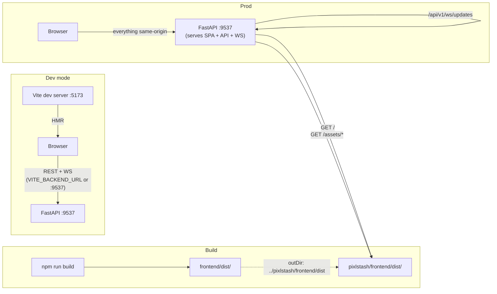
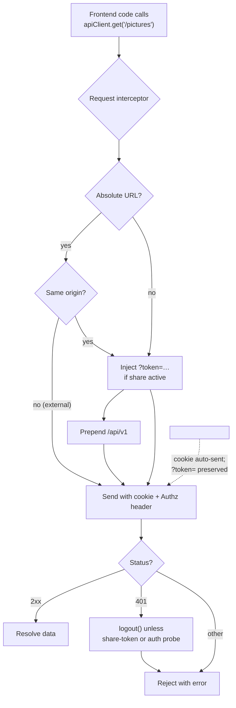

# PixlStash Integration Architecture

> Cross-cutting reference for the **boundary** between the FastAPI backend (`pixlstash/`) and the Vue 3 SPA (`frontend/`). Read alongside [backend_architecture.md](backend_architecture.md) and [frontend_architecture.md](frontend_architecture.md).
>
> Anything in this document is a contract — changing one side without updating the other will break the app.

---

## Table of Contents

1. [Single-Origin Model](#1-single-origin-model)
2. [API Surface & URL Prefix](#2-api-surface--url-prefix)
3. [API Client (`apiClient.js`)](#3-api-client-apiclientjs)
4. [Authentication & Session](#4-authentication--session)
5. [Share Tokens (Public Read-Only Access)](#5-share-tokens-public-read-only-access)
6. [CORS Policy](#6-cors-policy)
7. [WebSocket Channels](#7-websocket-channels)
8. [Real-Time Event Contract](#8-real-time-event-contract)
9. [Image & Thumbnail Serving](#9-image--thumbnail-serving)
10. [File Uploads (Import)](#10-file-uploads-import)
11. [Long-Running Operations](#11-long-running-operations)
12. [Configuration Sync](#12-configuration-sync)
13. [Error Handling Contract](#13-error-handling-contract)
14. [Build & Deployment Coupling](#14-build--deployment-coupling)
15. [Host vs Container Paths](#15-host-vs-container-paths)
16. [Versioning](#16-versioning)
17. [Integration Pitfalls](#17-integration-pitfalls)
18. [Integration Diagrams](#18-integration-diagrams)
19. [Duplicates Queue API (v1.9)](#19-duplicates-queue-api-v19)
20. [Folder-Structure Read API (v1.11, Phase 2)](#20-folder-structure-read-api-v111-phase-2)
21. [About your library (v1.11)](#21-about-your-library-v111)
22. [Folder-Structure Commit API (v1.11, Phase 3)](#22-folder-structure-commit-api-v111-phase-3)
23. [Layout & Move API (v1.11, Phase 4b)](#23-layout--move-api-v111-phase-4b)
24. [Move Reconciliation API (v1.11, Phase 5)](#24-move-reconciliation-api-v111-phase-5)

---

## 1. Single-Origin Model

PixlStash is designed to be served from **one origin**: the FastAPI server hosts both the API and the bundled SPA. The frontend assumes this in many places:

- `deriveBackendUrl()` in [apiClient.js](../frontend/src/utils/apiClient.js) builds the API base URL from `window.location` — no hard-coded backend host.
- WebSocket URLs are derived from the same origin (`http:` → `ws:`, `https:` → `wss:`).
- Image `` URLs are same-origin relative or absolute to the page origin.
- Cookie-based auth depends on the SPA and API being same-origin.

**Override**: `VITE_BACKEND_URL` (build-time env var) can point the SPA at a different backend — used during local Vite development against a remote server.

---

## 2. API Surface & URL Prefix

- All REST endpoints live under **`/api/v1/`** (constant `API_V1_PREFIX` in [server.py](../pixlstash/server.py)).
- The `apiClient` request interceptor automatically prepends `/api/v1` to any relative URL that does not already start with it — frontend code can call `apiClient.get('/pictures')` and have it routed to `/api/v1/pictures`.
- WebSocket endpoints are **also under `/api/v1/`**: `/api/v1/ws/updates` and `/api/v1/ws/comfyui`.
- Auth endpoints follow the same rule: `POST /api/v1/login`, `POST /api/v1/logout`, `GET /api/v1/check-session`.
- Static assets are served at `/assets/*` (Vite bundle output) and the SPA shell at `/` (serves `frontend/dist/index.html`).

**Contract rule**: every new backend router must be mounted with `prefix=API_V1_PREFIX`. Every new frontend call must use a relative URL (the client adds the prefix).

---

### 2.1 The `/dedup` contract (v1.9)

The duplicate queue was built by two lanes at once, so the agreement is written
down rather than inferred from either side. The client half lives in
[`api/dedup.js`](../frontend/src/api/dedup.js); this is the integration-side
copy, reconciled against `routes/dedup.py` as shipped (2026-07-29).

| Route | Purpose | Response |
|---|---|---|
| `GET /dedup/policy` | tier defaults, bounds and closed vocabularies | `{ defaults, bounds }` |
| `GET /dedup/groups` | one page of the queue, confidence descending | `{ groups, total, offset, limit, next_cursor, policy, scope, scan }` |
| `GET /dedup/stacks/{stack_id}/members` | one page of an existing stack's members, for the deck expansion | `{ stack_id, member_count, leader_picture_id, leader_thumbnail_version, stackable, blocked_by_sets, offset, limit, next_offset, members }` |
| `POST /dedup/counts` | the sidebar badge, the per-tier split, and N scoped counts | `{ unresolved_groups, by_tier, scopes, policy, scan }` |
| `POST /dedup/scan` | queue a scan for one scope | `ScanProgressModel` |
| `POST /dedup/verdicts/stack` | the "same picture" verdict | `VerdictResponse` |
| `POST /dedup/verdicts/keep-separate` | the "different pictures" verdict | `VerdictResponse` |
| `POST /dedup/verdicts/reopen` | un-resolve a group (clearing a stacked verdict also dissolves its stack) | `{ signature, previous_verdict, reopened_at, group_returned_to_queue, batch_id, unstacked_picture_ids }` |
| `POST /dedup/auto-stack` | bulk-stack the exact tier, `dry_run` first | `{ batch_id, dry_run, groups, pictures, scope, dry_run_summary, results, failures }` |

Shapes and rules the frontend depends on:

- **A group is `{ signature, tier, confidence, member_count, cover_picture_id,
  why, created_at, candidates, stacks }`.** `signature` is a hash of the sorted member
  content hashes and is the id every verdict route takes, **in the request
  body**, never in a path. `tier` is `exact | near | embedding`; the exact tier
  is rendered as a different kind of claim, never as "100% similar".
- **A candidate is `{ picture_id, width, height, megapixels, size_bytes, format,
  is_raw, score, tag_count, created_at, imported_at, stack_id,
  reference_folder_id, file_path, smart_score, sharpness, cover_score, why }`.**
  `file_path` is populated **only** for a reference-folder picture and is null
  for a managed one, which is exactly the design's "paths only where they
  matter" rule enforced server-side rather than trusted to the client.
  `smart_score` ([1, 5] scale) and `sharpness` (typical 0-0.5) are the cover
  ranking's top signals, **null-safe**: null means not computed yet or failed —
  render a dash, never a zero. `cover_score` is the **deprecated** legacy
  composite; do not build new UI on it.
- **A group carries `stacks`, and it is the thing the row renders (2026-08-01).**
  `{ "<stack id>": { stack_id, member_count, leader_picture_id,
  leader_thumbnail_version, matched_picture_ids, stackable, blocked_by_sets } }`,
  one entry per existing stack the group touches, `{}` when none is. A stack
  verdict moves whole **stacks**, so the smallest thing the queue may offer to
  move is a unit: a loose picture (`stack_id: null`), or a **deck**, every
  candidate sharing a `stack_id`, drawn as one tile.
  - **`member_count` is the STACK's live member count, not the group's.** It is
    routinely larger than the number of that stack's members in `candidates`
    (measured: 36 of 116 stack-touching groups name only ONE member of a stack),
    so a group's true picture total can exceed `candidates.length`. Sizing a deck
    from `candidates` draws a 4-deep stack as one picture and then silently moves
    four.
  - **`leader_picture_id` is the deck's face**, and it is frequently *not* in
    `matched_picture_ids`. A cover choice on a deck resolves to the leader, so
    showing a matched member while meaning the leader is the mismatch the deck
    exists to remove. `leader_thumbnail_version` is its `?v=` token, same
    contract as a candidate's, so the face renders without expanding anything.
  - **`stackable` / `blocked_by_sets` are the unit-level rollup**: false when ANY
    member of the deck is frozen, because a stack cannot be partially stacked.
    This already covers a locked sibling **outside** the group, a locked set
    freezes a whole stack.
  - **Count and leader are eager; the members are not.** Shipping every member of
    every stack would put a 40-member stack's worth of tiles behind one row.
    `GET /dedup/stacks/{stack_id}/members` is the expansion's own read: plain
    `offset` paging (a stack's membership is not a live list being decided out
    from under the client), `next_offset` is `null` at the end, members come back
    leader-first with exactly the fields a candidate carries plus `position` and
    `is_leader`, and `why` is always `[]`: evidence belongs to the duplicate
    group, not to a stack the user already made. A stack with no live member is a
    **404**, never an empty stack that looks like it exists. Its envelope's
    `stackable` / `blocked_by_sets` are the same pair, with the same meaning and
    over the same member rows, as a `GET /dedup/mixed-stacks` row: `false` means
    split, unstack and `DELETE /stacks/{stack_id}/members` all answer `423`.
    **The envelope can be `false` while every listed member is `true`.** The
    envelope counts scrapheaped member rows (a scrapheaped picture in a locked
    set still freezes its stack against being broken up); the per-member flag is
    the narrower "may this picture be put in a dedup stack", and a scrapheaped
    locked member freezes no live sibling. Drive the split/unstack affordance off
    the envelope, not off the members.
- **A candidate also carries `stackable` and `blocked_by_sets`.** `stackable:
  false` means a locked picture set freezes it, so it can be neither stacked nor
  metadata-unioned, and `blocked_by_sets` is `[{id, name}]` for the tooltip.
  Render it as excluded-by-the-server (the same treatment as a user exclusion,
  with a lock rather than an X) and act on the `stackable` ones only.
  `cover_picture_id` is already moved onto a stackable member.
- **A group with fewer than two stackable members is withheld entirely** (owner
  call, 2026-07-30). It poses no stackable decision, so it is not served, not
  counted in `total`, not counted by `POST /dedup/counts` (`unresolved_groups`
  and `by_tier`), and not planned into `POST /dedup/auto-stack` or its dry run.
  One rule, every surface, so the badge can never disagree with the list. The
  filter is **SQL inside the group predicate**, not a post-filter on the page:
  dropping rows after the `LIMIT` would shrink pages and desynchronise the
  cursor. Groups that keep two or more stackable members are still served whole,
  frozen members included and marked. Nothing is deleted: the group row survives
  and unlocking the set brings it straight back with no rescan.
- **A fully collapsed group is withheld the same way** (design D1): a group
  whose live members already sit in one and the same stack poses no decision, so
  it is not served, not counted, and, since 2026-08-01, **not planned into
  `POST /dedup/auto-stack` or its dry run either**. Auto-stack used a weaker
  filter that ignored stack units, so it reported far more "stacks to create"
  than the badge showed and would have re-covered stacks the user had already
  curated. The button's count and the run are now the same population.
- **A withheld group's signature stays valid.** A client holding a page from
  before the lock landed can still POST it, and that is the path the partial
  success and the `423` below exist for.
- **A why-pill is `{ text, against }`.** `against: true` is counter-evidence and
  renders as the red x; the client orders counter-evidence first, because a
  collapsed row only has room for two pills and the warning is the half that
  matters.
- **`scan` is `{ status, scanned_pictures, total_pictures, scanned_buckets,
  total_buckets, groups_found, error }`** and rides on the queue, the counts and
  the scan trigger, so any of the three can feed the progress banner. `status`
  is `idle | pending | running | complete | failed`. There is **no percentage
  and no time estimate**: the client derives the percentage from pictures, or
  from buckets when no picture total is known yet, and deliberately shows no
  "N min left" rather than inventing one.
- **Scope is `(scope_type, scope_id)`** with `scope_type` one of
  `global | project | set | character | folder`, published in
  `bounds.scope_types`. The whole vault is `global` and takes no id; every other
  type requires one, and a folder's id is its absolute path. `ScopeRequestModel`
  **forbids extra fields**, so a scope label or glyph is a 422: those are client
  presentation state and live in the URL query instead.
- **The tier gate is two booleans plus a threshold**, not a list of tier names:
  `near_enabled`, then `embedding_enabled` which requires it. `bounds` carries
  `tiers` (strongest first), `always_on_tiers`, `tier_requires`,
  `min_threshold`, `max_threshold` and `max_page_size`, so no bound is stated
  twice. A threshold below the floor is a **400, never a silent clamp**.
- **Counts take a LIST of scopes and always return the global badge**, so a
  context menu labelling three entries refreshes the sidebar in the same
  request and the two can never disagree. `by_tier` deliberately includes tiers
  that are switched off, so the tier menu can show what enabling one would add.
- **`batch_id`** is what makes a bulk auto-stack reverse with one `Ctrl+Z`, so
  it has to reach the client on the real run. `failures` names groups the run
  skipped: one unstackable group never aborts it, so a partial result is
  reported rather than hidden.

**Keep-separate records one operation, exactly like stack (owner override,
2026-07-30).** Until then it deliberately recorded nothing (the #644-era CSO
ruling: no reversible picture facet, and an empty row would still consume a
`Ctrl+Z`); the owner explicitly reversed that ruling. Every verdict — stack and
keep-separate — now records one operation (`dedup.stack` /
`dedup.keep_separate`), a client gesture id groups several into one undo, and
both flow through the standard `ActionReceipt` with nothing dedup-specific. The
keep-separate operation's before/after payloads are empty (no picture facet
changed); its undo reopens the verdict and returns the group to the queue via
the registered post-restore hook, and redo re-decides it. The explicit
**Reopen** ("Clear decision") action remains available as the non-undo way
back — and since the 2026-07-30 clear-decision fix it, too, records a
`dedup.reopen` operation whenever clearing a stacked verdict has to dissolve
the verdict's stack (the response carries the `batch_id`; undoing it restacks
and re-decides). A picture-neutral clear still records nothing.

**Paging is a keyset cursor; `offset` is the deprecated fallback.** The queue is
ordered by confidence descending while a scan is still inserting rows, so an
offset can re-serve a group the client already holds or skip one. `next_cursor`
over `(confidence DESC, signature)` removes that hazard instead of mitigating
it, so it is the **primary path**:

- A first page is always `offset=0`. A cursor is a position inside one ordering,
  and the policy, the threshold or the scope may have changed under it, so
  `useDedupStore.loadFirstPage` never reuses one.
- A response carrying a non-empty `next_cursor` puts that queue on the cursor
  path: `loadMore` sends `cursor` and **never sends `offset` alongside it**,
  because a server free to choose between the two could silently keep the weaker
  one. `next_cursor: null` (or absent) ends the cursor path.
- A cursor outranks the offset arithmetic in both directions. `total` is a live
  count under a running scan, so a served cursor means "more" even when the
  offset says the page was the last, and an **empty page ends the queue whatever
  the cursor says**, or a server that kept minting cursors past the end would
  loop the read-ahead.
- A cursor needs no correction when a verdict removes a row: it names a position
  in the ordering, not a count of rows before it. Only the offset is decremented
  in `removeGroup`.
- **The offset fallback stays seamless and keeps its mitigations.** A server that
  publishes no `next_cursor` is paged exactly as before, and either path can hand
  over to the other mid-queue. `loadMore` dedupes by signature on **both** paths
  and drops a re-seen group (a duplicated row could be resolved twice, and the
  second verdict would 400), and the offset still advances by the page's
  **served** length rather than its kept length.

**The sidebar badge is reconciled from the server after every verdict.** Both
verdict kinds now raise the standard `pictures_changed` event (added 2026-07-30
alongside the keep-separate op-logging; before that a keep-separate raised no
event at all), so a second tab has a refresh signal — but the event names
pictures, not dedup counts. `useDedupStore` therefore keeps the optimistic tick
for immediacy and fires `POST /dedup/counts` behind it (one scope, one COUNT,
not awaited so auto-advance is not held up), and `DuplicateQueue` refreshes the
counts on queue open even when it is already showing the requested scope. **Do
not treat a WebSocket event as the source of truth for a dedup count.**

**The auto-stack consent dialog reads `dry_run_summary`, not the envelope.** The
server derives `{ groups, groups_by_tier, pictures, covers_gaining_tags,
covers_gaining_score, covers_gaining_metadata }` from one read of one group list,
so the dialog's rows cannot disagree with each other across a landing scan. The
design's "covers gaining metadata from copies" row is
`covers_gaining_metadata`, and "Stacks to create" sums `groups_by_tier`. The
top-level `groups` / `pictures` are used only as a fallback for a server that
predates the summary. **`groups_by_tier` counts only what the run would act on**
(exact-only today, zero-filled for the rest), so it is *not* the queue's
remainder: the dialog's "Groups left in the queue to review" row stays on
`POST /dedup/counts` -> `by_tier`, which is the only call that knows it. Those
two rows therefore still come from different calls, deliberately, and could
disagree across a race.

**Punch-list for the backend lane** (fields a designed UI state wants and the
shipped surface does not provide; none is worked around silently):

1. **No thumbnail version on a candidate.** The grid busts its thumbnail cache
   with `?v=<version>`; a dedup candidate carries none, so the queue's
   thumbnails load without one. A thumbnail regenerated mid-triage therefore
   shows stale until a reload. Non-blocking, and a wrong decision is not
   possible from it.
2. ~~**No "covers gaining metadata" count on the auto-stack dry run.**~~
   **Resolved:** `dry_run_summary.covers_gaining_metadata`, and the row is back
   in the dialog.
3. **The queue remainder and the run's counts still come from two calls.**
   `dry_run_summary.groups_by_tier` covers the run, not the queue, so the
   "groups left in the queue" row is fed from `POST /dedup/counts` -> `by_tier`.
   Noted so the two are known to be able to disagree across a race.

### 2.2 The `Keep cover only` contract

Two routes on the **stacks** surface, not the dedup one, because the action is
about stacks however they were made: the queue is not the only way stacks get
created. Design: `docs/design/keep-cover-only.md`; backend: §22.12 of
`docs/backend_architecture.md`.

| Route | Purpose | Response |
|---|---|---|
| `POST /stacks/keep-cover-only/preview` | the confirm dialog's only source of truth | `KeepCoverOnlyPreviewResponse` |
| `POST /stacks/keep-cover-only` | collapse every eligible stack to its cover | `KeepCoverOnlyResponse` |

Both take the same body: `{ stack_ids?: int[], picture_ids?: int[], batch_id?:
string }`. At least one id list must be non-empty (400 otherwise); they are
unioned, and **the unit is the stack**, any picture named pulls in its whole
stack, so a partial selection inside a stack collapses the whole stack. Loose
pictures name no stack and are ignored.

**2000 ids per request, counted before de-duplication and shared by the two
lists.** No list may carry more than 2000 entries and the two together may not
exceed 2000 (400 either way). Both halves of that used to be looser: the cap was
applied to the de-duplicated set, so a body of repeats passed, and it was applied
per list, so one request carried 4000.

**`batch_id` must be client-namespaced** (`cli-` plus 4-76 of `A-Z a-z 0-9 _ -`)
or the request is a 400, the same rule the `/dedup/*` routes and the
`X-Operation-Batch-Id` header enforce, from the same helper
(`pixlstash/utils/request_origin.py::require_client_batch_id`). Omit it and the
server mints an `srv-…`. It is the undo handle, so an unvalidated one lets a
caller graft its rows into another batch and reverse more than the user did.

Shapes and rules the frontend depends on:

- **Every figure in the dialog comes from the preview, and only from it.** The
  headline and the button label must render from the *same computed value*, not
  merely the same endpoint. While the preview is in flight or has failed, show
  an en dash and disable the confirm: never a zero, never a stale number.
- **The stack buckets are disjoint and sum to `stacks_selected`:**
  `stacks_eligible + stacks_skipped_locked + stacks_skipped_character_on_copy +
  stacks_skipped_single_member`. Do not derive one by subtracting the others;
  the server counts each directly and refuses to answer if the sum breaks.
  `unknown_stack_ids` is *outside* the arithmetic (those are not stacks).
- **The headline is `pictures_moving`**, computed over the eligible stacks only,
  so it never includes a skipped stack's members. `picture_ids_moving` is the id
  list behind it, for marking cards.
- **`covers_gaining_metadata` is a union, not a sum**, of
  `covers_gaining_tags` and `covers_gaining_score`: a cover can gain both.
- **`bytes_held_by_copies` is held, not freed.** Never render it as freed,
  reclaimed or saved space, and never as a figure block; it is a *sentence*
  about what could later be reclaimed. Nothing is freed until the Scrapheap is
  emptied, and `scrapheap_retention_days: null` means **never** (the default on
  a fresh install), so the retention copy must branch on this value rather than
  hardcode "30 days". `originals_deleted_from_disk` is always `0` and should be
  stated out loud, exactly as the sibling delete-forever dialog states its own
  zero.
- **`reference_folder_pictures_moving` is a SUBSET of `pictures_moving`,** not a
  fourth bucket: those rows move like any other, but their files are
  user-managed and are not touched.
- **`stacks[]` carries one row per selected stack**, eligible and skipped alike,
  each with `stack_id`, `cover_picture_id`, `member_count`,
  `copy_picture_ids` (empty when skipped), `eligible`, `skip_reason`,
  `locked_sets` and `lost_characters`. Rows and headline come from the same
  read, which is the property the auto-stack dialog lacked when it reported "62
  stacks to create" for work that would create 3.
- **`skip_reason` is a closed vocabulary:** `set_locked` (a live member is
  frozen by a locked picture set: the **whole** stack is refused, with
  `locked_sets` naming what to unlock), `character_only_on_copy` (a character
  link sits only on a copy, with `lost_characters` naming it), `single_member`.
  Menu state follows the shipped `Delete` item: disabled with the lock reason
  only when **every** selected stack is locked; otherwise enabled, with the
  dialog reporting the skips.
- **The mutation's response mirrors the preview** field-for-field where they
  overlap (`stacks_collapsed` == `stacks_eligible`, `pictures_moved` ==
  `pictures_moving`, and so on), plus `tags_added`, `scores_lifted` and
  `batch_id`. The skipped lists come back as **rows**, not counts, so the
  receipt's second sentence can name what was skipped.
- **`batch_id` is the undo handle** for `POST /operations/batches/{batch_id}/undo`;
  the whole call is one `stack.keep_cover_only` operation, so one `Ctrl+Z`
  reverses every stack it collapsed. It is `null` when nothing was collapsed.
- **No `confirm_token` and no type-to-confirm.** Those are reserved for
  destroying an on-disk original. Cancel is focused by default and plain `Enter`
  does not accept, deliberately inverting the app's dialog convention because
  users arrive with `Enter` under their finger from the queue's verdict keys.

**The collapse announces two things, and the second one was missing** (fixed
2026-08-02). The copies leave, and the covers' **stack membership** changes: a
cover that led a stack of five now leads nothing live, and a card renders that
number as its stack badge.

- The copies are `removed`, the covers are `updated`. **Never merged**: telling
  the grid a scrapheaped picture was merely updated leaves a 404-clickable card.
- The covers' announcement is **unconditional** (gated only on something having
  moved) and carries `fields: ["stack_count"]`. It used to be gated on
  `tags_added or scores_lifted`, which tests the wrong property: a collapse
  whose metadata union found nothing new said nothing at all about the cover, so
  every view went on drawing a stack of five around a picture that was alone.
- The metadata union keeps its **own** `updated` event, with no `fields`,
  emitted only when it did something. Two events, because narrowing the union's
  announcement to `stack_count` would tell a client sorting by score that the
  change cannot affect its order, which is false.
- **`stack_count` is the field name because it is the derived, listing-only
  value the client re-reads.** The server computes it per stack over LIVE
  members in the `fields=grid` projection (`_enrich_stack_counts`) and
  `GET /pictures/{id}/metadata` does not carry it at all, so the per-card
  metadata refresh the SPA uses for every other `updated` event cannot repair a
  badge. See §8.2 for the branch that consumes it.
- **The undo and the redo announce it back**, from
  `operation_log_service._emit`. The surviving members carry no facet diff and
  are therefore not even in the operation's picture list, so they are resolved
  separately (`lifecycle["stack_siblings"]`, computed in the restore's own
  session after `delete_emptied_stacks`) and get the same
  `fields: ["stack_count"]` announcement. That rule is general, not
  keep-cover-only's: any lifecycle move changes the live count of every stack it
  touched.

**The frontend consumer (shipped).** `api/stacks.js` owns both URLs
(`previewKeepCoverOnly` / `keepCoverOnly`); the copy and the two selection
computations are pure functions in `utils/keepCoverOnly.js`;
`KeepCoverOnlyDialog.vue` renders the consent and `ImageGrid.vue` owns the
preview, the run and the ghosting. Five points where the wiring is load-bearing:

- **One computed, two renderings.** `picturesMoving` is `null` until the preview
  lands and drives both the headline block and the confirm label, so the two
  cannot describe different moments even in principle.
- **The confirm acts on the stacks the preview described**, frozen when the
  dialog opened (`keepCoverOnlyTargetStackIds`), never on the live selection
  re-read at confirm time.
- **The menu's stack count and its locked gate are client-side** and only decide
  what is *offered* (`selectedKeepCoverOnlyStacks` /
  `keepCoverOnlyLockReason`); the preview stays authoritative about what
  actually happens.
- **`stack.keep_cover_only` is registered** in `OP_ICONS` (`mdi-layers-minus`)
  and in `DESTRUCTIVE_RULES`, so the receipt inherits the 8s window. The skipped
  rows become the receipt's second sentence via
  `useOperationStore.noteNextReceipt(opType, note)`: the same pill as the move,
  never a competing notice.
- **The badge is reconciled off the WebSocket, in every tab including the acting
  one, never by a refetch.** `runKeepCoverOnly` deliberately does not call
  `debouncedFetchAllGridImages()`: a refetch rebuilds the grid without the
  scrapheaped copies and takes the ghosted tiles, and with them the one-click
  undo they advertise, off the screen. The `stack_count` announcement above
  drives `ImageGrid.refreshStackFacets`, which patches fields only. That is also
  why the acting tab's own echo is not suppressed for this field: it has no
  optimistic local copy of a count only the server can compute, and an undo has
  no local grid op at all.

---

### 2.3 The `/libraries` contract (v1.11)

Six routes, and the split between them is a locality split rather than a
read/write one.

| Route | Tier | Shape |
|---|---|---|
| `GET /libraries` | `owner_only` | `{ libraries[], can_manage, in_docker, cli_hint }` |
| `GET /libraries/inspect?path=` | `local_owner_only` | one verdict (below) |
| `POST /libraries` | `local_owner_only` | `{ path, name? }` → the library, `201` |
| `PATCH /libraries/{library_uuid}` | `local_owner_only` | `{ name }` → the library |
| `DELETE /libraries/{library_uuid}` | `local_owner_only` | `{ status, library, inert_share_links }` |
| `POST /libraries/active` | `local_owner_only` | `{ uuid }` → the library |

**`can_manage` is the single gate the frontend reads.** The listing is
`owner_only` so the Settings tab renders for any owner; every management verb is
`local_owner_only` because four of the five take or write a host path and the
other two exercise authority over other principals' state. Rather than have each
control guess, `GET /libraries` answers `can_manage` from the same predicate the
authz gate applies, and `LibrariesSection` hides the whole management surface —
the Add button and the per-row `⋯` menu — when it is false. A remote session is
given a visible reason instead of controls that each fail.

**`inspect` returns one of five verdicts**, and the client branches only on
`can_add`:

| `verdict` | `can_add` | Means |
|---|---|---|
| `attached` | `false` | This exact folder is a registered library (`library` names it). `picture_count` is still what is on disk, indexed or not: a desktop first run creates the vault in a folder that may already hold pictures, and the empty library asks this to know whether to offer bringing them in |
| `overlaps` | `false` | A registered library contains it, or it contains one (`library` names it) |
| `vault` | `true` | A vault nothing is using — `POST /libraries` attaches it |
| `pictures` | `true` | Pictures, no vault — `POST /libraries` starts a library over them |
| `empty` | `true` | Neither — `POST /libraries` starts a fresh one |

`headline` and `detail` are written server-side and rendered verbatim, so the
sentence naming the library that covers a folder exists once, where the rule
lives; only the button label is the client's. `picture_count_capped` is `true`
when the recursive count stopped at its entry cap, so `picture_count` is a floor
and the copy says "at least".

**The verdict is advisory.** `POST /libraries` re-inspects the path itself and
answers `409` with the same sentence if the folder became covered in between, so
a client cannot skip the rule by not asking. It requires the folder to exist
(`404` otherwise) and creates no directory: the picker makes one with `POST
/filesystem/folders`, which it already used.

Both path-taking routes answer `400` for a relative path or one resolving into a
blocklisted system directory (resolved **then** checked, so a symlink cannot
smuggle one past), and `403` for a path outside `filesystem_roots` when that is
configured. `POST` also accepts an optional `name`; without one the server uses
the folder's own, and **the picker sends one** — library names are unique among
attached libraries, so two folders both called `2024` would otherwise be
unaddable from the dialog.

**`DELETE` removes no file.** The registry clears the attached flag and keeps
the row, so the `inert_share_links` it reports stop working rather than being
revoked, and adding the same folder again revives the row — same uuid, same
tokens live again. The active library is refused (`409`); switch away first.

`PATCH` and `DELETE` take the **uuid only**, and only of an **attached**
library. The registry's `get` also accepts a row id and a name, which is right
for a CLI a person types at; over HTTP the handlers resolve through `by_uuid`,
because a client left open across a detach and attach would name a different
library by row id. `by_uuid` does return detached rows — that is how a uuid stays
meaningful for the tokens stamped with it — so the handlers filter them: a
library already forgotten is a `404`, not a second `200`.

`DELETE` answers `503` while a library switch is in flight. The other three do
not: these routes are hub-only and deliberately keep answering when no vault is
open, which is the state an owner recovers from. Detach is the exception because
it reads which library is active, and mid-swap that is the one thing moving.

---


## 3. API Client ([apiClient.js](../frontend/src/utils/apiClient.js))

Single shared **axios** instance with:

| Setting | Value | Rationale |
|---------|-------|-----------|
| `baseURL` | derived from `window.location` (or `VITE_BACKEND_URL`) | Same-origin assumption |
| `withCredentials: true` | always on | Required so the browser sends the JWT cookie |
| `timeout` | 60 000 ms | Many endpoints are slow (import, plugin runs) |
| Default `Content-Type` | `application/json` | Overridden for `multipart/form-data` uploads |

### Request interceptor

1. Skip absolute URLs to other origins (avoids leaking the share token to third-party hosts such as a local ComfyUI).
2. If a share token is active, inject `?token=<token>` as a query param.
3. On **mutating** requests (`POST`/`PUT`/`PATCH`/`DELETE`) inject the per-tab **`X-Client-Id`** header (the same-origin guard above applies, so it is never leaked off-origin). See §8.1.
4. Prepend `/api/v1` to any relative URL that doesn't already start with it.

### Response interceptor

On `401 Unauthorized`, the client calls `logout()` automatically — **except**:
- The probe endpoint `/users/me/auth` (used to test credentials without side-effects).
- Requests made under a share token (a 401 just means that endpoint is outside the token's scope).

All frontend code **must** route HTTP traffic through this client; bypassing it skips auth, share-token injection, and 401 handling. The only legitimate bypass is direct ``. Such a URL **must** be built from `API_BASE_URL`, since the `/api/v1` prefix is added by the request interceptor that only Axios requests reach; without it the request lands on the SPA fallback, which answers 200 with HTML rather than an error. It also passes through `appendShareToken()` wherever the resource is reachable under a share token — which is most of them, but not the shelf's own (a model icon is `OWNER_ONLY`, a training-run sample `LOCAL_OWNER_ONLY`), where a share token could never resolve anyway.

---

## 4. Authentication & Session

### Authentication modes

1. **Cookie session** (browser SPA): `POST /api/v1/login` with `{username, password}` returns a JWT in an **HttpOnly cookie**. The browser sends it automatically thanks to `withCredentials: true`.
2. **Bearer token** (programmatic clients): a `UserToken` (long-lived API token) passed as `Authorization: Bearer <token>`.
3. **Share token** (public read-only): a scoped `UserToken` passed as `?token=<token>` query param. See §5.

### Session bootstrap

On app mount, the SPA calls:

- `GET /api/v1/login` — determines whether registration is needed.
- `GET /api/v1/check-session` — validates the current cookie; on `401`, the SPA renders the login screen.
- `GET /api/v1/users/me/config` (or equivalent) — fetches the user's settings (`sessionContext` ref).

### Logout

`POST /api/v1/logout` clears the session cookie; the SPA wipes `isAuthenticated` and `sessionContext`.

### Reactive state

`apiClient.js` exports reactive refs that the rest of the SPA reads:

| Export | Type | Meaning |
|--------|------|---------|
| `isAuthenticated` | `Ref<boolean>` | True after successful login or `check-session` |
| `sessionContext` | `Ref<object \| null>` | Current user/scope/limits |
| `isReadOnly` | `ComputedRef<boolean>` | True when `sessionContext.scope === 'READ'` |

Components must respect `isReadOnly` for any mutating UI (hide edit/delete affordances when true).

---

## 5. Share Tokens (Public Read-Only Access)

- Activated via `activateShareToken(token)` when the SPA detects a `?token=` query param at boot.
- Stored in module-scope (not persisted) — refreshing without the query param exits share mode.
- Injected automatically into:
  - Every same-origin axios request (request interceptor).
  - Every `` / `<video src>` URL built through `appendShareToken(url)`.
- A share token is a `UserToken` with `scope=READ` and an optional `resource_type`/`resource_id` (picture set, character, project). The backend enforces scope per request; the SPA hides all write affordances when `isReadOnly` is true.
- Backend never logs the token; frontend never sends it cross-origin.

---

## 6. CORS Policy

Configured in [server.py](../pixlstash/server.py) (`CORSMiddleware`):

- `allow_origin_regex` always permits **`localhost`**, **`127.0.0.1`**, and the host's detected **LAN IP**, on any port and over `http` or `https`. This lets the Vite dev server (default `:5173`) and other dev clients talk to the backend without manual configuration.
- Additional explicit origins can be added through the server config `cors_origins` list.
- `allow_credentials=True` — required because the SPA uses cookie auth.
- `allow_methods=["*"]`, `allow_headers=["*"]`.

**Rule**: any new dev environment must satisfy the regex above or be added to `cors_origins`, otherwise cookies will be dropped.

---

## 7. WebSocket Channels

Two endpoints, both under the API prefix:

| Endpoint | Used by | Purpose |
|----------|---------|---------|
| `GET /api/v1/ws/updates` | [App.vue](../frontend/src/App.vue) | Vault-wide events (pictures, tags, characters, plugin progress) |
| `GET /api/v1/ws/comfyui?clientId=…` | [ComfyUiRunner.vue](../frontend/src/components/io/ComfyUiRunner.vue) | ComfyUI workflow execution stream |

### Lifecycle (`/ws/updates`)

1. Frontend opens the socket after auth succeeds.
2. On `open`, the SPA sends a `set_filters` message with the current view filters (selected character, set(s), search query). The backend uses these to scope which events the client receives.
3. The server pushes JSON events as state changes occur.
4. On `close`, the SPA auto-reconnects after 2 s (`updatesReconnectTimer`).

### Filter message format

```json
{
  "type": "set_filters",
  "client_id": "<opaque per-tab uuid>",
  "selected_character": "<id|null>",
  "selected_set": "<id|null>",
  "selected_sets": ["<id>", ...],
  "search_query": "..."
}
```

When filters change in the UI, the SPA re-sends a `set_filters` message.

`client_id` carries the tab's `X-Client-Id` over the socket because browsers cannot set custom headers on a WebSocket handshake. The server stores it on the per-client record (capped at 200 chars, ignored if longer). It is **forward-looking only** — for v1 the frontend matches the echoed `origin_client_id` against its own id locally, so the server does not yet need it to route events. See §8.1.

---

## 8. Real-Time Event Contract

The backend's [EventType](../pixlstash/event_types.py) enum names are **not** sent verbatim. Wire payloads use **snake_case** `type` strings. Both sides must agree on these strings — they are the integration contract.

### Uniform event envelope

`_broadcast_ws_event` ([server.py](../pixlstash/server.py)) stamps **every** picture/mutation event with the same origin-aware envelope so the SPA can decide *who* caused a change and *what* changed, and drive the grid by intent instead of doing a full reload on every event:

| Field | Type | Description |
|---|---|---|
| `type` | string | Wire type. Picture/mutation events: `picture_imported` \| `pictures_changed` \| `tags_changed` \| `descriptions_changed` \| `characters_changed` \| `plugin_progress`. Snapshot/restore events (carry snapshot/restore info rather than `picture_ids`): `snapshot_created` \| `snapshot_deleted` \| `restore_started` \| `restore_completed` \| `restore_failed`. Machine/vault events (carry neither): `vram_oom` \| `external_moves_pending`. |
| `event` | string | Backend `EventType.name`; diagnostic only, not part of the behavioural contract. |
| `source` | `"ui"` \| `"external"` | Coarse origin class. `"ui"` = an attributable owner action through the SPA; `"external"` = work that originated outside the UI (watch/reference folders, external API writes, background ML finishers, externally-run ComfyUI). Defaults to `"external"`. |
| `origin_client_id` | `string` \| `null` | The `X-Client-Id` of the originating tab, or `null` for background/external work. **The primary signal** — a tab recognises the echo of its own change by matching this against its own id. |
| `picture_ids` | `number[]` | Affected picture ids. |
| `fields` | `string[]` (optional) | Columns that changed (e.g. `["smart_score"]`); drives the silent-vs-sort-changed decision. Omitted for edits that may affect any view (user edits, imports). Two values are **not** columns and name a routing class instead: `detections` (card content) and `stack_count` (the stack's live member count, derived by the listing endpoint and re-read by its own targeted call). See §8.2. |
| `change_kind` | `"added"` \| `"updated"` \| `"removed"` \| `"restored"` (optional) | Set at the emit site where cheap (`removed` on deletes is free; `added` is implicit for `picture_imported`). **Omitted entirely when unset** — the SPA infers `added` for `picture_imported` and falls back to `updated` otherwise. `"restored"` is a scrapheap comeback (undo of a move, or `POST /pictures/scrapheap/restore`): the card returns, but the picture is **not** new to the vault, so the sidebar must not raise its NEW marker for it. The value set is a closed allowlist on **both** ends — `WsBroadcasterMixin.CHANGE_KINDS` and `resolveChangeKind` — and each silently degrades an unknown kind (the backend drops the field, the SPA falls back to `updated`), so the two move together or not at all. |

Per-type payload specifics (all carry the envelope fields above):

| Wire `type` | Trigger | Type-specific fields | Frontend behaviour |
|-------------|---------|---------------|--------------------|
| `pictures_changed` | Picture metadata/score/quality updated | optional `fields: string[]` | Routed through the decision rule (§8.2). When `fields` is present and **none** of the named fields affect the SPA's current sort/filters (e.g. `["smart_score"]` under a date sort), a same-view change is applied silently or ignored. Omit `fields` for changes that may affect any view (user edits) so the SPA always reconciles. |
| `picture_imported` | New picture entered the vault (ComfyUI, watch folder, API) | — | Slick in-place insert for the initiating tab, targeted insert for a foreign owner tab, or the **"New pictures"** pill for external imports (§8.2). |
| `characters_changed` | Character created/updated/deleted or face reassigned | — | Refresh sidebar (character list) |
| `tags_changed` | Tags or tag predictions changed | `picture_ids: number[]` | Bump `wsTagUpdate` so affected grid cards re-render |
| `descriptions_changed` | Picture descriptions/captions changed | `picture_ids: number[]` | Refresh affected descriptions |
| `plugin_progress` | Image plugin run progress | `plugin`, `progress`, `total`, `picture_id` | Update `wsPluginProgress` for the plugin progress UI |
| `vram_oom` | A GPU task ran out of VRAM: emitted before each retry, then once more to close the sequence | `attempt` (the attempt this frame is about, 1-based), `max_attempts`, `gave_up`, `recovered`, `task_type` (diagnostic only) | One keyed notice (`vram-oom`), updated in place by the later frames. Exactly one closing frame: `recovered` (that attempt succeeded) or `gave_up` (the sequence ended without the work). **`gave_up` with `attempt < max_attempts` is an early stop** — the task died of something else, or the app is shutting down — and the SPA promises no later retry for it; only an exhausted sequence says the work will be tried again. The retry frames carry an explicit timeout longer than the backend's pause, or the card would expire between frames and stop coalescing. |
| `external_moves_pending` | A reference-folder scan queued one or more moves the owner made outside PixlStash for reconciliation (v1.11 Phase 5) | — (no count; the queue is reclassified live, so a number on the wire could already be stale) | Debounced (3s) re-fetch of `GET /moves/pending`, so a burst of scans settling around the same time re-fetches once |
| `snapshot_created` / `snapshot_deleted` | Vault snapshot created or deleted | snapshot info (id, kind, …) | Refresh the snapshots panel |
| `restore_started` / `restore_completed` / `restore_failed` | Vault restore lifecycle | restore info | Drive the restore progress/result UI |

> **`source` migration:** the import emit's legacy value `"user"` is migrated to `"ui"`. During the transition the frontend (`normaliseSource`) accepts **both** — the real signal is the `origin_client_id` match, so accepting the legacy value just over-notifies (safe). Drop the legacy acceptance once both ends have shipped.

**Rules for adding a new event:**
1. Add the enum to `event_types.py`.
2. Use a snake_case wire `type` and document it here.
3. Always include enough context (`picture_ids`, and `change_kind` where cheap) so the SPA can do targeted updates rather than full reloads.
4. For a `pictures_changed` event raised by background work that only touches non-visible/non-sortable columns (embeddings, scores), tag it with `fields` (pass `{"picture_ids": [...], "fields": [...]}` to `notify`) so the SPA can skip the refresh under unaffected sorts. Map the field in `App.vue#pictureChangeFieldAffectsView`.
5. Mutating in-request emits must pass `source`/`origin_client_id` (and `change_kind`) into the event `data` dict — see §8.1.
6. Handle it via `useGridRealtimeSync` (picture events) or the remaining `App.vue` branches (tags/descriptions/characters/plugin).

**Backend filtering**: the server uses the client's last `set_filters` to decide whether to push an event. Events outside the client's current view are dropped server-side to reduce noise. The stream is **owner-only** — scoped/READ tokens may connect but receive nothing.

### 8.1 Client id & origin attribution

Each browser **tab** generates one opaque id (`crypto.randomUUID()`), persisted in `sessionStorage` (survives reload; in-memory fallback in private mode). It is:

- stored in `useWsStore` and mirrored into `apiClient.js` module scope (to dodge Pinia-init timing);
- sent on **every mutating HTTP request** as the `X-Client-Id` header (≤200 chars — an oversized value is **dropped, not truncated**, so a crafted long value can never collide with a legitimate short one);
- sent over the socket via `set_filters.client_id` (§7), because browsers can't set headers on a WS handshake.

The backend's `OriginClientMiddleware` captures the header into `request.state.origin_client_id` (and a contextvar). Mutating handlers thread it into the event `data` dict so `_broadcast_ws_event` echoes it back as `origin_client_id`, letting the originating tab suppress the reload for its own optimistic op.

**Security:** `X-Client-Id` is attacker-controllable and is used **only** for echo-matching — **never** for authorization or scoping. It is length-capped and not logged at INFO. The WS stream stays owner-only. Signed off by the CSO when the origin-aware envelope shipped (PR #468).

### 8.2 Frontend decision rule

The picture-event policy lives in [`useGridRealtimeSync.js`](../frontend/src/composables/useGridRealtimeSync.js) (App.vue keeps only socket lifecycle). For each picture event, in order:

1. **Own-origin echo** (`origin_client_id === myClientId`) → **suppress** (the optimistic local op already applied it). **Exception:** an `updated` event whose `fields` include a *server-computed* sort field (`smart_score`, `character_likeness`) that is also the **active sort** → single-card `refreshSmartScoreForImage`/`refreshGridImage` reconcile, never a reload (the optimistic guess can diverge from server truth).
2. **Foreign owner UI** (`source: "ui"`, different origin) → targeted op: `added` → insert at sorted position + highlight; `updated` → `refreshGridImage`/reposition, gated by `pictureChangeAffectsView(fields)` (ignored when the changed fields don't affect the current view); `removed` → `removeImagesById`.
3. **External** (`source: "external"`) →
   - `added` → the primary-coloured **"New pictures"** pill (never auto-inserts under the user);
   - `removed` → removed **silently** in place (never leave a 404-clickable card);
   - `updated` with `pictureChangeAffectsView(fields) === true` (would reorder the grid) → the sibling **"Sort order changed externally — click to refresh"** pill, instead of reshuffling under the user;
   - `updated` with known fields that are **invisible** to the current sort/filter → **ignored** (e.g. a background `smart_score` recompute under a date sort) to avoid a per-card `/metadata` + thumbnail **refetch storm** for values that aren't even displayed.
4. **Unrecognised shape** (e.g. a bulk sort/filter-defining change) → a rare, **logged** full-reload fallback.

Two field classes are decided **before** the origin dispatch, because for both
of them the origin makes no difference to what has to happen:

- **Card-content fields** (`detections`) → a targeted per-card
  `refreshGridImage`, never a pill and never a reshuffle.
- **Stack facets** (`stack_count`) → **one batched** `refreshStackFacets(ids)`
  read for the whole event, never a pill, never a reshuffle, and never the
  per-card path: `stack_count` is derived per stack by the listing endpoint and
  is absent from `GET /pictures/{id}/metadata`, so `refreshGridImage` cannot
  repair a stack badge. Uniform across origins for the same reason `restored`
  is: the acting tab has no optimistic local copy of a server-computed count,
  and an undo (Ctrl+Z, the toolbar, the lightbox) has no local grid op at all.
  There is no `MAX_TARGETED_UPDATE` escalation here, deliberately: one read is
  not a fetch storm, and the reload it would escalate to is precisely what must
  not happen while a ghost window is open.

Both require **every** named field to be in the class. Mixed fields fall through
to the ordinary dispatch, so a cover that also gained a score still gets the
sort treatment its own (separate) announcement carries.

**The grid is not the only destination.** `useUpdatesSocket` routes each `pictures_changed` frame to every store that holds a snapshot of a server read, and each destination owns its own decision, the grid's table above is *not* shared. The other subscriber is the **Duplicates queue** (`useDedupStore.applyPictureEvent`), whose rows are groups rather than cards:

- `removed` **with ids** → **surgical**. The named pictures are taken out of every loaded group (candidates, the group's `member_count`, and each deck's depth/`matched_picture_ids`/leader), then any group left spanning fewer than two stack units is removed, the client-side twin of `live_groups_filter`'s HAVING clauses. A full `loadFirstPage` is deliberately *not* used: the queue is windowed and keyset-paged, so rebuilding it throws a triage in progress back to row 1.
- `removed` **with no ids**, and `restored` → **not applied to the list**. A returning group lands at a position in the confidence ordering the client cannot compute (there is no per-signature read), and the queue has never been a live insert surface, a scan's new groups arrive by paging too. The badge, which refreshes on `useSidebarRefresh`'s own `pictures_changed` path, carries the change and the row returns with the next page. The one exception is an **empty window**: "nothing left to review" while the badge says otherwise is a lie, and there is nothing on screen to disturb, so the first page is reloaded.
- **Origin is not consulted.** Unlike the grid, this store never applies a scrapheap move optimistically (no queue action deletes a picture), so its own tab's echo is as new to it as another tab's.
- The **decided page** keeps its thinned rows and only loses their dead tiles, matching the server: the verdict already happened and "clear this decision" is the only route back to it.

**ComfyUI classification:** the **in-app** runner is **UI-initiated but async** — there is no optimistic client-side copy to suppress, because the generation completes server-side after the request returns. `routes/comfyui.py` therefore emits a **single** `picture_imported` with `source: "ui"` and **no origin echo** (`origin_client_id` omitted), so **every** owner tab — including the initiating one — performs a slick in-place insert via `handleForeignUi` rather than the originator suppressing its own echo. It does **not** fire a second `pictures_changed`/`CHANGED_PICTURES` broadcast; the field-scoped `Missing*Finder` events (smart_score/quality) emit their own targeted events later. Externally-run ComfyUI lands via the watch/reference finders, which stay `source: "external"`, origin `null` → the "New pictures" pill.

---

## 9. Image & Thumbnail Serving

Browser-native `` tags **cannot** use the axios interceptor, so the integration relies on:

- **Cookie auth** (sent automatically by the browser on same-origin GETs).
- **Share-token injection** via `appendShareToken(url)` — every component that builds an image URL for direct browser fetch must wrap it.

### Endpoint patterns

| URL | Purpose |
|-----|---------|
| `GET /api/v1/pictures/thumbnails/{id}.webp` | Cached WebP thumbnail. Backend uses an async lock + LRU memory cache + on-disk `.pixlstash/` cache. |
| `POST /api/v1/pictures/thumbnails` | Batch thumbnail metadata (JSON). |
| `GET /api/v1/pictures/{id}.{ext}` | Original file (optionally watermarked). |

### Generated thumbnails: the URL is stable, so the *response* carries the freshness contract

`GET /characters/{id}/thumbnail` and `GET /picture_sets/{id}/thumbnail` serve a **generated** image from a server-side cache file whose bytes change under an unchanged URL (the face crop is rebuilt when a better picture wins **or when the user pins a different one** — `PATCH /characters/{id}` with `thumbnail_picture_id`, cleared with `null` — the set collage when its top members change). Two facts make this a trap:

- Starlette's `FileResponse` sets an `ETag` but **answers no conditional request** — its only conditional logic is `If-Range` (verified against starlette 1.3.1).
- With no `Cache-Control` at all, browsers fall back to **heuristic** caching, so a regenerated thumbnail can stay stale for an unbounded window with no revalidation.

The client used to paper over this with a per-request `?cb=<Date.now()>`, which guaranteed freshness by re-downloading every character thumbnail on every sidebar refresh — against a route whose picture lookup is already expensive (issue #651).

**Contract (both routes, via `pixlstash/utils/http_cache.py`):** the response carries `Cache-Control: private, no-cache` plus a weak `ETag`, and a matching `If-None-Match` is answered with a bodyless `304` that repeats the `ETag` and the policy. So the browser revalidates every time but transfers bytes only when they actually changed. **The frontend must therefore NOT cache-bust these URLs** — `SideBar.fetchCharacterThumbnail` calls `getCharacterThumbnail(id)` with no `cacheBuster`, and re-adding one would restore the download-per-refresh cost the header exists to remove.

Note the contrast with `/pictures/thumbnails/{id}.webp`, which is *content-addressed* (`?v=WxH` changes when the bitmap is regenerated) and may therefore be cached for a while: `private, max-age=3600, must-revalidate`. Stable-URL generated images get `no-cache`; version-tokened ones get a max-age.

### Watermarking

The decision to watermark is made server-side per request based on `User.embed_watermark` and the token's scope. The frontend does **not** need to know whether a given URL will be watermarked, but it must regenerate URLs (cache-bust) when watermark settings change.

---

## 10. File Uploads (Import)

- **Endpoint**: `POST /api/v1/pictures/import` (multipart/form-data).
- **Content**: image files or `.zip` archives (extracted server-side).
- **Deduplication**: server computes `pixel_sha` (SHA-256 of decoded pixels) and skips content it already has, **including content sitting in the Scrapheap**. See below.
- **Async**: the response includes a `task_id`. The frontend polls `GET /api/v1/pictures/import/status?task_id=…` for completion percentage.
- **Real-time**: as pictures are persisted, the backend also broadcasts `picture_imported` over the WebSocket carrying the uniform envelope (§8). The SPA distinguishes its **own** upload (drives a progress dialog) from a **foreign owner tab** (slick insert) and from **external** imports (the "New pictures" pill) via `source`/`origin_client_id`.

**Contract**: the SPA sets `isUploadInProgress` for the duration of its own upload so that incoming `picture_imported` events don't double-count.

### 10.1 Three outcomes, not two: the Scrapheap bucket

A file whose `pixel_sha` matches a **soft-deleted** picture is neither imported nor an ordinary duplicate.
Importing it again would put a second copy of every scrapheaped picture back on disk (a bulk "Keep cover only"
cleanup makes that a predictable way to undo the cleanup and double the bytes); restoring it automatically would
be the opposite surprise, because the user scrapheapped it deliberately. So the server reports it and the SPA
**offers** the restore.

Both status endpoints carry it, and the buckets are disjoint and sum to the total (never derived by subtraction,
so no summary line can overstate what happened):

| Endpoint | Fields |
|---|---|
| `GET /pictures/import/status?task_id=…` | `imported_count`, `duplicate_count`, `scrapheaped_count`, `scrapheaped_picture_ids[]`; per-file `results[].status` is `success` / `duplicate` / `scrapheaped` |
| `GET /pictures/import/staging/{id}/status` | the same three plus `failed_count` and `cancelled_count` |

**Both status endpoints are `OWNER_ONLY`** (corrected 2026-08-01; they were
`ANY_TOKEN`). The table above is the reason: `results[].picture_id`,
`results[].file` (the vault-relative filename) and `scrapheaped_picture_ids[]`
are per-object data about pictures anywhere in the vault, which is precisely
what `ANY_TOKEN` promises a route does not return. Neither task id nor
`staging_id` being unguessable changes that; a capability URL is not an access
policy. Every `POST` sibling that starts an import is already owner only, so no
caller that could have a task to poll loses access.

`scrapheaped_count` is per **file**; `scrapheaped_picture_ids` is per **picture**, so several incoming copies of one
scrapheaped picture name its id once. The SPA feeds those ids straight to the **shipped**
`POST /pictures/scrapheap/restore` (there is deliberately no second restore route, and therefore no new
`AccessPolicy` declaration): `ImageImporter.vue` raises one sticky notice whose action restores them and reports
`restored_count` honestly, since retention can sweep a match away between the import and the click. The restore
broadcasts `CHANGED_PICTURES` with `change_kind: "restored"` (§8), which the grid already consumes.


---

## 11. Long-Running Operations

Two complementary mechanisms; most workflows use both:

1. **Task-id polling** — for client-initiated operations with a clear end state (import, export, bulk score apply, plugin run on many pictures): the endpoint returns `{task_id}`; the SPA polls `…/status?task_id=…` until completion, then fetches the result (e.g. download the ZIP via `/pictures/export/download/{task_id}`).
2. **WebSocket events** — for backend-initiated state changes (watch folder ingest, background quality/tag/embedding work, plugin progress): the SPA refreshes affected views from events without polling.

**Rule of thumb**:
- If the user triggered it and expects a result file → polling.
- If it changes vault state that other clients also need to see → WebSocket event.
- For UX (e.g. plugin progress bar), emit both: polling for the initiator and WS broadcasting for everyone else.

### 11.1 Object detection (Segment) & bbox export

The **Segment** action runs Florence-2 object detection over the selected pictures and stores labelled boxes per picture (see [backend_architecture.md §6/§7](backend_architecture.md)). It follows the WebSocket-event branch of the rule above — it is a backend task, not a downloadable result.

- **Enqueue**: `POST /api/v1/pictures/detect` with body `{ "picture_ids": [int, …], "prompt": "optional phrase" }`. An empty/omitted `prompt` runs dense object detection; a non-empty phrase runs open-vocabulary grounding for that phrase. Scoped tokens have `picture_ids` filtered to their grant (deny-by-default; all-out-of-scope → 403). Returns `{ "status": "queued", "task_id", "picture_ids", "prompt" }`. Progress surfaces in the existing task-manager UI.
- **Completion**: the task fires a `pictures_changed` event (`{picture_ids, change_kind:"updated"}`) over the WebSocket; the SPA refreshes affected views.
- **Read**: `GET /api/v1/pictures/{id}/detections` returns a **bare JSON array** (object-scope enforced before any read):
  ```json
  [ { "id": 1, "picture_id": 42, "frame_index": 0, "detection_index": 0,
      "label": "dog", "bbox": [x1, y1, x2, y2], "score": null,
      "source": "florence2:od" } ]
  ```
  `bbox` is pixel `xyxy` in the **original** picture coordinate space (same convention as faces). `score` is `null` for Florence (it emits no per-box confidence). The overlay (`ImageOverlay.vue`) renders these as a toggleable layer next to the face-bbox layer.
- **Export sidecar** (`GET /api/v1/pictures/export?bbox_mode=…`, FULL exports only): writes a per-image `{stem}.json` into the ZIP. `bbox_mode=none` (default) writes nothing. Two formats:
  - `bbox_mode=coco-json` — a COCO-subset sidecar (pixel `xyxy`), written *alongside* the `.txt` caption. Boxes and `width`/`height` scale to match the exported image when a reduced `resolution` is selected.
    ```json
    {"image":"IMG_0001.jpg","width":1920,"height":1080,
     "schema":"pixlstash.detections/v1","bbox_format":"xyxy_px",
     "objects":[{"label":"dog","bbox":[x1,y1,x2,y2],"score":0.0}]}
    ```
  - `bbox_mode=ideogram-json` — an **Ideogram-4 structured-JSON caption** ([official schema](https://github.com/ideogram-oss/ideogram4/blob/main/docs/prompting.md)): this `{stem}.json` *is* the caption ai-toolkit consumes (set `caption_ext: json` in the dataset config). Boxes are **normalized `[y_min,x_min,y_max,x_max]` on a 0-1000 grid** (resolution-independent, so the `resolution` setting does not affect them). Each detection is a `type:"obj"` element with its label as `desc`; key order (`type, bbox, desc` / top-level order) is preserved because the model was trained on a fixed key order. The picture's caption becomes `high_level_description`; `style_description` is omitted (optional). The `.txt` caption is still written per `caption_mode`, so the user picks which one ai-toolkit reads via `caption_ext`.
    ```json
    {"high_level_description":"a dog on grass",
     "compositional_deconstruction":{"background":"",
       "elements":[{"type":"obj","bbox":[y_min,x_min,y_max,x_max],"desc":"dog"}]}}
    ```

### 11.2 Remix — "Generate variants" (v1.9)

Right-clicking a grid image offers **Generate variants…**, which runs one picture through the shipped ComfyUI engine. It follows the WebSocket branch of the rule above: the dialog submits, closes, and the app-wide `ComfyUiRunner` owns progress; the output arrives as a normal `picture_imported` event and is inserted in place (§8).

Two round trips, both scoped to the source picture (`PICTURE_SCOPED` in `ROUTE_POLICIES`):

- **Ask** `GET /api/v1/comfyui/pictures/{id}/recipe`. Answers whether the file carries a *replayable* recipe — the embedded API-format `prompt` chunk, never the UI `workflow` chunk — and pre-flights it against the user's ComfyUI:
  ```json
  {"available": true, "reason": null, "summary": "API Workflow · 12 nodes",
   "positive_prompt": "…", "seed": 12345, "models": ["…"], "loras": [],
   "node_count": 12,
   "node_classes": ["CheckpointLoaderSimple","CLIPTextEncode","KSampler","SaveImage"],
   "source_is_imported": true, "source_label": "Watched folder",
   "seed_inputs": [{"node_id":"3","class_type":"KSampler","field":"seed","value":1}],
   "preflight": {"ok": true, "checked": true, "missing_node_classes": [],
                 "missing_models": [], "missing_input_images": [],
                 "has_save_image": true, "unchecked_fields": 0}}
  ```
  `node_classes` (distinct `class_type`, sorted) and `source_is_imported` / `source_label` exist for the owner's **consent** decision, not for display polish — see the untrusted-graph note below. `node_classes` is read from the file, so unlike everything under `preflight` it is populated even when ComfyUI was unreachable.
  **Three distinct negative answers, and the SPA must not collapse them**, because they send the user to three different places:
  | Response | Meaning | UI |
  |---|---|---|
  | `available:false`, `reason:"no_prompt_chunk"` | Ordinary photo, A1111 output, stripped metadata, or a UI-graph-only file | Recipe mode disabled: "No executable workflow embedded" |
  | `available:false`, `reason:"no_seed_input"` | The graph has no seed to change, so a re-run would be byte-identical (and would be deduped on `pixel_sha`, emitting no event — the user would see nothing at all) | Recipe mode disabled, with that reason |
  | `preflight.ok:false` | Checked, and this ComfyUI cannot run it | Recipe mode disabled, naming the missing node types / models / input images |
  | `preflight.checked:false` | ComfyUI was unreachable — **the check did not run; this is NOT a pass** | Recipe mode stays *selectable* but is **refused by default**: the run needs an explicit acknowledgement (below) |

  `unchecked_fields > 0` means the check was partial (a field ComfyUI does not enumerate, or a `remote` combo it fills lazily) and must not read as a clean bill of health. It is **not** the same state as `checked:false` and must not be gated the same way.

- **Run** `POST /api/v1/comfyui/run_recipe` with `{picture_id, seed_mode, seed?, client_id?, stack?, allow_unchecked?}`, or `POST /api/v1/comfyui/run_i2i` for template mode (which now takes the same `seed_mode`/`seed` pair as `run_t2i`). Both return `{status, prompts:[{picture_id, prompt_id}]}`; the SPA passes `prompts` to `ComfyUiRunner` so its ComfyUI-WebSocket progress tracking picks the run up.

**The client never sends a graph.** `run_recipe` re-extracts the prompt chunk from the picture's file on every call. That keeps the picture-scoped authz declaration a complete access control for the endpoint, and it means a stale client cannot replay something the file no longer contains.

**But the graph is still untrusted input, and the contract reflects that** (review finding R3, CWE-829). It is authored by whoever made the image file; replaying it executes it on the owner's ComfyUI, bounded only by their installed node packs. The owner is the trust anchor, so the two sides split the job:

- **Server side.** `run_recipe` returns **400** when `preflight.checked` is false and the body carries no `allow_unchecked: true`. The refusal is enforced on the server, not only in the dialog — a UI-only gate is not a gate. `allow_unchecked` is accepted as `allow_unchecked` or `allowUnchecked`, matching the existing `client_id`/`clientId` pair, and an accepted override is logged with the node classes that ran.
- **Client side.** The SPA must render `node_classes` before the run button is usable, must send `allow_unchecked` **only** for a run the user explicitly acknowledged (never as a constant, never when `preflight.checked` is true), and must surface `source_is_imported` as information rather than a gate (it is the Source row in the disclosure; it was a banner until 2026-08-06, which fired on the common watched-folder case). See the `RemixDialog.vue` consent section in `frontend_architecture.md` for why the gate is deliberately narrow: an acknowledgement in front of a common state becomes a reflex and stops protecting the rare one.

**Seed ranges differ between the routes** — 32-bit for the template paths, 64-bit for replay (the shipped Flux2 Klein template's own `noise_seed` exceeds 2³²). The dialog caps its input at `Number.MAX_SAFE_INTEGER` regardless, because above 2⁵³ a JavaScript number cannot carry the value the user typed.

---

## 12. Configuration Sync

- All persistent user settings live on the `User` row (see [backend_architecture.md §6](backend_architecture.md#6-database-models)).
- Frontend fetches them once at boot into `sessionContext` and a local `configSnapshot` ref.
- Updates use `PATCH` against the user-config endpoint with **partial** payloads (only changed fields).
- The SPA applies updates **optimistically** to local refs and reconciles on response. Failed updates revert and surface a toast.
- Hidden tags, sort, columns, theme, watermark settings, smart-score penalised tags, etc. are all part of this object — keep the field names identical on both sides.

### 12.1 PixlStash Views (`/server-config/views`)

Views is **not** part of the user-config object: the folder holds *this library's*
sets, people and projects, so it lives in `library_settings` and has its own
topic endpoint, reached through `frontend/src/api/serverConfig.js`.

| Method | Path | Body | Returns |
|---|---|---|---|
| `GET` | `/server-config/views` | — | `{views_root, kinds, available_kinds}` — `views_root` is `null` when views are off |
| `PATCH` | `/server-config/views` | `{views_root, kinds}` | the same, plus `last_publish` |

Three contract points the client depends on:

- **Saving is rebuilding, and the re-derive is total.** There is no separate
  rebuild verb: a PATCH with the current values republishes, which is what the
  pane's *Rebuild now* sends. Every kind folder is cleared, including the ones
  *not* in `kinds` — switching a kind off removes its folder rather than leaving
  it behind full of links nothing will refresh — so `kinds: []` really does leave
  an empty tree.
- **`views_root: null` turns views off**, removing the published tree and leaving
  the folder itself alone.
- **A refused folder changes nothing.** The 400's `detail` names the reason —
  inside this library or another registered one, inside a reference folder,
  cloud-synced, or a filesystem with no links — and the recorded settings are untouched, so the pane must
  re-read rather than keep showing the root that was tried. `available_kinds` is
  the server's list, in display order, so the UI can never offer a kind the PATCH
  would drop.

`last_publish` is what actually landed, not what was asked for:
`{link_mode: "symlink"|"hardlink", folders, links, skipped_missing,
skipped_unlinkable, kept_by_owner}`. Two of those name a partial result and the
UI must show both, because the alternative is a tree that reads as complete and
is not:

- `skipped_unlinkable` — view folders where **at least one** picture could not be
  linked. The folder exists and is incomplete; it is not absent. A hard link
  cannot span two drives, which is what a library split across disks looks like.
- `kept_by_owner` — entries the rebuild refused to delete because they were not
  links: the owner's own files, sitting in a view folder. A rebuild removes only
  a symlink or a file that has another hard link elsewhere, so a file whose only
  copy is in a view folder is reported and left alone, never deleted.

---

## 13. Error Handling Contract

| HTTP status | Frontend reaction |
|-------------|------------------|
| `2xx` | Use response data |
| `400`, `422` | Surface the response's `detail` field in a toast; do not log the user out |
| `401` | Auto-logout (see §3); SPA navigates to login. Suppressed for share-token sessions and the auth probe |
| `403` | Toast "permission denied"; component disables the action |
| `404` | Component-local "not found" state |
| `409` | Surface conflict details (used by import-dedup and rename operations) |
| `5xx` | Generic error toast; the user may retry |

Backend rule: errors must use FastAPI's `HTTPException(status_code, detail=...)` with a human-readable `detail`. Never return a `500` for an expected validation failure.

---

## 14. Build & Deployment Coupling

### Build output

[vite.config.js](../frontend/vite.config.js) writes the build to **`../pixlstash/frontend/dist`** — directly into the Python package. This is intentional: `pip install -e .` then ships the built SPA along with the backend.

### Serving order (in `_setup_routes`)

1. `/assets/*` is mounted as `StaticFiles(directory=…/frontend/dist/assets)`.
2. `/` returns `frontend/dist/index.html` (the SPA shell). If the dist directory is missing (e.g. a clean dev checkout), the root returns a small JSON status so the user sees a clear error.
3. All API routers are mounted under `/api/v1/`.
4. Other top-level routes are added explicitly for public sharing.

### Dev workflow

- Backend: `python -m pixlstash.app` (default port `9537`).
- Frontend: `npm run dev` inside [frontend/](../frontend/) (Vite at `:5173`, HMR enabled).
- CORS regex automatically permits `localhost:5173`.
- Cookies cross ports only if both sides agree on credentials (`withCredentials: true` + `allow_credentials=True`).

### Production workflow

- `npm run build` → `pixlstash/frontend/dist/`.
- Run `python -m pixlstash.app`; the SPA is served from the same origin as the API. No proxy needed.

**Pitfall**: forgetting to run `npm run build` before packaging leaves users with the JSON status fallback at `/`.

---

## 15. Host vs Container Paths

When the backend runs in Docker, filesystem paths in the database refer to **container paths**, but the user thinks in **host paths** (e.g. when picking watch folders or reference folders).

- Translation happens entirely backend-side via [utils/path_mapper.py](../pixlstash/utils/path_mapper.py) and [utils/host_path_utils.py](../pixlstash/utils/host_path_utils.py).
- `ImportFolder` / `ReferenceFolder` rows carry both `path` (container) and `host_path` (display).
- API responses include both values for these resources; the SPA must display `host_path` and only send a `host_path` (never a container path) when creating new folders. The backend resolves to a container path.
- The folder picker at `GET /api/v1/filesystem/browse` returns results in container-path space; the SPA presents them with their host equivalents.

The frontend itself should **never** transform paths — always trust the backend's translation.

---

## 16. Versioning

- A single source of truth for the version: the root `pyproject.toml`.
- The backend exposes it via `GET /version` (returns `version`, `install_type`, `docker_variant`).
- The frontend bakes it in at build time via `vite.config.js` (`__APP_VERSION__` reads `pyproject.toml`).
- The SPA can call `/version` at runtime to detect a backend upgrade and prompt the user to reload.

**Rule**: bump the version in `pyproject.toml` *before* building the frontend so the bundle reflects the actual release.

---

## 17. Integration Pitfalls

A focused list — read before changing anything that crosses the boundary.

1. **Don't add new routers without `prefix=API_V1_PREFIX`.** The interceptor expects every API call under `/api/v1`.
2. **Don't bypass `apiClient`.** Hand-rolled `fetch()` calls skip auth, share-token injection, and 401 handling.
3. **Always wrap browser-fetched image URLs in `appendShareToken()`.** Share mode silently breaks without it.
4. **Use snake_case wire `type` strings for events**, not the `EventType` enum name. Mismatched names manifest as a silently dead UI.
5. **Always include `picture_ids` in picture-related events** so the SPA can do targeted refresh — full reloads on every event will not scale.
6. **Optimistic UI must reconcile on failure.** Always revert local state if the PATCH errors out.
7. **Settings field names are a contract.** Renaming a `User` column requires a coordinated frontend change and an Alembic migration.
8. **CORS depends on cookies.** If you ever set `withCredentials: false` on the client or `allow_credentials=False` on the server, the SPA cannot log in.
9. **Image URLs from `` tags use cookie auth.** If you ever switch to header-only tokens for browser sessions, all `` URLs must become blob URLs fetched through `apiClient`.
10. **`frontend/dist/` is part of the Python package.** Add the build step to release automation; never commit a stale `dist/`.
11. **Host vs container paths**: do not let host paths leak into the database, and never display container paths in the UI.
12. **WebSocket reconnect is silent.** If the backend changes the filter schema, old clients will keep sending stale filters until they reload — version the filter message if you change it incompatibly.
13. **Delete-forever is a two-call flow and cannot be short-circuited.** `POST /pictures/scrapheap/delete-preview` returns a single-use `confirm_token` bound to that exact selection; `DELETE /pictures/scrapheap` refuses without it (400 missing, 409 spent/expired/wrong-selection) and destroys nothing on a refusal. A type-to-confirm dialog is a client control and proves nothing to the server — CORS admits any `localhost`/LAN-IP *port* with credentials (§6), so a page on another local port could otherwise drive the one irreversible endpoint. Clear the token after every attempt and re-run the preview to retry; never cache one.
14. **`X-Client-Id` / `origin_client_id` is for echo-matching only — never authorization.** It is attacker-controllable; any access decision based on it is a vulnerability. Every mutating in-request emit must carry `source`/`origin_client_id` in the event `data` dict, or the originating tab will full-reload on its own change.

---

## 18. Integration Diagrams

### 18.1 End-to-end request & event flow

```mermaid
sequenceDiagram
    autonumber
    participant U as User (Browser)
    participant SPA as Vue SPA
    participant AX as apiClient (axios)
    participant WS as WebSocket (/api/v1/ws/updates)
    participant API as FastAPI (/api/v1)
    participant V as Vault / Workers
    participant DB as SQLite

    U->>SPA: open app
    SPA->>AX: GET /check-session
    AX->>API: cookie + Bearer
    API-->>AX: 200 user context
    SPA->>WS: open connection
    SPA->>WS: { type: set_filters, ... }

    U->>SPA: upload images
    SPA->>AX: POST /pictures/import (multipart)
    AX->>API: forward
    API->>V: enqueue import + processing
    API-->>AX: { task_id }
    AX-->>SPA: task_id
    loop until done
        SPA->>AX: GET /pictures/import/status?task_id=…
        AX-->>SPA: { progress }
    end

    par Background pipeline
        V->>DB: write Picture, Quality, Tags, Embeddings
        V-->>API: emit events (snake_case type)
        API-->>WS: filter by client's set_filters
        WS-->>SPA: { type: pictures_changed, picture_ids: [...] }
        SPA->>SPA: refresh grid / sidebar
    end

    U->>SPA: open a picture
    SPA->>SPA: build 
    Note over SPA,API: Browser sends cookie automatically;<br/>share token appended via appendShareToken()
    API-->>SPA: image bytes (watermarked if applicable)
```

### 18.2 Origin & build coupling



### 18.3 Auth & share-token routing



---

## 19. Duplicates Queue API (v1.9)

The contract behind the sidebar **Duplicates** destination. Every route is
`owner_only`; a share token gets 403 on all of them. Backend design is
`docs/backend_architecture.md` §22.

**Two rules the client must hold to.** The queue is *paged*, never fetched whole
(`GET /dedup/groups` returns `total` so a scrollbar can be sized without a second
request), and a group is addressed by its **`signature`**, never by an id. The
signature is a hash of the group's member content hashes, so it survives a rescan
and a re-import; a numeric id would not.

### `GET /dedup/policy`

No parameters. Renders the tier switches and the threshold slider so 0.90 and the
0.65 floor are never hardcoded twice.

```jsonc
{
  "defaults": { "near_enabled": false, "embedding_enabled": false,
                "threshold": 0.9, "min_group_size": 2, "max_group_size": 24 },
  "bounds": {
    "min_threshold": 0.65, "max_threshold": 0.99999,
    "tiers": ["exact", "near", "embedding"],
    "always_on_tiers": ["exact"],
    "tier_requires": { "exact": null, "near": "exact", "embedding": "near" },
    "scope_types": ["global", "project", "set", "character", "folder"],
    "verdicts": ["stacked", "keep_separate"],
    "max_page_size": 200
  }
}
```

`always_on_tiers` is why the exact switch renders disabled; `tier_requires` is why
enabling *embedding* must first enable *near*. Sending `embedding_enabled=true`
without `near_enabled` is a **400**, and a `threshold` below `min_threshold` is a
**422** — neither is silently corrected.

### `GET /dedup/groups`

Query: `near_enabled`, `embedding_enabled`, `threshold`, `scope_type`,
`scope_id`, `cursor`, `limit` (≤ 200), the deprecated `offset`,
`decided` (default `false`) and the repeatable `verdict`. With `decided=true` the same shape pages the
**resolved** groups instead — each row additionally carrying its live
`verdict` (`stacked` | `keep_separate`) and `decided_at` — so a decision can
be reviewed and cleared via `POST /dedup/verdicts/reopen`. The decided page
deliberately ignores the tier gate and the threshold: a decision made under
yesterday's policy must not be hidden by today's. On the open queue both
fields are `null`.

**The decided page has its own filter: `verdict` (2026-07-30).** The tier gate
is not in force there, so what the Duplicates toolbar's filter menu offers on
that page is the *decision*: `verdict=stacked`, `verdict=keep_separate`, or
neither for both (the param is repeatable, and listing every verdict means the
same as omitting it). `total` and `next_cursor` are computed under the same
filter as the page, so the scrollbar can never be sized for rows that will not
be served. Every decided response also carries `by_verdict` — the per-verdict
count taken **without** the filter, so the menu can say what turning a verdict
back on would add — and `verdicts`, the echo of the filter in force. `by_verdict`
may sum to less than `total`: a resolved group whose live verdict row is missing
still lists (so its "clear decision" way back survives) but belongs to no
verdict. Sending `verdict` **without** `decided` is a **400** — open-queue
groups carry no verdict, so the filter could only silently empty the queue.

**The decided page is ordered by recent activity descending.** A stacked
verdict uses its live `PictureStack.updated_at`, so editing that stack brings
its group back to the top of Decided and the Compare Group sequence. Other
verdicts use `decided_at` (2026-07-30; the open queue keeps its
confidence-descending order). `next_cursor` encodes that same effective
timestamp. Both pages mint **distinct cursor families** that reject each other
with a 400 — never reuse a queue cursor on the decided page or across the flip.

**`decided_at` is display-ready.** It means "when this decision last became
live" (a redo re-stamps it), even though a stacked row may sort by the newer
stack activity described above. Format is
**naive-UTC ISO 8601** with microseconds and **no offset suffix**
(`"2026-07-30T12:28:53.123456"`, no trailing `Z`) — the same convention as
every other timestamp on this API (`created_at`, the operation log's stamps) —
so parse it as UTC. It is `null` on the open queue and `null` for the stale
edge of a resolved group whose verdict is missing or reopened (such rows sort
into the list's tail); the server never invents a stamp for them.

```jsonc
{
  "groups": [{
    "signature": "9f2c…",           // the id every verdict route takes
    "tier": "exact",                 // exact | near | embedding
    "confidence": 1.0,               // 1.0 for exact; else the WEAKEST pairwise link
    "member_count": 2,
    "cover_picture_id": 41,          // a preselection, never a silent decision
    "why": [                         // group evidence, BOTH directions
      { "text": "Identical file hash", "against": false },
      { "text": "Different resolution", "against": true }
    ],
    "created_at": "2026-07-29T09:00:00",
    "candidates": [{
      "picture_id": 41, "width": 6016, "height": 4016, "megapixels": 24.16,
      "size_bytes": 14800000, "format": "jpeg", "is_raw": false,
      "score": 4, "tag_count": 2,
      "created_at": "2026-05-12T14:22:00", "imported_at": "2026-05-13T08:00:00",
      "stack_id": null, "reference_folder_id": null,
      "file_path": null,             // non-null ONLY for reference-folder pictures
      "thumbnail_version": "320x240",// append as ?v= — same token the grid uses
      "smart_score": 4.3,            // [1,5]; null = not computed/failed → dash
      "sharpness": 0.31,             // typical 0–0.5; null = not computed/failed
      "cover_score": 108.64,         // DEPRECATED legacy composite — do not use
      "why": [{ "text": "Best smart score (4.3)", "against": false },
              { "text": "Highest resolution", "against": false }]
    }]
  }],
  "total": 128, "offset": 0, "limit": 20,
  "cursor": null,                    // echo of the cursor this page was read from
  "next_cursor": "MXwxfDQy",         // pass back as ?cursor=; null at end-of-found
  "policy": { … }, "scope": { "scope_type": "global", "scope_id": null, "key": "global" },
  "scan": { "status": "running", "scanned_pictures": 79412, "total_pictures": 112000,
            "scanned_buckets": 210, "total_buckets": 940, "groups_found": 128,
            "error": null }
}
```

**Page with `cursor`, not `offset`.** Send the previous page's `next_cursor`
back verbatim and stop when it is `null`. The queue is a live list: deciding a
verdict removes the group the user just decided, and a tier-2 scan commits new
groups after every bucket, so an `offset` re-read skips exactly as many groups as
changed underneath it — reproducibly, with a single verdict between two pages.
The cursor is **opaque**: never construct, parse or edit one. A cursor the server
did not mint is a **400** (not a silent restart from page 1), `offset` is
deprecated but still works, and sending **both** is a **400**.

`scan` is the banner. `status` is `idle` when the scope has never been scanned —
that is not an error, the queue still shows what an earlier global scan found.
`file_path` is populated **only** for reference-folder pictures, where the user
manages the files; for a managed-library picture the path is an implementation
detail and the API returns `null`.

Render the `why` pills as reasons, not conclusions: `against: false` is the olive
check, `against: true` the red x. A group carrying red pills is the one that needs
Compare.

**`thumbnail_version` must be appended as `?v=`** to every thumbnail URL the queue
builds — `/api/v1/pictures/thumbnails/{picture_id}.webp?v={thumbnail_version}` —
exactly as the batch-thumbnail endpoint does (both come from the same server-side
helper, so they cannot drift). Without it a thumbnail regenerated mid-triage keeps
painting the stale cached bitmap, because the queue's URL never changes. The value
is `"0"` until the picture has been processed.

**Scope validation.** `scope_id` must be an integer for `project` / `set` /
`character`; anything else is a **400** at the boundary on every route that takes a
scope, including `POST /dedup/scan` (which writes nothing on a rejected scope). For
`folder`, `%` and `_` are escaped rather than treated as wildcards, so a folder
scope always means the folder it names.

### `POST /dedup/counts`

Read-only despite the verb (a scope list does not fit a URL). Body:
`{ "policy": {…}, "scopes": [{ "scope_type": "set", "scope_id": "9" }] }`.

```jsonc
{
  "unresolved_groups": 128,                              // the sidebar badge
  "by_tier": { "exact": 96, "near": 30, "embedding": 2 },// INCLUDING disabled tiers
  "scopes": [{ "scope_type": "set", "scope_id": "9", "key": "set:9",
               "unresolved_groups": 4 }],
  "policy": { … }, "scan": { … }
}
```

`by_tier` deliberately reports tiers that are switched off, so a tier switch can
be labelled with what enabling it would add. A non-global scope without a
`scope_id` is a **400**, and the `scopes` list is capped at **200** entries (each
is a separate correlated `COUNT`) — over that is a **422**.

### `POST /dedup/scan`

Body: `{ "policy": {…}, "scope": { "scope_type": "project", "scope_id": "3" } }`.
Returns the scan progress row **immediately** — the queue is opened while the
scan runs. Hashes are cached (computed on import), so a scoped scan only reads and
compares them. Tier 1 lands in milliseconds; tier 2 groups appear as each
candidate bucket finishes, so poll `GET /dedup/groups` and watch
`scan.scanned_buckets` rather than waiting for `status: "complete"`.

### Verdict routes

All three take `{ "signature": "9f2c…", "batch_id": "…" }`; `POST
/dedup/verdicts/stack` additionally takes `cover_picture_id` and
`excluded_picture_ids`. An unknown signature, a cover outside the **resulting
stack**, or excluding down to fewer than two members is a **400**.

**`cover_picture_id` may be a folded stack's leader** (design B2), not only a
group member: a group frequently names one picture of an existing stack, the
queue renders that stack as a single unit whose face is its leader, and picking
the unit must not promote the matched member over the leader the user already
chose. The accepted set is the group's members **plus the full membership of
every stack the verdict folds in**: anything else, including the leader of a
stack this group does not touch, is still a 400.

**A locked-set member is a partial success, not a refusal (2026-07-30).** A frozen
picture can join neither the stack (its set's membership cannot change) nor the
metadata union (its labels cannot change), so a group straddling a locked-set
boundary has no legal *whole-group* stack. `POST /dedup/verdicts/stack` stacks the
members it may and reports the rest in `skipped`, rather than costing the user the
decision about the whole group:

```jsonc
"skipped": [ { "picture_id": 38025, "reason": "set_locked",
               "sets": [ { "id": 91, "name": "Evaluation Set" } ] } ]
```

Skipped ids also appear in `excluded_picture_ids` (the verdict records them as
exclusions so a rescan does not re-ask); `skipped` is what says the exclusion was
the server's rather than the user's. The cover moves onto a member that survived,
and `cover_picture_id` reports where it landed. **Only when fewer than two members
survive is it a 423**, and that detail names the pictures as well as the sets, so
a client can mark the exact thumbnails:
`{ code: "set_locked", action, sets: [{id, name}], picture_ids: [...] }`.

This path is the *stale-client* case. `GET /dedup/groups` already marks every
frozen candidate `stackable: false`, so in the normal flow the user never presses
Stack on one. The manual `POST /stacks` routes are unchanged and still refuse
whole-request with 423: they act on exactly the pictures the user named, so there
is no "rest of the group" to fall back to.

**`batch_id` is namespaced.** Omit it and the server mints its own `srv-…`;
supply one only to make several calls reverse as one undo, and then it must match
`cli-<4–76 chars of A-Z a-z 0-9 _ ->` (≤ 80). Any other shape — including a
`srv-…` id — is a **400**, so a client cannot mint what reads as a server batch
or graft its rows into an existing one.

| Route | Effect |
|---|---|
| `POST /dedup/verdicts/stack` | Stacks the included members behind the cover and applies the metadata union. |
| `POST /dedup/verdicts/keep-separate` | Records that the group is not duplicates. Changes **no** picture row. |
| `POST /dedup/verdicts/reopen` | Returns a decided group to the queue. Clearing a `stacked` verdict whose stack still stands **dissolves that stack** (restoring the recorded pre-verdict stack state, folded stacks included) and records one undoable `dedup.reopen` operation — the response's `batch_id` is its undo handle and `unstacked_picture_ids` names what moved. A picture-neutral clear (keep-separate, or a stack already dissolved by hand) records nothing and returns `batch_id: null`, so clients must gate any receipt/narration on `batch_id`, exactly as for keep-separate. The metadata union is never reverted here. |
| `POST /dedup/mixed-stacks/{stack_id}/split` | Splits the marked member(s) off a mixed stack. Send `picture_ids`, the ids the user marked on the row (they start from `stranded_picture_ids` and are the user's to adjust); omit it and the server uses the stranded set it computes at `threshold`, the same opening marking. Every id must be a **live member of the stack in the path** — a picture in another stack or in none is a `400`, and so is a soft-deleted member, whose `detail` names the Scrapheap rather than claiming the id is not a member. (Widened 2026-08-02, deliberately reversing the subset-of-stranded bound that security finding F7 added the day before; see `docs/design/mixed-stacks-and-stack-units.md` B7.) Records one undoable `dedup.split_stack` operation; `batch_id` is always present. |
| `POST /dedup/mixed-stacks/{stack_id}/unstack` | Dissolves a mixed stack entirely. Records one undoable `dedup.unstack` operation; `batch_id` is always present. |

**A locked picture set refuses the whole stack on every route that detaches a
member**: `POST /dedup/mixed-stacks/{id}/split`, `POST
/dedup/mixed-stacks/{id}/unstack` and `DELETE /stacks/{id}/members`, with the
same `423` and the same `{"code": "pictures_locked", "action", "sets",
"picture_ids"}` detail the picture-level guards use. Stacks are set-membership
atomic, and a locked set freezes a stack's siblings *through* the stack, so
detaching one severs a freeze the lock exists to hold: unguarded, unstack
followed by delete turned a hard `423` into a soft delete. It is the whole stack,
never the frozen member alone, which is the same rule
`docs/design/keep-cover-only.md` states. Mixed-stack rows carry `stackable` /
`blocked_by_sets` so the client can disable the action with a reason instead of
issuing it and reading an error.

### Mixed stacks (design D5/B5)

`GET /dedup/mixed-stacks?threshold=&offset=&limit=&include_kept=` lists live
stacks whose members do not form one connected cluster at *that* threshold,
**pass the queue's own slider value; the list is threshold-relative and the same
stack is mixed at 0.90 and cohesive at 0.65.** Rows are ranked
least-held-together first (stranded members desc, component count desc, weakest
edge asc) and carry `component_count`, `component_sizes`, `components`,
`largest_component_size`, `stranded_picture_ids`, `weakest_edge` (`null` when no
pair is close enough to be an edge at all), `unhashed_picture_ids` (members whose
`perceptual_hash` has not arrived: report as *not yet comparable*, never as a
mistake), `suggested_action` (`split` / `unstack`), `membership_fingerprint`,
`kept`, `leader_picture_id`, `leader_thumbnail_version`, and `stackable` /
`blocked_by_sets` (the same pair `GET /dedup/stacks/{stack_id}/members` reports,
rolled up over the whole stack: `false` means a locked picture set freezes a
member, so split and unstack will both answer `423`).

Each row also carries `member_edges`, one entry per member parallel to
`member_ids`, holding **two numbers that are not interchangeable**:
`strongest_edge` / `closest_picture_id` is thresholded, so it is `null` for a
stranded member by construction and is what the stranded verdict is made on;
`nearest_edge` / `nearest_picture_id` is unconditional, how close that member
really gets to its closest sibling whatever the threshold says. **Bind the
number a user sees to `nearest_edge`**, which is `null` only when there is
nothing comparable to measure against (the member is in `unhashed_picture_ids`,
or no other member is hashed), so a dash means *not comparable*, never *unlike
everything*. The envelope adds
`total`, `kept_total`, `live_stack_count` and `next_offset` (plain offset paging;
this list is tens of rows, not thousands).

`POST` / `DELETE /dedup/mixed-stacks/{stack_id}/keep` set and clear the durable
**Keep** dismissal. It is keyed on stack id **plus** `membership_fingerprint`, so
adding a member later re-raises the stack; `POST` is idempotent
(`created: false` when it was already kept) and `DELETE` clears every
fingerprint (`removed: N`). Keep changes no picture, so it is **not** an undoable
operation and returns no `batch_id`: `DELETE` is the way back, not `Ctrl+Z`.

Both actions return `{stack_id, split_picture_ids, remaining_picture_ids,
stack_dissolved, batch_id}`. **`stack_dissolved` is reported, not inferred**: a
split that would leave a stack of one frees the last member too and drops the
stack row, so a client must read the flag rather than assume the remainder still
exists. All five routes are OWNER_ONLY.

**Undoing a verdict also returns its group to the queue.** `POST
/operations/undo` and `POST /operations/batches/{batch_id}/undo` restore the
pictures (for a stack) *and* reopen the verdict — both kinds, since the
2026-07-30 owner override made keep-separate op-logged (`dedup.keep_separate`)
— so after an undo the group is back in `GET /dedup/groups` and back in the
sidebar count with no extra call; do not follow an undo with a `reopen`. Redo
re-decides it. A client gesture id shared across several verdicts (a bulk
multi-select, or a mixed stack + keep-separate gesture) reverses as one batch
undo, each verdict through its own listed operation. `reopen` remains the
explicit, non-undo way back from either verdict kind.

`stack` and `keep-separate` return the same shape (for keep-separate,
`stack_id` / `cover_picture_id` are null and `metadata_union` is empty).
`batch_id` is **always** populated on both — the client's `cli-…` gesture id
when one was sent, a server-minted `srv-…` otherwise — and is the
`POST /operations/batches/{batch_id}/undo` handle:

```jsonc
{ "signature": "9f2c…", "verdict": "stacked", "stack_id": 77,
  "cover_picture_id": 41, "picture_ids": [41, 42], "excluded_picture_ids": [],
  "batch_id": "a1b2…", "skipped": [],
  "metadata_union": { "tags_added": 3, "scores_lifted": 1,
                      "characters_pending": 0, "membership_changed": true,
                      "best_score": 5 } }
```

`metadata_union` is what the action receipt should say. Stacking **unions** tags,
project membership and set membership onto every member and lifts every member to
the highest score; nothing is overwritten and nothing is deleted.

> **The union is also a visibility change.** Adding an out-of-scope duplicate to a
> *shared* set means every live share token for that set now reaches it. That is
> the shipped stack-atomic membership model (ordinary `POST /stacks` does the
> same), but auto-stack applies it in bulk — worth saying out loud in the consent
> copy. See backend §22.9 accepted risk A1.

### `POST /dedup/auto-stack`

Body: `{ "scope": {…}, "dry_run": true, "batch_id": null, "limit": null }`.
**Defaults to `dry_run: true`**, which returns the counts the consent dialog shows
and writes nothing. Send `dry_run: false` to apply.

Dry run:

```jsonc
{ "batch_id": null, "dry_run": true, "groups": 1204, "pictures": 2611,
  "scope": { … }, "results": [],
  "dry_run_summary": {
    "groups": 1204,
    "groups_by_tier": { "exact": 1204, "near": 0, "embedding": 0 },
    "pictures": 2611,
    "covers_gaining_tags": 310,
    "covers_gaining_score": 88,
    "covers_gaining_metadata": 361   // the dialog's "covers gaining metadata" row
  } }
```

`dry_run_summary` is derived from the **same** snapshot as the top-level counts in
a single read, so the dialog's figures can never disagree with each other. The
union is not executed to produce them and nothing is written; a cover "gains" a
facet when some other member of its group carries something it does not.

**`pictures` is the distinct stack-expanded set the run would move** (design
B4), not the groups' member counts: a group that folds an existing stack in
reparents that stack's whole membership, and two groups can name members of the
same stack. It can therefore exceed the sum of the groups' `member_count`s.
The `covers_gaining_*` rows stay on the groups' own members, because the tag and
score union runs over exactly those.

Applied (including a partially applied run):

```jsonc
{ "batch_id": "a1b2…", "dry_run": false, "groups": 1203, "pictures": 2609,
  "scope": { … },
  "results":  [ { …verdict…, "outcome": "applied" } ],
  "failures": [ { "signature": "…", "outcome": "blocked", "status_code": 423,
                  "error": { "code": "set_locked", … } } ],
  "blocked": 1, "failed": 0 }
```

Only the **exact** tier is eligible; near and embedding groups always go through
the queue no matter how confident they look. Every group in the run shares one
`batch_id`, so N stacks reverse with a single `POST
/operations/batches/{batch_id}/undo`.

**Every group is accounted for under exactly one `outcome`** — `applied`,
`blocked` (a guard refused it, in practice a locked picture set at 423) or
`failed` (it could not be resolved at all). One bad group never aborts the run,
and **the `batch_id` is returned even on a partially applied run**, so work that
did happen always comes back with its undo handle. Show `blocked` groups to the
user: they are still in the queue awaiting an individual decision.

### Not in this API

There is **no deletion route** anywhere in v1.9. A stack is a grouping row plus a
cover pointer; dropping it restores the flat grid exactly. Any UI copy implying
files are removed would be wrong.

## 20. Folder-Structure Read API (v1.11, Phase 2)

The two-minute pass behind the mapping screen (`MapTree`). It reads a folder tree
on disk and proposes **what each level is** — Project, Set, Person, Tag, or just a
folder. Backend design is `docs/backend_architecture.md` §24; the release plan is
`docs/plans/v1.11.0-existing-library.md` §4 Phase 2.

**Three rules the client must hold to.**

1. **It reads. It never writes.** No `Picture`, `Project`, `PictureSet`,
   `Character` or `Tag` row is created, and no file is opened for writing, moved
   or renamed. The result is a proposal the owner edits on the mapping screen and
   Phase 3 commits — or does not.
2. **A proposal without evidence does not exist.** Every `kind` a row carries
   comes with the `evidence` that produced it. A signal that cannot state its
   reason returns nothing rather than a guess, so `kind: null` with
   `evidence: []` is the normal answer for an ordinary folder name and must
   render as *"This one is…"*, never as a low-confidence pick.
3. **Narrowed is not decided.** Where the signals only rule things *out*, the row
   comes back with `kind: null` and two or more `candidates`. The UI offers those
   ("one of these: Project, Set") and the owner picks. Collapsing `candidates`
   to `candidates[0]` would invent a decision the backend deliberately refused to
   make.

### The eight signals

All deterministic, all local, **no LLM** — a folder name is a string and `Mira`
could be a person, a project or a client.

| `signal` | Reads | Proposes | Scope |
|---|---|---|---|
| `cardinality` | how many distinct names a level has, over how many parents | `tag`, or *not* `tag` | one whole level |
| `sidecars` | a caption `.txt`/`.caption` beside every picture (case-insensitive) | `set` | one folder |
| `faces` | one identity across the folder's pictures, **sampled at 20** | `person` | one folder |
| `name_match` | the folder name against entities the vault already has | that entity's kind | one folder |
| `leaf` | pictures and no folders below; a date *with other words* strengthens it | `set` | one folder |
| `container` | the level below mostly reads as Sets, People or date buckets, and this folder holds few pictures itself | `project`; a bare year (`2009`) narrows to `project`/`set` | one folder, read off the level below |
| `capture_day` | EXIF capture dates from the same 20-picture sample | `set` | one folder |
| `batch_numbering` | most direct pictures named `<prefix><digits>` with one prefix (`IMG_0412`) | `set`, only where nothing else spoke | one folder |

Two `signal` values carry **evidence without a proposal**: `date_bucket` on a
folder whose whole name is a date (*"filed by date"* — Lightroom, phones and
Google Photos exports all file by capture day whether or not the pictures belong
together, so the row proposes nothing and the tooltip explains the blank) and
on a level mostly made of such folders (*"3 of 3 folders filed by date"*). So
`kind: null`, `candidates: []` may now arrive with non-empty `evidence`; render
the text, offer no pick.

`faces` is the only expensive one and the only sampled one:
**`sampled_per_folder` pictures per folder, never the whole folder**, which is
what makes this two minutes rather than an hour. The number is in the response
rather than hardcoded in the client, and the evidence string says what it was
(`"one face, 19 of 20"`). The full pass runs later as ordinary background work
and can only *add* people — it never revises a row the owner has accepted.

One more `signal` value, `level_vote`, can appear on a **level** proposal: it
means the level took its rows' answer as its own, and its `text` says the count
(`"31 of 149 folders read as Set"`).

### `POST /api/v1/folder-structure/read`

Body `{"path": "/absolute/path/to/library"}`. Returns `{"task_id": "…"}` and
starts the read in the background. An optional `"match_existing": false`
turns the `name_match` signal off, for a read taken before the library it is
for exists (the Add-library dialog): otherwise the *active* library's People
and Sets would be proposed and their ids handed out as `match`.

`local_owner_only`: it takes a caller-supplied host path (§16.3 host-capability
tier). The blocklist (`validate_reference_folder_path`) runs on the
**realpath**, not on the string the caller sent — deliberately stricter than
`GET /filesystem/browse`, which checks the raw path only: browse lists one
level, this walks a subtree and decodes files out of it, so a symlink to a
restricted directory must not get through. `filesystem_roots` containment is the
same as browse's, and applies only when the owner has configured roots.

| Status | When |
|---|---|
| **400** | not absolute, resolves into a restricted system directory, or unusable as a path |
| **403** | outside the configured `filesystem_roots`, or Docker mode |
| **404** | the resolved path is not a directory |
| **409** | a read is already running — there is one at a time, and the screen only ever shows one |

**Starting a read discards the previous one.** There is a single slot, so once a
new `POST` succeeds the earlier `task_id` returns 404 from both the status and
the cancel route. A client holding a completed result should keep it rather than
expect to re-fetch it.

**No inference engine is not an error.** With no GPU task runner the read still
runs and the other signals still answer; only `faces` stays silent, so no
folder comes back as a Person. The result says which happened
(`face_signal_ran`) — without that field the same tree answers differently
depending on whether models had loaded, and neither the client nor the owner
could tell that from a library with nobody in it.

### `GET /api/v1/folder-structure/read/status?task_id=…`

Polled per §11's task-id branch. `result` is `null` until the read has **settled**
(`completed`, `cancelled` or `failed`); a `failed` read carries `error` and a
`null` result.

```jsonc
{
  "task_id": "0f1c…",
  "status": "running",        // queued | running | completed | failed | cancelled
  "stage": "faces",           // walking | faces | done
  "processed": 149,           // folders whose face sample has been read
  "total": 352,               // folders that will get one; 0 until `walking` ends
  "progress": 42.3,           // percent, 0.0 while total is 0
  "error": null,              // set only when status is "failed"
  "result": null
}
```

`stage` is what the progress bar names — "the bar names what it is buying". There
are only two working stages: `walking` (the tree is being collected, and the
sidecar signal is counted from the same listing) and `faces`. The counters only
mean folders during `faces`; during `walking` `total` is `0` and `processed`
counts folders found so far, which is why the client must render `walking` as an
indeterminate bar rather than 0%.

### The result

```jsonc
{
  "root": {"path": "/home/me/Generations", "name": "Generations",
           "picture_count": 28412},
  "sampled_per_folder": 20,
  "folder_count": 352,
  "picture_count": 28412,
  "truncated": false,           // true = the walk hit max_folders and stopped
  "max_folders": 20000,
  "unreadable_folders": 0,      // folders skipped because they could not be read
  "skipped_folders": {          // folders deliberately not walked
    "hidden": 0,                //   dot-folders: a vault's own caches
    "restricted": 0             //   below the root and on the system blocklist
  },
  "face_signal_ran": true,      // false = no inference engine; nobody is a Person
  "levels": [ /* one per depth, ascending, level 1 = the root itself */ ]
}
```

Two fields the screen must not ignore, because both mean *this map is not the
whole library*:

- **`truncated: true`** — the tree was bigger than the walk's bound and the
  levels describe a prefix of it.
- **`unreadable_folders > 0`** — that many folders could not be opened
  (permissions, a broken mount) and are **absent from `levels` entirely**. A
  read that omits a subtree and presents itself as complete is worse than one
  that refuses.
- **`skipped_folders`** — folders deliberately not walked, as opposed to ones
  that failed. `hidden` counts dot-folders (a vault's own caches and sidecar
  directories); `restricted` counts directories on the system blocklist found
  *below* the root, because the walk re-checks the blocklist per directory
  rather than only on the path the caller named. Both are ordinary and neither
  needs to interrupt the screen, but they are counted rather than dropped in
  silence, for the same reason `unreadable_folders` is.

A **level**:

```jsonc
{
  "depth": 3,                   // 1 = the root folder itself
  "folder_count": 149,
  "direct_picture_count": 26734,  // pictures directly in these folders, NOT
                                  // recursive — summing recursive counts would
                                  // count a picture once per ancestor
  "proposal": {
    "kind": null,               // project|set|person|tag|folder|null
    // Names used once each rule Tag OUT and rule nothing in, so this level
    // comes back narrowed, never empty. `candidates: []` here would mean
    // something else entirely — see the shape table below.
    "candidates": ["project", "set", "person"],
    "match": null,
    "evidence": [{"signal": "cardinality",
                  "text": "149 names under 14 parents, used once each, so not labels"}]
  },
  "folders": [ /* every folder at this depth — see below */ ]
}
```

A level's `proposal` is the read *of the level as a whole*, which is what the
level header shows and what the digit keys 1–4/0 assign. It is the only place
`cardinality` can speak, because cardinality is a property of a level and not of
a folder. Level 1 is always the single root folder and never carries a
cardinality reading.

A **folder row**:

```jsonc
{
  "id": "3/57",                 // stable for the life of this read; the handle
                                // every per-row override addresses
  "parent_id": "2/4",           // null at level 1
  "depth": 3,
  "name": "mira",
  "relative_path": "2024 Shoots/mira",   // POSIX separators, relative to root
  "picture_count": 2914,        // recursive, this folder and everything under it
  "direct_picture_count": 118,  // files directly in it — what `faces` sampled from
  "child_count": 3,
  "proposal": {
    "kind": "person",
    "candidates": [],
    "match": {"entity_type": "character", "id": 41, "name": "Mira"},
    "evidence": [
      {"signal": "faces", "text": "one face, 19 of 20",
       "sampled": 20, "matched": 19},
      {"signal": "name_match", "text": "matches the person Mira"}
    ]
  }
}
```

**`relative_path`, never an absolute one.** The rows are for a screen, and the
absolute path is already in `root.path`; joining is the client's job. This keeps
a screenshot of the mapping screen from carrying the owner's home directory.

**`id` is `"<depth>/<walk-index>"` and belongs to one read.** The index is the
folder's position in the whole walk, **not within its level** — so a level's ids
are sparse and out of order, and `id`s must be treated as opaque strings rather
than sorted or indexed on. It is not a database id (nothing here is in the
database yet) and it is not stable across two reads of the same folder. Persist
an override against `relative_path`, never against `id`.

`match` is present only for `name_match`, and it is a **lookup, not an
inference**: `entity_type` is one of `project`, `set`, `character`, `tag`, and
`id` is that row's real primary key. When `match` is non-null the row's `kind` is
that entity's kind, and accepting the row should attach to the existing entity
rather than create a second one with the same name. **`tag` is the exception and
carries `id: null`** — a tag in this vault is a string on a picture, not a row of
its own (`Tag.tag`), so there is no id to hand back and the name *is* the handle.

Two ways `name_match` declines to hand back a `match`, and both are deliberate:

- **Two entities of the same kind share the name** (`PictureSet.name` is not
  unique, and a real vault has duplicates on day one). The `kind` is still known
  and is returned; `match` is `null` and the evidence says
  `"matches 2 existing sets"`. Returning whichever row the query happened to
  order first, under a field this section calls a real primary key, would send
  Phase 3's attach at an arbitrary set.
- **Two *kinds* of entity share the name** (a project *and* a person both called
  `Mira`). That is a narrowing, not a match: `kind: null`, `match: null`,
  `candidates: ["project", "person"]`, with the evidence saying so.

### Evidence

`evidence` is an ordered list, strongest signal first, and every entry carries a
`signal` (the table above) and a display-ready `text`. Entries may carry extra
per-signal numbers — `sampled`/`matched` for `faces`, `pictures`/`with_sidecar`
for `sidecars`, `names`/`parents` for `cardinality` — and the client is free to
ignore them and render `text`. **`text` is the contract; the numbers are a
convenience.** New signals add new `signal` values, so treat an unrecognised one
as "render the text, offer no special affordance" rather than an error.

The three ways a proposal comes back, and all three are legitimate:

| Shape | Means | Screen |
|---|---|---|
| `kind` set, `evidence` non-empty | a signal answered | the row is filled, with its reason under it |
| `kind: null`, `candidates` 2+ | signals ruled things out, nothing in | "one of these: …" |
| `kind: null`, `candidates: []` | nothing proposed; `evidence` may still explain why (`date_bucket`) | "This one is… ▾" |

`kind: "folder"` — **"just a folder"** — is in the enum because the *owner* can
choose it on the mapping screen and Phase 3 will send it back. **No signal ever
proposes it**, because no signal can prove that a string means nothing. A row the
backend had nothing to say about comes back as `kind: null`, not as `"folder"`.

**The other four `kind` values are the layout's facets**, `Facet` in
`pixlstash/utils/library_layout.py` (v1.11 Phase 4a) — `project`, `person`,
`set`, `tag` — and the read sources them from that enum rather than spelling
them again, so the two cannot drift. `folder` is the one addition and is
deliberately not a facet: it is the *absence* of one. A client can treat a
`kind` other than `folder` as a facet name the layout will accept.

### `DELETE /api/v1/folder-structure/read?task_id=…`

Asks a running read to stop. Returns `{"status": "cancelled"}`, or **404** if the
task-id is unknown (including an id evicted by a later read). A read that has
already settled is **not** cancelled and reports what it actually is —
`{"status": "completed"}` — rather than claiming a cancel the client cannot check.

Cancel stays live for the whole two minutes, per the release plan's risk table,
and a cancelled read keeps its partial `result` so the screen can still show what
was found. It takes effect **at the next folder boundary**, so a cancel issued
while a folder's face batch is in flight lands when that batch returns rather
than instantly.

### Not in this API

- **No commit.** Nothing here writes. The accept path is §22, Phase 3.
- **No per-row re-read.** A single read answers the whole tree; there is no
  "re-run faces on this one folder" route.
- **No language reading of folder names.** Explicitly out (release plan §5): no
  LLM ships with PixlStash, and `name_match` is a string comparison against rows
  the vault already has, not a semantic one.

## 21. About your library (v1.11)

### `GET /insights`

Read-only findings over the library. One request, computed live — there is no
cache, no rebuild route and nothing to poll, so the screen's "Look again"
button is this same GET. `owner_only`.

```jsonc
{
  "total_pictures": 12000,
  "folder_pictures": 12000,   // how many sit in a folder read in place; the
  "folders": 200,             // rest are vault-managed and have no folder name
  "findings": [ /* … */ ]
}
```

Each finding:

```jsonc
{
  "id": "unsorted_pile",      // stable key for the CHECK, not for the row
  "state": "todo",            // "todo" | "clear"
  "title": "900 pictures are in _unsorted and nowhere else",
  "evidence": "…the counts the finding was read off…",
  "action": {                 // null when there is nothing to open
    "label": "Sort them",
    "note": "rapid triage",   // what the button opens, shown under it
    "kind": "unassigned_in_folder",
    "path": "/home/me/library/_unsorted",
    "folder_label": "_unsorted"
  }
}
```

**Two contract points the frontend depends on.**

1. **A check that found nothing still returns a row**, with `state: "clear"`,
   its evidence, and `action: null`. The client must render it rather than
   filter it out: a screen where every row is a complaint reads as a nag, and a
   check that vanishes when it passes cannot be trusted when it fires. The
   client picks the glyph from `id`, so a reworded finding keeps its icon.
2. **`action` is passed through untouched.** The client must not re-derive the
   path or the kind — the folder the evidence counted is the folder the tool
   opens on, and rewriting is where the two get to disagree.

`kind` is a closed vocabulary, and each value maps to something that already
exists in the client:

| `kind` | Opens |
|---|---|
| `unassigned_in_folder` | `/character/UNASSIGNED?path=<path>` |
| `unassigned_with_face` | `/character/UNASSIGNED?face=with_face` |
| `duplicates_in_folder` | `/duplicates?scope=folder&scope_id=<path>` (the queue's existing folder scope) |
| `duplicates` | `/duplicates`, unscoped |
| `settings` | the settings dialog on the `tab` pane — a dialog, not a route, so App.vue handles this one |

**None of these is the obvious destination, and the reason is always the same
one: a finding counts what its own button can show.** A number the owner cannot
reach reads as the feature being broken, so where the two disagreed the *check*
was changed to match the destination, not the other way round.

* `unassigned_with_face` carries the face facet because unassigned alone is
  mostly pictures with no face in them. Unassigned means no face here is named;
  `with_face` means there is one. The pair is the counted set exactly — and
  both sides exclude `face.face_index = -1`, the sentinel row the extractor
  writes for a picture it found **no** face in. Reading that row as an unnamed
  face made the finding fire on most of a scanned library and open an empty
  grid.
* `duplicates_in_folder` for a two-folder overlap scopes to the pair's **common
  ancestor**, never to one of the two folders. Tier 1 is
  `GROUP BY pixel_sha, size_bytes HAVING count(*) > 1` with the scope predicate
  applied *inside* the aggregate, so a scope holding one copy of each shared
  file sees count 1 and the queue comes back empty. The queue's folder scope is
  a sub-tree prefix match, so the ancestor holds both copies. The server sends
  the unscoped `duplicates` instead when that ancestor would not narrow
  anything — a filesystem root, a relative path, or a sub-tree holding more
  than `SCOPE_MAX_WIDENING` times the two folders' own pictures. Two unrelated
  trees under one home directory are *siblings*, structurally identical to two
  folders inside a library, so only the size test separates them.

**Counts are in ROWS, not pictures.** Every grid request the app makes carries
`fields=grid`, which the listing route maps to `stack_leaders_only`: a stack of
eight is one row. A finding counting pictures states a number its own button
cannot produce.

### `?path=` and `?face=` — the two facets a finding opens on

A reference folder and an import folder each have a route of their own
(`/ref-folder/:id`, `/import-folder/:id`). The folder an insight points at has
no id of any kind, so it travels as **`?path=<absolute folder>`** on any grid
route (`useViewStore.parseFolderPath`), resolving to the same `{pathPrefix}`
payload the sidebar emits and therefore to the listing API's existing
`file_path_prefix` query param. It is ignored on a folder route, where the
sidebar owns the payload. (It does **not** yet put the sidebar's own subfolder
selection in the URL: `FolderTreeNode.vue` requires an `rfId`, so a subfolder
click still takes the ref-folder branch.)

**`?face=with_face|without_face`** is the face facet, additive like
`?stack_state=` — an absent or unrecognised value leaves
`useFilterStore.faceBboxFilter` alone.

Reading both on every grid route rather than only on `/` is what makes
`/character/UNASSIGNED?path=…` and `/character/UNASSIGNED?face=with_face`
expressible at all.

**Two backend changes were needed for this, both small and both in
`Picture.find_unassigned`:**

1. It now accepts `file_path_prefix` and passes it to the shared
   `PredicateFilter`. It did not before, so
   `character_id=UNASSIGNED&file_path_prefix=…` silently answered with every
   unassigned picture in the library.
2. Its `stack_leaders_only` branch now treats a folder scope the way it already
   treated a project scope. The fast path represents a stack by its **global**
   `stack_position == 0` member; under a folder filter that member can be
   outside the scope, and the whole stack fell out of a grid whose own pictures
   were right there. The narrowed collapse reuses
   `PredicateFilter(file_path_prefix=…).file_path_prefix_predicates()` — the
   clauses are compiled once and handed to `Picture.stack_leader_filter`, which
   ranks the in-scope members and takes the best one, because two spellings of
   "in this folder" is how the leader and the members get to disagree.

### Not in this API

There is **no write anywhere on this surface**, no work queued and no file
touched. Any UI copy implying otherwise would be wrong.

---

## 22. Folder-Structure Commit API (v1.11, Phase 3)

The accept path behind the `Preview` screen: takes the mapping the owner
confirmed over a §20 read and writes it. Backend design is
`docs/backend_architecture.md` §25; the release plan is
`docs/plans/v1.11.0-existing-library.md` §4 Phase 3.

**One rule the client must hold to, same as §20's first: it moves, renames and
copies zero files, in either commit mode.** `mode: "reference"` (the default)
registers the scanned root as an ordinary reference folder — the same
mechanism `POST /reference-folders` already ships, indexed in place. `mode:
"local_import"` (v1.11.x, the "Add a library" fix) instead imports the pictures
as ordinary MANAGED ones — no reference folder at all. Either way every
picture found is linked to the accepted projects, people, sets and tags by
writing database rows. Nothing on disk changes except the new thumbnail each
newly-indexed picture gets, exactly as any other import produces.

### `POST /api/v1/folder-structure/commit`

```jsonc
{
  // Exactly ONE of these two identifies the read being committed.
  "task_id": "…",              // the settled read's task_id (§20)
  "read_result": { /* … */ },  // or the read's own result, from §20's status
  "label": "Generations",       // optional; defaults to the folder's own name
  "mode": "reference",          // "reference" (default) | "local_import"
  "assignments": [
    // One entry per folder the owner accepted as something. A folder left
    // "just a folder" or undecided is simply absent — there is nothing here
    // for it to do, and every picture under it is still indexed and
    // searchable (§20's "arrives ungrouped" case).
    {"relative_path": "2024 Shoots", "kind": "project"},
    {"relative_path": "2024 Shoots/mira", "kind": "person", "match_id": 41},
    {"relative_path": "Datasets/mira-lora-v3", "kind": "set"},
    {"relative_path": "final", "kind": "tag"}
  ]
}
```

**`read_result` exists because a read lives in one server process's memory and
processes end.** The desktop's first run reads the library folder while the GPU
runtime downloads and then restarts the backend onto that runtime, so by the
time the owner answers the mapping questions the task that produced the answer
is gone and `task_id` can only be `404 Task not found` — with the answer sitting
in the dialog. Sending the result back is the same information by another route.
Two consequences worth knowing: a supplied result reserves nothing, so it
carries none of the one-commit protection a task-identified read gets (the
caller holding the result owns that), and a body that names both or neither is a
`400`.

`relative_path` is the same handle §20's folder rows carry — POSIX-separated,
relative to the read's root, `""` for the root itself. `kind` is one of
`project`, `person`, `set`, `tag` (never `folder`: a row with nothing to do is
omitted, not sent as `folder`). `match_id` names an existing entity to attach
to, exactly as `name_match`'s `match.id` proposed or as the owner picked from
`candidates`; omitted, a new one is created named after the folder.

**A folder's nearest accepted ancestor of each exclusive kind wins** — a
picture is filed under the *closest* Project, Person or Set above it, not
every one along the path, mirroring `library_layout`'s first-match-wins
segments. Tags are the exception: every accepted Tag ancestor applies, because
a picture can carry more than one label.

Returns `{"task_id": "…"}` and starts the commit in the background.

`local_owner_only` (§16.3): the read already validated the host path once, and
this route is the write that follows from it.

| Status | When |
|---|---|
| **400** | an `assignments` row is malformed or names an unknown `kind` |
| **404** | `task_id` does not name a read this session holds |
| **409** | the named read has not settled yet, a commit is already running (against any read), the named read has **already been committed**, or the read's root path is already a reference folder that has completed a scan (§25 — the reuse-vs-refuse rule) |

### `mode: "local_import"`

For the read's root when it IS the active library's own `image_root`, or a
folder inside it — the "Add a library" flow's "pictures" verdict, where the
folder a fresh vault was just created in already held loose files before the
owner ever pointed PixlStash at it. `label` is ignored in this mode: there is
no reference folder to name.

**Every picture the walk finds becomes an ordinary MANAGED picture** (relative
`file_path`, exactly as anything else imported into this library), not a
reference-folder one. Routing this case through `mode: "reference"` instead
would collide with the rule `POST /reference-folders` already enforces the
other direction — a reference folder may never equal or contain `image_root`
(`409 "Path conflicts with the PixlStash data folder."`) — so the two stay two
modes, never one. Import is **idempotent by `file_path`**: a file already
indexed under this path (an overlapping earlier `local_import`, or an ordinary
import that reached it independently) is reused by id, never re-imported as a
second row — same spirit as `mode: "reference"`'s own "don't redo what already
happened" rule for a resumed commit (§25).

**The root must be inside `image_root` or the commit fails.** There is no
separate error status for this — the check runs inside the background commit,
same as every other commit-time refusal, and surfaces as `status: "failed"`
with `error` set once the client polls `GET .../commit/status` (see below),
not as a synchronous 4xx on the `POST`. A client offering `local_import` in its
UI should therefore only ever construct the request against the active
library's own folder — this is a server-side backstop, not something the
mapping screen is expected to let the owner trigger by hand against an
arbitrary path.

### `GET /api/v1/folder-structure/commit/status?task_id=…`

Polled per §11's task-id branch, same shape as §20's read status:

```jsonc
{
  "task_id": "…",
  "status": "running",        // queued | running | completed | failed
  "stage": "indexing",        // registering | indexing | assigning | done
  "processed": 149,
  "total": 352,
  "progress": 42.3,
  "error": null,
  "result": null
}
```

**A commit is never `cancelled`.** In `mode: "reference"`, once the reference
folder is registered its scan runs to completion regardless of what the screen
does next — the in-place indexing this route starts is not something a
"Cancel and organise later" on a *later* screen can safely stop mid-write, and
it is also the whole reason the mapping screen stays reachable from the
sidebar afterwards: the scan and the mapping are two different steps, and
abandoning the second does not undo the first. `mode: "local_import"` has no
separate scan to keep running, but the same rule applies for the same
underlying reason: there is no cancel route on this API in either mode, so a
commit once started always runs to `completed` or `failed`.

`stage` progresses `registering` (creating the reference folder row) →
`indexing` → `assigning` (creating the accepted entities and linking pictures
— no filesystem work happens here at all) → `done`. In `mode: "reference"`,
`indexing` means waiting for the reference folder's first scan pass;
`processed`/`total` are pictures indexed so far, out of the read's own
`picture_count`. In `mode: "local_import"` there is no reference folder to
register, so `stage` goes straight from `registering` (the commit's initial
state, before its background thread has reported anything) to `indexing`,
where `processed`/`total` instead count files as `local_import_pictures`
resolves them — both the ones already indexed (an idempotent hit, counted
immediately) and the newly-imported ones (counted as each batch commits).

The result, once `status` is `completed`:

```jsonc
{
  "reference_folder_id": 7,     // null for mode: "local_import" — no ref folder
  "pictures_indexed": 28412,
  "projects_created": 12, "projects_matched": 1,
  "people_created": 114, "people_matched": 4,
  "sets_created": 31, "sets_matched": 0,
  "tags_created": 4
}
```

### Not in this API

- **No re-mapping an already-committed folder.** Accepting a mapping is
  one-shot and **enforced**, not merely a convention the client is trusted to
  follow: the read is marked committed the instant a commit for it starts
  (§25), and a second `POST` against the same `task_id` — whether the first
  commit is still running or long since `completed` — is refused with a
  **409**, never re-run. Changing what a folder means afterwards is ordinary
  entity editing (rename a project, move a picture between sets), not a
  second commit.
- **No placement of *future* pictures.** This writes the accepted mapping onto
  the pictures the read found; where a new picture goes on import is the
  layout, v1.11 Phase 4.

---

---

## 23. Layout & Move API (v1.11, Phases 4b and 4c)

How a library's folders are laid out, the one action the client offers over it,
and the one gesture that moves everything. Backend design is
`docs/backend_architecture.md` §26; the release plan is
`docs/plans/v1.11.0-existing-library.md` §4 Phase 4.

**Three rules the client must hold to.**

1. **A picture moves only when its folder stops being true.** Not whenever
   something about it changes. Adding a second project or a second person moves
   nothing, and the UI must not suggest otherwise — the copy that sits next to
   the layout builder is a table of what does and does not move, not a warning.
2. **Choosing a layout reorganises nothing.** Every path already in the library
   is what its assignments were read from, so every path is already true. A
   confirmation dialog saying "this will move your files" would be false, and
   `PATCH /server-config/layout` will not have moved one when it returns.
   *Offering* the Phase 4c migration afterwards is the correct shape, and it is
   a separate, previewed, explicitly-consented action — never a side effect of
   the PATCH.
3. **Drift is offered, never taken.** A picture whose folder is still true but is
   not what the layout would pick today is *not wrong*. `suggested_folder` is an
   offer the owner accepts; nothing in the product acts on it by itself. The
   Phase 4c migration is the one thing that does sweep a folder of the owner's
   own into the layout, and only because it is the owner acting, on the whole
   library at once, after a preview and with one undo: **the rule and the drift
   offer treat a folder of the owner's own as a permanent override; "Move them
   now" flattens it.**

### The layout string

One field, `layout`, in the form `project/person,set`:

- `/` separates **segments** — one folder level each, in order.
- `,` separates a segment's **alternatives**; the first the picture has a value
  for wins.
- A segment nothing fills is **skipped**, not left as an empty folder, which is
  what keeps the tree two deep instead of five.
- Facets: `project`, `person`, `set`, `tag`. `person` is the user-facing word;
  `character` is the database's.

`null` or `""` means **no layout**, which is the default and the only state in
which nothing is ever placed or moved. `layout_unfiled` is the folder a picture
with nothing to file it by goes to — one safe path component, `Unassigned`
when null. It is deliberately not the library root: the root is where an unmigrated
flat library lives and those files must never move.

**Both PATCHes are patches, not puts.** A field you do not send keeps its stored
value, so sending `layout_unfiled` alone renames the unfiled folder and does not
turn the layout off. Send `layout: null` explicitly to turn it off. An unfiled
name that is not a single safe path component is `400`, and so is an
unparseable layout — checked independently, so a bad unfiled name is refused
even when there is no layout to parse beside it.

### Routes

| Method | Path | Tier | Returns |
|---|---|---|---|
| `GET` | `/api/v1/server-config/layout` | `local_owner_only` | `{layout, layout_unfiled, default_layout}` for the library's own picture root |
| `PATCH` | `/api/v1/server-config/layout` | `local_owner_only` | the same, after recording. `400` with the reason if the layout cannot be read |
| `PATCH` | `/api/v1/reference-folders/{folder_id}` | `local_owner_only` | the folder, now carrying `layout` / `layout_unfiled`. The same two fields on the folder the owner indexed in place, and they are read back by `GET /reference-folders` too |
| `GET` | `/api/v1/pictures/{id}/layout` | `picture_scoped` | `{layout, current_folder, suggested_folder}` |
| `POST` | `/api/v1/pictures/layout/move-to-match` | `picture_scoped` | `{moved_count, moved_picture_ids, skipped, operation_id}` |
| `GET` | `/api/v1/server-config/layout/migration` | `local_owner_only` | what moving the whole library onto its layout would do. Moves nothing |
| `POST` | `/api/v1/server-config/layout/migration` | `local_owner_only` | one pass of that move: `{batch_id, moved_count, moved_picture_ids, examined, next_after_id, done, skipped, operation_id}` |

`GET /pictures/{id}/layout` answers `{"layout": null, "current_folder": null,
"suggested_folder": null}` — **not** a 404 — for a picture in a root with no
layout. A 404 there means the picture does not exist.

`suggested_folder` is `null` whenever there is nothing to offer, and the client
must treat all four cases the same way (no button): the root has no layout, the
picture is not in a laid-out root, its folder is one of the owner's own, or it
is already where the layout would put it.

### `move-to-match`

Body `{"picture_ids": [int, ...]}`, at most 200 — the same cap as `POST /pictures/rotate`, because every id is a file operation on the owner's disk and the whole request is one transaction and one undo. A larger selection is `422`; send it in batches. Every picture that is already
where the layout would put it, or is in a folder of the owner's own, comes back
in `skipped` as `{"picture_id": int, "reason": str}` and is **left exactly where
it is**. Reasons the client may see: `already_matches`, `no_layout`,
`destination_taken`, `source_file_missing`, `source_is_symlink`,
`path_outside_root`, `destination_outside_root`.

The whole request is recorded as **one** `pictures.layout.move` operation, so
one Ctrl+Z puts every file back — `operation_id` names it. A folder the move
leaves empty is kept, never deleted.

### The migration (Phase 4c)

The one operation in this release that deliberately moves everything, offered
whenever a layout is **set or changed** and never automatic, never on import.

> **It is not rule 1 and the UI must not describe it as one.** Under that rule a
> flat path parses against nothing, can never be false, and never moves — which
> is why an existing library needs no migration and why rule 2 is true. This is
> the owner asking for something else: *make it all match, now.*

`GET .../migration` **moves nothing** and is the consent screen:

```
{ "layout": "project/person,set",
  "picture_count": 4109, "folder_count": 312,
  "samples": [ {"picture_id": 12, "from": "0412.png", "to": "2024 Shoots/Mira/0412.png"} ],
  "collision_count": 3, "collisions": [ ... ],
  "cross_volume_count": 0,
  "skipped_counts": {"source_is_symlink": 1} }
```

**`skipped_counts` is a different shape from the `POST`'s `skipped`, on
purpose**, and the name says so: the preview answers `{reason: count}` because a
per-picture list over a whole library would be a listing of it, and the `POST`
answers `[{picture_id, reason}]` because a pass is 200 pictures and the client
may want to name them.

Every path is **relative to the library root**, never absolute. Three numbers
carry the whole consent and the client must show all three:

- `picture_count` / `folder_count` — *"4,109 pictures will move into 312
  folders"*, with `samples` under it. A picture the layout cannot place is in
  none of these and does not move: sweeping it into the unfiled folder would be
  movement for no gain, since it already contradicts nothing.
- `collision_count` — pictures rendering onto a path something already occupies.
  They are suffixed `-2`, `-3`… **The file already sitting there is never
  renamed and never overwritten**; what is suffixed is the file being moved,
  and its sidecars with it (a sidecar pairs with its picture by stem).
  Show the count and the `collisions` samples rather than hiding it, and never
  present it as a failure.
- `cross_volume_count` — pictures sitting across a mount point from where the
  layout would put them. **Those cannot be moved at all**: the destination is
  claimed with `os.link` and then `os.replace`, and both refuse to cross a
  device, so they are refused in the plan rather than attempted. They are also
  in `skipped_counts` as `destination_other_volume`, they are not in
  `picture_count`, and they stay exactly where they are. Non-zero is worth
  saying out loud before the run — it is the one case where "make it all match"
  cannot, and the owner may want to move the mount rather than the pictures.

`POST .../migration` runs **one pass**. Body `{"after_id": 0, "batch_id": null}`;
call it again with the `next_after_id` and the `batch_id` it returned until
`done` is `true`. That loop is the progress bar.

- **Omit `batch_id` on the first pass and echo it on every one after.** Every
  pass records its own `pictures.layout.move` operation, all under that one id,
  and a batch is a single undo unit — so **one undo puts every file back at the
  path it had**. A `batch_id` outside the `srv-layout-migration-` namespace is
  `400`; the check is on the value's shape, so what it guarantees is that a
  migration's passes cannot be grouped into some other gesture's undo unit, not
  that the id came from this server.
- **A pass that fails is finishable, not restartable.** The tree is left
  half-moved and wholly consistent; call again with the same cursor and id. A
  picture already where the layout wants it plans no move, so re-running is
  safe and re-moves nothing.
- **Every picture a pass planned is accounted for**, in `moved_picture_ids` or
  in `skipped`. A file that could not be moved after all — a name that appeared
  at the destination since the plan, a file locked on Windows — comes back as
  `move_failed` rather than vanishing from both lists while the pass reports a
  clean finish. Re-run to retry it.
- `skipped` uses §23's own vocabulary plus `destination_other_volume` and
  `move_failed`, both above.
- Only the library's **own** picture root is migrated. A reference folder's
  layout has no migration route; it would need its own consent naming that
  folder.

### Events

A move — whether the owner asked for it, the rule decided it, or the migration
made it — broadcasts
`CHANGED_PICTURES` with `change_kind: "updated"` and
`fields: ["file_path", "pixels"]`. **`pixels` is not decoration.** The thumbnail
URL is derived from the file path and does not come back from
`GET /pictures/{id}/metadata`, so a client that re-reads metadata alone goes on
painting a thumbnail that is no longer at that address — the same marker an
in-place rotate raises, for the same reason.

There is no event for "a picture became due a layout check", and there should
not be: the check is debounced by design, almost always decides nothing, and a
client that drew a spinner for it would be drawing one for every membership edit
in the product.

## 24. Move Reconciliation API (v1.11, Phase 5)

The mirror of §23: that surface moves a file when an assignment change makes
its folder untrue; this one reads a file the owner already moved outside
PixlStash and says whether an assignment should change to match. Backend
design is `docs/backend_architecture.md` §27; the release plan is
`docs/plans/v1.11.0-existing-library.md` §4 Phase 5.

### Routes

All three `owner_only`, vault-wide like `/operations` — none of it is
boundable to a single resource-scoped grant.

| Method | Path | Body | Returns |
|---|---|---|---|
| `GET` | `/api/v1/moves/pending` | — | `{unambiguous, ambiguous, off_layout}` |
| `POST` | `/api/v1/moves/apply` | `{"review_ids": [int, ...]}` | `{applied_picture_ids, skipped_review_ids}` |
| `POST` | `/api/v1/moves/dismiss` | `{"review_ids": [int, ...]}` | `{dismissed_review_ids}` |

Each item in a bucket:

```jsonc
{
  "review_id": 42,
  "picture_id": 1001,
  "old_path": "/library/refs/2024 Shoots/mira.png",
  "new_path": "/library/refs/Client · Nordvik/mira.png",
  "removals": [{"facet": "project", "name": "2024 Shoots"}],
  "additions": [{"facet": "project", "name": "Client · Nordvik"}],
  // ambiguous bucket only — the picture's own current names for each facet a
  // removal is ambiguous about, i.e. why leaving one folder does not say
  // which the owner meant:
  "current": {"project": ["2024 Shoots", "Client · Nordvik"]}
}
```

`facet` is one of `"project"` \| `"set"` \| `"person"` — the same three
`Facet` values §23's layout builder uses, minus `"tag"` (deliberately
unreconciled; `docs/backend_architecture.md` §27).

**Four contract points the client must hold to.**

1. **There is no cache to invalidate, on either side.** Every `GET` is
   reclassified live against current assignments and the current layout —
   the same "Look again" shape as `GET /insights` (§21). A row that no longer
   implies anything is quietly dropped rather than returned; the client
   should not expect a `review_id` it saw once to still be there.
2. **`apply` recomputes fresh too, never trusting an earlier `GET`.** Passing
   every currently-unambiguous `review_id` is how the client requests "apply
   the whole bucket" — it is not submitting a decision the server already
   made, it is asking the server to decide again, right now, and act. A
   picture whose memberships changed in the gap is applied against what is
   true at that moment, which may differ from what the `GET` said.
3. **A single `review_id` sent to `apply` is how an ambiguous row is
   resolved** — the ambiguity gate only blocks the *bulk* "apply every
   unambiguous row" action, never a caller naming one row explicitly.
   `dismiss` on the same id ("Keep both") changes nothing and only clears the
   queue. The resolve button's own label is derived client-side from `current`
   and `removals`, not sent by the server — see
   `docs/frontend_architecture.md` §9.4 for why it must name the destination
   rather than a generic verb.
4. **`applied_picture_ids` and `skipped_review_ids` are disjoint, and neither
   implies the row is still in the queue.** Every `review_id` the caller sent
   is cleared once acted on, whether or not anything changed. A `review_id`
   lands in `skipped_review_ids` when it had a genuine removal or addition to
   make but the entity name it needed could not be resolved uniquely (§27) —
   the client must not read an empty `applied_picture_ids` as "nothing was
   asked for" without also checking whether anything was skipped.

**`off_layout` carries no decision.** Every item in it already has its path
followed (the scan already updated `Picture.file_path`); the bucket exists so
the client can say so, not so the client can act on it. Both endpoints accept
any `review_id` and clear the row either way, so applying or dismissing an
`off_layout` one is never an error — but it is not guaranteed to be a pure
no-op, because `apply` reclassifies fresh (contract point 2, above): if a
matching entity was created in the gap between the `GET` and the click, the
row may no longer be `off_layout` by the time `apply` acts on it, and it is
applied against what is true then. The client's own `off_layout` bucket
carries no button for this reason — the row is not offered as something to
apply, only as something to dismiss along with the rest of the queue, and it
never persists past `RETENTION_S` regardless (§27).

### Events

`external_moves_pending` (§8) is the only event on this surface, and it
carries no picture ids or counts — see the table entry above. There is no
"reconciled" event: applying and dismissing are both client-initiated `POST`s
the caller already has the result of, and `CHANGED_PICTURES` (with
`change_kind: "updated"`) is emitted separately for the pictures an `apply`
actually changed, the same envelope every other membership write uses.

---

*Last updated: 2026-08-24. Update this document whenever any integration contract (URL prefix, event names, auth mode, build output path, CORS policy, share-token mechanism, settings field names) changes.*
